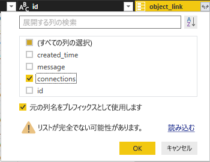
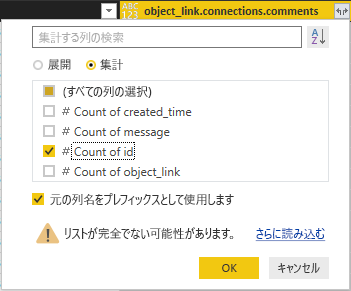
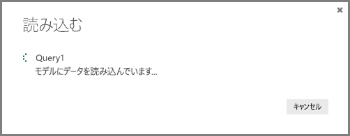
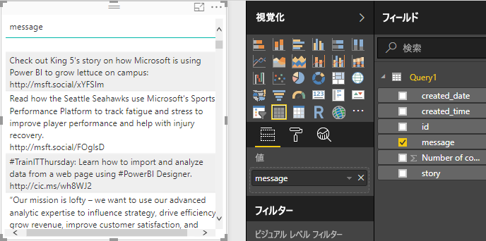
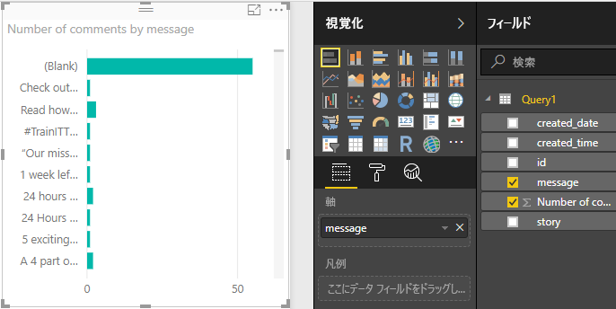
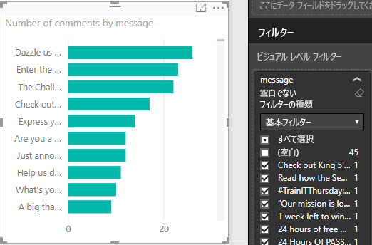
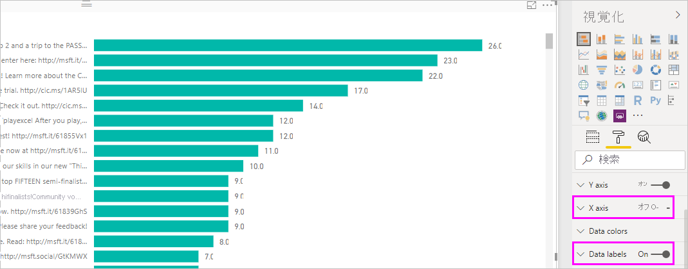
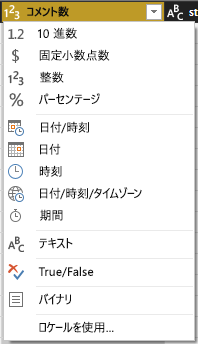

# チュートリアル:Power BI Desktop を使用して Facebook のデータを分析する

このチュートリアルでは、Facebook からデータをインポートし、Power BI Desktop で使用する方法を学習します。 ここでは、Power BI Facebook ページに接続してデータをインポートし、インポートしたデータに変換を適用し、レポートの視覚化でデータを使用します。

> [!WARNING]
> Facebook アプリのアクセス許可の制限により、この記事で説明されているコネクタ機能は現在は正常に機能していません。 Facebook 社と協力して、できるだけ早くこの機能を元に戻します。

## Facebook ページに接続する

このチュートリアルでは、[Microsoft Power BI の Facebook ページ](https://www.facebook.com/microsoftbi)のデータを使用します。 このページのデータに接続し、インポートするには、個人の Facebook アカウント以外に特別な資格情報は必要ありません。

1. Power BI Desktop を開き、 **[作業の開始]** ダイアログ ボックスで **[データの取得]** を選択するか、 **[ホーム]** リボン タブで **[データの取得]** を選んでから **[その他]** を選択します。
   
2. **[データの取得]** ダイアログ ボックスで、 **[オンライン サービス]** グループから **[Facebook]** を選択し、 **[接続]** を選びます。
   
   
   
   サードパーティ サービスを使用する場合のリスクを警告するダイアログ ボックスが表示されます。
   
   
   
3. **[続行]** を選択します。 
   
4. **[Facebook]** ダイアログ ボックスで、**ユーザー名**としてページ名の「**microsoftbi**」を入力し、 **[接続]** ドロップダウンから **[投稿]** を選び、 **[OK]** を選択します。
   
   
   
5. 資格情報を求めるメッセージが表示されたら、Facebook アカウントにサインインし、Power BI からアカウントにアクセスできるようにします。
   
   

   Power BI の Facebook ページに接続した後、ページの投稿データのプレビューが表示されます。 
   
   
   
## インポートしたデータの整形と変換

たとえば、最もコメントが多い投稿を時系列で表示したいと考えていますが、投稿データのプレビューでは、**created_time** データが読みづらく、わかりづらく、コメント データが不足していることがわかったとします。 それを最大限に活用するために、データの整形と整理を行います。 これを行うには、Power BI Desktop にデータをインポートする前または後に、Power BI Desktop の Power Query エディターを使用して編集します。 

### 日付と時刻の列を分割する

まず、**created_time** 列の日付と時刻の値を分かりやすくするために分割します。 

1. Facebook データのプレビューで、 **[編集]** を選択します。 
   
   
   
   Power BI Desktop の Power Query エディターが新しいウィンドウで開き、Power BI の Facebook ページからデータ プレビューが表示されます。 
   
   
   
2. **created_time** 列を選択します。 これが **Text** データ型であることに注目してください (列ヘッダーには **ABC** アイコンで示される)。 ヘッダーを右クリックし、 **[列の分割]**  >  **[区切り記号による分割]** (ドロップダウン リストにある) を選択します。 または、リボンの **[ホーム]** タブの **[変換]** グループで **[列の分割]**  >  **[区切り記号による分割]** を選択します。  
   
   
   
3. **[区切り記号による列の分割]** ダイアログ ボックスで、ドロップダウンから **[カスタム]** を選び、入力フィールドに「**T**」(**created_time** 値の時刻部分の先頭文字) と入力してから **[OK]** を選択します。 
   
   ![[区切り記号による列の分割] ダイアログ ボックス](media/desktop-tutorial-facebook-analytics/delimiter2.png)
   
   列は、*T* 区切り記号の前後の文字列を含む 2 つの列に分割されます。 新しい列にはそれぞれ、**created_time.1** および **created_time.2** という名前が付けられます。 Power BI では、データ型が自動的に検出され、最初の列は **Date** に、2 列目は **Time** に変更されるので、日付と時刻の値が読みやすくなります。
   
4. 2 つの列の名前を変更します。 **created_time.1** 列を選択し、リボンの **[変換]** タブの **[任意の列]** グループで **[名前の変更]** を選択します。 または、列ヘッダーをダブルクリックし、新しい列名として「**created_date**」と入力します。 **created_time.2** 列に対してこれを繰り返し、その名前を **created_time** に変更します。
   
   
   
### 入れ子の列を展開する

これで日付と時刻のデータの準備ができたので、入れ子になった列を展開してコメント データを公開できます。 

1. **object_link** 列の上部にある  アイコンを選択して、 **[展開/集計]** ダイアログ ボックスを開きます。 **接続**を選択し、 **[OK]** を選択します。 
   
   
   
   列ヘッダーが **object_link.connections** に変わります。
2. **object_link.connections** 列の上部にある  アイコンを選択し、**コメント**を選んでから **[OK]** を選択します。 列ヘッダーが **object_link.connections.comments** に変わります。
   
3. **object_link.connections.comments** 列の上部にある  アイコンを選択し、今回は、ダイアログ ボックスの **[展開]** ではなく、 **[集計]** を選びます。 **# Count of id** を選択し、 **[OK]** を選択します。 
   
   
   
   列に各メッセージのコメント数が表示されるようになりました。 
   
4. **Count of object_link.connections.comments.id** 列の名前を **Number of comments** に変更します。
   
5. **Number of comments** 列ヘッダーの横にある下矢印を選択し、 **[降順で並べ替え]** を選んで、コメント数が最も多い投稿から最も少ない投稿の順に表示します。 
   
   
   
### クエリ ステップを確認する

Power Query エディターでデータを整形して変換すると、**Power Query エディター** ウィンドウの右側にある **[クエリ設定]** ペインの **[適用したステップ]** 領域に各ステップが記録されます。 **[適用したステップ]** をさかのぼり、自分が行った変更を正確に把握し、必要に応じて編集、削除、または再配置することができます。 前のステップを変更すると、後のステップが動作しなくなる可能性があるため、これらのステップを変更する際は注意してください。 

これまでのデータ変換を適用した後、 **[適用したステップ]** は次のようになるはずです。
   
   
   
   >[!TIP]
   >**[適用したステップ]** の基になるのは、[Power Query M 数式言語](https://docs.microsoft.com/powerquery-m/quick-tour-of-the-power-query-m-formula-language)で記述された数式です。 数式を表示および編集するには、リボンの **[ホーム]** タブの **[クエリ]** グループで **[詳細エディター]** を選択します。 

### 変換されたデータをインポートする

データに問題がなければ、リボンの **[ホーム]** タブで **[閉じて適用]**  >  **[閉じて適用]** の順に選択し、Power BI Desktop にインポートします。 
   
   
   
   ダイアログ ボックスには、Power BI Desktop データ モデルへのデータ読み込みの進行状況が示されます。 
   
   
   
   データが読み込まれると、 **[レポート]** ビューに **[フィールド]** ペインの新しいクエリとして表示されます。
   
   
   
## レポートの視覚化でデータを使用する 

Facebook ページからデータをインポートしたら、視覚化を使用してデータに関する考察を迅速かつ簡単に得ることができます。 視覚化の作成は簡単です。フィールドを選択するか、 **[フィールド]** ペインからレポート キャンバスにドラッグするだけです。

### 横棒グラフを作成する

1. Power BI Desktop の **[レポート]** ビューで、 **[フィールド]** ペインから **[message]** を選択するか、レポート キャンバスにドラッグします。 すべての投稿メッセージを示すテーブルがキャンバスに表示されます。 
   
   
   
2. そのテーブルを選択した状態で、 **[フィールド]** ペインから **[Number of comments]** も選択するか、テーブルにドラッグします。 
   
3. **[視覚化]** ペインで**積み上げ横棒グラフ** アイコンを選択します。 テーブルは、投稿ごとのコメント数を示す横棒グラフに変わります。 
   
   
   
4. 視覚化の横にある **[その他のオプション]** (...) を選択し、 **[並べ替え]**  >  **[Number of comments]** の順に選択して、コメント数の降順でテーブルを並べ替えます。 

   ほとんどのコメントは **(空白)** メッセージに関連付けられている (これらの投稿はストーリー、リンク、ビデオ、またはその他のテキスト以外のコンテンツだった可能性がある) ことに注目してください。 
   
5. 空白行をフィルターで除外するには、 **[フィルター]** ペインから **[message is (All)]\(メッセージは (すべて) です\)** を選び、 **[すべて選択]** を選択してから **[(空白)]** を選んで、その選択を解除します。 

   **[フィルター]** ペインのエントリは **[message is not (Blank)]\(メッセージは (空白) ではありません\)** に変わり、グラフの視覚化に **(空白)** 行が表示されなくなります。
   
   
   
### グラフの書式を設定する

視覚化はさらに興味深くなっていますが、グラフの投稿テキストの多くは表示できません。 投稿テキストの詳細を表示するには:

1. グラフの視覚化のハンドルを使用して、グラフのサイズをできるだけ大きくします。 
   
2. グラフを選択した状態で、 **[視覚化]** ペインで**書式設定**アイコン (ペイント ローラー) を選びます。
   
3. **Y 軸**の横にある下矢印を選択し、 **[最大サイズ]** スライダーを右端 (**50%** ) までドラッグします。 
4. より多くのテキストを表示するには、 **[テキスト サイズ]** を **[10 pt]** に減らします。
   
   
   
   グラフには、より多くの投稿コンテンツが表示されるようになりました。 
   
   
   
グラフの x 軸 (コメント数) には正確な値が表示されず、グラフの下部が表示されていません。 代わりに、データ ラベルを使用してみましょう。 

1. **書式設定**アイコンを選択し、 **[X 軸]** のスライダーを **[オフ]** に設定します。 
   
2. **[データ ラベル]** スライダーを選択して、 **[オン]** にします。 

   これで、各投稿の正確なコメント数がグラフに表示されます。
   
   
   
### データ型を編集する

これで改善されましたが、すべてのデータ ラベルに小数点以下の **.0** が付いています。**Number of posts** は整数である必要があるため、これは邪魔で誤解を招きます。 これを修正するには、**Number of posts** 列のデータ型を**整数**に変更する必要があります。

1. **[フィールド]** ペインで **[Query1]** を右クリックするか、その上にカーソルを合わせ、 **[その他のオプション]** (...) を選択します。 

2. コンテキスト メニューから、 **[クエリの編集]** を選択します。 または、リボンの **[ホーム]** タブの **[外部データ]** グループから **[クエリの編集]**  >  **[クエリの編集]** を選択します。 
   
3. **Power Query エディター** ウィンドウから、**Number of comments** 列を選択し、これらの手順のいずれかに従ってデータ型を変更します。 
   - **Number of comments** 列ヘッダーの横にある **1.2** アイコンを選択し、ドロップダウン リストから **[整数]** を選びます
   - 列ヘッダーを右クリックし、 **[型の変更]**  >  **[整数]** の順に選択します。
   - **[データ型: 10 進数]** を **[ホーム]** タブの **[変換]** グループ、または **[変換]** タブの **[任意の列]** グループで選択してから、 **[整数]** を選びます。
   
   列ヘッダーのアイコンは、**整数**のデータ型であることを示す、**123** に変わります。
   
   
   
3. 変更を適用するには、 **[ファイル]**  >  **[閉じて適用]** を選択します。**Power Query エディター** ウィンドウを開いたままにする場合は、 **[ファイル]**  >  **[適用]** を選択します。 

   変更が読み込まれた後、グラフのデータ ラベルは整数になります。
   
   
   
### 日付スライサーを作成する

投稿のコメント数を時系列で視覚化するとします。 この場合、スライサーの視覚化を作成して、グラフ データをさまざまな時間枠にフィルター処理することができます。 

1. キャンバスの空白領域を選択し、 **[視覚化]** ペインで**スライサー** アイコンを選びます。 

   空白のスライサーの視覚化が表示されます。
   
   
   
2. **[フィールド]** ペインから **created_date** フィールドを選択するか、新しいスライサーにドラッグします。 

   スライサーは、フィールドの **Date** データ型に基づいて、日付範囲スライダーに変更されます。
   
   
   
3. スライダー ハンドルを移動して異なる日付範囲を選択し、それに応じてグラフ データがどのようにフィルター処理されるかを確認します。 また、スライサーの日付フィールドを選択し、特定の日付を入力するか、カレンダーのポップアップから日付フィールドを選択することもできます。
    
   
   
### 視覚化の書式を設定する

グラフによりわかりやすく魅力的なタイトルを付けます。 

1. グラフを選択した状態で、 **[視覚化]** ペインの**書式設定**アイコンを選択し、 **[タイトル]** の横にあるドロップダウン矢印を選んで展開します。

2. **[タイトル テキスト]** を「**Comments per post**」に変更します。 

3. **[フォントの色]** の横にあるドロップダウン矢印を選択し、視覚化の緑色のバーと一致する緑色を選びます。

4. **[テキスト サイズ]** を **[10 pt]** に増やし、 **[フォント ファミリ]** を **[Segoe (太字)]** に変更します。

5. 他の書式設定オプションや設定を試して、視覚化の外観を変更してみてください。 

   

## 視覚化をさらに作成する

お分かりいただけたように、レポートの視覚化は簡単にカスタマイズできるため、希望どおりにデータを表示することができます。 たとえば、インポートした Facebook データを使用して、この折れ線グラフを作成し、時系列でコメント数を表示してみます。

Power BI Desktop は、さまざまなデータ ソースからデータを取得して分析のニーズに合わせてデータの形を整えることから、このデータを機能豊富な対話型の方法で視覚化することまで、シームレスなエンド ツー エンドのエクスペリエンスを提供します。 レポートの準備ができたら、[Power BI サービスにアップロード](../create-reports/desktop-upload-desktop-files.md)し、それに基づいてダッシュボードを作成し、他の Power BI ユーザーと共有することができます。

## 次の手順
* [他の Power BI Desktop のチュートリアルを読む](https://go.microsoft.com/fwlink/?LinkID=521937)
* [Power BI Desktop のビデオを見る](https://go.microsoft.com/fwlink/?LinkID=519322)
* [Power BI フォーラムにアクセスする](https://go.microsoft.com/fwlink/?LinkID=519326)
* [Power BI ブログを読む](https://go.microsoft.com/fwlink/?LinkID=519327)
