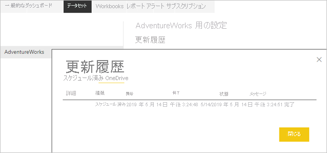
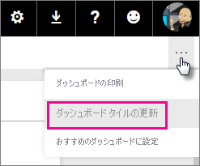
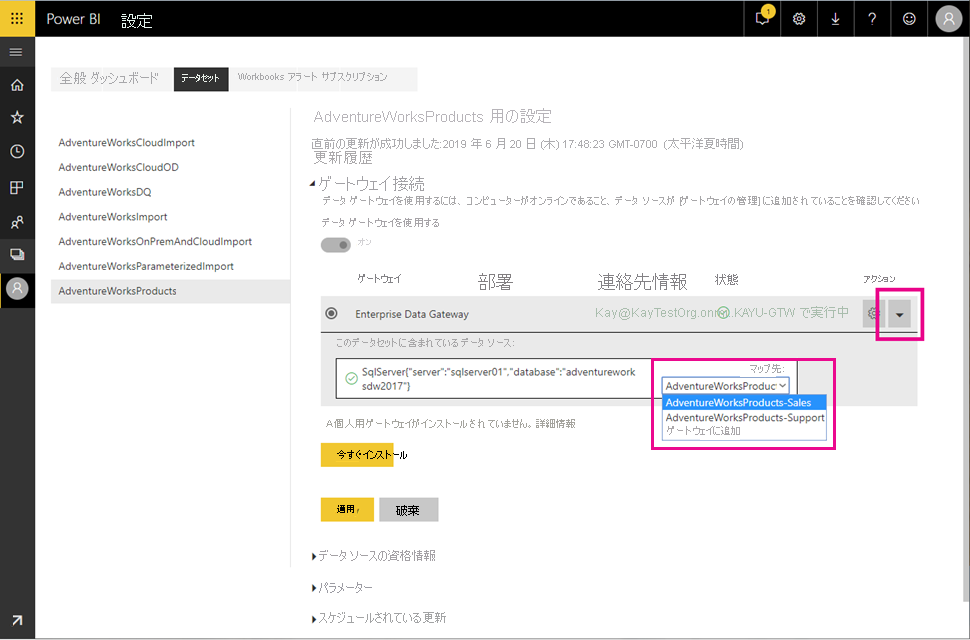
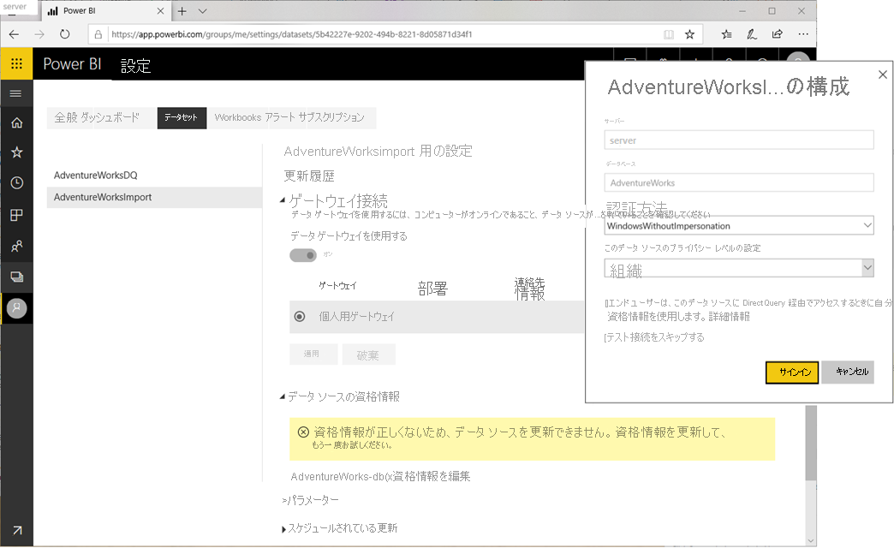
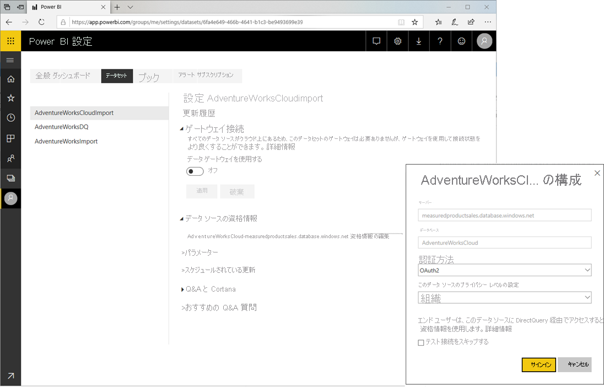
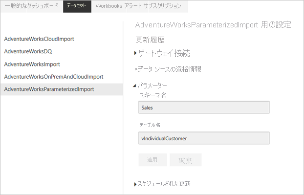
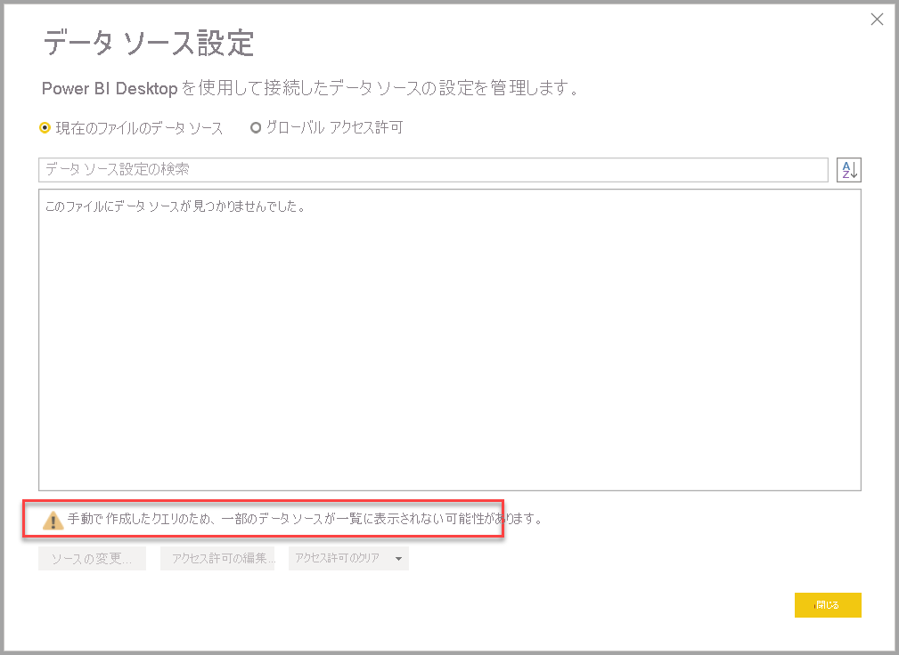
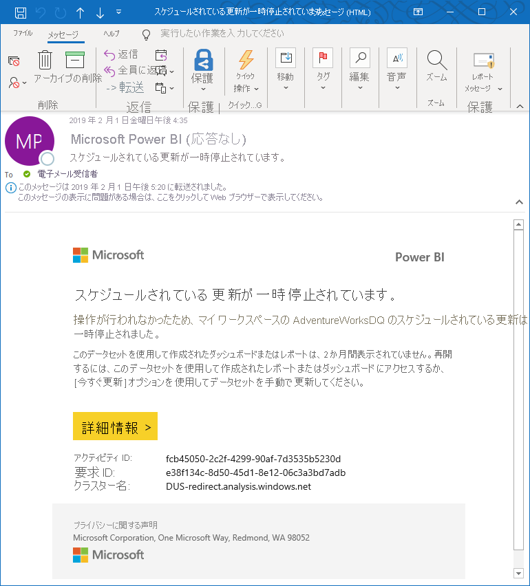

# <a name="data-refresh-in-power-bi"></a>Power BI でのデータの更新

Power BI を利用すると、データから分析情報へ、さらにはアクションへと迅速に移動することが可能です。ただし、Power BI レポートとダッシュボード内のデータは、確実に最新化しておく必要があります。 データの更新方法を把握することは、多くの場合、正確な結果を得るうえで重要になります。

この記事では、Power BI のデータ更新機能とその依存関係について概念レベルで説明します。 また、一般的な更新の問題を回避するためのベスト プラクティスとヒントも提示します。 データ更新の仕組みを理解するための基礎を築く内容になっています。 データ更新を構成する際に対象となる詳しい手順については、この記事の末尾にある「次の手順」セクションに示されたチュートリアルと攻略ガイドをご覧ください。

## <a name="understanding-data-refresh"></a>データ更新について

Power BI では、データが更新されるたびに、基になるデータ ソースを照会し、必要に応じてソース データをデータセットに読み込んで、更新後のデータセットに依存するレポートまたはダッシュボード内のビジュアルをすべて更新する必要があります。 プロセス全体は、以降のセクションで説明するように、データセットのストレージ モードに応じて複数のフェーズで構成されます。

Power BI によるデータセット、レポート、およびダッシュボードの更新方法を理解するためには、次の概念について認識しておく必要があります。

- **ストレージ モードとデータセットの種類**:Power BI によってサポートされるストレージ モードとデータセットの種類に応じて、更新の要件が異なります。 Power BI にデータを再インポートして、行われた変更をすべて確認するか、またはソースにあるデータを直接照会するかを選ぶことができます。
- **Power BI の更新の種類**:データセットの特性に関わらず、さまざまな更新の種類を把握しておくと、Power BI では更新処理中にどこに時間を費やす可能性があるのかを理解しやすくなります。 そして、これらの詳細とストレージ モードの特性を組み合わせると、データセットに対して **[今すぐ更新]** を選択した場合の Power BI の正確な動作を理解しやすくなります。

### <a name="storage-modes-and-dataset-types"></a>ストレージ モードとデータセットの種類

さまざまなデータ ソースからデータにアクセスするために、Power BI データセットは次のいずれかのモードで操作できます。 詳細については、「[Power BI Desktop のストレージ モード](../transform-model/desktop-storage-mode.md)」をご覧ください。

- Import モード
- DirectQuery モード
- LiveConnect モード
- Push モード

次の図では、ストレージ モードに基づいて、さまざまなデータ フローを示しています。 最も重要な点は、Import モードのデータセットだけがソース データの更新を必要とすることです。 データ ソースからデータをインポートするのはこの種類のデータセットだけなので、更新が必要になります。また、インポートされたデータは、定期またはアドホック ベースで更新される可能があります。 Analysis Services に対する DirectQuery データセットと LiveConnect モードのデータセットでは、データをインポートしません。ユーザー操作ごとに、基になるデータ ソースを照会します。 Push モードのデータセットでは、データ ソースに直接アクセスしませんが、Power BI にデータをプッシュすることが期待されます。 データセットの更新要件は、ストレージ モード / データセットの種類に応じて異なります。


#### <a name="datasets-in-import-mode"></a>Import モードでのデータセット

Power BI では、元のデータ ソースからデータセットへデータをインポートします。 データセットに送信された Power BI レポートとダッシュボードのクエリでは、インポートされたテーブルと列から結果が返されます。 このようなデータは、特定時点のコピーとして捉えることができます。 Power BI ではデータをコピーするので、データセットを更新して、基になるデータ ソースから変更をフェッチする必要があります。

Power BI ではデータをキャッシュするので、Import モードのデータセット サイズは、かなり大きくなる場合があります。 各容量の最大データセット サイズについては、次の表を参照してください。 更新操作中に、データセットにおいて利用可能な最大量を超えるリソースが必要になった場合に、発生する可能性がある更新の問題を回避するために、常に最大データセット サイズを下回るようにしてください。

| 容量の種類 | 最大データセット サイズ |
| --- | --- |
| Shared、A1、A2、または A3 | 1 GB |
| A4 または P1 | 3 GB |
| A5 または P2 | 6 GB |
| A6 または P3 | 10 GB |
| | |

#### <a name="datasets-in-directqueryliveconnect-mode"></a>DirectQuery/LiveConnect モードでのデータセット

Power BI では、DirectQuery/LiveConnect モードで動作する接続を介して、データをインポートすることはありません。 代わりに、レポートまたはダッシュボードからデータセットが照会されるたびに、データセットは基になるデータ ソースから結果を返します。 Power BI ではクエリを変換して、データ ソースに転送します。

Power BI 上でクエリがソースに転送されるという点で、DirectQuery モードおよび LiveConnect モードは似ていますが、重要なのは、LiveConnect モードの場合、Power BI 上でのクエリ変換は必須ではない点に留意することです。 クエリは、共有された容量や Premium 容量のリソースを消費することなく、データベ―スをホストしている Analysis Services インスタンスに直接送信されます。

Power BI ではデータをインポートしないため、データ更新を実行する必要はありません。 ただし、更新の種類に関する次のセクションで説明するように、Power BI では、タイルの更新と、可能であればレポートの更新を実行します。 タイルは、ダッシュボードにピン留めされたレポート ビジュアルであり、タイルに最新の結果が表示されるように、ダッシュボード タイルの更新は約 1 時間ごとに行われます。 次のスクリーンショットに示すように、データセットの設定では、スケジュールを変更できます。または、 **[今すぐ更新]** オプションを使用して、手動でダッシュボードの更新を強制実行します。


> [!NOTE]
> **[データセット]** タブにある **[スケジュールされたキャッシュの更新]** セクションは、Import モードのデータセットでは利用できません。 これらのデータセットでは、スケジュールされた各データ更新またはオンデマンドでの各データ更新の間に Power BI 上で自動的にタイルが更新されるので、個別のタイル更新を必要としません。

#### <a name="push-datasets"></a>プッシュ データセット

Push データセットには、データ ソースの正式な定義は含まれません。そのため、Power BI 上でデータ更新を実行する必要はありません。 Azure Stream Analytics などの外部サービスやプロセスを経由して、データセットにデータをプッシュすることで、更新を行います。 これは、Power BI を利用したリアルタイム分析では、一般的な手法です。 Power BI では、Push データセットの最上部に使用されるタイルに対しては、引き続きキャッシュの更新を実行します。 詳細なチュートリアルについては、「[チュートリアル: Stream Analytics と Power BI:ストリーミング データのリアルタイム分析ダッシュボード](/azure/stream-analytics/stream-analytics-power-bi-dashboard)」をご覧ください。

> [!NOTE]
> Push モードには、「[Power BI REST API の制限事項](../developer/automation/api-rest-api-limitations.md)」に示されているように、複数の制限事項があります。

### <a name="power-bi-refresh-types"></a>Power BI の更新の種類

Power BI の更新操作は、データ更新、OneDrive の更新、クエリ キャッシュの更新、タイルの更新、およびレポート ビジュアルの更新を含む、複数の更新の種類で構成できます。 指定したデータセットに対して必要な更新手順は、Power BI によって自動的に判断されますが、それらが更新操作の複雑さや期間にどのように影響するのかは、ご自身で把握しておく必要があります。 簡単な参考情報については、次の表で確認してください。

| ストレージ モード | データ更新 | OneDrive の更新 | クエリのキャッシュ | タイルの更新 | レポート ビジュアル |
| --- | --- | --- | --- | --- | --- |
| インポート | スケジュール設定とオンデマンド | はい (接続されたデータセットに対して) | Premium 容量で有効になっている場合 | 自動およびオンデマンド | いいえ |
| DirectQuery | 該当なし | はい (接続されたデータセットに対して) | Premium 容量で有効になっている場合 | 自動およびオンデマンド | いいえ |
| LiveConnect | 該当なし | はい (接続されたデータセットに対して) | Premium 容量で有効になっている場合 | 自動およびオンデマンド | はい |
| プッシュ | 該当なし | 該当なし | 実効性なし | 自動およびオンデマンド | いいえ |
| | | | | | |

#### <a name="data-refresh"></a>データ更新

Power BI ユーザーにとって、データ更新とは通常、更新スケジュールに基づくか、またはオンデマンドで、元のデータ ソースからデータセットへデータをインポートすることを意味します。 データセットの更新は 1 日に複数回実行でき、基になるソース データが頻繁に変更される場合には、その必要が生じる可能性があります。 Power BI では、共有された容量にあるデータセットに対して、1 日の更新を 8 回までに制限しています。 データセットが Premium 容量にある場合は、データセットの設定で、1 日に最大 48 回まで更新をスケジュールできます。 詳しくは、この記事で後述する「[スケジュールされた更新の構成](#configure-scheduled-refresh)」をご覧ください。 [XMLA エンドポイント](../admin/service-premium-connect-tools.md)で読み取り/書き込みが有効になっている Premium 容量のデータセットでは、TMSL または PowerShell を使用してプログラムによって構成した場合、無制限の更新操作がサポートされます。

1 日あたりの更新に関する共有容量の制限は、スケジュールされた更新と API による更新の両方に適用されることを周知することも重要です。 次のスクリーンショットに示すように、データセット メニューにある **[今すぐ更新]** を選択して、オンデマンドの更新をトリガーすることもできます。 オンデマンドの更新は、更新の制限の対象外です。 また、Premium 容量上のデータセットには、API による更新の制限は課されません。 Power BI REST API を使用して独自の更新ソリューションを作成したい場合は、「[データセット - データセットの更新](/rest/api/power-bi/datasets/refreshdataset)」を参照してください。


> [!NOTE]
> 共有された容量では、2 時間未満でデータ更新が完了する必要があります。 ご自身のデータセットが、更新処理により長い時間を必要とする場合、データセットを Premium 容量へ移行することを検討してください。 Premium では、更新の最大期間は 5 時間です。

#### <a name="onedrive-refresh"></a>OneDrive の更新

OneDrive または SharePoint Online 上の Power BI Desktop ファイル、Excel ワークブック、またはコンマ区切りの値 (.csv) ファイルに基づいてデータセットとレポートを作成した場合、Power BI では、OneDrive の更新と呼ばれる別の種類の更新を実行します。 詳しくは、「[ファイルから Power BI 用のデータを取得する](service-get-data-from-files.md)」をご覧ください。

OneDrive の更新では、データセットの更新中に Power BI がデータ ソースからデータセットへデータをインポートするのではなく、データセットとレポートをソース ファイルと同期します。 Power BI では既定で、OneDrive または SharePoint Online 上のファイルに接続されているデータセットを同期する必要があるかどうかを、約 1 時間ごとにチェックします。

Power BI では OneDrive の項目 ID に基づいて更新が実行されるため、更新と置き換えを検討する際は慎重になる必要があります。 OneDrive ファイルをデータ ソースとして設定すると、Power BI では、更新を実行するときにファイルの項目 ID が参照されます。 次のシナリオを考えてみます。マスター ファイルの _A_ とそのファイルの運用コピー _B_ があるとき、ファイル B に対して OneDrive の更新を構成するとします。ファイル B の上にファイル A を_コピー_すると、コピー操作によって古いファイル B が削除され、新しいファイル B が異なる項目 ID で作成され、これにより OneDrive の更新が中断されます。 このような状況を回避するには、代わりにファイル B をアップロードして置き換えることができます。これによってその同じ項目 ID が保持されます。

(ドラッグ アンド ドロップなどを利用して) ファイルを別の場所に移動すると、更新は引き続き動作します。Power BI で引き続きファイル ID が認識されるためです。 ただし、そのファイルを別の場所にコピーすると、ファイルの新しいインスタンスと新しいファイル ID が作成されます。 そのため、Power BI ファイル参照は無効になり、更新は失敗します。

> [!NOTE]
> ローカル コンピューターで同期が完了していて、Power BI サービスで *[今すぐ更新]* を使用した後でも、Power BI でデータセットを更新するまでに最大 10 分かかることがあります。

過去の同期サイクルを確認するには、更新履歴にある [OneDrive] タブをチェックします。 次のスクリーンショットは、サンプル データセットに対する完了済みの同期サイクルを示しています。



上記のスクリーンショットに示すように、Power BI ではこの OneDrive の更新を**スケジュールされた**更新として識別しますが、更新間隔を構成することはできません。 データセットの設定では、OneDrive の更新を非アクティブ化することしかできません。 更新の非アクティブ化は、Power BI のデータセットとレポートにより、ソース ファイルから自動的に変更が取得されないようにしたい場合に便利です。

次のスクリーンショットに示すように、データセットが OneDrive または SharePoint Online 上のファイルに接続されている場合、データセットの設定ページには **[OneDrive の資格情報]** と **[OneDrive の更新]** セクションのみが表示されることに注意してください。 データセットが OneDrive または SharePoint Online 上のソース ファイルに接続されていない場合、これらのセクションは表示されません。

![[OneDrive の資格情報] と [OneDrive の更新]](media/refresh-data/onedrive-credentials-refresh.png)

データセットに対して OneDrive の更新を無効にした場合、データセット メニューにある **[今すぐ更新]** を選択することで、引き続きオンデマンドでデータセットを同期することができます。 Power BI では、オンデマンド更新の中で、OneDrive または SharePoint Online 上のソース ファイルが Power BI にあるデータセットよりも新しいかどうかをチェックして、これに該当した場合にデータセットを同期します。 **[更新履歴]** では、 **[OneDrive]** タブ上にオンデマンド更新としてこれらのアクティビティが一覧表示されます。

OneDrive の更新では、元のデータ ソースからデータがプルされないことに留意してください。 OneDrive の更新では、次の図に示すように、.pbix、.xlsx、または .csv ファイルからのメタデータおよびデータを利用して、単純に Power BI 上のリソースを更新します。 データセットがデータ ソースからの最新のデータを保持することを保証するために、Power BI では、オンデマンド更新の中でデータ更新もトリガーします。 **[スケジュール]** タブに切り替えると、 **[更新履歴]** 上でこれを確認できます。


OneDrive または SharePoint Online に接続されたデータセットに対して OneDrive の更新を有効にした状態で、スケジュール ベースでのデータ更新を実行したい場合は、Power BI によるデータ更新が OneDrive の更新の後に実行されるように、確実にスケジュールを構成してください。 たとえば、毎夜午前 1 時にソース ファイルを更新するために独自のサービスまたはプロセスを作成した場合、Power BI がデータ更新の開始前に OneDrive の更新を完了できるだけの十分な時間を取れるように、スケジュールされた更新を午前 2 時 30 分に構成できます。

#### <a name="refresh-of-query-caches"></a>クエリ キャッシュの更新

データセットが Premium 容量にあるなら、次のスクリーンショットに示すように、クエリ キャッシュを有効にすることで、関連するレポートとダッシュボードのパフォーマンスを向上させることができる場合があります。 クエリ キャッシュにより、Premium 容量はそのローカル キャッシュ サービスを使用してクエリ結果を維持するよう指示され、基になるデータ ソースによってそれらの結果が計算されることが回避されます。 詳しくは、「[Power BI Premium でのクエリのキャッシュ](power-bi-query-caching.md)」をご覧ください。


しかし、データ更新の後は、以前にキャッシュされたクエリ結果は無効になってしまいます。 Power BI では、キャッシュされたこれらの結果を破棄して、再構築する必要があります。 このため、1 日に 48 回など、極めて頻繁に更新されるデータセットに関連付けられたレポートおよびダッシュボードでは、クエリキャッシュによるメリットはあまり得られない可能性があります。

#### <a name="tile-refresh"></a>タイルの更新

Power BI では、ダッシュボード上のすべてのタイル ビジュアルのキャッシュを維持し、データが変更された場合には速やかにタイル キャッシュを更新します。 つまり、タイル更新は、データ更新に続けて自動的に行われます。 これは、スケジュール更新およびオンデマンド更新のどちらの操作にも適用されます。 ダッシュボードの右上にある**その他のオプション** (...) を選択し、 **[ダッシュボード タイルの更新]** を選択して、強制的にタイルを更新することもできます。



タイル更新は、自動的に行われることから、データ更新に組み込まれた一部分として捉えることができます。 何よりも、タイル数に応じて更新期間が長くなることに気が付くかもしれません。 タイル更新のオーバーヘッドによって、大きな影響が出る可能性があります。

Power BI は既定で、タイルごとに単一のキャッシュを維持しますが、「[Power BI での行レベルのセキュリティ (RLS)](../admin/service-admin-rls.md)」に説明されているように、動的なセキュリティを使用してユーザー ロールに基づくデータ アクセスを制限する場合、Power BI ではロールごとおよびタイルごとに 1 つのキャッシュを維持する必要があります。 タイル キャッシュ数に、ロール数が掛け合わされます。

チュートリアル「[Analysis Services 表形式モデルを使用した動的な行レベル セキュリティ](desktop-tutorial-row-level-security-onprem-ssas-tabular.md)」で強調されているように、データセットが RLS による Analysis Services データ モデルへのライブ接続を使用している場合、状況はより複雑になる可能性があります。 このような状況では、Power BI は、タイルごとおよびダッシュボードを閲覧したユーザーごとに、1 つのキャッシュを維持して更新する必要があります。 このようなデータ更新操作の一部として行われるタイル更新に、ソースからのデータのフェッチよりも長い時間がかかることは、珍しくありません。 タイル更新について詳しくは「[タイルのエラーのトラブルシューティング](refresh-troubleshooting-tile-errors.md)」をご覧ください。

#### <a name="refresh-of-report-visuals"></a>レポート ビジュアルの更新

この更新プロセスは、Analysis Services へのライブ接続にしか該当しないため、重要度は低くなります。 これらの接続の場合、レポートを再度表示するときに Power BI が Analysis Services の表形式モデルを照会する必要がないように、Power BI ではレポート ビジュアルの最新状態をキャッシュします。 レポート フィルターを変更するなど、レポートを操作した場合、Power BI では表形式モデルを照会して、レポート ビジュアルを自動的に更新します。 レポートに古いデータが表示されていると思われる場合は、次のスクリーンショットに示されるように、レポートの [更新] ボタンを選択してすべてのレポート ビジュアルの更新をトリガーすることもできます。


## <a name="review-data-infrastructure-dependencies"></a>データ インフラストラクチャの依存関係を確認する

ストレージ モードに関係なく、基になるデータ ソースがアクセス可能でない限り、データ更新を成功させることはできません。 主なデータ アクセスのシナリオとして、次の 3 つがあります。

- データセットが、オンプレミスにあるデータ ソースを使用する
- データセットが、クラウドにあるデータ ソースを使用する
- データセットが、オンプレミスおよびクラウド ソースの両方からのデータを使用する

### <a name="connecting-to-on-premises-data-sources"></a>オンプレミス データ ソースへの接続

データセットが、直接ネットワーク接続では Power BI からアクセスできないデータ ソースを使用している場合は、更新スケジュールを有効にしたり、オンデマンドによるデータ更新を実行したりできるように、事前にこのデータセットに対してゲートウェイ接続を構成しておく必要があります。 データ ゲートウェイとその仕組みについては、「[オンプレミス データ ゲートウェイとは](service-gateway-onprem.md)」をご覧ください。

次のようなオプションがあります。

- 必要なデータ ソース定義を利用してエンタープライズ データ ゲートウェイを選択する
- 個人用のデータ ゲートウェイを展開する

> [!NOTE]
> データ ゲートウェイを必要とするデータ ソースの種類の一覧については、「[データ ソースの管理 - インポート/スケジュールされた更新](service-gateway-enterprise-manage-scheduled-refresh.md)」の記事で確認できます。

#### <a name="using-an-enterprise-data-gateway"></a>エンタープライズ データ ゲートウェイの使用

Microsoft では、個人用ゲートウェイではなくエンタープライズ データ ゲートウェイを使用して、オンプレミス データ ソースにデータセットを接続することを推奨しています。 確実にゲートウェイが正しく構成されるようにしてください。つまり、ゲートウェイでは、最新の更新情報と必要なすべてのデータ ソース定義を保持している必要があります。 データ ソース定義は、接続エンドポイント、認証モード、資格情報など、指定されたソースへの接続情報を Power BI に提供します。 ゲートウェイ上でのデータ ソースの管理について詳しくは、「[データ ソースの管理 - インポート/スケジュールされた更新](service-gateway-enterprise-manage-scheduled-refresh.md)」をご覧ください。

ゲートウェイ管理者になっている場合、データセットをエンタープライズ ゲートウェイに接続することは、比較的簡単です。 管理者権限があれば、速やかにゲートウェイを更新し、必要に応じて不足するデータ ソースを追加できます。 実際に、データセットの設定ページから直接、不足しているデータ ソースをゲートウェイに追加できます。 次のスクリーンショットに示すように、トグル ボタンを展開してデータ ソースを表示し、 **[ゲートウェイに追加]** リンクを選択します。 一方、ゲートウェイ管理者でない場合は、ゲートウェイ管理者に問い合わせて、必要なデータ ソース定義を追加する必要があります。

> [!NOTE]
> ゲートウェイ管理者だけがデータ ソースをゲートウェイに追加できます。 また、データ ソースを使用するアクセス許可を持つユーザーの一覧に、ゲートウェイ管理者があなたのユーザー アカウントを追加していることを確認します。 [データセットの設定] ページでは、使用するアクセス許可を与えられているデータ ソースに一致するものを持つエンタープライズ ゲートウェイのみを選択できます。



データ ソースに適切なデータ ソースの定義をマップすることを確認します。 上記のスクリーン ショットに示すように、ゲートウェイの管理者は、それぞれ別の資格情報を持つ同じデータ ソースに接続する単一のゲートウェイで複数の定義を作成できます。 例で示したとおり、販売部署のデータセットの所有者は AdventureWorksProducts 販売データ ソースの定義を選択し、サポート部門のデータセットの所有者は、データセットを AdventureWorksProducts サポートのデータ ソースの定義にマップします。 データ ソースの定義の名前が直感的でない場合は、ゲートウェイの管理者に、どの定義を選択するべきかお問い合わせください。

> [!NOTE]
> 1 つのデータセットでは、単一のゲートウェイ接続しか使用できません。 言い換えると、複数のゲートウェイ接続にわたってオンプレミス データ ソースにアクセスすることはできません。 したがって、必要なすべてのデータ ソース定義を必ず同じゲートウェイに追加してください。

#### <a name="deploying-a-personal-data-gateway"></a>個人用データ ゲートウェイを展開する

お客様がエンタープライズ データ ゲートウェイにアクセスできず、またデータセットを管理する唯一のユーザーであるために他のユーザーとデータ ソースを共有する必要がない場合は、個人用モードでデータ ゲートウェイを展開できます。 **[ゲートウェイ接続]** セクション内で、 **[個人用ゲートウェイがインストールされていません]** の下にある **[今すぐインストール]** を選択します。 「[オンプレミス データ ゲートウェイ (個人用モード)](service-gateway-personal-mode.md)」で説明されているように、個人用データ ゲートウェイには複数の制限事項があります。

エンタープライズ データ ゲートウェイとは違って、個人用ゲートウェイにはデータ ソース定義を追加する必要はありません。 代わりに、次のスクリーンショットに示すように、データセットの設定にある **[データ ソースの資格情報]** セクションを使用して、データ ソースの構成を管理します。



> [!NOTE]
> 個人用データ ゲートウェイでは、DirectQuery/LiveConnect モードのデータセットをサポートしていません。 データセットの設定ページ上でインストールを求められるかもしれませんが、個人用ゲートウェイしか使用していない場合は、ゲートウェイ接続を構成できません。 これらの種類のデータ セットをサポートするには、必ずエンタープライズ データ ゲートウェイを使用するようにしてください。

### <a name="accessing-cloud-data-sources"></a>クラウド データ ソースへのアクセス

Azure SQL DB などのクラウド データ ソースを使用するデータセットでは、Power BI がソースへの直接ネットワーク接続を確立できる場合、データ ゲートウェイを必要としません。 したがって、データセットの設定にある **[データ ソースの資格情報]** セクションを使用して、これらのデータ ソースの構成を管理できます。 次のスクリーンショットに示すように、ゲートウェイ接続を構成する必要はありません。



### <a name="accessing-on-premises-and-cloud-sources-in-the-same-source-query"></a>同一ソース クエリでのオンプレミスとクラウド ソースへのアクセス

1 つのデータセットでは複数のソースからデータを取得でき、これらのソースをオンプレミスまたはクラウド内に配置しておくことが可能です。 しかし、前述したように、1 つのデータセットでは単一のゲートウェイ接続しか使用できません。 クラウド データ ソースでは必ずしもゲートウェイを必要としないものの、単一のマッシュアップ クエリ内で 1 つのデータセットからオンプレミスとクラウド ソースの両方に接続する場合には、ゲートウェイが必要になります。 このシナリオでは、クラウド データ ソースの場合でも、Power BI においてゲートウェイを使用する必要があります。 次の図は、このようなデータセットがデータ ソースにアクセスする仕組みを示しています。


> [!NOTE]
> 1 つのデータセットが別個のマッシュアップ クエリを使用してオンプレミスとクラウド ソースに接続する場合、Power BI では、オンプレミス ソースにアクセスするにはゲートウェイ接続を使用し、クラウド ソースには直接ネットワーク接続を使用します。 1 つのマッシュアップ クエリにおいて、オンプレミスとクラウドのソースからデータをマージまたはアペンドする場合は、Power BI では、クラウド ソースに対してもゲートウェイ接続に切り替えます。

Power BI のデータセットは Power Query に依存して、ソース データにアクセスして取得します。 次のマッシュアップは、オンプレミス ソースとクラウド ソースからデータをマージする基本例を示しています。

```
Let

    OnPremSource = Sql.Database("on-premises-db", "AdventureWorks"),

    CloudSource = Sql.Databases("cloudsql.database.windows.net", "AdventureWorks"),

    TableData1 = OnPremSource{[Schema="Sales",Item="Customer"]}[Data],

    TableData2 = CloudSource {[Schema="Sales",Item="Customer"]}[Data],

    MergedData = Table.NestedJoin(TableData1, {"BusinessEntityID"}, TableData2, {"BusinessEntityID"}, "MergedData", JoinKind.Inner)

in

    MergedData
```

オンプレミスおよびクラウド ソースからのデータのマージまたはアペンドをサポートするようにデータ ゲートウェイを構成するには、2 つのオプションがあります。

- オンプレミス データ ソースだけでなく、クラウド ソース用のデータ ソース定義をデータ ゲートウェイに追加します。
- **[Allow user's cloud data sources to refresh through this gateway cluster]\(このゲートウェイ クラスターを利用してユーザーのクラウド データ ソースを更新することを許可します\)** のチェックボックスをオンにします。


上記のスクリーンショットに示すように、 **[Allow user's cloud data sources to refresh through this gateway cluster in the gateway configuration]\(ゲートウェイ構成のこのゲートウェイ クラスターを利用してユーザーのクラウド データ ソースを更新することを許可します\)** のチェックボックスをオンにした場合、Power BI ではデータセットの設定にある **[データソースの資格情報]** 下でユーザーがクラウド ソース用に定義した構成を使用できます。 これにより、ゲートウェイ構成のオーバーヘッドを低減できます。 一方で、お使いのゲートウェイによって確立された接続を介して、より詳細な制御を行いたい場合は、このチェックボックスをオンにしてはいけません。 この場合、サポート対象にするすべてのクラウド ソース用の明示的なデータ ソース定義を、お使いのゲートウェイに追加する必要があります。 また、チェックボックスを有効にした状態で、クラウド ソース用の明示的なデータ ソース定義をゲートウェイに追加することも可能です。 この場合、ゲートウェイでは、一致するすべてのソースに対してデータ ソース定義を使用します。

### <a name="configuring-query-parameters"></a>クエリ パラメーターの構成

Power Query を使用して作成したマッシュアップまたは M クエリでは、簡単な手順からパラメーター化されたコンストラクトまで、複雑さに違いが生じる場合があります。 データベース内の指定されたテーブルにアクセスするために _SchemaName_ および _TableName_ という 2 つのパラメーターを使用する小規模なサンプル マッシュアップ クエリを、次に示します。

```
let

    Source = Sql.Database("SqlServer01", "AdventureWorks"),

    TableData = Source{[Schema=SchemaName,Item=TableName]}[Data]

in

    TableData
```

> [!NOTE]
> クエリ パラメータ―は、Import モードのデータセットに対してのみ、サポートされています。 DirectQuery/LiveConnect モードでは、クエリ パラメーターの定義をサポートしていません。

パラメータ―化されたデータセットから適切なデータに確実にアクセスするには、データセットの設定内でマッシュアップ クエリ パラメータ―を構成する必要があります。 また、[Power BI REST API](/rest/api/power-bi/datasets/updateparametersingroup) を使用して、プログラムによってパラメータ―を更新することもできます。 次のスクリーンショットは、上記のマッシュアップ クエリを使用するデータセットに対してクエリ パラメータ―を構成するためのユーザー インターフェイスを示しています。




## <a name="refresh-and-dynamic-data-sources"></a>更新と動的データ ソース
 
"*動的データ ソース*" は、Power Query でクエリが実行されるまで、接続に必要な情報の一部またはすべてを決定できないデータ ソースです。これは、データがコードで生成されるか別のデータ ソースから返されるためです。 この例としては、SQL Server データベースのインスタンス名とデータベース、CSV ファイルのパス、Web サービスの URL などがあります。 
 
ほとんどの場合、動的データ ソースを使用する Power BI データセットを Power BI サービスで更新することはできません。 ただし、Power BI サービスで動的データ ソースを最新の情報に更新できる例外がいくつかあります。たとえば、Web. Contents M 関数で RelativePath およびクエリ オプションを使用する場合などです。 Power Query パラメーターを参照するクエリを更新することもできます。
 
動的データ ソースを最新の情報に更新できるかどうかを確認するには、**Power Query エディター**で **[データ ソース設定]** ダイアログを開き、 **[現在のファイルのデータ ソース]** を選択します。 次の図に示すように、表示されたウィンドウで、次の警告メッセージを探します。
 
    Some data sources may not be listed because of hand-authored queries.



この警告が **[データソース設定]** ダイアログに表示されている場合は、Power BI サービスで更新できない動的データ ソースが存在します。

## <a name="configure-scheduled-refresh"></a>スケジュールされた更新の構成

Power BI とデータ ソース間での接続の確立は、データ更新の構成の中でも圧倒的に困難な作業です。 それ以外の手順は比較的簡単であり、更新スケジュールの設定や更新失敗の通知の有効化などがあります。 詳しい手順については、攻略ガイド「[スケジュールされた更新の構成](refresh-scheduled-refresh.md)」をご覧ください。

### <a name="setting-a-refresh-schedule"></a>更新スケジュールの設定

**[スケジュールされている更新]** セクションでは、データセットを更新する頻度と時間枠を定義します。 前述のように、データセットが共有された容量上にある場合は 1 日に最大 8 時間の枠を、Power BI Premium 上では 48 時間の枠を構成できます。 次のスクリーンショットは、12 時間間隔の更新スケジュールを示しています。


更新スケジュールを構成すると、上記のスクリーンショットに示すように、データセットの設定ページ上で次回の更新時刻が通知されます。 ゲートウェイとデータ ソースの構成をテストする場合など、データの更新をより早く行いたい場合には、ナビ ペイン内のデータセット メニューにある **[今すぐ更新]** オプションを使用して、オンデマンド更新を実行します。 オンデマンド更新は、次にスケジュールされている更新時間には影響しません。

また、構成された更新時刻は、スケジュールされた次のプロセスが Power BI によって開始される正確な時刻になるとは限らない点に注意してください。 Power BI では、ベスト エフォート方式を基本として、スケジュールされた更新を開始します。 スケジュールされた時間枠の 15 分以内に更新を開始することを目標としますが、サービスが必要なリソースを迅速に割り当てることができない場合、最大で 1 時間の遅延が生じる可能性があります。

> [!NOTE]
> 連続で 4 回失敗した後、あるいは、資格情報が無効または期限切れの場合など、構成の更新が必要になる回復不能なエラーをサービスが検出した場合に、Power BI では更新スケジュールを非アクティブ化します。 連続エラーのしきい値を変更することはできません。

### <a name="getting-refresh-failure-notifications"></a>更新失敗の通知の取得

Power BI では既定で、更新の問題が発生した場合に、データセットの所有者が適時に対応できるように、電子メール経由で所有者に更新失敗の通知を送信します。 また、Power BI では、連続するエラーが原因でサービスによってスケジュールが無効にされた場合にも、通知を送信します。 Microsoft では、 **[更新失敗に関する通知を電子メールで受信する]** を有効のままにしておくことをお勧めしています。

また、 **[更新に失敗したときにこれらのユーザーに電子メールを送信する]** ボックスを使用し、追加の受信者を指定することもお勧めします。 データセットの所有者に加えて、指定された受信者は更新エラー通知を受け取ります。 たとえば、休暇中のあなたのデータセットを処理する同僚を指定します。 部署または組織の更新に関する問題に対応するサポート チームの電子メール エイリアスにすることもできます。 データセットの所有者に加えて更新エラー通知を他のユーザーに送信すると、問題が発生した場合に適切なタイミングで対処するのに役立ちます。

Power BI では、更新失敗時だけでなく、非アクティブ状態が原因でサービスがスケジュールされた更新を一時停止した場合にも、通知を送信することに注意してください。 2 か月が経過して、データセット上に構築されたダッシュボードまたはレポートにアクセスしたユーザーが誰もいなかった場合、Power BI ではデータセットを非アクティブと見なします。 このような場合、Power BI では、サービスによってデータセットに対する更新スケジュールが一時停止にされたことを示す電子メール メッセージをデータセット所有者に送信します。 次のスクリーンショットに、このような通知の例を示します。



スケジュールされた更新を再開するには、このデータセットを使用して構築されたレポートまたはダッシュボードにアクセスするか、または **[今すぐ更新]** オプションを使用して手動でデータセットを更新します。

### <a name="checking-refresh-status-and-history"></a>更新の状態と履歴のチェック

失敗の通知以外にも、更新失敗について定期的にデータセットをチェックすることをお勧めします。 簡単な方法としては、ワークスペースにデータセットの一覧を表示します。 エラーがあるデータベースには、小さな警告アイコンが表示されます。 次のスクリーンショットに示すように、警告アイコンを選択して追加情報を取得します。 特定の更新失敗のトラブルシューティングについて詳しくは、「[更新に関するトラブルシューティング シナリオ](refresh-troubleshooting-refresh-scenarios.md)」をご覧ください。


警告アイコンによって現在のデータセットの問題が示されますが、時には更新履歴をチェックすることもお勧めします。 名前からもわかるように、更新履歴では、過去の同期サイクルの成功や失敗の状態を確認できます。 たとえば、ゲートウェイ管理者が、有効期限が切れた一連のデータベース資格情報を更新したかもしれません。 次のスクリーンショットに示すように、更新履歴には、影響を受けた更新が再稼働を開始した時刻が示されます。


> [!NOTE]
> データセットの設定には、更新履歴を表示するためのリンクがあります。 また、[Power BI REST API](/rest/api/power-bi/datasets/getrefreshhistoryingroup) を使用して、プログラムによって更新履歴を取得することも可能です。 カスタム ソリューションを使用して、複数のデータセットの更新履歴を一元的な方法で監視することができます。

## <a name="automatic-page-refresh"></a>ページの自動更新

ページの自動更新はレポート ページ レベルで動作し、レポート作成者は、ページが使用されているときにのみアクティブなページ内のビジュアルの更新間隔を設定できます。 ページの自動更新は、DirectQuery データ ソースでのみ使用できます。 最小更新間隔は、レポートが発行されているワークスペースの種類と、Premium ワークスペースの容量の管理者設定と[埋め込まれたワークスペース](../developer/embedded/embedding.md)によって変わります。

ページの自動更新の詳細については、[ページの自動更新](../create-reports/desktop-automatic-page-refresh.md)に関する記事を参照してください。

## <a name="best-practices"></a>ベスト プラクティス

データセットの更新履歴を定期的にチェックすることは、レポートとダッシュボードにおいて最新のデータが利用されることを保証するために取り入れることができる、最も重要なベスト プラクティスの 1 つです。 問題を発見した場合には速やかに対応し、データ ソースの所有者とゲートウェイ管理者と共に対処します。

さらに、データセットに対して信頼できるデータ更新プロセスを確立して維持するために、次の推奨事項について検討します。

- 特にデータセットが Power BI Premium 上にある場合には、ビジー状態の時間を減らすように更新をスケジュールします。 データセットの更新サイクルをより広範な時間枠にわたって分散させると、利用可能なリソースに高い負荷を強いる可能性があるピーク時間を回避できます。 更新サイクルの開始の遅延は、リソース オーバーヘッドの指標になります。 Premium 容量が完全に消費されると、Power BI では更新サイクルをスキップする可能性もあります。
- 更新に関する制限事項に常に留意してください。 ソース データが頻繁に変更される場合や、データ ボリュームがかなり大きい場合には、ソースでの負荷の上昇やクエリ パフォーマンスへの影響を許容できるのであれば、Import モードではなく DirectQuery/LiveConnect モードを使用することを検討してください。 Import モードのデータセットを絶えず更新することは避けてください。 ただし、DirectQuery/LiveConnect モードには、[Power BI Desktop での DirectQuery の使用](desktop-use-directquery.md)に関するページに示されているように、応答データに対する 100 万行の上限やクエリ実行に対する 225 秒の応答時間の上限など、複数の制限事項があります。 これらの制限事項によって、やはり Import モードを使用することが必要になる場合もあります。 データ ボリュームが非常に大きい場合は、[Power BI での集計](../transform-model/desktop-aggregations.md)を利用することを検討してください。
- データセットの更新時間が、更新期間の上限を超過していないことを確認します。 Power BI Desktop を使用して更新期間をチェックしてください。 2 時間を超える場合は、データセットを Power BI Premium に移行することを検討してください。 共有された容量では、データセットが更新できない恐れがあります。 また、1GB を超えるデータセットや、更新に数時間かかるデータセットには、[Power BI Premium での増分更新](../admin/service-premium-incremental-refresh.md)を使用することを検討してください。
- レポートおよびダッシュボードで使用されるテーブルと列だけを含むように、データセットを最適化します。 マッシュアップ クエリを最適化し、必要に応じて、動的データ ソース定義や高コストの DAX 計算を回避してください。 特に、メモリ消費量が高くオーバーヘッド処理があることから、テーブル内のすべての行をテストする DAX 関数は回避してください。
- Power BI において効率的なソース クエリを確実に生成できるように、Power BI Desktop と同じプライバシー設定を適用します。 Power BI Desktop ではプライバシー設定は公開されないことに留意してください。 データセットの公開後、手動でデータ ソース定義の設定を再適用する必要があります。
- 特に[行レベルのセキュリティ (RLS)](../admin/service-admin-rls.md) を使用する場合には、ダッシュボード上のビジュアル数を制限します。 この記事で前述したように、ダッシュボード タイルの数が多くなり過ぎると、更新期間が大幅に増大する可能性があります。
- 信頼できるエンタープライズ データ ゲートウェイの展開を利用して、オンプレミス データ ソースにデータセットを接続します。 ゲートウェイが利用不可能や過負荷になるなどで、ゲートウェイ関連の更新失敗に気付いたら、ゲートウェイ管理者と共に、既存のクラスターにさらにゲートウェイを追加するか、新しいクラスターを展開して、対応を行います (スケールアップとスケールアウト)。
- ユーザー操作のたびにデータ ソースを照会することから、スケジュールされた更新の間に行われるデータ インポートが DirectQuery/LiveConnect データセットの最上部にあるレポートやダッシュボードのパフォーマンスに影響しないように、Import データセットと DirectQuery/LiveConnect データセットには別個のデータ ゲートウェイを使用します。
- Power BI からご自身の電子メール ボックスに更新失敗の通知を送信できることを確認します。 スパム フィルターによって、電子メール メッセージがブロックされたり、気付かないような別のフォルダーへ直ちに移動されたりする可能性があります。


## <a name="next-steps"></a>次の手順

[スケジュールされた更新の構成](refresh-scheduled-refresh.md)  
[更新の問題をトラブルシューティングするためのツール](service-gateway-onprem-tshoot.md)  
[更新に関するトラブルシューティング シナリオ](refresh-troubleshooting-refresh-scenarios.md)  

他にわからないことがある場合は、 [Power BI コミュニティで質問してみてください](https://community.powerbi.com/)。
