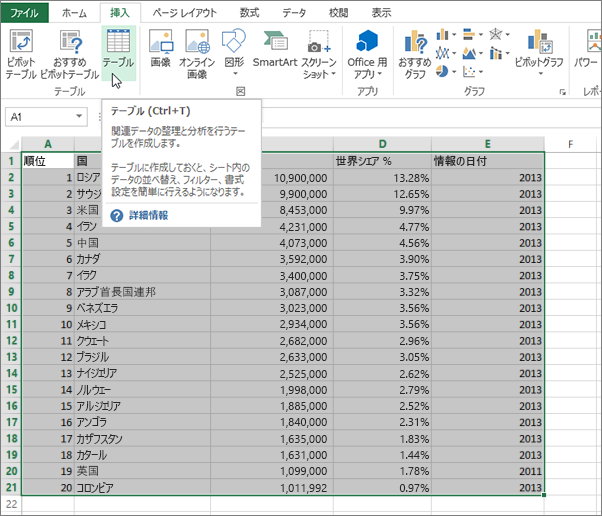
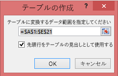

# エラー: Excel ブックにデータが見つかりませんでした

>[!NOTE]  
>この記事は、Excel 2007 以降に適用されます。

Power BI に Excel ブックをインポートするとき、次のエラーが生じることがあります。

*エラー:テーブルとして書式設定されたデータが見つかりませんでした。Excel から Power BI サービスにインポートするには、データをテーブルとして書式設定する必要があります。テーブルで必要なすべてのデータを選択し、Ctrl + T キーを押します。*

## クイック ソリューション
1. Excel でブックを編集します。
2. データを含むセルの範囲を選択します。 最初の行には、列のヘッダー (列名) が含まれている必要があります。
3. **Ctrl + T** キーを押して、テーブルを作成します。
4. ブックを保存します。
5. Power BI に戻り、ブックを再びインポートします。または、Excel 2016 を使用していて、ブックを OneDrive for Business に保存した場合は、Excel で [ファイル]、[発行] の順にクリックします。

## 詳細
### 原因
Excel では、特定のセルの範囲から **テーブル** を作成できます。これにより、並べ替え、フィルター処理、およびデータの書式設定が簡単になります。

Excel ブックをインポートするとき、Power BI はそれらのテーブルを検索してデータセットにインポートします。テーブルが見つからない場合は、このエラー メッセージが表示されます。

### 解決方法
1. Excel でブックを開きます。 
    >[!NOTE]
    >この図は Excel 2013 のものです。 他のバージョンを使用している場合、表示は少し異なりますが、手順は同じです。
    
    
2. データを含むセルの範囲を選択します。 最初の行には、列のヘッダー (列名) が含まれている必要があります。
   
    
3. **[挿入]** タブのリボンで、 **[テーブル]** をクリックします  (または、ショートカットの **Ctrl + T** キーを押します)。
   
    
4. 次のダイアログ ボックスが表示されます。 **[先頭行をテーブルの見出しとして使用する]** にチェックマークが付いていることを確認して、 **[OK]** を選択します。
   
    
5. これで、データはテーブルとして書式設定されました。
   
    
6. ブックを保存します。
7. Power BI に戻ります。 ナビ ペインの下部にある [データの取得] を選択します。
   
    
8. **[ファイル]** ボックスで、 **[取得]** を選択します。
   
    
9. Excel ブックを再度インポートします。 今回は、インポートでテーブルが見つかり、成功するはずです。
   
    インポートがまだ失敗する場合は、ヘルプ メニューの **[コミュニティ]** をクリックして通知してください。
   
    ![[コミュニティ] リンク](media/service-admin-troubleshoot-excel-workbook-data/power-bi-question-menu-community.png)
