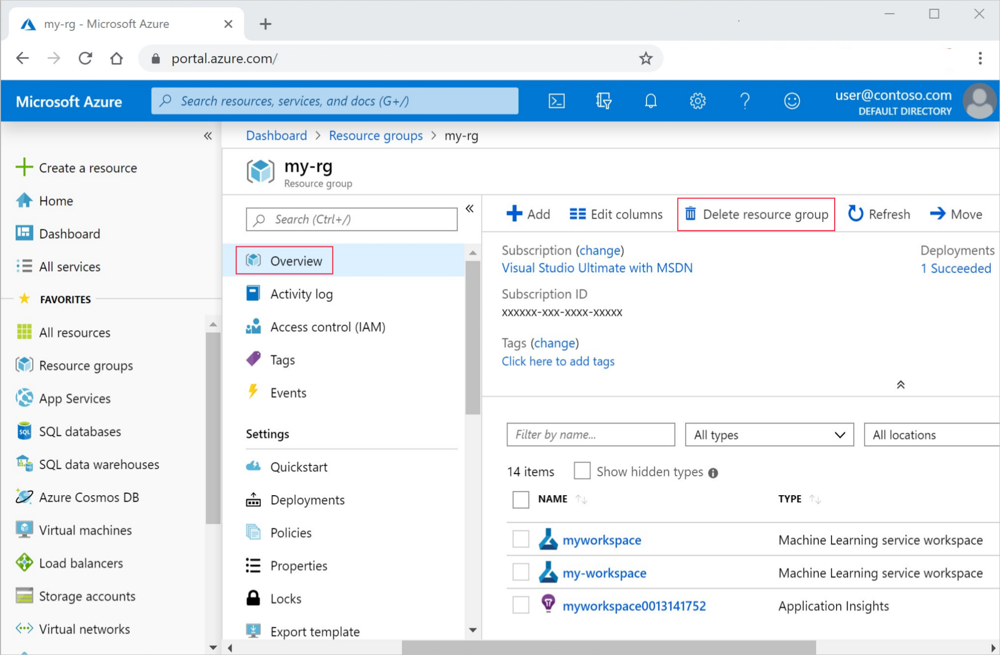

# <a name="tutorial-consume-azure-machine-learning-models-in-power-bi"></a>チュートリアル:Power BI で Azure Machine Learning モデルを使用する

このチュートリアルでは、機械学習モデルに基づいて Power BI レポートを作成する手順について説明します。 このチュートリアルを終了すると、次のことができるようになります。

> [!div class="checklist"]
> * Power BI で、(Azure Machine Learning を使用してデプロイされた) 機械学習モデルをスコア付けします。
> * Power Query エディターで Azure Machine Learning モデルに接続します。
> * そのモデルに基づく視覚化を使用して、レポートを作成します。
> * そのレポートを Power BI サービスに発行します。
> * レポートの定期更新を設定します。

## <a name="prerequisites"></a>前提条件

このチュートリアルを開始するには、事前に次の準備が必要です。

- Azure Machine Learning で機械学習モデルをトレーニングしてデプロイします。 次の 3 つの Azure Machine Learning チュートリアルのいずれかを使用します。 

    - [オプション A:コード](/azure/machine-learning/tutorial-power-bi-custom-model)
    - [オプション B:デザイナー](/azure/machine-learning/tutorial-power-bi-designer-model)
    - [オプション C:自動 ML](/azure/machine-learning/tutorial-power-bi-automated-model)

- [Power BI 無料試用版](https://app.powerbi.com/signupredirect?pbi_source=web)にサインアップします。
- ローカル コンピューターに [Power BI Desktop](https://powerbi.microsoft.com/desktop/) をインストールします。

## <a name="create-the-data-model"></a>データ モデルを作成する

Power BI Desktop を開いて、 **[データの取得]** を選びます。 **[データの取得]** ダイアログ ボックスで、 **[Web]** を検索します。 **[Web]** ソース > **[接続]** の順に選択します。

:::image type="content" source="media/service-aml-integrate/pbi-get-data.png" alt-text="Web データを表示したスクリーンショット。":::

**[Web から]** ダイアログ ボックスで、次の URL をコピーしてボックスに貼り付けます。

```txt 
https://www4.stat.ncsu.edu/~boos/var.select/diabetes.tab.txt
```

:::image type="content" source="media/service-aml-integrate/pbi-data.png" alt-text="Web URL を示したスクリーンショット。":::

**[OK]** を選択します。

**[Web コンテンツへのアクセス]** で、 **[匿名]**  >  **[接続]** の順に選択します。

:::image type="content" source="media/service-aml-integrate/anonymous-access-web-content.png" alt-text="Web コンテンツの匿名アクセスを示すスクリーンショット。":::

**[データの変換]** を選択して **[Power Query エディター]** ウィンドウを開きます。

Power Query エディターの [ホーム] リボンで、 **[Azure Machine Learning]** ボタンを選択します。

:::image type="content" source="media/service-aml-integrate/aml-button.png" alt-text="Power Query エディターを示すスクリーンショット。":::

シングル サインオンを使用して Azure アカウントにサイン インすると、利用可能なサービスの一覧が表示されます。 [トレーニング] から作成した **my-sklearn-service** を選択して、機械学習モデルのチュートリアルをデプロイします。 

Power Query によって、列が自動的に設定されます。 サービスのスキーマに、入力を指定した Python デコレーターがあることに注意してください。 **[OK]** を選択します。

:::image type="content" source="media/service-aml-integrate/aml-pbi-run.png" alt-text="Azure Machine Learning モデルを示したスクリーンショット。":::

**[OK]** を選択すると、Azure Machine Learning service が呼び出されます。 データとエンドポイントの両方について、データのプライバシーに関する警告がトリガーされます。

:::image type="content" source="media/service-aml-integrate/data_privacy_warning.png" alt-text="プライバシーの警告を示すスクリーンショット。":::

**[続行]** をクリックします。 次の画面で、 **[Ignore Privacy Levels checks for this file]\(このファイルのプライバシー レベルのチェックを無視する\)**  >  **[保存]** の順に選択します。

データがスコア付けされると、Power Query によって **AzureML.my-diabetes-model** という名前の追加の列が作成されます。

:::image type="content" source="media/service-aml-integrate/scored-data.png" alt-text="スコア付けされた追加の列を示すスクリーンショット。":::

サービスから返されるデータは、**一覧** です。 

> [!NOTE]
> デザイナー モデルをデプロイした場合は、**レコード** が表示されます。

予測を取得するには、**AzureML.my-diabetes-model** 列ヘッダーの両方向矢印を選択し、 **[新しい行に展開する]** を選択します。

:::image type="content" source="media/service-aml-integrate/expand-column.png" alt-text="[列の展開] アイコンを示すスクリーンショット。":::

展開後は、AzureML.my-diabetes-model 列に予測が表示されます。

:::image type="content" source="media/service-aml-integrate/after-expand.png" alt-text="展開を示したスクリーンショット。":::

次の手順に従って、データ モデルのクリーンアップを完了します。

1. **AzureML.my-diabetes-model** 列の名前を **[予測]** に変更します。
1. **Y** 列の名前を **[実際]** に変更します。
1. **[実際]** 列の型を変更します。列を選択し、 **[変換]** リボン上で **[データ型]**  >  **[10 進数]** の順に選択します。
1. **[予測]** 列の型を変更します。列を選択し、 **[変換]** リボン上で **[データ型]**  >  **[10 進数]** の順に選択します。
1. **[ホーム]** リボン上で、 **[Close & Apply\(閉じて適用する\)]** を選択します。

## <a name="create-a-report-with-visualizations"></a>視覚化を使用してレポートを作成する

これで、いくつかの視覚化を作成してデータを表示できるようになりました。

1. **[視覚化]** ウィンドウで、 **[折れ線グラフ]** を選択します。 
1. 視覚化の折れ線グラフが選択された状態になっています。
1. **[期間]** フィールドを **[軸]** にドラッグします。
1. **[実際]** フィールドを **[値]** にドラッグします。
1. **[予測]** フィールドを **[値]** にドラッグします。

折れ線グラフのサイズをページ全体に拡大します。 これで、レポートに 2 本の線を含む折れ線グラフが作成されました。1 本は予測、もう 1 本は実際の値に対応し、期間別に分布しています。

:::image type="content" source="media/service-aml-integrate/report-viz.png" alt-text="レポートの視覚化を示すスクリーンショット。":::

## <a name="publish-the-report"></a>レポートを発行する

必要に応じて、視覚化をさらに追加できます。 簡潔にするために、このチュートリアルではレポートを発行します。

1. レポートを保存します。
1. **[ファイル]**  >  **[発行]**  >  **[Power BI へ発行]** の順に選択します。
1. Power BI サービスにサインインします。
1. **[マイ ワークスペース]** を選択します。
1. レポートが正常に発行されたら、 **[Open <MY_PBIX_FILE.pbix> in Power BI]\(Power BI の <MY_PBIX_FILE.pbix> を開く\)** リンクを選択します。 ブラウザーの Power BI にレポートが開かれます。

     :::image type="content" source="media/service-aml-integrate/publish-success.png" alt-text="正常に発行されたことを示すスクリーンショット。":::

## <a name="enable-datasets-to-refresh"></a>データセットの更新を有効にする

新しいデータによってデータ ソースが更新されスコア付けされるシナリオでは、データをスコア付けできるように資格情報を更新する必要があります。 

Power BI サービスの [マイ ワークスペース] にある黒いヘッダー バーで、 **[その他のオプション (...)]**  >  **[設定]**  >  **[設定]** の順に選択します。

:::image type="content" source="media/service-aml-integrate/settings-pbi.png" alt-text="設定を表示したスクリーンショット。":::

**[データセット]** を選択し、 **[データ ソースの資格情報]** を展開して、 **[資格情報の編集]** を選択します。

:::image type="content" source="media/service-aml-integrate/data-refresh.png" alt-text="資格情報の更新を示すスクリーンショット。":::

**azureMLFunctions** および **Web** の両方の手順に従います。 必ずプライバシー レベルを選択してください。 これで、データの **[スケジュールされている更新]** を設定できるようになりました。 **[更新の頻度]** と **[タイム ゾーン]** を選択します。 また、Power BI によって更新エラー通知が送信される電子メール アドレスを選択することもできます。

:::image type="content" source="media/service-aml-integrate/schedule-refresh.png" alt-text="データセットとスコア更新を示すスクリーンショット。":::

**[適用]** を選択します。

>[!NOTE]
> データが更新されると、スコア付けのためにそのデータは Azure Machine Learning エンドポイントにも送信されます。

## <a name="clean-up-resources"></a>リソースをクリーンアップする

>[!IMPORTANT]
>作成したリソースは、Azure Machine Learning のその他のチュートリアルおよびハウツー記事の前提条件として使用できます。

作成したリソースを使用する予定がない場合は、料金が発生しないように削除します。

1. Azure Portal で、左端にある **[リソース グループ]** を選択します。
 
1. 一覧から、作成したリソース グループを選択します。

1. **[リソース グループの削除]** を選択します。

   

1. リソース グループ名を入力します。 次に、 **[削除]** を選択します。
1. Power BI サービスの [マイ ワークスペース] で、レポートと関連するデータセットを削除します。 コンピューター上で Power BI Desktop またはレポートを削除する必要はありません。 Power BI Desktop は無料です。

## <a name="next-steps"></a>次のステップ

このチュートリアル シリーズでは、Azure Machine Learning 上でスコア付けエンドポイントによって新しいデータをスコア付けできるように、Power BI にスケジュールを設定する方法について説明します。
