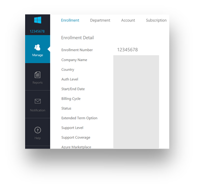

# Microsoft Sustainability Calculator のサポート ページ

Microsoft Sustainability Calculator では、Azure サービスに関連する二酸化炭素排出データに関する新しい分析情報を提供します。 組織内で持続可能性に関するレポートと推進を担当するユーザーは、各 Azure サブスクリプションの炭素排出量を定量化し、Azure とオンプレミスのデータセンターでワークロードを実行した場合の二酸化炭素の推定削減量を比較することができます。 このデータは、スコープ 3 排出量の温室効果ガス レポートに使用できます。

> [!NOTE]
> このコネクタ バージョンでサポートされるのは、[Azure Enterprise Portal](https://ea.azure.com) からの登録のみです。 現在、中国での登録はサポートされていません。

## [前提条件]

Microsoft Sustainability Calculator にアクセスするには、次の情報を組織の Azure 管理者から入手する必要があります。

- テナント ID
- アクセス キー
- 加入契約番号

会社の登録番号を確認するには:

1. [Azure Enterprise Portal](https://ea.azure.com) に管理者としてサインインします。
2. 左側のナビゲーション バーで **[Active Directory]** または **[管理]** を選択します。 会社の登録番号が表示されます。

   

会社のアクセス キーを確認するには:

1. [Azure Enterprise Portal](https://ea.azure.com) に管理者としてサインインします。
2. **[レポート]** を選択し、 **[API アクセス キー]** を選択してプライマリ登録アカウント キーを取得します。

## Sustainability Calculator の 2020 年 1 月リリース

### 接続する方法

[!INCLUDE [powerbi-service-apps-get-more-apps](../includes/powerbi-service-apps-get-more-apps.md)]

3. **Microsoft Sustainability Calculator** を選択してから、 **[今すぐ入手する]** を選択します。

4. **[この Power BI アプリをインストールしますか?]** で、 **[インストール]** を選択します。

5. **[アプリ]** ペインで、 **[Microsoft Sustainability Calculator]** タイルを選択します。

6. **[新しいアプリを開始する]** で **[接続]** を選択します。

   

7. **[Company name]\(会社名\)** 、 **[User enrollment number]\(ユーザー登録番号\)** 、 **[Number of months]\(月数\)** を入力します。 登録番号の取得については、「[前提条件](#prerequisites)」を参照してください。 **[次へ]** を選択します。

   

8. 次の情報を入力します。

   | フィールド | 値 |
   | --- | --- |
   | **認証方法** | **[キー]** を選択します。 |
   | **アカウント キー** | アクセス キーを入力します。 |
   | **このデータ ソースのプライバシー レベルの設定** | **[Organizational]\(組織\)** を選択します。 |

   

9. **[サインイン]** を選択します。

10. インポート処理が自動的に開始します。 完了すると、**ナビゲーション ペイン** に、新しいダッシュボード、レポート、モデルが表示されます。 インポートされたデータを表示するレポートを選択します。

### アプリの使用

パラメーターを更新するには:

1. **[Dataset]\(データセット\)** の設定に移動し、アプリ ワークスペースに関連付けられている設定にアクセスします。
2. 必要に応じて、 **[Company name]\(会社名\)** 、 **[User enrollment number]\(ユーザー登録番号\)** 、 **[Number of months]\(月数\)** を更新します。
3. **[更新]** を選択して、新しいパラメーターが適用されたデータを再度読み込みます。

## Sustainability Calculator の 2020 年 12 月リリース (プレビュー)

Microsoft Sustainability Calculator を使用して、クラウドベースの現在の炭素排出量を計算します。

正確なカーボン アカウンティングには、パートナー、ベンダー、サプライヤーからの適切な情報が必要です。 Microsoft Sustainability Calculator を使用すると、Azure と Microsoft Dynamics の使用によって発生する炭素の排出量についての透明性が得られます。

Microsoft のカーボン アカウンティングは、2018 年にスタンフォード大学によって検証された方法により、3 つの排出スコープすべてを対象としています。 一貫した正確なカーボン アカウンティングを使用して、お客様の環境フットプリントに対する Microsoft クラウド サービスの影響を定量化します。 Microsoft は、自主的報告または法定報告の要件に関するレポートを作成するかたわら、このレベルの透明性をお客様に提供する唯一のクラウド プロバイダーです。

### アップグレードを開始する前に

Microsoft Sustainability Calculator は Power BI Pro で実行されます。 Power BI Pro がない場合は、[無料試用版をすぐに入手してください](https://powerbi.microsoft.com/power-bi-pro)。

Azure の登録番号が必要になります。 わからない場合は、組織の Azure 管理者に問い合わせてください。 詳細については、「[前提条件](#prerequisites)」を参照してください。

### Calculator の接続: カーボン アカウンティングへの 5 つの簡単なステップ

1. [AppSource](https://go.microsoft.com/fwlink/?linkid=2151690) からアプリをダウンロードします。

   

   Power BI でアプリを検索することもできます。

   

2. アプリを開きます。

3. 登録番号を入力します。 **[データを接続]** を選択して、登録番号を入力します。 登録番号の取得の詳細については、「[前提条件](#prerequisites)」を参照してください。

   

4. アカウントを接続します。
   - **[You are connecting to (1 of 2)]\(接続しています (1/2)\)** の **[認証方法]** で **[OAuth2]** を選択し、 **[このデータ ソースのプライバシー レベルの設定]** で **[組織]** を選択します。

      
 
   - ユーザー アカウントを選択します。

      
       
   - **[You are connecting to (2 of 2)]\(接続しています (2/2)\)** の **[認証方法]** で **[匿名]** を選択し、 **[このデータ ソースのプライバシー レベルの設定]** で、 **[組織]** を選択します。

     
    
5. ビューが作成されるまで待ちます。これには最大で 24 時間かかることがあります。

### その他のリソース

- [ハウツー ビデオ](https://go.microsoft.com/fwlink/?linkid=2151608)
- [クラウド コンピューティングのカーボン メリット: WSP とのパートナーシップによる Microsoft クラウドに関する調査](https://download.microsoft.com/download/7/3/9/739BC4AD-A855-436E-961D-9C95EB51DAF9/Microsoft_Cloud_Carbon_Study_2018.pdf)

### よく寄せられる質問

#### アプリのセットアップ

**データを Calculator に接続するときにエラーが発生します。どうすればよいですか?**

最初に、Azure Cost Management で IT 管理者特権があることを確認します。 そうでない場合は、管理者にこのアクセスを要求します。 次に、正しい登録番号を使用していることを確認します。

**登録番号を入力しましたが、会社のデータが読み込まれません。何が問題ですか?**

Sustainability Calculator パブリック プレビューへのデータの読み込みには、最大で 24 時間かかる場合があります。 24 時間経ったら、Power BI で **[更新]** ボタンを選択します。

**Microsoft は、排出に関する責任を Microsoft から顧客に移そうとしているのですか?**

いいえ。 Azure サービスからの炭素排出量は、業界標準の[温室効果ガス (GHG) 協定](https://ghgprotocol.org/)と一致する、Microsoft のスコープ 1 および 2 の排出量として報告されます。 GHG 協定では、スコープ 3 の排出量は別のエンティティによって代わりに排出される排出量として定義されており、これは本質的に二重にカウントされます。 Microsoft Sustainability Calculator を使用すると、Azure サービスの使用に関連するスコープ 3 の排出量に対する新しい透明性が提供されます。具体的には、スコープ 3 カテゴリ 1 "購入された商品とサービス" です。

**Microsoft クラウドを使用したときの排出量が、オンプレミスのソリューションを使用していた場合よりはるかに少ないのはなぜでしょうか?**

Microsoft は、Microsoft クラウドとオンプレミスまたは従来のデータセンターの違いを評価する[調査 (2018 年に公開)](https://blogs.microsoft.com/on-the-issues/2018/05/17/microsoft-cloud-delivers-when-it-comes-to-energy-efficiency-and-carbon-emission-reductions-study-finds/) を実施しました。 結果では、Azure の Compute と Storage は、低、中、または高効率のオンプレミスの代替手段との間で行われた特定の比較に応じて、従来のエンタープライズ データセンターよりエネルギー効率が 52 から 79% 高くなります。 再生可能エネルギーの購入を考慮する場合、Azure ではカーボン効率が 79 から 98% 向上します。 これらの削減は、Microsoft クラウドの次の 4 つの主要な機能によるものです: IT 運用の効率、IT 機器の効率、データセンター インフラストラクチャの効率、再生可能な電力。

**Microsoft の運用がカーボン ニュートラルであり、再生可能エネルギーによって提供されている場合、Azure サービスからの顧客の排出量がゼロにならないのはなぜでしょうか?**

Microsoft からの顧客の排出量がゼロにならないのには、主に 2 つの理由があります。 1 つ目は GHG アカウンティング プラクティスに関連し、2 つ目はこの分析の境界に関係があります。 カーボン ニュートラルの運用を実現するため、Microsoft はカーボン オフセットを使用して、補助発電機のオンサイトの燃料燃焼、冷却剤、自動車隊など、特定の排出源を減らしています。 これにより、Microsoft の "*正味*" 排出量はゼロに減ります。 Calculator では、これらのオフセットを適用する前の "*総*" GHG 排出量が報告されますが、透明性を高めるため、適用されるオフセットの量と正味排出量が **[GHG Reporting]\(GHG レポート\)** タブで報告されます。 2 つ目の理由として、Microsoft のデータセンターの運用に伴うエネルギーと排出量に加えて、排出量のフットプリントには、Microsoft のデータセンターと Azure の顧客との間でデータを送信するために、Microsoft の運用境界の外部でインターネット サービス プロバイダーによって使用されるエネルギーが含まれます。

**このデータをどのように使用し、どこに報告すればよいでしょうか?**

排出量は、会社のスコープ 3 間接炭素排出量の一部として報告することができます。 スコープ 3 の排出量は、多くの場合、持続可能性報告書、CDP 気候変動、およびその他のレポート発表で公開されます。 排出量の合計に加えて、排出量の削減により、Microsoft Azure サービスを使用するという会社の決定がグローバルな排出量の削減にどのように寄与するのかについての明確な例が示されます。 状況に当てはめるため、アプリにより、2020 年 1 月時点での EPA の同等の計算要因に基づいて、GHG 排出量での削減に対応して回避された同等の車両マイル数が示されます。

**排出量をさらに削減するにはどうすればよいですか?**

Azure のリソースとコスト効率により、Azure の使用による環境への影響が軽減されます。 たとえば、使用されていない仮想マシンは、クラウドでもオンプレミスでも無駄になります。 仮想マシンのサイズを適切に調整してコンピューティング利用率 (CUF) を向上させることで、物理サーバーの場合と同様に、有用な出力ごとのエネルギー使用量が減ります。 [Azure Cost Management](https://docs.microsoft.com/azure/cost-management-billing/costs/cost-mgt-best-practices) には、クラウドへの投資を最大限に活用するために支出を計画、分析、削減するためのツールが用意されています。

#### 手法

**ツールの背後ではどのような手法が使用されていますか?**

Microsoft Sustainability Calculator には、使用されている特定のクラウド サービスと、関連するエネルギー要件、それらのサービスを提供するデータセンターの効率、それらのデータセンターが運用されているリージョンでの電気燃料の混合、および Microsoft による再生可能エネルギーの購入が反映されています。 アプリの開発の一部として、手法とその実装がサードパーティによって検証されて、世界資源研究所 (WRI)/持続可能な発展のための世界経済人会議 (WBCSD) による温室効果ガス (GHG) 協定の企業会計およびレポート標準に一致することが確認されています。 ISO 14064-3: 温室効果ガス -- パート 3: 温室効果ガス アサーションの検証と確認についてのガイダンスに関する仕様に従って実施された検証のスコープには、Azure サービスからの排出量の推定は含まれていましたが、その見積もりの事実に反する性質として、オンプレミスの排出量の推定は除外されていました。 カーボン計算の詳細な説明は、ツールの **[Calculation Methodology]\(計算方法\)** タブにあります。

**Azure カーボン フットプリントを計算するために必要なデータは何ですか? 会社のデータにアクセスしますか?**

推定カーボン計算は、Azure 使用による収益 を使用してアクセスされた Azure サービスの消費量に基づいて行われます。 Calculator で、お客様によって格納された顧客データにアクセスすることはありません。 消費量データは、Microsoft によるエネルギーおよびカーボン追跡データと組み合わされ、Azure サービスを提供するデータセンターに基づいて、それらのサービスの使用量に関連する推定排出量が計算されます。

**この計算には、すべての Azure サービスとすべての Azure リージョンが含まれますか?**

推定には、セットアップの間に提供されたテナント ID に関連付けられているすべての Azure リージョンのすべての Azure サービスが含まれます。

#### オンプレミスの排出量の特性化

**Microsoft Sustainability Calculator では、オンプレミスの排出量と運用に関するデータがどこから取得されますか?**

Microsoft Sustainability Calculator では、お客様によって提供されたものを "*除き*"、オンプレミスのデータセンターに関する特定の情報は取得されません。 以降の FAQ で説明されているように、Microsoft Sustainability Calculator では、オンプレミスの代替手段の効率とエネルギーの組み合わせに関する業界の調査とユーザー入力に基づいて、オンプレミスの排出量の推定が作成されます。

**オンプレミスの推定に関する前提事項は何ですか? 効率性の要因は、電力利用効果 (PUE) の向上によるものだけですか?**

Microsoft クラウド サービスに関連する効率性には、PUE の向上以外のものも含まれています。 Microsoft のデータセンターでは PUE の最適化が行われていますが、主要な効率の向上は、データセンターのインフラストラクチャの効率性 (PUE の向上) に加えて、IT 運用の効率性 (動的プロビジョニング、マルチテナント、サーバー使用率) と、IT 機器の効率性 (有用な出力に使用されるエネルギーを増やすためのサービスに合わせたハードウェアの調整) によるものです。 [2018 年の調査](https://blogs.microsoft.com/on-the-issues/2018/05/17/microsoft-cloud-delivers-when-it-comes-to-energy-efficiency-and-carbon-emission-reductions-study-finds/)において、低効率から高効率までのデータセンターのオンプレミスの代替手段と比較して、これらの削減が定量化されています。 これらの調査結果は、各お客様が Microsoft クラウドで使用するのと同じサービスを対応するオンプレミス データセンターで提供するために必要なエネルギー使用量を推定するために使用されています。

**オンプレミスのインフラストラクチャでは、どのようなエネルギーの組み合わせが想定されていますか?**

既定の Microsoft Sustainability Calculator では、グリッドでの再生可能エネルギーと非再生可能エネルギーの組み合わせに基づいて、オンプレミスの排出量が推定されます。 オンプレミスのデータセンターは、Microsoft のデータセンターと同じグリッドにあるものと想定されています。 ただし、グリッドのものに "*加えて*" (たとえば買電契約を通じて) 再生可能電気を購入しているお客様の場合、ユーザーは再生可能電気の割合を選択でき、Microsoft Sustainability Calculator ではそれに応じてオンプレミスの排出量が調整されます。

**どのようなときにオンプレミスのインフラストラクチャの効率性を低、中、高から選択する必要がありますか?**

ユーザーは、次の機器とデータセンターの特性に基づいて、比較対象のオンプレミス展開の最も代表的な効率を選択する必要があります。

- **低**: 小規模のローカライズされたデータセンターでの物理サーバーと直接接続ストレージ (500 から 1,999 平方フィート)
- **中**: 中規模の内部データセンターでの物理および仮想サーバーと接続および専用ストレージの混合 (2,000 から 19,999 平方フィート)
- **高**: ハイエンド内部データセンターの仮想化されたサーバーと専用ストレージ (20,000 平方フィート以上)
