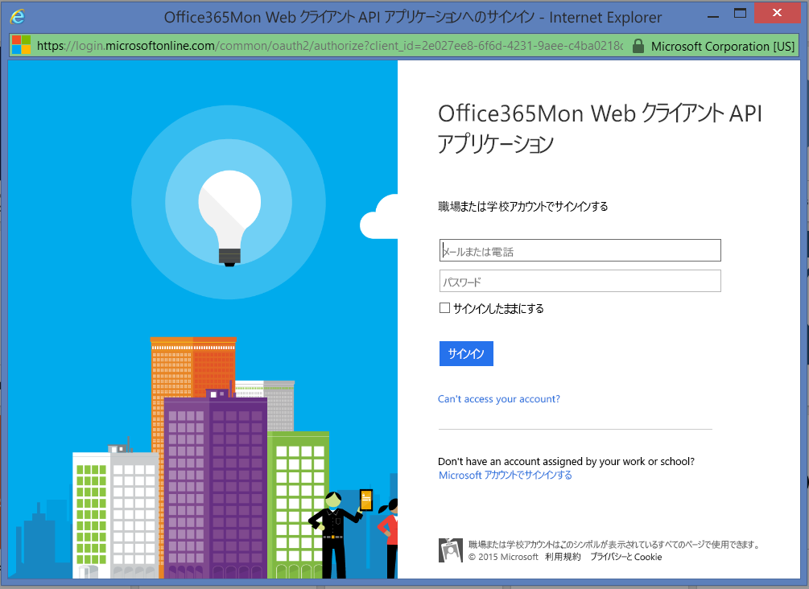
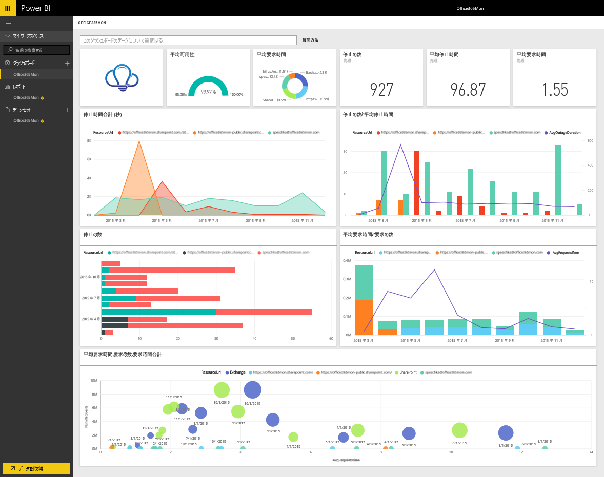

# Power BI で Office365Mon に接続する
Office 365 の障害および正常性のパフォーマンス データの分析は、Power BI や Office365Mon テンプレート アプリを使用すると簡単です。 Power BI は、障害および正常性 プローブを含むデータを取得してから、そのデータに基づいてすぐに使えるダッシュボードおよびレポートを作成します。

Power BI 用 [Office365Mon テンプレート アプリ](https://msit.powerbi.com/groups/me/getapps/services/office365mon.office365mon_powerbi_v3)に接続します。

>[!NOTE]
>Power BI テンプレート アプリに接続して読み込むには、Office365Mon の管理者アカウントが必要です。

## 接続する方法
1. ナビ ペインの下部にある **[データの取得]** を選択します。
   
   ![[データの取得] ボタンのスクリーンショット。ナビゲーション ウィンドウに表示されています。](media/service-connect-to-office365mon/pbi_getdata.png)
2. **[サービス]** ボックスで、 **[取得]** を選択します。
   
   ![[サービス] ダイアログのスクリーンショット。[取得] ボタンが表示されます。](media/service-connect-to-office365mon/pbi_getservices.png) 
3. **[Office365Mon]** \> **[取得]** を選択します。
   
   ![[Office365Mon] ダイアログのスクリーンショット。[取得] リンクが表示されます。](media/service-connect-to-office365mon/o365mon.png)
4. 認証方式として、 **[oAuth2]** \> **[サインイン]** を選択します。
   
   プロンプトが表示されたら、Office365Mon の管理者資格情報を入力し、認証プロセスに従います。
   
   ![[Connect to Office365Mon]\(Office365Mon に接続する\) ダイアログのスクリーンショット。[認証方法] フィールドに [Auth2] が入力されています。](media/service-connect-to-office365mon/creds.png)
   
   
5. Power BI によるデータのインポート後、新しいダッシュ ボード、レポート、データセットがナビ ペインに表示されます。 新しい項目は、黄色のアスタリスク (\*) でマークされます。Office365Mon エントリを選択します。
   
   

**実行できる操作**

* ダッシュボード上部にある [Q&A ボックスで質問](../consumer/end-user-q-and-a.md)してみてください。
* ダッシュボードで[タイルを変更](../create-reports/service-dashboard-edit-tile.md)できます。
* [タイルを選択](../consumer/end-user-tiles.md)して基になるレポートを開くことができます。
* データセットは毎日更新するようにスケジュール設定されますが、更新のスケジュールは変更でき、また **[今すぐ更新]** を使えばいつでも必要なときに更新できます。

## トラブルシューティング
Office365Mon サブスクリプション資格情報を使用してログインした後に **"ログインに失敗しました"** エラーが表示された場合、使用しているアカウントには、アカウントから Office365Mon データを取得するためのアクセス許可がありません。 管理者アカウントであることを確認してからやり直してください。

## 次の手順
[Power BI とは?](../fundamentals/power-bi-overview.md)

[Power BI のデータの取得](service-get-data.md)
