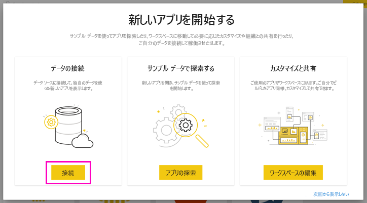

# Power BI で Xero に接続する
Xero は、小規模な企業専用に設計された使いやすいオンライン会計ソフトウェアです。 この Power BI テンプレート アプリを使うと、Xero 財務をベースにした説得力のある視覚化を作成できます。 既定のダッシュボードには、現金持高、収益と経費、損益の傾向、債権回収までの日数、投資収益率など、小規模ビジネスで必要とされる多くのメトリックが組み込まれています。

Power BI 用 [Xero テンプレート アプリ](https://app.powerbi.com/getdata/services/xero)に接続するか、[Xero と Power BI](https://help.xero.com/Power-BI) の統合に関する詳細をご確認ください。

## 接続する方法

[!INCLUDE [powerbi-service-apps-get-more-apps](../includes/powerbi-service-apps-get-more-apps.md)]

3. **[Xero]** \> **[今すぐ入手]** の順に選択します。
4. **[この Power BI アプリをインストールしますか?]** で、 **[インストール]** を選択します。

    

4. **[アプリ]** ペインで、 **[Xero]** タイルを選択します。

   ![[Xero] タイルを選択する](media/service-connect-to-xero/power-bi-start-xero.png)

6. **[新しいアプリを開始する]** で **[接続]** を選択します。

    

4. Xero アカウントに関連付けられている組織のニックネームを入力します。 これは複数の Xero 組織を区別するためのものなので、何でもかまいません。 詳細については、この記事で後述する「[パラメーターの見つけ方](#FindingParams)」を参照してください。

    

5. **[認証方法]** として **[OAuth]** を選択します。 Xero アカウントへのサインインを求められたら、接続する組織を選択します。 サインインが完了したら、 **[サインイン]** を選択して読み込みプロセスを開始します。
   
    
   
    
6. 承諾後、インポート処理が自動的に開始されます。 完了すると、新しいダッシュ ボード、レポート、モデルがナビゲーション ペインに表示されます。 インポートされたデータを表示するダッシュボードを選択します。
   
     

**実行できる操作**

* ダッシュボード上部にある [Q&A ボックスで質問](../consumer/end-user-q-and-a.md)してみてください。
* ダッシュボードで[タイルを変更](../create-reports/service-dashboard-edit-tile.md)できます。
* [タイルを選択](../consumer/end-user-tiles.md)して基になるレポートを開くことができます。
* データセットは毎日更新するようにスケジュール設定されますが、更新のスケジュールは変更でき、また **[今すぐ更新]** を使えばいつでも必要なときに更新できます。

## 含まれるもの
テンプレート アプリのダッシュ ボードには、次のようなさまざまな領域をカバーするタイルとメトリック、および対応する詳細なレポートが含まれています。  

| 領域 | ダッシュボードのタイル | レポート |
| --- | --- | --- |
| Cash (キャッシュ) |Daily cash flow (日単位のキャッシュ フロー)  Cash in (キャッシュ イン)  Cash out (キャッシュ アウト)  Closing balance by account (アカウント別決算残高)  Closing balance today (当日決算残高) |Bank Accounts (銀行口座) |
| 顧客 |Invoiced sales (請求済み売上)  Invoiced sales by customer (顧客別請求済み売上)  Invoiced sales growth trend (請求済み売上増加傾向)  Invoices due (請求期限)  Outstanding receivables (未収売掛)  Overdue receivables (期限切れ売掛) |Customer (顧客)  Inventory (在庫) |
| Supplier (仕入先) |Billed purchases (請求済み購入)  Billed purchases by supplier (仕入先別請求済み購入)  Billed purchases growth trend (請求済み購入増加傾向)   Bills due (支払期限)  Outstanding payables (未払債務)  Overdue payables (期限切れ債務) |Suppliers (仕入先)  在庫 |
| 在庫 |Monthly sales amount by product (製品別月別売上高) |在庫 |
| Profit and loss (損益) |Monthly profit and loss (月別損益)  Net profit this fiscal year (当会計年度純利益)  Net profit this month (当月純利益)  Top expense accounts (経費上位) |Profit and loss (損益) |
| Balance sheet (貸借対照表) |Total assets (総資産)  Total liabilities (総負債)  Equity (株主資本) |Balance sheet (貸借対照表) |
| 正常性 |Current ratio (現在比率)  Gross profit percentage (総利益率)   Return on total assets (総資産利益率)  Total liabilities to equity ratio (負債資本比率) |健康  Glossary and Technical Notes (用語集とテクニカル ノート) |

データセットには、レポートとダッシュボードをカスタマイズするための次の表も含まれます。  

* Addresses (住所)  
* Alerts (アラート)  
* Bank Statement Daily Balance (銀行取引明細書日別残高)  
* Bank Statements (銀行取引明細書)  
* 連絡先  
* Expense Claims (経費)  
* Invoice Line Items (請求書明細品目)  
* Invoices (請求書)  
* Items (品目)  
* Month End (月末)  
* 組織  
* 評価版残高  
* Xero Accounts (Xero アカウント)

## システム要件
Xero テンプレート アプリにアクセスするには、"Standard + Reports" または "Advisor" の役割が必要です。

## パラメーターの見つけ方
Power BI で追跡する組織の名前を指定します。 特定の名前を指定することにより、複数の異なる接続先組織を切り替えることができます。 スケジュールされた更新に影響するため、同じ組織に複数回接続することはできません。   

## トラブルシューティング
* Xero ユーザーが Power BI 用 Xero テンプレート アプリにアクセスするには、"Standard + Reports" または "Advisor" の役割が必要です。 このテンプレート アプリでは、Power BI を介してレポート データにアクセスする際に、ユーザーベースのアクセス許可を使用します。
* 読み込み中、ダッシュボードのタイルすべてが読み込み状態になります。 全体の読み込みが完了するまで、この状態のままになります。 読み込み完了の通知を受け取ったにもかかわらず、タイルがまだ読み込み中の場合は、ダッシュボードの右上にある [...] を使用して、ダッシュボードのタイルを更新してみてください。
* テンプレート アプリの更新が失敗する場合は、Power BI で同じ組織に複数回にわたって接続していないかを確認してください。 Xero では 1 つの組織には 1 回のアクティブ接続しか許可されず、同じ組織に複数回接続すると資格情報が無効であることを示すエラーが表示される場合があります。  
* エラー メッセージが表示される、読み込み速度が非常に遅いなど、Power BI 用 Xero テンプレート アプリへの接続に問題がある場合は、まずキャッシュまたは Cookie をクリアしてブラウザーを再起動した後、Power BI に再接続します。  

その他の問題が解決しない場合は、 https://support.powerbi.com でチケットを提出してください。

## 次の手順
[Power BI の概要](../fundamentals/service-get-started.md)

[Power BI でデータを取得する](service-get-data.md)
