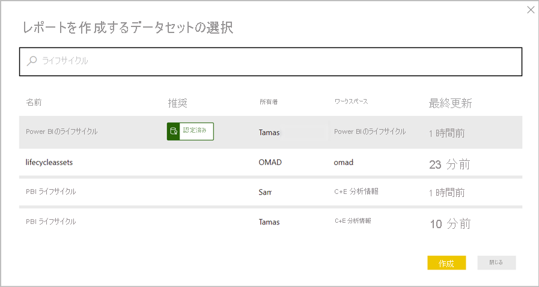

# ワークスペース全体のデータセットの概要

ビジネス インテリジェンスは共同作業です。 "1 つの正しい情報源" になれる標準化されたデータセットを確立することが重要です。 その後、そのような標準化されたデータセットを検出し、再利用することが鍵となります。 組織のデータ モデリングの専門家が最適化されたデータセットを作成し、共有するとき、レポートの作成者はそのようなデータセットから始め、正確なレポートを構築できます。 そうすれば、組織は整合性のあるデータで意思決定できるほか、そのデータ文化が健全になります。

Power BI では、データセットの作成者は、[ビルド アクセス許可](service-datasets-build-permissions.md)を使用することで、自分のデータにアクセスできるユーザーを制御できます。 データセットの作成者は、他のユーザーがデータセットを見つけられるよう、データセットを "*認定*" または "*昇格*" することもできます。 そうすることで、レポートの作成者は、どのデータセットが高品質かつ正式であるかを把握し、それらのデータセットを Power BI 内のあらゆる作成場所で使用できます。 管理者には、[ワークスペース全体でデータセットの使用を制御する](service-datasets-admin-across-workspaces.md)ための新しいテナント設定が与えられます。

## データセット共有と新しいワークスペース エクスペリエンス

さまざまなワークスペースのデータセットに基づいてレポートを構築することと、さまざまなワークスペースにレポートをコピーすることは、[新しいワークスペース エクスペリエンス](../collaborate-share/service-create-the-new-workspaces.md)と密結合しています。

- サービスでは、新しいワークスペース エクスペリエンスからデータセット カタログを開くとき、データセット カタログにはマイ ワークスペースと他の新しいワークスペース エクスペリエンスのワークスペースにあるデータセットが表示されます。 
- 従来のワークスペースからデータセット カタログを開くときは、そのワークスペースのデータセットのみが表示され、他のワークスペースのデータセットは表示されません。
- Power BI Desktop では、データセットが新しいエクスペリエンスのワークスペースにある限り、さまざまなワークスペースに Live Connect レポートを発行できます。
- ワークスペース間でレポートをコピーするとき、コピー先のワークスペースを新しいエクスペリエンスのワークスペースにする必要があります。

## データセットを検出する

既存のデータセットに基づいてレポートを構築するとき、最初の手順は、Power BI サービスまたは Power BI Desktop でデータセットに接続することです。 [さまざまなワークスペースからデータセットを検出する](service-datasets-discover-across-workspaces.md)方法に関するページをお読みください

## レポートをコピーする

ワークスペースまたはアプリで気に入ったレポートを見つけたら、それをコピーし、ニーズに合わせて変更できます。 データ モデルを作成する必要はありません。 既に作成されています。 また、一から始めるより、既存のレポートを変更するほうがずっと簡単です。 レポートのコピーについては[こちら](service-datasets-copy-reports.md)をお読みください。

## データセットのビルド アクセス許可

データセットの作成者の場合は、ビルド アクセス許可の種類を使用して、自分のデータセットに新しいコンテンツをビルドできる組織内のユーザーを決定することができます。 ビルド アクセス許可を持っている人は、Excel で分析、XMLA、エクスポートを利用した Excel シートなど、Power BI 外部のデータセットの上で新しいコンテンツをビルドすることもできます。 ビルド アクセス許可の詳細は[こちら](service-datasets-build-permissions.md)をお読みください。

## 推奨と認定

データセットを作成する場合、他のユーザーに役立ててもらえるようなデータセットを作成したとき、[データセットを推奨する](service-datasets-promote.md)ことでデータセットを簡単に見つけてもらうことができます。 また、[データセットの認定](service-datasets-certify.md)を組織の専門家に依頼できます。

## ライセンス

共有データセット機能に基づいて構築された特定の機能とエクスペリエンスは、既存のシナリオに基づいてライセンス供与されます。 例:

- 一般的に、共有データセットは誰でも検出し、それに接続できます。これは Premium に制限された機能ではありません。
- Pro ライセンスを所有していないユーザーが、レポート作成のためにワークスペース全体でデータセットを使用できるのは、それらのデータセットがユーザー個人のマイ ワークスペースまたは Premium ベースのワークスペースに存在する場合のみです。 レポートを Power BI Desktop または Power BI サービスのどちらで作成しても、同じライセンスの制限が適用されます。
- ワークスペース間でレポートをコピーするには、Pro ライセンスが必要です。
- アプリからレポートをコピーするには、組織のコンテンツ パックに必要であった Pro ライセンスが必要です。
- データセットの昇格と認定を行うには、Pro ライセンスが必要です。

## 考慮事項と制限事項

- アプリの発行元は、対象ユーザーがワークスペースの外部にあるデータセットにアクセスできることを確認する必要があります。 それ以外の場合は、ユーザーはアプリとやりとりするときに問題が発生します。データセットへのアクセス権がないとレポートは開かず、ダッシュボード タイルはロック済みとして表示されます。 また、ナビゲーションの最初の項目がデータセットへのアクセス権がないレポートである場合、ユーザーはアプリを開くことができません。
- 異なるワークスペースのデータセットに基づいてレポートを構築するには、両端に新しいワークスペース エクスペリエンスが必要になります。レポートを 1 つの新しいワークスペース エクスペリエンスに置き、データセットを 1 つの新しいワークスペース エクスペリエンスに置きます。 新しいワークスペース エクスペリエンス内のレポートをコピーできるのは、クラシック ワークスペースやマイ ワークスペースではなく、別の新しいワークスペース エクスペリエンスに対してのみとなります。 
- 従来のワークスペースの場合、データセットを検出すると、そのワークスペースにあるデータセットのみが表示されます。
- 設計上、共有データセットに基づくレポートに対しては、"Web に公開" は機能しません。
- 共有データセットにアクセスしているワークスペースに 2 人のユーザーが属している場合、そのうちの 1 人だけがワークスペース内の関連データセットを表示できます。 少なくともデータセットの読み取りアクセス権限が与えられているユーザーだけが共有データセットを表示できます。 

## 次の手順

- [データセットを推奨する](service-datasets-promote.md)
- [データセットを認定する](service-datasets-certify.md)
- [ワークスペース全体でデータセットの使用を制御する](service-datasets-admin-across-workspaces.md)
- わからないことがある場合は、 [Power BI コミュニティで質問してみてください](https://community.powerbi.com/)。
