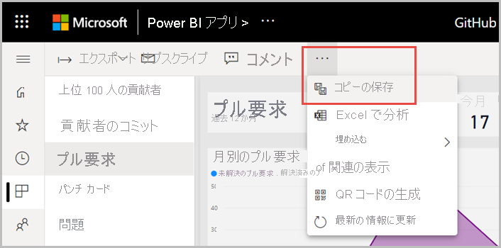
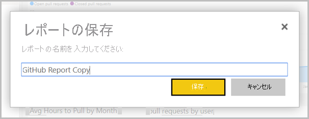

# 他のワークスペースからレポートをコピーする

ワークスペースまたはアプリで気に入ったレポートを見つけたら、それをコピーし、別のワークスペースに保存できます。 これで、そのレポートのコピーを変更し、ビジュアルや他の要素を追加または削除することができるようになります。 データ モデルを作成する必要はありません。 既に作成されています。 また、一から始めるより、既存のレポートを変更するほうがずっと簡単です。 ただし、ワークスペースからアプリを作成する場合、レポートのコピーをアプリに発行できないことがあります。 詳細については、記事「ワークスペース全体でデータセットを使用する」の「[考慮事項と制限事項](service-datasets-across-workspaces.md#considerations-and-limitations)」を参照してください。

## 前提条件

- レポートをコピーするには、元のレポートが Premium 容量内のワークスペースにある場合でも、Pro または Premium Per User (PPU) のライセンスが必要です。
- レポートをコピーするには、あるいは別のワークスペース内のデータセットに基づいてレポートを作成するには、そのデータセットに対するビルドのアクセス許可が必要です。 元のワークスペース内のデータセットについては、管理者、メンバー、共同作成者のロールを持つユーザーに対して、そのワークスペース ロールを通じてビルドのアクセス許可が自動的に付与されます。 詳細については、「[新しいワークスペースのロール](../collaborate-share/service-new-workspaces.md#roles-in-the-new-workspaces)」を参照してください。

## レポートのコピーをワークスペースに保存する

1. ワークスペースで、[レポート] リスト ビューに移動します。

    ![[レポート] リスト ビュー](media/service-datasets-copy-reports/power-bi-report-list-view.png)

1. **[アクション]** で、 **[コピーの保存]** を選択します。

    

    **[コピーの保存]** アイコンが表示されるのは、レポートが新しいエクスペリエンス ワークスペース内にあり、[ビルド アクセス許可](service-datasets-build-permissions.md)を持っている場合のみです。 ワークスペースにアクセスできる場合でも、データセットに対するビルド アクセス許可が必要です。

3. **[このレポートのコピーを保存します]** で、レポートに名前を付けて保存先のワークスペースを選択します。

    ![[コピーの保存] ダイアログ ボックス](media/service-datasets-copy-reports/power-bi-dataset-save-report.png)

    レポートを現在のワークスペースまたは Power BI サービスの別のワークスペースに保存できます。 自分がメンバーである新しいエクスペリエンス ワークスペースのワークスペースのみが表示されます。 
  
4. **[保存]** を選択します。

    レポートがワークスペースの外部のデータセットに基づいている場合は、Power BI によってレポートのコピーが作成され、データセットの一覧内のエントリが自動的に作成されます。 このデータセットのアイコンは、ワークスペース内のデータセットのアイコンとは異なります。 
    
    これで、ワークスペースの外部のデータセットをどのレポートとダッシュボードが使用するかをワークスペースのメンバーが把握できます。 エントリにはデータセットに関する情報と、いくつかの選択アクションが表示されます。

    

    レポートと関連するデータセットの詳細については、この記事の「[レポートのコピー](#your-copy-of-the-report)」を参照してください。

## アプリでレポートをコピーする

1. アプリで、コピーするレポートを開きます。
2. メニュー バーの **[その他のオプション** ( **...** )] > **[コピーの保存]** を選択します。

    

    **[コピーの保存]** オプションが表示されるのは、レポートが新しいエクスペリエンス ワークスペース内にあり、[ビルド アクセス許可](service-datasets-build-permissions.md)を持っている場合のみです。

3. レポートに名前を付けて、 **[保存]** を選択します。

    

    コピーは自動的に [マイ ワークスペース] に保存されます。

4. コピーを開くには、 **[レポートに移動]** を選択します。

## レポートのコピー

レポートのコピーを保存すると、データセットへのライブ接続が作成され、完全なデータセットを使用してレポート作成エクスペリエンスを開くことができます。 

データセットのコピーは作成していません。 データセットは、まだ元の場所に存在します。 独自のレポートで、そのデータセットのすべてのテーブルとメジャーを使用することができます。 データセットで行レベル セキュリティ (RLS) の制限が有効になるため、RLS ロールに基づいて表示のアクセス許可があるデータのみが表示されます。

## 関連データセットを表示する

別のワークスペースのデータセットに基づく 1 つのワークスペースにレポートがある場合は、基になっているデータセットの詳細を確認する必要があります。

1. [レポート] リスト ビューで、 **[関連の表示]** を選択します。

    ![[アクション] の下の [関連の表示] アイコンが表示されているスクリーンショット。](media/service-datasets-copy-reports/power-bi-dataset-view-related.png)

1. **[関連コンテンツ]** ダイアログ ボックスには、すべての関連項目が表示されます。 このリストでは、データセットは他のものと同じように表示されます。 別のワークスペース内にあるかどうかは判別できません。 これは既知の問題です。
 
    ![[関連コンテンツ] ダイアログ ボックス](media/service-datasets-copy-reports/power-bi-dataset-related.png)

## レポートとその共有データセットを削除する

ワークスペース内のレポートおよびそれに関連付けられている共有データセットが不要になったと判断する場合があります。

1. レポートを削除します。 ワークスペース内のレポートの一覧で、**削除** アイコンを選択します。

    

2. データセットの一覧で、共有データセットには **削除** アイコンがないことがわかります。 ページを最新の情報に更新するか、別のページに移動して戻ります。 データセットがなくなります。 そうでない場合は、 **[関連の表示]** を確認してください。 ワークスペース内の別のテーブルに関連している可能性があります。

    ![データセットと [関連の表示] オプションを表示する関連テーブルの確認のスクリーンショット。](media/service-datasets-across-workspaces/power-bi-dataset-view-related-icon.png)

    > [!NOTE]
    > このワークスペース内の共有データセットを削除しても、データセットは削除されません。 それに対する参照が削除されるだけです。

## 次の手順

- [ワークスペースをまたいでデータセットを使用](service-datasets-across-workspaces.md)
- わからないことがある場合は、 [Power BI コミュニティで質問してみてください](https://community.powerbi.com/)。
