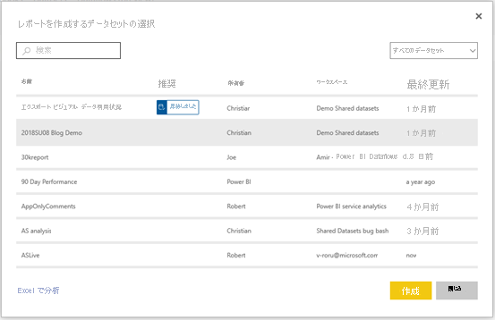

# 異なるワークスペースのデータセットに基づいてレポートを作成する

他のワークスペース内のデータセットに基づいて、各自のワークスペースにレポートを作成する方法について説明します。 既存のデータセットの上にレポートを作成するには、Power BI Desktop または Power BI サービスの [マイ ワークスペース] または[新しいワークスペース エクスペリエンス](../collaborate-share/service-create-the-new-workspaces.md)を起動します。

- Power BI サービスの場合: **[データを取得]**  >  **[発行済みデータセット]** 。
- Power BI Desktop の場合: **[データを取得]**  >  **[Power BI データセット]** 。

    
   
どちらの場合も、データセット検出のエクスペリエンスはこの **[レポートを作成するデータセットの選択]** ダイアログ ボックスから開始します。 どこにいても、アクセス権があるすべてのデータセットが表示されます。

一番上に **[昇格しました]** のラベルが付いていることがわかります。 これについては、この記事の「[推奨されるデータセットを検索する](#find-an-endorsed-dataset)」で後述します。

このリストに表示されているデータセットは、次の条件のうち少なくとも 1 つを満たしています。

- データセットが新しいワークスペース エクスペリエンスのワークスペースのいずれかにあり、そのワークスペースのメンバーになっている。 「[Considerations and limitations](service-datasets-across-workspaces.md#considerations-and-limitations)」(考慮事項と制限事項) を参照してください。
- 新しいワークスペース エクスペリエンスのワークスペース内にあるデータセットに対してビルドのアクセス許可がある。
- データセットが [マイ ワークスペース] にある。

> [!NOTE]
> 無料ユーザーの場合は、[マイ ワークスペース] にあるデータセットか、Premium 容量のワークスペースでビルドのアクセス許可があるデータセットのみが表示されますます。

**[作成]** をクリックすると、データセットへのライブ接続が作成され、すべてのデータセットが使用できるレポート作成エクスペリエンスが開始します。 データセットのコピーは作成していません。 データセットは、まだ元の場所に存在します。 そのデータセットのすべてのテーブルとメジャーを使用して、独自のレポートを作成することができます。 データセットで行レベル セキュリティ (RLS) の制限が有効になるため、RLS ロールに基づいて表示のアクセス許可があるデータのみが表示されます。

Power BI サービスの現在のワークスペースにレポートを保存するか、Power BI Desktop からワークスペースにレポートを公開することができます。 レポートがワークスペースの外部のデータセットに基づいている場合は、Power BI によってデータセットのリストのエントリが自動的に作成されます。 このデータセットのアイコンは、ワークスペース内のデータセットのアイコンとは異なります。 

これで、ワークスペースの外部のデータセットをどのレポートとダッシュボードが使用するかをワークスペースのメンバーが把握できます。 エントリにはデータセットに関する情報と、いくつかの選択アクションが表示されます。

## 推奨されるデータセットを検索する

推奨されるデータセットは 2 種類あります。 データセットの所有者はお勧めのデータセットを*昇格*することができます。 また、Power BI テナントの管理者は、すべてのユーザーが使用できるデータセットを "*認定*" するエキスパートを組織内で指定できます。 データセットの検索時と、ワークスペースのデータセットのリストには、昇格されたデータセットと認定されたデータセットの両方に*バッジ*が表示されます。 データセットを認定した担当者の名前がデータセット検出エクスペリエンス中にツールヒントに表示されます。 **[認定済み]** ラベルをポイントすると、それが表示されます。

- Power BI サービスの場合: **[データを取得]**  >  **[発行済みデータセット]** 。
- Power BI Desktop の場合: **[データを取得]**  >  **[Power BI データセット]** 。

    **[データセットの選択]** ダイアログ ボックスのリストでは、推奨されるデータセットが既定で一番上に表示されます。 

    

## 次の手順

- [ワークスペースをまたいでデータセットを使用](service-datasets-across-workspaces.md)
- わからないことがある場合は、 [Power BI コミュニティで質問してみてください](https://community.powerbi.com/)。
