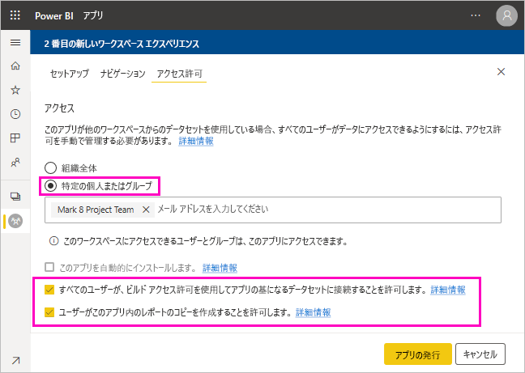

# データセットを共有する (プレビュー)

Power BI Desktop の "*データ モデル*" の作成者であれば、Power BI サービスで配布できる "*データセット*" を作成します。 そのデータセットは、他のレポート作成者が自分のレポートの基礎として使用できます。 この記事では、データセットを共有する方法について説明します。 共有データセットへのアクセス権を付与したり、削除したりする方法については、「[データセットを共有する (プレビュー)](service-datasets-build-permissions.md)」を参照してください。

## データセットを共有する手順

1. まず、Power BI Desktop でデータ モデルを使用して .pbix ファイルを作成します。 他のユーザーがレポートを作成できるようにこのデータセットを提供する予定の場合、.pbix ファイルではレポートをデザインすることもできない可能性があります。

    ベスト プラクティスは、.pbix ファイルを Microsoft 365 グループに保存することです。

1. Power BI サービスの[新しいエクスペリエンス ワークスペース](../collaborate-share/service-create-the-new-workspaces.md)に .pbix ファイルを発行します。
    
    既に、このワークスペースの他のメンバーは、このデータセットに基づいて他のワークスペースにレポートを作成できます。

1. このワークスペースから[アプリを発行](../collaborate-share/service-create-distribute-apps.md)することもできます。 このとき、 **[アクセス許可]** ページで、アクセス許可を持つユーザーと、実行できる内容を指定します。

    > [!NOTE]
    > **[組織全体]** を選択した場合、組織内の誰もビルド アクセス許可を持たなくなります。 これは既知の問題です。 代わりに、 **[特定の個人またはグループ]** にメール アドレスを指定します。  組織全体にビルド アクセス許可を持たせる場合は、組織全体のメール エイリアスを指定します。

    

1. **[アプリの発行]** 、または既に発行されている場合は **[アプリの更新]** を選択します。

## データセットの使用状況を追跡する

ワークスペースに共有データセットがある場合、必要に応じて他のワークスペースのどのレポートがそれに基づいているかを確認できます。

1. [データセット] リスト ビューで、 **[関連の表示]** を選択します。

    ![[関連の表示] アイコン](media/service-datasets-build-permissions/power-bi-dataset-view-related-to-dataset.png)

1. **[関連コンテンツ]** ダイアログ ボックスには、すべての関連項目が表示されます。 このリストには、このワークスペースと **[その他のワークスペース]** の関連項目が表示されます。
 
    ![[関連コンテンツ] ダイアログ ボックス](media/service-datasets-build-permissions/power-bi-dataset-related-workspaces.png)

## 次の手順

- [ワークスペース全体でデータセットを使用する (プレビュー)](service-datasets-across-workspaces.md)
- わからないことがある場合は、 [Power BI コミュニティで質問してみてください](https://community.powerbi.com/)。
