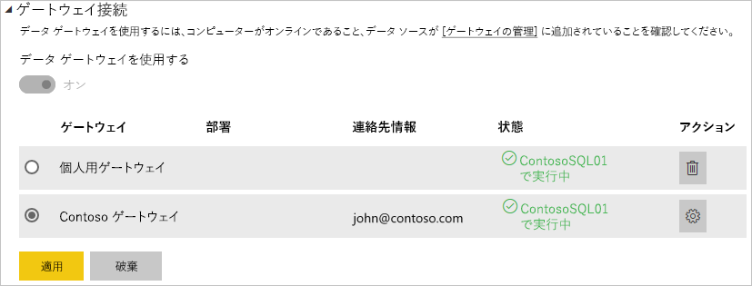

# ゲートウェイのデータ ソースの追加または削除

[!INCLUDE [gateway-rewrite](../includes/gateway-rewrite.md)]

Power BI は、多数の[オンプレミス データ ソース](power-bi-data-sources.md)をサポートしますが、各データ ソースには独自の要件があります。 ゲートウェイは、単一のデータ ソースにも複数のデータ ソースにも使用できます。 この例では、データソースとして SQL Server を追加する方法について説明します。 手順は、他のデータソースの場合と似ています。

ほとんどのデータ ソースの管理操作は、API を使用して実行することもできます。 詳細については、[REST API (ゲートウェイ)](/rest/api/power-bi/gateways) に関するページを参照してください。

ゲートウェイをまだインストールしていない場合は、「[オンプレミス データ ゲートウェイをインストールする](/data-integration/gateway/service-gateway-install)」を参照して始めてください。

## データ ソースの追加

1. Power BI サービスのページ ヘッダーで、 **[設定]**  >  **[ゲートウェイの管理]** を選択します。

    

2. ゲートウェイを選択し、 **[データ ソースの追加]** を選択します。 ヘッダー テキスト **[データ ソースを追加]** を選択するか、ゲートウェイ エントリの横をカーソルでポイントしてその他のオプション メニューを表示することができます。

    

3. データ ソースに名前を割り当ててから、 **[データ ソースの種類]** を選択します。 この例では、SQL Server を選択します。

    

4. データ ソースに関する情報を入力します。 SQL Server の場合は、 **[サーバー]** と **[データベース]** を指定します。

    

5. データ ソースへの接続時に使用する **[認証方法]** を選択します。 SQL Server の場合は、 **[Windows]** または **[基本]** (SQL 認証) を選択します。 データ ソースの資格情報を入力します。

   :::image type="content" source="media/service-gateway-data-sources/basic-auth.png" alt-text="基本認証の設定。":::

    > [!NOTE]
    > 認証方法として OAuth が選択されている場合、OAuth トークンの有効期限ポリシーよりも長く実行されるクエリは失敗する場合があります。

6. **[詳細設定]** で、データ ソースの [シングル サインオン (SSO)](service-gateway-sso-overview.md) を構成できます。 

    ![[詳細設定]](media/service-gateway-data-sources/advanced-settings-02.png)

    DirectQuery ベースのレポートには、 **[DirectQuery クエリには Kerberos 経由で SSO を使用します]** または **[Kerberos を使用した SSO を DirectQuery とインポート クエリに使用する]** のいずれかを構成できます。また、更新ベースのレポートには、 **[Kerberos を使用した SSO を DirectQuery とインポート クエリに使用する]** を構成できます。

    DirectQuery ベースのレポートに **[DirectQuery クエリには Kerberos 経由で SSO を使用します]** を使用し、このデータ ソースを使用する場合、Power BI サービスにサインインするユーザーの資格情報が使用されます。 更新ベースのレポートの場合、 **[ユーザー名]** フィールドと **[パスワード]** フィールドに入力する資格情報が使用されます。

    **[Kerberos を使用した SSO を DirectQuery とインポート クエリに使用する]** を使用する場合、資格情報を入力する必要はありません。 このデータ ソースを DirectQuery ベースのレポートに使用する場合、Power BI サービスにサインインする (Azure) Active Directory ユーザーにマップされているユーザーが使用されます。  更新ベースのレポートの場合、データ セット所有者のセキュリティ コンテキストが使用されます。

    > [!NOTE]
    >インポート クエリの SSO は、[Kerberos の制約付き委任](service-gateway-sso-kerberos.md)を使用する SSO データ ソースの一覧に対してのみ使用できます。

7. **[詳細設定]** で、必要に応じてご利用のデータ ソースに対して [プライバシー レベル](https://support.office.com/article/Privacy-levels-Power-Query-CC3EDE4D-359E-4B28-BC72-9BEE7900B540)を構成します ([DirectQuery](desktop-directquery-about.md) には適用されません)。

    :::image type="content" source="media/service-gateway-data-sources/privacy-level.png" alt-text="プライバシー レベルの選択。":::

8. **[追加]** を選択します。 接続に成功すると、「"*接続成功*"」というメッセージが表示されます。

    

これで、このデータ ソースを使用して、Power BI ダッシュボードとレポートに SQL Server のデータを含めることができます。

## データ ソースの削除

使用しなくなったデータ ソースは削除できます。 データ ソースを削除すると、そのデータ ソースに依存するすべてのダッシュボードやレポートが壊れます。

データソースを削除するには、そのデータ ソースに移動し、その他のオプション メニューから **[削除]** を選択します。 その他のオプション メニューは、データ ソース名の横をカーソルでポイントすると表示されます。

## スケジュールされた更新または DirectQuery にデータ ソースを使用する

作成したデータ ソースは、DirectQuery 接続またはスケジュールされた更新のいずれかで使用できます。 スケジュールされた更新の設定の詳細については、「[スケジュールされた更新の構成](refresh-scheduled-refresh.md)」を参照してください。

> [!NOTE]
>Power BI Desktop とオンプレミス データ ゲートウェイに追加されたデータ ソースの間で、サーバーとデータベース名が一致している必要があります。

データセットとゲートウェイ内のデータ ソース間のリンクは、サーバー名とデータベース名に基づいています。 これらの名前は一致している必要があります。 たとえば、Power BI Desktop 内でサーバー名の IP アドレスを指定する場合は、ゲートウェイ構成内のデータ ソースでその IP アドレスを使用する必要があります。 Power BI Desktop で *SERVER\INSTANCE* を使用する場合は、ゲートウェイ用に構成されているデータ ソース内で同じものを使用する必要があります。

ゲートウェイ内に構成されているデータ ソースの **[ユーザー]** タブの一覧に自分が表示されていて、さらにサーバーとデータベース名が一致している場合は、スケジュールされた更新で使用するオプションとして、ゲートウェイが表示されます。

> [!WARNING]
> データセットに複数のデータ ソースが含まれる場合、ゲートウェイで各データ ソースを追加する必要があります。 ゲートウェイに追加されていないデータ ソースがある場合、そのゲートウェイはスケジュールされた更新に更新可能なものとして表示されません。

### 制限事項

OAuth は、オンプレミスのデータ ゲートウェイを使用するカスタム コネクタに対してのみサポートされる認証方式です。 OAuth を必要とする他のデータ ソースを追加することはできません。 データセットに OAuth を必要とするデータ ソースが含まれ、このデータ ソースがカスタム コネクタでない場合は、スケジュールされた更新にゲートウェイを使用できません。

## ユーザーの管理

データ ソースをゲートウェイに追加した後、ユーザーとメールが有効なセキュリティ グループに (ゲートウェイ全体ではなく) 特定のデータ ソースへのアクセス権を与えます。 データ ソースのアクセス リストにより、データ ソースのデータが含まれるレポートを発行できるユーザーが制御されます。 レポートの所有者は、ダッシュボード、コンテンツ パック、アプリを作成し、それらの項目を他のユーザーと共有できます。

ゲートウェイへの管理アクセス権をユーザーとセキュリティ グループに与えることもできます。

> [!NOTE]
> データ ソースへのアクセス権を持つユーザーは、データ ソースの作成時に選択されたセキュリティ オプション (保存された資格情報またはシングル サインオン) に基づいて、データ ソースにデータセットを関連付け、接続できます。

### データ ソースへのユーザーの追加

1. Power BI サービスのページ ヘッダーで、 **[設定]**  >  **[ゲートウェイの管理]** を選択します。

2. ユーザーを追加するデータ ソースを選択します。

3. **[ユーザー]** を選択し、選択したデータ ソースにアクセスする組織のユーザーおよびメールが有効なセキュリティ グループを入力します。 **[追加]** を選択すると、追加したメンバーの名前が、このデータ ソースを使用するレポートを発行できるユーザーの一覧に追加されます。

    

アクセス権を付与するデータ ソースごとにユーザーを追加する必要があることに注意してください。 データ ソースにはそれぞれ、ユーザーの一覧があります。 各データ ソースに個別にユーザーを追加します。

### データ ソースからのユーザーの削除

データ ソースの **[ユーザー]** タブで、このデータ ソースを使用できるユーザーまたはセキュリティ グループを削除できます。

## 暗号化された資格情報をクラウドに格納する

データ ソースをゲートウェイに追加する場合は、そのデータ ソースの資格情報を指定する必要があります。 データ ソースへのすべてのクエリは、これらの資格情報を使用して実行されます。 資格情報は安全に暗号化されます。 クラウド内で解読されないように、クラウドに格納される前に対称暗号化が資格情報で使用されます。 資格情報は、データ ソースにアクセスするときに、ゲートウェイを実行しているオンプレミスのコンピューターに送信されて暗号化が解除されます。

## 使用可能なデータ ソースの種類の一覧

オンプレミス データ ゲートウェイでサポートされているデータ ソースに関する詳細については、「[Power BI データ ソース](power-bi-data-sources.md)」を参照してください。

## 次の手順

* [データ ソースの管理 - Analysis Services](service-gateway-enterprise-manage-ssas.md)
* [データ ソースの管理 - SAP HANA](service-gateway-enterprise-manage-sap.md)
* [データ ソースの管理 - SQL Server](service-gateway-enterprise-manage-sql.md)
* [データ ソースの管理 - Oracle](service-gateway-onprem-manage-oracle.md)
* [データ ソースの管理 - インポート/スケジュールされた更新](service-gateway-enterprise-manage-scheduled-refresh.md)
* [データ ゲートウェイの展開に関するガイダンス](service-gateway-deployment-guidance.md)

他にわからないことがある場合は、 [Power BI コミュニティ](https://community.powerbi.com/)を利用してください。
