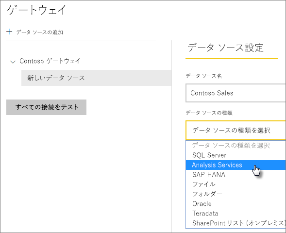
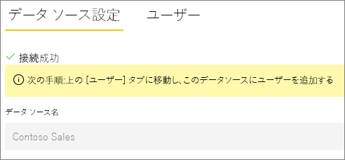
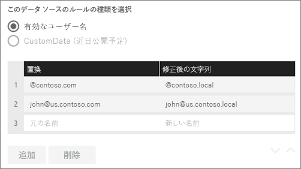
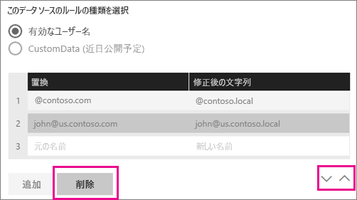

# <a name="manage-your-data-source---analysis-services"></a>データ ソースの管理 - Analysis Services

[!INCLUDE [gateway-rewrite](../includes/gateway-rewrite.md)]

[オンプレミス データ ゲートウェイをインストール](/data-integration/gateway/service-gateway-install)したら、ゲートウェイで使用できる[データ ソースを追加する](service-gateway-data-sources.md#add-a-data-source)必要があります。 この記事では、スケジュールされた更新またはライブ接続に使用されるゲートウェイと SQL Server Analysis Services (SSAS) データ ソースの操作方法について説明します。

Analysis Services へのライブ接続を設定する方法の詳細については、[こちらのビデオをご覧ください](https://www.youtube.com/watch?v=GPf0YS-Xbyo&feature=youtu.be)。

> [!NOTE]
> Analysis Services データ ソースを持っている場合は、Analysis Services サーバーと同じフォレスト/ドメインに結合されているコンピューターにゲートウェイをインストールする必要があります。

## <a name="add-a-data-source"></a>データ ソースの追加

データ ソースを追加する方法の詳細については、「[Add a data source](service-gateway-data-sources.md#add-a-data-source)」(データソースの追加) を参照してください。 多次元サーバーまたは表形式サーバーに接続している場合は、 **[データ ソースの種類]** として **[Analysis Services]** を選択します。



**[サーバー]** や **[データベース]** など、データ ソースの情報を入力します。 **[ユーザー名]** や **[パスワード]** として入力した情報は、Analysis Services インスタンスに接続するために、ゲートウェイによって使用されます。

> [!NOTE]
> 入力する Windows アカウントは、接続先の Analysis Services インスタンスのサーバー管理者ロールのメンバーとする必要があります。 このアカウントのパスワードに有効期限が設定されている場合、データ ソースのパスワードが更新されないと、接続エラーになることがあります。 資格情報の格納方法の詳細については、「[暗号化された資格情報をクラウドに格納する](service-gateway-data-sources.md#store-encrypted-credentials-in-the-cloud)」を参照してください。


すべての情報を入力したら、 **[追加]** を選択します。 これで、オンプレミスの Analysis Services インスタンスに対するスケジュールされた更新またはライブ接続にこのデータ ソースを使用できます。 成功すると、"*接続成功*" というメッセージが表示されます。



### <a name="advanced-settings"></a>詳細設定

必要に応じて、データ ソースのプライバシー レベルを構成できます。 この設定により、データを結合できる方法が管理されます。 これは、スケジュールされた更新にのみ使用されます。 プライバシー レベルの設定は、ライブ接続には適用されません。 データ ソースのプライバシー レベルの詳細については、「[プライバシーレベル (Power Query)](https://support.office.com/article/Privacy-levels-Power-Query-CC3EDE4D-359E-4B28-BC72-9BEE7900B540)」を参照してください。


## <a name="user-names-with-analysis-services"></a>Analysis Services でのユーザー名

<iframe width="560" height="315" src="https://www.youtube.com/embed/Qb5EEjkHoLg" frameborder="0" allowfullscreen></iframe>

Analysis Services に接続されているレポートをユーザーが操作するたびに、有効なユーザー名がゲートウェイに渡され、次にオンプレミスの Analysis Services サーバーに渡されます。 Power BI にサインインするときに使用するメール アドレスが、有効なユーザーとして Analysis Services に渡されます。 これは、接続プロパティ [EffectiveUserName](/analysis-services/instances/connection-string-properties-analysis-services#bkmk_auth) に渡されます。 

このメール アドレスは、ローカルの Active Directory ドメイン内で定義されているユーザー プリンシパル名 (UPN) と一致する必要があります。 UPN は、Active Directory アカウントのプロパティです。 その Windows アカウントは、Analysis Services ロールに存在している必要があります。 Active Directory で一致が見つからない場合は、サインインは成功しません。 Active Directory とユーザーの名前付けの詳細については、[ユーザーの名前付け属性](/windows/win32/ad/naming-properties)に関する記事を参照してください。

[Power BI のサインイン名をローカル ディレクトリの UPN にマップする](service-gateway-enterprise-manage-ssas.md#map-user-names-for-analysis-services-data-sources)こともできます。

## <a name="map-user-names-for-analysis-services-data-sources"></a>Analysis Services データ ソースのユーザー名をマップする

<iframe width="560" height="315" src="https://www.youtube.com/embed/eATPS-c7YRU" frameborder="0" allowfullscreen></iframe>

Power BI では、Analysis Services データ ソースのユーザー名をマッピングできます。 Power BI のサインイン ユーザー名を、Analysis Services 接続での EffectiveUserName に渡される名前にマッピングする規則を構成できます。 ユーザー名のマッピング機能は、Azure Active Directory (Azure AD) のユーザー名がローカル Active Directory インスタンスの UPN に一致しないときの回避策として優れています。 たとえば、メール アドレスが nancy@contoso.onmicrsoft.com の場合、これを nancy@contoso.com にマップすると、その値がゲートウェイに渡されます。

Analysis Services のユーザー名は、次の 2 つの方法でマッピングすることができます。

* 手動によるユーザーの再マッピング
* オンプレミスの Active Directory プロパティ参照を使用して Active Directory ユーザーに Azure AD UPN を再マップする (Active Directory 参照マッピング)

2 つ目の方法を使用して手動でマッピングを実行することもできますが、その場合は時間がかかり、保守が困難になります。 パターン マッチングでは十分ではない場合は特に困難です。 たとえば、ドメイン名が Azure AD とオンプレミス Active Directory の間で異なる場合や、ユーザー アカウント名が Azure AD と Active Directory で異なる場合です。 そのため、2 番目の方法での手動マッピングはお勧めできません。

このような 2 つの方法を順番に次の 2 つのセクションで説明します。

### <a name="manual-user-name-remapping"></a>手動でのユーザー名の再マッピング

Analysis Services データ ソースの場合は、カスタムの UPN 規則を構成できます。 カスタム規則は、Power BI サービスのサインイン名がローカル ディレクトリ UPN と一致しない場合に役立ちます。 たとえば、john@contoso.com で Power BI にサインインしているものの、ローカル ディレクトリの UPN が john@contoso.local の場合は、john@contoso.local を Analysis Services に渡すマッピング規則を構成できます。

UPN マッピング画面にアクセスするには、次の手順に従います。

1. 歯車アイコンにアクセスし、 **[ゲートウェイの管理]** を選択します。
2. Analysis Services データ ソースを格納するゲートウェイを展開します。 または、Analysis Services データ ソースを作成していない場合は、この時点で作成します。
3. データ ソースを選択してから、 **[ユーザー]** タブを選択します。
4. **[ユーザー名のマップ]** を選択します。

    

特定のユーザーに対して規則を追加してテストするためのオプションが表示されます。

> [!NOTE]
> 意図していなかったユーザーを変更してしまう場合があります。 たとえば、 **[置換前] (元の値)** が contoso.com で、 **[置換後] (新しい名前)** が @contoso.local の場合、@contoso.com を含むサインイン名を持つすべてのユーザーが @contoso.local に置き換えられます。 また、 **[置換前] (元の名前)** が dave@contoso.com で **[置換後] (新しい名前)** が dave@contoso.local の場合、v-dave@contoso.com でサインインしたユーザーが v-dave@contoso.local として送信されます。

### <a name="active-directory-lookup-mapping"></a>Active Directory 参照マッピング

オンプレミスの Active Directory プロパティ参照を実行して Azure AD UPN を Active Directory ユーザーに再マップするには、次のセクションの手順に従ってください。 まず始めに、このしくみを確認しましょう。

Power BI サービスでは、次の処理が実行されます。

* オンプレミスの SSAS サーバーに対して Power BI Azure AD ユーザーがクエリを実行するたびに、firstName.lastName@contoso.com のような UPN 文字列が渡されます。

> [!NOTE]
> ユーザー名文字列がオンプレミスのデータ ゲートウェイに送信される "*前*" は、Power BI データ ソースの構成内で定義される手動 UPN ユーザー マッピングが適用されたままです。

構成可能なカスタム ユーザー マッピングを持つオンプレミス データ ゲートウェイでは、次の手順を実行します。

1. 検索する Active Directory を検索します。 自動または構成可能を使用できます。
2. Power BI サービスから、Active Directory ユーザーの属性 (メールなど) を参照します。 属性は、firstName.lastName@contoso.com のような受信 UPN 文字列に基づいています。
3. Active Directory 参照が失敗すると、SSAS への EffectiveUser として渡された UPN の使用を試みます。
4. Active Directory 参照が成功すると、その Active Directory ユーザーの UserPrincipalName が取得されます。
5. 次に、UserPrincipalName のメール アドレスが EffectiveUser として SSAS に渡されます (たとえば、Alias@corp.on-prem.contoso)。

Active Directory 参照を実行するようにゲートウェイを構成するには:

1. [最新のゲートウェイをダウンロードしてインストールします](/data-integration/gateway/service-gateway-install)。

2. ゲートウェイで、オンプレミスのデータ ゲートウェイ サービスを、ローカル サービス アカウントではなくドメイン アカウントで実行するように変更します。 そうしないと、ランタイムに Active Directory 参照が正しく機能しません。 コンピューター上で[オンプレミス データ ゲートウェイ アプリ](/data-integration/gateway/service-gateway-app)に移動し、 **[サービス設定]**  >  **[サービス アカウントの変更]** の順に移動します。 新しいゲートウェイを作成しない場合は、同じコンピューター上でゲートウェイを復元する必要があるため、このゲートウェイの回復キーがあることを確認してください。 変更内容を有効にするには、ゲートウェイ サービスを再起動します。

3. ゲートウェイのインストール フォルダー (*C:\Program Files\On-premises* data gateway) に移動し、管理者として書き込みアクセス許可があることを確認します。 *Microsoft.PowerBI.DataMovement.Pipeline.GatewayCore.dll.config* ファイルを開きます。

4. ご自分の Active Directory ユーザーに対して "*ご利用の*" Active Directory 属性の構成に従って、次の 2 つの構成値を編集します。 次の構成値はサンプルです。 ご自分の Active Directory の構成に基づいて値を指定します。 これらの構成では大文字と小文字が区別されるので、必ず Active Directory の値と一致していることを確認してください。

    

    ADServerPath 構成の値を指定しない場合、ゲートウェイでは既定のグローバル カタログを使用します。 ADServerPath には複数の値を指定することも可能です。 次の例に示されているように、各値はセミコロンで区切る必要があります。

    ```xml
    <setting name="ADServerPath" serializeAs="String">
        <value> >GC://serverpath1; GC://serverpath2;GC://serverpath3</value>
    </setting>
    ```

    このゲートウェイは、一致を検出するまで左から右に ADServerPath 値を解析します。 一致する値が見つからない場合、元の UPN が使用されます。 ゲートウェイ サービス (PBIEgwService) を実行するアカウントが、ADServerPath で指定したすべての Active Directory サーバーにクエリを実行する許可があることを確認します。

    ゲートウェイでは、次の例に示すように、2 種類の ADServerPath をサポートしています。

    **WinNT**

    ```xml
    <value="WinNT://usa.domain.corp.contoso.com,computer"/>
    ```

    **GC**

    ```xml
    <value> GC://USA.domain.com </value>
    ```

5. 構成の変更を有効にするには、オンプレミスのデータ ゲートウェイ サービスを再起動します。

### <a name="work-with-mapping-rules"></a>マッピング規則を使用する

マッピング規則を作成するには、 **[元の名前]** と **[新しい名前]** の値を入力し、 **[追加]** を選択します。

| フィールド | Description |
| --- | --- |
| 置換前 (元の名前) |Power BI にサインインするために使用したメール アドレス。 |
| 置換後 (新しい名前) |元の名前を置き換える値。 ここで置き換えた値が、Analysis Services 接続の EffectiveUserName プロパティに渡されます。 |



一覧の項目を選択するときに、シェブロン アイコンを使用して項目を並べ替えることも、 エントリを削除することもできます。



### <a name="use-a-wildcard"></a>ワイルドカードを使用する

**[置換前] (元の名前)** の文字列でワイルドカード (*) を使用できます。 ワイルドカードは単独でのみ使用でき、その他の文字列パーツと併用はできません。 すべてのユーザーを取得してデータ ソースに単一の値を渡す場合は、ワイルドカードを使用します。 この方法は、組織内のすべてのユーザーにローカル環境内の同じユーザーを割り当てる場合に便利です。

### <a name="test-a-mapping-rule"></a>マッピング規則をテストする

元の名前がどのように置き換えられるかを検証するには、 **[元の名前]** に値を入力します。 **[ルールのテスト]** を選択します。


> [!NOTE]
> 保存された規則がサービスで使用されるようになるまでに数分かかります。 規則は、ブラウザーで直ちに機能します。

### <a name="limitations-for-mapping-rules"></a>マッピング規則の制限事項

マッピングは、構成されている特定のデータ ソース向けです。 グローバルな設定ではありません。 複数の Analysis Services データ ソースがある場合は、データ ソースごとにユーザーをマッピングする必要があります。

## <a name="authentication-to-a-live-analysis-services-data-source"></a>ライブ Analysis Services データ ソースの認証

Analysis Services をユーザーが操作するたびに、有効なユーザー名がゲートウェイに渡され、次にオンプレミスの Analysis Services サーバーに渡されます。 UPN (通常はクラウドへのサインインに使用するメール アドレス) が、有効なユーザーとして Analysis Services に渡されます。 UPN は接続プロパティ EffectiveUserName に渡されます。 

この電子メール アドレスは、ローカルの Active Directory ドメイン内で定義されている UPN と一致する必要があります。 UPN は、Active Directory アカウントのプロパティです。 サーバーにアクセスするには、その Windows アカウントが Analysis Services ロールに存在する必要があります。 Active Directory で一致が見つからない場合は、サインインは成功しません。

Analysis Services は、このアカウントに基づいて、フィルター処理も提供できます。 フィルター処理は、ロール ベースのセキュリティまたは行レベルのセキュリティで実行できます。

## <a name="role-based-security"></a>ロール ベース セキュリティ

モデルでは、ユーザー ロールに基づいてセキュリティが提供されます。 特定のモデル プロジェクトに対してロールが定義されるのは、SQL Server Data Tools – Business Intelligence でのオーサリング中、または SQL Server Management Studio を使用してモデルをデプロイした後です。 ロールに含まれるメンバーは、Windows ユーザー名または Windows グループによって決まります。 ロールは、ユーザーがモデルに対してクエリまたは操作を実行するためのアクセス許可を定義します。 ほとんどのユーザーは、読み取りアクセス許可を持つロールに属します。 その他のロールは管理者向けで、項目を処理するアクセス許可、データベースの機能を管理するアクセス許可、他のロールを管理するアクセス許可を持つものがあります。

## <a name="row-level-security"></a>行レベルのセキュリティ

行レベルのセキュリティは、Analysis Services の行レベルのセキュリティに固有です。 モデルでは、動的な行レベルのセキュリティを提供できます。 ユーザーが少なくとも 1 つのロールに属する場合とは異なり、表形式モデルに動的なセキュリティは必要ではありません。 動的なセキュリティでは、上位レベルから、特定テーブル内の特定の行のデータに対してユーザーの読み取りアクセス権が定義されます。 ロールの場合と同様、動的な行レベルのセキュリティは、ユーザーの Windows ユーザー名に依存します。

ユーザーがモデル データを照会して表示できるかは、次で決まります。

- Windows ユーザー アカウントがメンバーとして属しているロール。
- 動的な行レベルのセキュリティ (構成されている場合)。

モデルでのロールと動的な行レベル セキュリティの実装については、この記事では説明しません。 詳細については、MSDN の[ロール (SSAS 表形式)](/analysis-services/tabular-models/roles-ssas-tabular)、および[セキュリティ ロール (Analysis Services - 多次元データ)、](/analysis-services/multidimensional-models/olap-logical/security-roles-analysis-services-multidimensional-data)に関する記事を参照してください。 表形式モデルのセキュリティに関するさらに詳細な情報については、[表形式 BI セマンティック モデルをセキュリティで保護するホワイトペーパー](https://download.microsoft.com/download/D/2/0/D20E1C5F-72EA-4505-9F26-FEF9550EFD44/Securing%20the%20Tabular%20BI%20Semantic%20Model.docx)をダウンロードしてお読みください。

## <a name="what-about-azure-ad"></a>Azure AD とは

Microsoft クラウド サービスは、ユーザーの認証を処理するために [Azure AD](/azure/active-directory/fundamentals/active-directory-whatis) を使用します。 Azure AD は、ユーザー名とセキュリティ グループを含むテナントです。 通常、ユーザーがサインインに使用する電子メール アドレスはアカウントの UPN と同じです。

## <a name="what-is-the-role-of-my-local-active-directory-instance"></a>自分のローカル Active Directory インスタンスのロール

Analysis Services に接続するユーザーがデータの読み取りアクセス許可を持つロールに属しているかどうかを判断するため、サーバーは、Azure AD からゲートウェイ、Analysis Services サーバーの順に渡された有効なユーザー名を変換する必要があります。 Analysis Services サーバーは、Windows Active Directory ドメイン コントローラー (DC) に有効なユーザー名を渡します。 次に、Active Directory DC によって、有効なユーザー名がローカル アカウントで有効な UPN であることが検証されます。 そのユーザーの Windows ユーザー名が Analysis Services サーバーに返されます。

EffectiveUserName は、ドメインに参加していない Analysis Services サーバーで使用できません。 サインイン エラーを回避するには、Analysis Services サーバーをドメインに参加させる必要があります。

## <a name="how-do-i-tell-what-my-upn-is"></a>自分の UPN を確認する方法

自分の UPN がわからないけれども、自分がドメイン管理者ではない場合もあります。 ワークステーションから次のコマンドを実行して、自分のアカウントの UPN を確認できます。

    whoami /upn

結果はメール アドレスに似ていますが、これはドメイン アカウントの UPN です。 Analysis Services データ ソースをライブ接続に使用している場合に、この UPN が Power BI へのサインインに使用しているメール アドレスと一致しない場合は、[ユーザー名をマップ](#map-user-names-for-analysis-services-data-sources)する方法を参照してください。

## <a name="synchronize-an-on-premises-active-directory-with-azure-ad"></a>オンプレミスの Active Directory と Azure AD を同期する

Analysis Services ライブ接続を使用する場合は、ローカル Active Directory アカウントが Azure AD と一致している必要があります。 UPN はアカウント間で一致する必要があります。

クラウド サービスは、Azure AD 内のアカウントのみを認識します。 ローカル Active Directory インスタンスにアカウントを追加したかどうかは問題ではありません。 アカウントは、Azure AD に存在しない場合には使用できません。 ローカル Active Directory アカウントと Azure AD はさまざまな方法で一致させることができます。

- Azure AD にアカウントを手動で追加できます。

   アカウントは Azure portal 上で、または Microsoft 365 管理センター内で作成できます。アカウント名はローカル Active Directory アカウントの UPN と一致します。

- [Azure AD Connect](/azure/active-directory/hybrid/how-to-connect-sync-whatis) ツールを使用し、ローカル アカウントと Azure AD テナントを同期させることができます。

   Azure AD Connect ツールには、ディレクトリ同期と認証の設定のオプションがあります。 オプションには、パスワード ハッシュ同期、パススルー認証、およびフェデレーションが含まれます。 テナント管理者またはローカル ドメイン管理者ではない場合、IT 管理者に問い合わせ、構成を支援してもらいます。

   Azure AD Connect を利用すると、UPN は Azure AD とローカル Active Directory インスタンス間で一致します。

> [!NOTE]
> Azure AD Connect ツールでアカウントを同期させると、Azure AD テナント内に新しいアカウントが作成されます。

## <a name="use-the-data-source"></a>データ ソースを使用する

作成したデータ ソースは、ライブ接続またはスケジュールされた更新によって使用できます。

> [!NOTE]
> Power BI Desktop とオンプレミス データ ゲートウェイ内のデータ ソースとの間で、サーバーとデータベース名が一致している必要があります。

データセットとゲートウェイ内のデータ ソース間のリンクは、サーバー名とデータベース名に基づいています。 これらの名前は一致している必要があります。 たとえば、Power BI Desktop 内でサーバー名の IP アドレスを指定する場合は、ゲートウェイ構成内のデータ ソースでもその IP アドレスを使用する必要があります。 Power BI Desktop で *SERVER\INSTANCE* を使用する場合は、ゲートウェイ用に構成されているデータ ソース内でもそれを使用する必要があります。

この要件は、ライブ接続とスケジュールされた更新のどちらにも該当します。

### <a name="use-the-data-source-with-live-connections"></a>ライブ接続でデータ ソースを使用する

Power BI Desktop とゲートウェイ用に構成されているデータ ソースとの間で、サーバーとデータベース名が一致していることを確認します。 また、ライブ接続のデータセットを公開するには、自分のユーザーがデータ ソースの **[ユーザー]** タブに一覧表示されていることを確認する必要があります。 ライブ接続の選択は、最初にデータをインポートする Power BI Desktop 内で発生します。

公開した後は、Power BI Desktop または **[データの取得]** のいずれかから、レポート機能が利用可能になります。 ゲートウェイ内にデータ ソースを作成してから、接続が使用できるようになるまでには、数分ほどかかることがあります。

### <a name="use-the-data-source-with-scheduled-refresh"></a>スケジュールされた更新でデータ ソースを使用する

ゲートウェイ内に構成されているデータ ソースの **[ユーザー]** タブの一覧に自分のアカウントが表示されていて、さらにサーバーとデータベース名が一致している場合は、スケジュールされた更新で使用するオプションとして、ゲートウェイが表示されます。


### <a name="limitations-of-analysis-services-live-connections"></a>Analysis Services ライブ接続の制限事項

表形式または多次元インスタンスに対してライブ接続を使用することができます。

| **サーバーのバージョン** | **必要な SKU** |
| --- | --- |
| 2012 SP1 CU4 以降 |Business Intelligence と Enterprise SKU |
| 2014 |Business Intelligence と Enterprise SKU |
| 2016 |Standard SKU 以上 |

* セル レベルの書式設定および変換機能はサポートされていません。
* アクションと名前付きセットが Power BI に公開されることはありません。 アクションまたは名前付きセットを含む多次元キューブに接続し、ビジュアルとレポートを作成することはできます。

## <a name="next-steps"></a>次のステップ

* [オンプレミス データ ゲートウェイのトラブルシューティング](/data-integration/gateway/service-gateway-tshoot)
* [ゲートウェイのトラブルシューティング - Power BI](service-gateway-onprem-tshoot.md)

他にわからないことがある場合は、 [Power BI コミュニティ](https://community.powerbi.com/)を利用してください。
