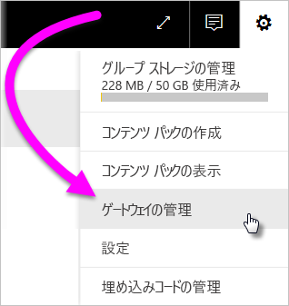
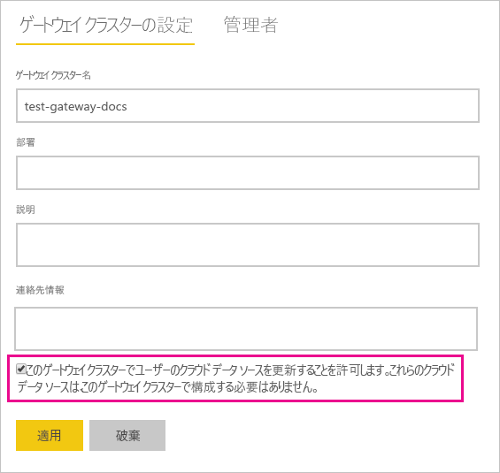
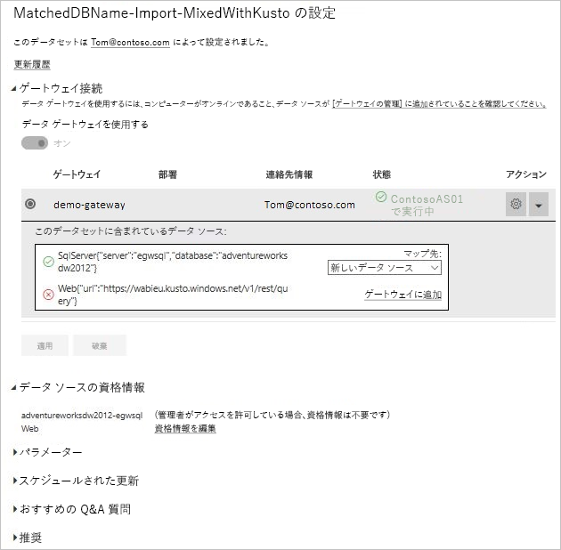

# オンプレミスとクラウド データ ソースのマージまたはアペンド

[!INCLUDE [gateway-rewrite](../includes/gateway-rewrite.md)]

オンプレミス データ ゲートウェイを使用し、オンプレミスとクラウドのデータ ソースを同じクエリでマージまたはアペンドすることができます。 このソリューションは、個別のクエリを使用せず、複数のソースからデータを結合するときに便利です。

>[!NOTE]
>この記事は、クラウドとオンプレミスのデータ ソースが 1 つのクエリにマージまたはアペンドされているデータセットにのみ適用されます。 個別のクエリを含む (1 つはオンプレミス データソースに接続し、もう一方はクラウド データ ソースに接続する) データセットの場合、ゲートウェイではクラウド データ ソースのクエリが実行されません。

## 前提条件

- ローカル コンピューターに[ゲートウェイがインストールされている](/data-integration/gateway/service-gateway-install)こと。
- オンプレミスとクラウドのデータ ソースを結合するクエリを含む Power BI Desktop ファイル。

>[!NOTE]
>クラウド データ ソースにアクセスするには、確実にゲートウェイがそれらのデータ ソースにアクセスできるようにする必要があります。

1. Power BI サービスの右上にある歯車アイコン ![[設定] 歯車アイコン](media/service-gateway-mashup-on-premises-cloud/icon-gear.png) >  **[ゲートウェイの管理]** の順に選択します。

    

2. 構成するゲートウェイを選択します。

3. **[ゲートウェイ クラスターの設定]** で **[Allow user's cloud data sources to refresh through this gateway cluster]\(このゲートウェイ クラスターでユーザーのクラウド データ ソースを更新することを許可します\)**  >  **[適用]** の順に選択します。

    

4. このゲートウェイ クラスターの下で、クエリで使用される[オンプレミス データ ソース](service-gateway-enterprise-manage-scheduled-refresh.md#add-a-data-source)があれば、それを追加します。 ここではクラウド データ ソースを追加する必要がありません。

5. オンプレミスとクラウドのデータ ソースを結合するクエリを含む Power BI Desktop ファイルを Power BI サービスにアップロードします。

6. 新しいデータセットの **[データセットの設定]** ページで:

   - オンプレミス ソースの場合、このデータ ソースに関連付けられているゲートウェイを選択します。
   - **[データ ソースの資格情報]** で、必要に応じて、クラウド データ ソースの資格情報を編集します。

    クラウドとオンプレミスの両方のデータ ソースのプライバシー レベルが適切に設定されていることを確認し、結合が安全に処理されるように確保してください。

     

7. クラウドの資格情報が設定されたので、 **[今すぐ更新]** オプションを利用してデータセットを更新できるようになりました。 または、定期的に更新するようにスケジュールを設定できます。

## 次のステップ

ゲートウェイのデータ更新の詳細については、「[スケジュールされた更新でデータ ソースを使用する](service-gateway-enterprise-manage-scheduled-refresh.md#use-the-data-source-for-scheduled-refresh)」を参照してください。
