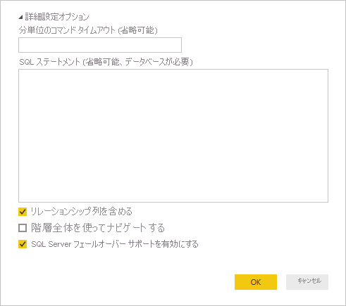
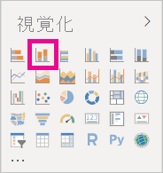
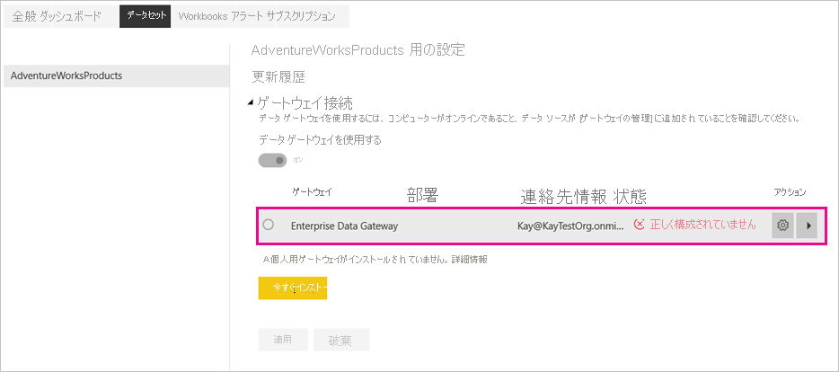
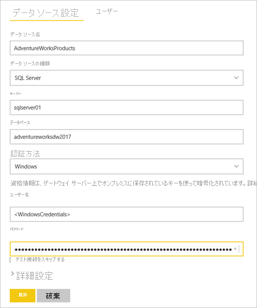
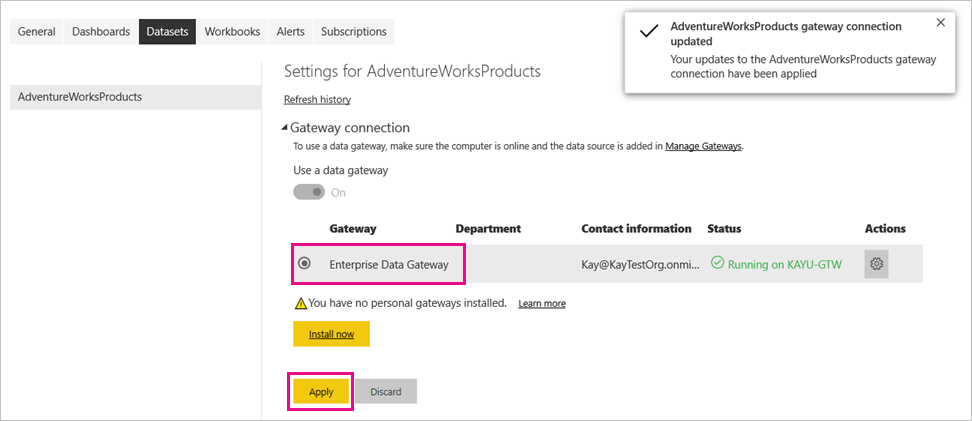
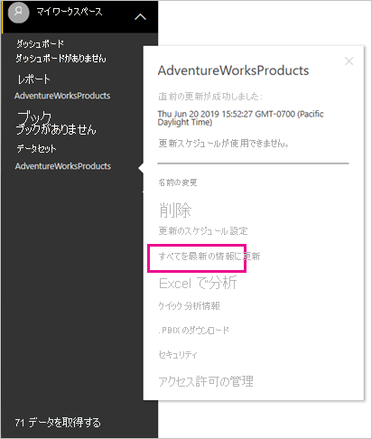
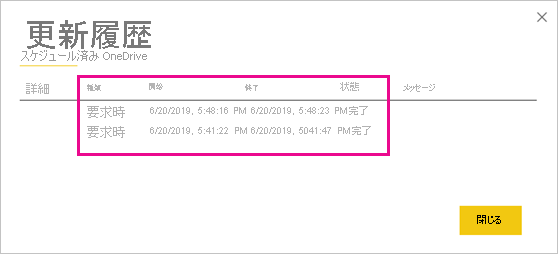

# <a name="refresh-data-from-an-on-premises-sql-server-database"></a>オンプレミス SQL Server データベースからのデータを更新する

このチュートリアルでは、ローカル ネットワーク内にオンプレミスで存在するリレーショナル データベースからの Power BI データセットを更新する方法について説明します。 具体的には、このチュートリアルではサンプルの SQL Server データベースを使用します。Power BI はこのデータベースにオンプレミス データ ゲートウェイ経由でアクセスする必要があります。

このチュートリアルでは、次の手順を実行します。

> [!div class="checklist"]
> * オンプレミス SQL Server データベースからのデータをインポートする Power BI Desktop (.pbix) ファイルを作成して公開します。
> * データ ゲートウェイ経由の SQL Server 接続用に、Power BI でデータ ソースとデータセットの設定を構成します。
> * Power BI データセットに最新のデータが確実に保持されるようにするための更新スケジュールを構成します。
> * データセットのオンデマンド更新を実行します。
> * 過去の更新サイクルの結果を分析するために更新履歴を確認します。
> * このチュートリアルで作成した成果物を削除してリソースをクリーンアップします。

## <a name="prerequisites"></a>前提条件

- まだお持ちでない場合は、始める前に[無料の Power BI 試用版](https://app.powerbi.com/signupredirect?pbi_source=web)にサインアップしてください。
- ローカル コンピューターに [Power BI Desktop](https://powerbi.microsoft.com/desktop/) をインストールします。
- ローカル コンピューターに [SQL Server をインストール](/sql/database-engine/install-windows/install-sql-server)し、[バックアップからサンプル データベース](https://github.com/Microsoft/sql-server-samples/releases/download/adventureworks/AdventureWorksDW2017.bak)を復元します。 AdventureWorks の詳細については、「[AdventureWorks のインストールと構成](/sql/samples/adventureworks-install-configure)」を参照してください。
- 同じローカル コンピューターに SQL Server として[オンプレミス データ ゲートウェイをインストール](service-gateway-onprem.md)します (実稼働環境では、通常は別のコンピューターにインストールします)。

> [!NOTE]
> ゲートウェイの管理者ではなく、ゲートウェイを自分でインストールしたくない場合は、組織内のゲートウェイの管理者に問い合わせてください。 管理者はデータセットを SQL Server データベースに接続するために必要なデータ ソースの定義を作成することができます。

## <a name="create-and-publish-a-power-bi-desktop-file"></a>Power BI Desktop ファイルを作成して公開する

AdventureWorksDW サンプル データベースを使用して基本的な Power BI レポートを作成するには、次の手順を行います。 レポートを Power BI に発行します。これにより、Power BI のデータセットを取得し、以降の手順で構成および更新することができます。

1. Power BI Desktop の **[ホーム]** タブで、**[データの取得]** \> **[SQL Server]** の順に選択します。

2. **[SQL Server データベース]** ダイアログ ボックスで、**[サーバー]** と **[データベース (省略可能)]** の名前を入力し、**[データ接続モード]** が **[インポート]** であることを確認して、**[OK]** を選択します。

    

    このチュートリアルでは **詳細設定オプション** は使用しませんが、SQL ステートメントを指定して [SQL Server フェールオーバー](/sql/database-engine/availability-groups/windows/failover-clustering-and-always-on-availability-groups-sql-server)などの他のオプションを設定できることに注意してください。

    

3. **資格情報** を確認し、 **[接続]** を選択します。

    > [!NOTE]
    > 認証できない場合は、必ず適切な認証方法を選択してデータベースへのアクセスを持つアカウントを使用するようにします。 テスト環境では、明示的なユーザー名とパスワードを指定してデータベース認証を使用することができます。 運用環境では、通常 Windows 認証を使用します。 「[更新に関するトラブルシューティング シナリオ](refresh-troubleshooting-refresh-scenarios.md)」を参照し、追加の支援についてデータベース管理者に問い合わせてください。

1. **[暗号化のサポート]** ダイアログ ボックスが表示されたら、**[OK]** を選択します。

2. **[ナビゲーター]** ダイアログ ボックスで **[DimProduct]** テーブルを選択し、**[読み込む]** を選択します。

    

3. Power BI Desktop の **[レポート]** ビューで、**[視覚化]** ウィンドウから **[積み上げ縦棒グラフ]** を選択します。

    

4. レポート キャンバスで縦棒グラフを選択した状態で、**[フィールド]** ウィンドウの **[EnglishProductName]** フィールドと **[ListPrice]** フィールドを選択します。

    ![[フィールド] ウィンドウ](./media/service-gateway-sql-tutorial/fields-pane.png)

5. **[EndDate]** を **[このページでのフィルター]** の上にドラッグし、 **[基本フィルター]** で **[(空白)]** のチェックボックスのみを選択します。

    

    グラフは次のように表示されます。

    

    5 つの **Road-250** 製品が最も高い表示価格で表示されていることに注目してください。 このチュートリアルの後半でデータを更新し、レポートを更新すると、この情報は変わります。

6. "AdventureWorksProducts.pbix" という名前でレポートを保存します。

7. **[ホーム]** タブで **[発行]** \> **[マイ ワークスペース]** \> **[選択]** の順に選択します。 Power BI サービスにサインインするように求められたら、サインインします。

8. **[成功]** 画面で、**[Power BI で 'AdventureWorksProducts.pbix' を開く]** を選択します。

    [Power BI に発行する](./media/service-gateway-sql-tutorial/publish-to-power-bi.png)

## <a name="connect-a-dataset-to-a-sql-server-database"></a>データセットを SQL Server データベースに接続する

Power BI Desktop では、オンプレミス SQL Server データベースに直接接続しましたが、Power BI サービスにはクラウドとオンプレミス ネットワーク間のブリッジとして機能するゲートウェイが必要です。 次の手順を行って、オンプレミス SQL Server データベースをデータ ソースとしてゲートウェイに追加し、データセットをこのデータ ソースに接続します。

1. Power BI にサインインします。 右上隅の設定歯車アイコンを選択して、**[設定]** を選択します。

    

2. **[データセット]** タブで、データセット **AdventureWorksProducts** を選択します。これによりデータ ゲートウェイ経由でオンプレミス SQL Server データベースに接続することができます。

3. **[ゲートウェイ接続]** を展開して、少なくとも 1 つのゲートウェイが表示されていることを確認します。 ゲートウェイがない場合は、このチュートリアルで前出した「[前提条件](#prerequisites)」セクションで、ゲートウェイをインストールして構成するための製品ドキュメントへのリンクを参照してください。

    

4. **[アクション]** の下で、トグル ボタンを展開してデータ ソースを表示し、**[ゲートウェイに追加]** リンクを選択します。

    

    > [!NOTE]
    > ゲートウェイの管理者ではなく、ゲートウェイを自分でインストールしたくない場合は、組織内のゲートウェイの管理者に問い合わせてください。 管理者はデータセットを SQL Server データベースに接続するために必要なデータ ソースの定義を作成することができます。

5. **[ゲートウェイ]** 管理ページの **[データ ソース設定]** タブで以下の情報を入力して確認し、**[追加]** を選択します。

    | オプション | 値 |
    | --- | --- |
    | データ ソース名 | AdventureWorksProducts |
    | データ ソースの種類 | SQL Server |
    | サーバー | SQLServer01 などの SQL Server インスタンスの名前 (Power BI Desktop で指定した名前と同じにする必要があります)。 |
    | データベース | AdventureWorksDW などの SQL Server データベースの名前 (Power BI Desktop で指定した名前と同じにする必要があります)。 |
    | 認証方法 | Windows または Basic (通常は Windows です)。 |
    | ユーザー名 | SQL Server への接続に使用するユーザー アカウント。 |
    | Password | SQL Server への接続に使用するアカウントのパスワード。 |

    

6. **[データセット]** タブで、**[ゲートウェイ接続]** セクションを再度展開します。 構成したデータ ゲートウェイを選択すると、インストールしたマシン上での実行の **[状態]** が表示されます。**[適用]** を選択します。

    

## <a name="configure-a-refresh-schedule"></a>更新スケジュールを構成する

これで Power BI のデータセットをデータ ゲートウェイ経由でオンプレミスの SQL Server データベースに接続したので、次の手順を行い更新スケジュールを構成します。 スケジュールに基づいてデータセットを更新することで、レポートとダッシュボードに最新のデータが確実に表示されるようにすることができます。

1. ナビゲーション ペインで、**[マイ ワークスペース]** \> **[データセット]** の順に開きます。 **AdventureWorksProducts** データセットの省略記号 (**. . .**) を選択し、**[更新のスケジュール設定]** を選択します。

    > [!NOTE]
    > 必ず、同じ名前のレポートの省略記号ではなく、**AdventureWorksProducts** データセットの省略記号を選択してください。 **AdventureWorksProducts** レポートのコンテキスト メニューには **[更新のスケジュール設定]** オプションは含まれていません。

2. **[スケジュールされている更新]** セクションの **[データを最新の状態に保つ]** で、更新を **[オン]** に設定します。

3. 適切な **[更新の頻度]** を選び (この例では **[毎日]**)、**[時刻]** の下で **[別の時間帯を追加]** を選択して、希望の更新時間を指定します (この例では 6:30 AM と PM)。

    

    > [!NOTE]
    > データセットが共有された容量上にある場合は 1 日に最大 8 時間の枠を、Power BI Premium 上では 48 時間の枠を構成できます。

4. **[更新失敗に関する通知を電子メールで受信する]** チェックボックスを有効のままにして、**[適用]** を選択します。

## <a name="perform-an-on-demand-refresh"></a>オンデマンド更新の実行

これで更新スケジュールを構成したので、Power BI により次のスケジュールされた時間 (15 分の幅あり) にデータセットが更新されます。 ゲートウェイとデータ ソースの構成をテストする場合など、データの更新をより早く行いたい場合には、ナビ ペイン内のデータセット メニューにある **[今すぐ更新]** オプションを使用して、オンデマンド更新を実行します。 オンデマンド更新は、スケジュールされた次回の更新時刻には影響を及ぼしません。ただし、前のセクションで述べたように、1 日の更新上限に対してはカウントされます。

説明するために、SQL Server Management Studio (SSMS) を使用して AdventureWorksDW データベースの DimProduct テーブルを更新することで、サンプル データの変更をシミュレートします。

```sql

UPDATE [AdventureWorksDW].[dbo].[DimProduct]
SET ListPrice = 5000
WHERE EnglishProductName ='Road-250 Red, 58'

```

今度は次の手順を行い、更新されたデータがゲートウェイ接続を経由して Power BI のデータセットとレポートに反映されるようにします。

1. Power BI Service のナビ ペインで、**[マイ ワークスペース]** を選択して展開します。

2. **[データセット]** の下の **[AdventureWorksProducts]** データセットの省略記号 (**. . .**) を選択し、**[今すぐ更新]** を選択します。

    

    Power BI が要求された更新の実行準備をしていることを右上隅で確認します。

3. **[マイ ワークスペース]\>[レポート]\>[AdventureWorksProducts]** の順に選択します。 更新されたデータが反映され、表示価格が最も高い製品が **Road-250 Red, 58** になりました。

    

## <a name="review-the-refresh-history"></a>更新履歴を確認する

更新履歴で過去の更新サイクルの結果を定期的に確認することをお勧めします。 データベースの資格情報の期限が切れていたかもしれません。または、選択したゲートウェイがスケジュールされた更新の期限のときにオフラインになっていたかもしれません。 次の手順を行い、更新履歴を調べて問題を確認します。

1. Power BI ユーザー インターフェイスの右上隅の設定歯車アイコンを選択して、**[設定]** を選択します。

2. **[データセット]** に切り替えて、**AdventureWorksProducts** などの調べたいデータセットを選択します。

3. **[更新履歴]** リンクを選択して、**[更新履歴]** ダイアログを開きます。

    ![[更新履歴] リンク](./media/service-gateway-sql-tutorial/refresh-history-link.png)

4. **[スケジュール済み]** タブで、過去にスケジュールされていた更新とオンデマンド更新について、**[開始]** 時刻と **[終了]** 時刻を確認し、**[状態]** が **[完了]** であることを確認します。これは、Power BI で更新が正常に実行されたことを示します。 失敗した更新については、エラー メッセージを表示してエラーの詳細を調べることができます。

    

    > [!NOTE]
    > [OneDrive] タブは、OneDrive または SharePoint Online 上の Power BI Desktop ファイル、Excel ブック、CSV ファイルに接続されているデータセットにのみ関連するものです。詳細については、「[Power BI でのデータの更新](refresh-data.md)」で説明しています。

## <a name="clean-up-resources"></a>リソースをクリーンアップする

今後はサンプル データを使用しない場合は、そのデータベースを SQL Server Management Studio (SSMS) で削除します。 SQL Server データ ソースを使用しない場合は、そのデータ ソースをデータ ゲートウェイから削除します。 データ ゲートウェイをこのチュートリアルを完了する目的でのみインストールした場合は、アンインストールすることも検討してください。 また、AdventureWorksProducts.pbix ファイルをアップロードしたときに Power BI により作成された AdventureWorksProducts データセットと AdventureWorksProducts レポートを削除する必要があります。

## <a name="next-steps"></a>次のステップ

このチュートリアルでは、オンプレミスの SQL Server データベースからデータを Power BI データセットにインポートする方法と、このデータセットを使用するレポートとダッシュボードが Power BI で更新されるよう、このデータセットをスケジュールおよびオンデマンド ベースで更新する方法について説明してきました。 これで、Power BI でのデータ ゲートウェイとデータ ソースの管理についてさらに詳しく学習することができます。 Power BI でデータ更新の概念に関する記事を参照することもお勧めします。

- [オンプレミス データ ゲートウェイの管理](/data-integration/gateway/service-gateway-manage)
- [データ ソースの管理 - インポート/スケジュールされた更新](service-gateway-enterprise-manage-scheduled-refresh.md)
- [Power BI でのデータの更新](refresh-data.md)
