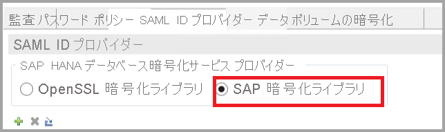
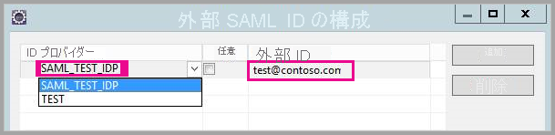
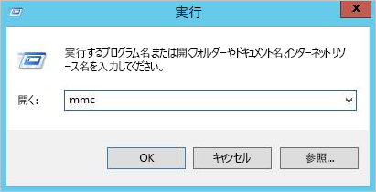
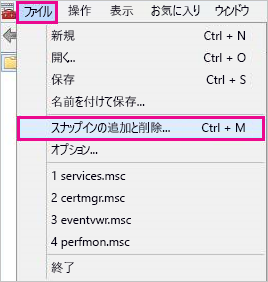
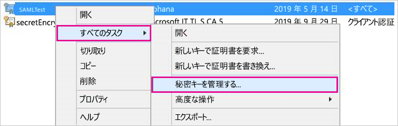
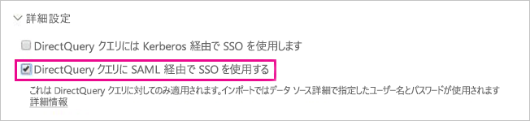

# <a name="use-security-assertion-markup-language-saml-for-sso-from-power-bi-to-on-premises-data-sources"></a>Power BI からオンプレミス データ ソースへの SSO に Security Assertion Markup Language (SAML) を使用する

SSO を有効にすると、Power BI レポートおよびダッシュボードでは、オンプレミスのソース上で構成されているユーザー レベルのアクセス許可を考慮しながら、それらのソースからのデータを簡単に更新できるようになります。 [Security Assertion Markup Language (SAML)](https://www.onelogin.com/pages/saml) を使用し、シームレスなシングル サインオン接続を有効にします。 

## <a name="supported-data-sources"></a>サポートされるデータ ソース

現在、SAP HANA に SAML をご利用いただけます。 SAML を使用した SAP HANA のシングル サインオンの設定と構成の詳細については、「[BI プラットフォームから HANA への SAML SSO](https://blogs.sap.com/2020/03/22/sap-bi-platform-saml-sso-to-hana-database/)」を参照してください。

[Kerberos](service-gateway-sso-kerberos.md) では、追加のデータ ソース (SAP HANA を含む) をサポートしています。

SAP HANA については、SAML SSO 接続を確立する前に暗号化を有効にすることをお勧めします。 暗号化を有効にするには、暗号化された接続を許可するよう HANA サーバーを構成し、HANA サーバーとの通信に暗号化を使用するようゲートウェイを構成します。 HANA ODBC ドライバーは既定で SAML アサーションを暗号化しないため、署名された SAML アサーションは、ゲートウェイから HANA サーバーに "*プレーンテキスト*" で送信され、第三者による傍受や再利用に対して脆弱になります。

> [!IMPORTANT]
> [SAP では OpenSSL がサポートされなくなったため](https://help.sap.com/viewer/b3ee5778bc2e4a089d3299b82ec762a7/2.0.05/en-US/de15ffb1bb5710148386ffdfd857482a.html)、Microsoft もそのサポートを停止しました。 既存の接続は引き続き機能しますが、2021 年 2 月以降、新しい接続を作成することはできなくなります。 今後は代わりに CommonCryptoLib を使用してください。

## <a name="configuring-the-gateway-and-data-source"></a>ゲートウェイとデータ ソースを構成する

SAML を使用するには、SSO を有効にする HANA サーバーとゲートウェイの間に信頼関係を確立する必要があります。 このシナリオでは、ゲートウェイは SAML ID プロバイダー (IdP) として機能します。 この関係を確立するには、さまざまな方法があります。 SAP によって推奨されているのは、SAP 暗号化ライブラリ (CommonCryptoLib または sapcrypto とも呼ばれる) を使用して、信頼関係を確立するための設定手順を完了することです。 詳細については、SAP の公式ドキュメントを参照してください。

次の手順では、HANA サーバーによって信頼されたルート CA を使用してゲートウェイ IdP の X509 証明書に署名することで、HANA サーバーとゲートウェイ IdP の間の信頼関係を確立する方法について説明します。 

### <a name="create-the-certificates"></a>証明書を作成する

次の手順に従って証明書を作成します。

1. SAP HANA を実行しているデバイスで、証明書を格納するための空のフォルダーを作成し、そのフォルダーに移動します。
2. 次のコマンドを実行して、ルート証明書を作成します。

   ```
   openssl req -new -x509 -newkey rsa:2048 -days 3650 -sha256 -keyout CA_Key.pem -out CA_Cert.pem -extensions v3_ca'''
   ```

    この証明書を使用して他の証明書に署名するには、パスフレーズを覚えておく必要があります。
    *CA_Cert.pem* と *CA_Key.pem* が作成されていることがわかります。

   
3. 次のコマンドを実行して、IdP 証明書を作成します。
 
    ```
    openssl req -newkey rsa:2048 -days 365 -sha256 -keyout IdP_Key.pem -out IdP_Req.pem -nodes
    ```
    *IdP_Key.pem* と *IdP_Req.pem* が作成されていることがわかります。

4. ルート証明書を使用して IdP 証明書に署名します。

    ```
    openssl x509 -req -days 365 -in IdP_Req.pem -sha256 -extensions usr_cert -CA CA_Cert.pem -CAkey CA_Key.pem -CAcreateserial -out IdP_Cert.pem
    ```
    *CA_Cert.srl* と *IdP_Cert.pem* が作成されていることがわかります。
    ここでは、*IdP_Cert pem* についてのみ説明します。    

### <a name="create-saml-identity-provider-certificate-mapping"></a>SAML ID プロバイダー証明書のマッピングを作成する

次の手順に従って、SAML ID プロバイダー証明書のマッピングを作成します。

1. **SAP HANA Studio** で、SAP HANA サーバー名を右クリックし、 **[Security]\(セキュリティ\) > [Open Security Console]\(セキュリティ コンソールを開く\) > [SAML Identity Provider]\(SAML ID プロバイダー\)** に移動します。
2. SAP 暗号化ライブラリが選択されていない場合は、選択します。 OpenSSL 暗号化ライブラリ (次の図の左側の選択項目) を使用 "*しない*" でください。これは SAP によって非推奨とされています。

    

3. 次の図に示すように、青いインポート ボタンをクリックして、署名された証明書 *IdP_Cert pem* をインポートします。

    

"*ID プロバイダー名*" に必ず名前を割り当ててください。

### <a name="import-and-create-the-signed-certificates-in-hana"></a>HANA で署名入り証明書をインポートして作成する

次に、HANA で署名入り証明書をインポートして作成します。 次の手順に従います。

1. **HANA Studio** で、次のクエリを実行します。

    ```
    CREATE CERTIFICATE FROM '<idp_cert_pem_certificate_content>'
    ```
    
    次に例を示します。

    ```
    CREATE CERTIFICATE FROM
    '-----BEGIN CERTIFICATE-----
    MIIDyDCCArCgA...veryLongString...0WkC5deeawTyMje6
    -----END CERTIFICATE-----
    '
    ```

2. PSEwith SAML の目的がない場合は、**HANA Studio** で次のクエリを実行して作成します。
    
    ```
    CREATE PSE SAMLCOLLECTION;<br>set pse SAMLCOLLECTION purpose SAML;<br>
    ```

3. 次のコマンドを使用して、新しく作成した署名入り証明書を PSE に追加します。

    ```
    alter pse SAMLCOLLECTION add CERTIFICATE <certificate_id>;
    ```

    次に例を示します。
    ```
    alter pse SAMLCOLLECTION add CERTIFICATE 1978320;
    ```

    次のクエリを使用して、作成した証明書の一覧を確認できます。
    ```
    select * from PUBLIC"."CERTIFICATES"
    ```

    これで証明書が正しくインストールされました。 次のクエリを実行して確認できます。
    ```
    select * from "PUBLIC"."PSE_CERTIFICATES"
    ```

### <a name="map-the-user"></a>ユーザーをマップする

次の手順に従ってユーザーをマップします。

1. **SAP HANA Studio** で **[Security]\(セキュリティ\)** フォルダーを選択します。

    ![[Security]\(セキュリティ\) フォルダーを選択する](media/service-gateway-sso-saml/service-gateway-sso-saml-03.png)

2. **[User]\(ユーザー\)** を展開し、Power BI ユーザーのマップ先のユーザーを選択します。

3. 次の図で強調表示されている **[SAML]** チェックボックスをオンにし、 **[Configure]\(構成\)** を選択します。

    

4. この記事の前半にある「[SAML ID プロバイダー証明書のマッピングを作成する](#create-saml-identity-provider-certificate-mapping)」セクションで作成した ID プロバイダーを選択します。 [External Identity]\(外部 ID\) に Power BI ユーザーの UPN (通常は、Power BI へのログインにユーザーが使用するメール アドレス) を入力し、 **[Add]\(追加\)** を選択します。  次の図は、オプションと選択項目を示しています。

    

    *ADUserNameReplacementProperty* 構成オプションを使用するようゲートウェイを構成した場合は、Power BI ユーザーの元の UPN を置き換える値を入力します。 たとえば、*ADUserNameReplacementProperty* を *SAMAccountName* に設定する場合は、ユーザーの *SAMAccountName* を入力します。

### <a name="configure-the-gateway"></a>ゲートウェイを構成する

これでゲートウェイの証明書と ID を構成できたので、証明書を pfx 形式に変換し、この証明書を使用するようゲートウェイを構成します。手順は次のとおりです。

1. 次のコマンドを実行し、証明書を pfx 形式に変換します。 このコマンドでは、結果として作成される .pfx ファイルに samlcert.pfx という名前を設定し、そのパスワードを *root* に設定します。

    ```
    openssl pkcs12 -export -out samltest.pfx -in IdP_Cert.pem -inkey IdP_Key.pem -passin pass:root -passout pass:root
    ```

2. ゲートウェイ コンピューターに pfx ファイルをコピーします。

    1. *samltest.pfx* をダブルクリックし、 **[ローカル コンピューター]**  >  **[次へ]** を選択します。

    2. パスワードを入力し、**[次へ]** を選択します。

    3. **[証明書をすべて次のストアに配置する]** を選択し、**[参照]** > **[個人]** > **[OK]** の順に選択します。

    4. **[次へ]** を選択し、**[完了]** を選択します。

       

3. 証明書の秘密キーにアクセスする許可をゲートウェイ サービス アカウントに付与します。手順は次のとおりです。

    1. ゲートウェイ コンピューターで、Microsoft 管理コンソール (MMC) を実行します。

        

    2. **[ファイル]** で **[スナップインの追加と削除]** を選択します。

        

    3. **[証明書]**  >  **[追加]** の順に選択し、 **[コンピューター アカウント]**  >  **[次へ]** の順に選択します。

    4. **[ローカル コンピューター]**  >  **[完了]**  >  **[OK]** の順に選択します。

    5. **[証明書]**  >  **[個人]**  >  **[証明書]** の順に展開し、証明書を見つけます。

    6. 証明書を右クリックし、**[すべてのタスク]** &gt; **[秘密キーの管理]** の順に移動します。

        

    1. ゲートウェイ サービス アカウントを一覧に追加します。 既定では、アカウントは **NT SERVICE\PBIEgwService** です。 **services.msc** を実行してゲートウェイ サービスを実行しているアカウントを見つけ、**オンプレミス データ ゲートウェイ サービス** を特定することができます。

        

最後に、次の手順を実行して、証明書の拇印をゲートウェイ構成に追加します。

1. 次の PowerShell コマンドを実行して、マシン上の証明書を一覧表示します。

    ```powershell
    Get-ChildItem -path cert:\LocalMachine\My
    ```

2. 作成した証明書の拇印をコピーします。

3. ゲートウェイ ディレクトリ (既定では *C:\Program Files\On-premises data gateway*) に移動します。

4. *PowerBI.DataMovement.Pipeline.GatewayCore.dll.config* を開き、*SapHanaSAMLCertThumbprint* セクションを見つけます。 コピーした拇印を貼り付けます。

5. ゲートウェイ サービスを再起動します。

## <a name="running-a-power-bi-report"></a>Power BI レポートを実行する

Power BI の **[Manage Gateway]\(ゲートウェイの管理\)** ページを使用して SAP HANA データ ソースを構成できるようになりました。 **[詳細設定]** で、SAML 経由で SSO を有効にします。 こうすることで、そのデータ ソースにバインドされているレポートやデータセットを発行できます。

   

## <a name="troubleshooting"></a>トラブルシューティング

このセクションでは、SAP HANA へのシングル サインオン (SSO) のために SAML を使用する場合のトラブルシューティング手順について詳しく説明します。 これらのトラブルシューティング手順は、発生している可能性のある問題を自己診断し、修正するのに役立ちます。

### <a name="rejected-credentials"></a>拒否された資格情報

SAML ベースの SSO を構成した後、Power BI ポータルで次のエラーが表示される場合があります: "*指定された資格情報は SapHana のソースに使用できません*"。 このエラーは、SAML 資格情報が SAP HANA によって拒否されたことを示します。

サーバー側の認証トレースを利用すれば、SAP HANA での資格情報の問題をトラブルシューティングするための詳細情報が得られます。 以下の手順に従って、ご利用の SAP HANA サーバーに対するトレースを構成します。

1. SAP HANA サーバー上で、次のクエリを実行して認証トレースをオンにします。

    ```
    ALTER SYSTEM ALTER CONFIGURATION ('indexserver.ini', 'SYSTEM') set ('trace', 'authentication') = 'debug' with reconfigure 
    ```

1. 問題を再現します。

1. HANA Studio で、管理コンソールを開いて、**[Diagnosis Files]\(診断ファイル\)** タブを選択します。

1. 最新のインデックス サーバー トレースを開いて、*SAMLAuthenticator.cpp* を検索します。

    次のように、根本原因を示す詳細なエラー メッセージを見つける必要があります。

    ```
    [3957]{-1}[-1/-1] 2018-09-11 21:40:23.815797 d Authentication   SAMLAuthenticator.cpp(00091) : Element '{urn:oasis:names:tc:SAML:2.0:assertion}Assertion', attribute 'ID': '123123123123123' is not a valid value of the atomic type 'xs:ID'.
    [3957]{-1}[-1/-1] 2018-09-11 21:40:23.815914 i Authentication   SAMLAuthenticator.cpp(00403) : No valid SAML Assertion or SAML Protocol detected
    ```

1. トラブルシューティングが完了したら、次のクエリを実行して認証トレースをオフにします。

    ```
    ALTER SYSTEM ALTER CONFIGURATION ('indexserver.ini', 'SYSTEM') UNSET ('trace', 'authentication');
    ```

### <a name="verifying-and-troubleshooting-gateway-errors"></a>ゲートウェイ エラーの検証とトラブルシューティング

このセクションの手順を実行するには、[ゲートウェイ ログを収集する](https://docs.microsoft.com/data-integration/gateway/service-gateway-tshoot#collect-logs-from-the-on-premises-data-gateway-app)必要があります。

#### <a name="ssl-error-certificate"></a>SSL エラー (証明書)

**エラーの症状:**

この問題には複数の症状があります。 新しいデータ ソースを追加しようとする際には、次のようなエラーが表示される場合があります。

```Unable to connect: We encountered an error while trying to connect to . Details: "We could not register this data source for any gateway instances within this cluster. Please find more details below about specific errors for each gateway instance."```

レポートを作成または更新しようとする際には、次のような内容が表示される場合があります。

:::image type="content" source="media/service-gateway-sso-kerberos-sap-hana/sap-hana-kerberos-troubleshooting-01.png" alt-text="SSL エラーのトラブルシューティングを行うウィンドウ":::

Mashup[date]*.log を調べると、次のエラーが見つかります。

```A connection was successfully established with the server, but then an error occurred during the login process and The certificate chain was issued by an authority that is not trusted```

**解決策:**

この SSL エラーを解決するには、次の図のように、データ ソース接続にアクセスし、 **[サーバー証明書の検証]** を **[いいえ]** に設定します。

:::image type="content" source="media/service-gateway-sso-kerberos-sap-hana/sap-hana-kerberos-troubleshooting-02.png" alt-text="SSL エラーを解決するウィンドウ":::

これを選択すると、エラーは表示されなくなります。

#### <a name="gateway-signxml-error"></a>ゲートウェイ SignXML エラー

ゲートウェイ SignXML エラーが発生する場合は、*SapHanaSAMLCertThumbprint* の設定が正しくないか、HANA サーバーに問題がある可能性があります。 ゲートウェイ ログのエントリを調べると、問題が発生している場所と、その解決方法を特定できます。 

**エラーの症状:**

```SignXML: Found the cert...``` のログ エントリ: GatewayInfo[*date*].log ファイルにこのエラーが含まれている場合、SignXML 証明書は見つかっています。トラブルシューティング作業では、この記事の後半にある「[HANA サーバー側の検証とトラブルシューティング](#verifying-and-troubleshooting-the-hana-server-side)」セクションの手順に重点を置いてください。

```Couldn't find saml cert``` のログ エントリ: GatewayInfo[*date*].log ファイルにこのエラーが含まれている場合は、*SapHanaSAMLCertThumbprint* が正しく設定されていません。 次の解決方法セクションでは、この問題を解決する方法について説明します。

**解決策:**

*SapHanaSAMLCertThumbprint* を適切に設定するには、「[Power BI からオンプレミス データ ソースへの SSO に Security Assertion Markup Language (SAML) を使用する](service-gateway-sso-saml.md)」で説明されている手順に従います。具体的には、この記事の下の方にある、「*最後に、次の手順を実行して、証明書の拇印をゲートウェイ構成に追加します*」から始まるセクションの手順に従います。

構成ファイルが変更されたら、ゲートウェイ サービスを再起動して変更を有効にします。

**検証:**

*SapHanaSAMLCertThumbprint* が適切に設定されると、ゲートウェイのログに、```SignXML: Found the cert...``` を含んだエントリが作成されます。 この時点で、[HANA サーバー側の検証とトラブルシューティング](#verifying-and-troubleshooting-the-hana-server-side)に進めるようになります。 

ゲートウェイが証明書を使用して SAML アサーションに署名できない場合には、ログに次のようなエラーが記録されることがあります。 

```GatewayPipelineErrorCode=DM_GWPipeline_UnknownError GatewayVersion= InnerType=CryptographicException InnerMessage=<pi>Signing key is not loaded.</pi> InnerToString=<pi>System.Security.Cryptography.CryptographicException: Signing key is not loaded.```

このエラーを解決するには、この記事の「[ゲートウェイの構成](service-gateway-sso-saml.md#configure-the-gateway)」セクションの **手順 3** で説明されている手順に従います。

構成を変更したら、ゲートウェイ サービスを再起動して変更を有効にします。

#### <a name="verifying-and-troubleshooting-the-hana-server-side"></a>HANA サーバー側の検証とトラブルシューティング

ゲートウェイが証明書を検索し、SAML アサーションに署名できる状態になっても、まだエラーが発生している場合は、このセクションのトラブルシューティング手順を使用してください。 このセクションの手順を実行するには、HANA 認証トレースを収集する必要があります (次の記事の「[トラブルシューティング](service-gateway-sso-saml.md#troubleshooting)」セクションで説明されています)。 

**SAML ID プロバイダー**

HANA 認証トレースに ```Found SAML provider``` という文字列がある場合、それは SAML ID プロバイダーが適切に構成されていることを示します。 この文字列がない場合は、構成が正しくありません。

**解決策:**

まず、組織で使用している sslcryptoprovider が **OpenSSL** なのか、それとも **commoncrypto** なのかを確認します。 どちらが使用されているかを確認するには、次の手順を実行します。

1. HANA Studio を開きます
2. 使用されているテナントの管理コンソールを開きます。
3. 次の図に示すように、[構成] タブにアクセスし、フィルターとして sslcryptoprovider を使用します。

:::image type="content" source="media/service-gateway-sso-kerberos-sap-hana/sap-hana-kerberos-troubleshooting-03.png" alt-text="HANA Studio の sslcryptoprovider の情報":::

次に、以下の手順に従って、暗号化ライブラリが正しく設定されていることを確認します。

1. HANA Studio の [SAML ID プロバイダー] タブで、セキュリティ コンソールに移動します
2. sslcryptoprovider が OpenSSL の場合は、 **[OpenSSL 暗号化ライブラリ]** ラジオ ボタンを選択します。 sslcryptoprovider が commonCrypto の場合は、 **[SAP 暗号化ライブラリ]** ラジオ ボタンを選択します。 次の図では、 **[SAP 暗号化ライブラリ]** が選択されています。

    :::image type="content" source="media/service-gateway-sso-kerberos-sap-hana/sap-hana-kerberos-troubleshooting-04.png" alt-text="HANA Studio での sslcryptoprovider の選択":::

3. 次の図に示すように、ウィンドウの右上隅にある **[デプロイ]** ボタンを選択して、変更をデプロイします。

    :::image type="content" source="media/service-gateway-sso-kerberos-sap-hana/sap-hana-kerberos-troubleshooting-05.png" alt-text="ソリューション変更のデプロイ":::

**検証:**

適切に構成されている場合は、トレースで ```Found SAML provider``` が報告され、```SAML Provider not found``` は報告 "*されません*"。 この記事で後述する「[SAML アサーション署名のトラブルシューティング](#troubleshooting-the-saml-assertion-signature)」へ進むことができます。 


暗号化サービス プロバイダーが設定されているにもかかわらず、まだ ```SAML Provider not found``` が報告されている場合は、トレースで次の文字列を検索します。

```Search SAML provider for certificate with subject =```

その文字列で、subject と発行者が、セキュリティ コンソールの [SAML ID プロバイダー] タブのものとまったく同じであるかどうかを確認します。 1 文字違うだけでも、問題が発生する可能性があります。 違いが見つかった場合は、SAP 暗号化ライブラリを変更することで、エントリを正確に一致させることができます。

SAP 暗号化ライブラリを変更しても問題が解決しない場合は、 *[発行先]* フィールドと *[発行元]* フィールドを手動で編集することができます。 フィールドは、ダブルクリックするだけで編集できます。


#### <a name="troubleshooting-the-saml-assertion-signature"></a>SAML アサーション署名のトラブルシューティング

次のようなエントリを含む HANA 認証トレースが記録されることがあります。

```[48163]{-1}[-1/-1] 2020-09-11 21:15:18.896165 i Authentication SAMLAuthenticator.cpp(00398) : Unable to verify XML signature```
```[48163]{-1}[-1/-1] 2020-09-11 21:15:18.896168 i Authentication MethodSAML.cpp(00103) : unsuccessful login attempt with SAML ticket!```

このようなエントリは、署名が信頼されていないことを意味します。

**解決策:** sslcryptoprovider として **OpenSSL** を使用している場合は、trust.pem と key.pem が SSL ディレクトリにあるかどうかを確認します。 これらを確認する方法については、次のリンクから確認できます: [SAP の記事](https://blogs.sap.com/2015/09/28/securing-the-communication-between-sap-hana-studio-and-sap-hana-server-through-ssl/)

sslcryptoprovider として **commoncrypto** を使用している場合は、テナント内に証明書を含むコレクションがあるかどうかを確認します。

**検証:**

適切に構成されている場合は、トレースで ```Found valid XML signature``` が報告されます 


#### <a name="troubleshooting-the-upn-mapping"></a>UPN マッピングのトラブルシューティング

次のようなエントリを含む HANA トレースが記録されることがあります。

```SAMLAuthenticator.cpp(00886) : Assertion Subject NameID: `johnny@contoso.com` SAMLAuthenticator.cpp(00398) : Database user does not exist```

このエラーは、SAML アサーションに nameId `johnny@contoso.com` が見つかったもの、それが存在しないか、HANA サーバーで正しくマップされていないことを示しています。

**解決策:**

当該の HANA データベース ユーザーにアクセスし、チェックマークの付いた SAML ボックスの下にある *[構成]* リンクをクリックします。 次のウィンドウが表示されます。

:::image type="content" source="media/service-gateway-sso-kerberos-sap-hana/sap-hana-kerberos-troubleshooting-06.png" alt-text="誤ったユーザー名":::

エラー メッセージに示されているように、HANA が `johnny@contoso.com` を見つけようとしましたが、外部 ID は johnny のみとなっています。 これら 2 つの値は一致する必要があります。これを修正するには、*外部 ID* を `johnny@contoso.com` に変更します。 これらのエントリでは、大文字と小文字が区別されることに注意してください。


## <a name="next-steps"></a>次の手順

オンプレミス データ ゲートウェイと DirectQuery の詳細については、次のリソースを参照してください。

* [オンプレミス データ ゲートウェイとは](/data-integration/gateway/service-gateway-onprem)
* [Power BI の DirectQuery](desktop-directquery-about.md)
* [DirectQuery でサポートされるデータ ソース](power-bi-data-sources.md)
* [DirectQuery と SAP BW](desktop-directquery-sap-bw.md)
* [DirectQuery と SAP HANA](desktop-directquery-sap-hana.md)
