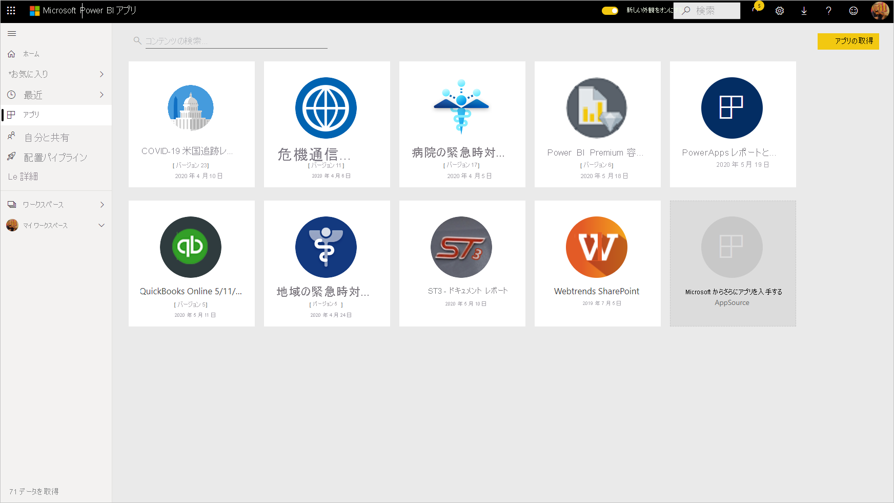
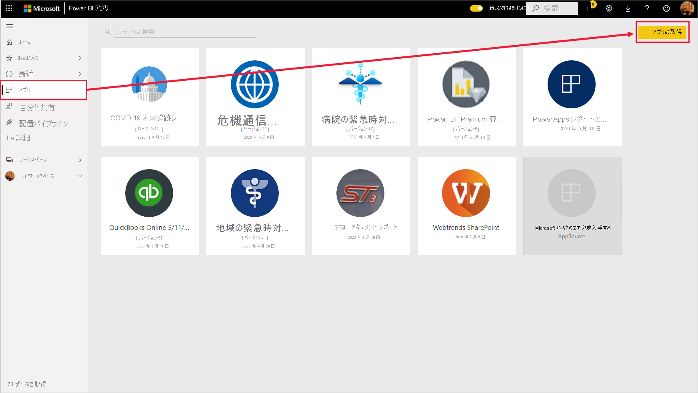
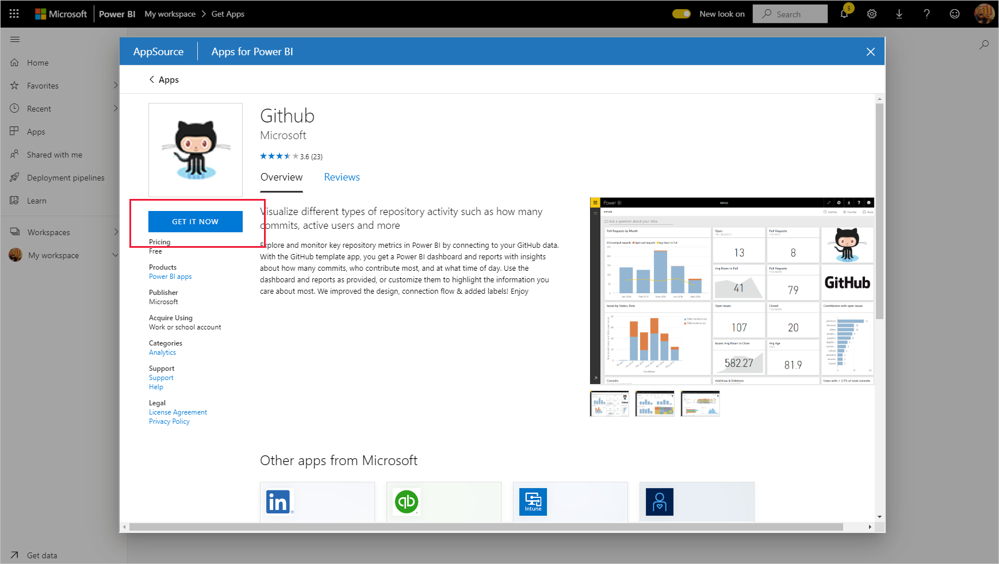
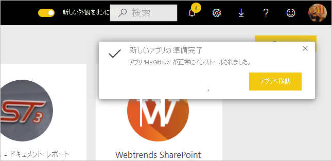
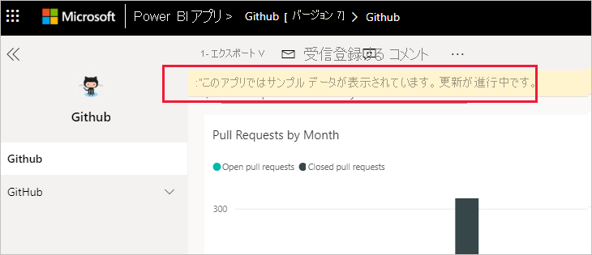
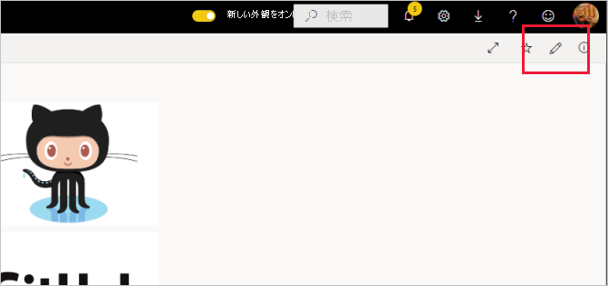
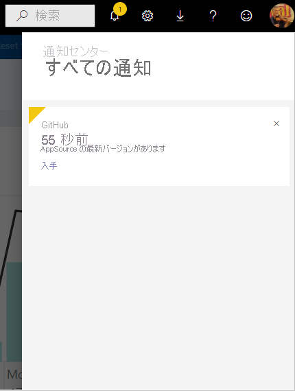
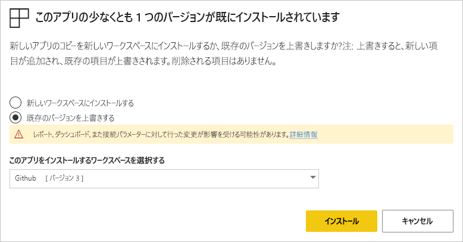

# 組織でテンプレート アプリをインストールして配布する

あなたは Power BI のアナリストですか? そうであれば、この記事では[テンプレート アプリ](service-template-apps-overview.md)をインストールし、Salesforce、Microsoft Dynamics、Google Analytics など、ビジネスに使用するさまざまなサービスに接続する方法について説明します。 その後、テンプレート アプリの既に作成されているダッシュボードやレポートを組織のニーズに合わせて変更したり、それらを[アプリ](../consumer/end-user-apps.md)として同僚に配布したりできます。 

組織外に配布するテンプレート アプリを自分で作成する場合は、「[Power BI でテンプレート アプリを作成する](service-template-apps-create.md)」を参照してください。 Power BI パートナーは、ほとんどまたはまったくコーディングせずに Power BI アプリを作成し、Power BI ユーザーがそれを利用できるようにすることができます。 

## 前提条件  

テンプレート アプリをインストール、カスタマイズ、配布するには、次のものが必要です。 

* [Power BI Pro ライセンス](../fundamentals/service-self-service-signup-for-power-bi.md)。
* テナントにテンプレート アプリをインストールするためのアクセス許可。
* アプリの有効なインストール リンク。AppSource またはアプリの作成者から取得します。
* [Power BI の基本的概念](../fundamentals/service-basic-concepts.md)に関する深い知識。

## テンプレート アプリをインストールする

1. Power BI サービスのナビ ペインで、 **[アプリ]**  >  **[アプリの取得]** の順に選択します。

    

1. 表示された Power BI アプリ マーケットプレースで、 **[テンプレート アプリ]** を選択します。 AppSource で利用できるすべてのテンプレート アプリが表示されます。 探しているテンプレート アプリを参照するか、検索ボックスを使用して選択項目をフィルター処理します。 テンプレート アプリの名前の一部を入力するか、金融、分析、マーケティングなどのカテゴリを入力すると、探している項目を簡単に見つけることができます。

    

1. 探しているテンプレート アプリが見つかったら、それをクリックします。 テンプレート アプリのオファーが表示されます。 **[GET IT NOW]** をクリックします。

   

1. 表示されるダイアログ ボックスで、 **[インストール]** を選択します。

    
    
    さらに[カスタマイズする](#customize-and-share-the-app)ために必要なすべての成果物が含まれる同じ名前のワークスペースと共に、アプリがインストールされます。

    > [!NOTE]
    > AppSource の一覧に表示されていないアプリのインストール リンクを使用する場合は、選択の確認を求める検証ダイアログ ボックスが表示されます。
    >
    >AppSource の一覧にないテンプレート アプリをインストールできるようにするには、関連するアクセス許可を管理者に要求する必要があります。詳細については、Power BI 管理ポータルの「[テンプレート アプリの設定](../admin/service-admin-portal.md#template-apps-settings)」を参照してください。

    インストールが正常に完了すると、新しいアプリの準備ができたことを示す通知が表示されます。

    

## データに接続する

1. **[アプリに移動]** を選択します。

1. **[新しいアプリを開始する]** ウィンドウで、**探索**を選択します。

   

   アプリが開き、サンプル データが表示されます。

1. ページの上部にあるバナーの **[データを接続]** リンクを選択します。

   ![GitHub アプリの [データを接続] リンク](media/service-template-apps-install-distribute/power-bi-template-app-connect-data.png)

    
    これにより表示される 1 つまたは複数のダイアログで、データ ソースをサンプル データから独自のデータ ソースに変更します。 これは一般に、データセット パラメーターとデータ ソースの資格情報の再定義を意味します。 「[既知の制限事項](service-template-apps-overview.md#known-limitations)」を参照してください。
    
    次の例では、2 つのダイアログを使用してデータに接続します。

   

    接続ダイアログの入力が済むと、接続プロセスが開始されます。 バナーによってデータが更新中であることと、その間サンプル データが表示されていることが示されます。

    

   レポート データは 1 日に 1 回自動的に更新されます (サインイン プロセス中にこれを無効にしていない限り)。 また、[独自の更新スケジュールを設定](./refresh-scheduled-refresh.md)し、必要に応じてレポート データを最新の状態に保つこともできます。

## アプリをカスタマイズして共有する

データへの接続とデータの更新が完了したら、アプリに含まれる任意のレポートやダッシュボードをカスタマイズしたり、アプリを同僚と共有したりできます。 ただし、変更した項目を別の名前で保存しない限り、アプリを新しいバージョンに更新すると変更が上書きされることを覚えておいてください。 [上書きに関する詳細を参照してください](#overwrite-behavior)。

アプリをカスタマイズしたり共有したりするには、ページの右上隅にある鉛筆アイコンを選択します。

ワークスペースでの成果物の編集については、以下を参照してください。
* [Power BI でのレポート エディターのツアー](../create-reports/service-the-report-editor-take-a-tour.md)
* [Power BI サービスのデザイナー向けの基本的な概念](../fundamentals/service-basic-concepts.md)

ワークスペースで成果物に必要な変更を行った後は、アプリを発行して共有することができます。 これを行う方法については、「[アプリを発行する](../collaborate-share/service-create-distribute-apps.md#publish-your-app)」を参照してください。

## テンプレート アプリを更新する

テンプレート アプリの作成者が、AppSource か直接リンクまたはその両方を使用して、テンプレート アプリの新しい改良バージョンをリリースすることがあります。

アプリを最初に AppSource からダウンロードした場合、テンプレート アプリの新しいバージョンが利用可能になると、ユーザーは次の 2 つの方法で通知を受け取ります。
* 新しいアプリ バージョンが使用可能であることを通知する更新プログラムのバナーが Power BI サービスに表示されます。
  
* Power BI の通知ペインに通知を受け取ります。

  

>[!NOTE]
>最初に AppSource ではなく直接リンクを使用してアプリを入手した場合、新しいバージョンが利用可能になったことを知る唯一の方法は、テンプレート アプリの作成者に問い合わせることです。

  更新をインストールするには、通知バナーまたは通知センターの **[今すぐ入手]** をクリックするか、AppSource でもう一度アプリを探して **[今すぐ入手する]** を選択します。 テンプレート アプリの作成者から更新への直接リンクを受け取った場合は、単にリンクをクリックします。
  
  現在のバージョンを上書きするか、新しいワークスペースに新しいバージョンをインストールするかを確認するメッセージが表示されます。 既定では、"上書き" が選択されています。

  

- **既存のバージョンを上書きする:** テンプレート アプリの更新されたバージョンを使用して、既存のワークスペースを上書きします。 [上書きに関する詳細を参照してください](#overwrite-behavior)。

- **新しいワークスペースにインストールする:** 再構成する必要があるワークスペースとアプリの新しいバージョンをインストールします (つまり、データに接続し、ナビゲーションとアクセス許可を定義します)。

### 上書きの動作

* 更新を上書きすると、アプリではなく、ワークスペース内のレポート、ダッシュボード、データセットが更新されます。 アプリのナビゲーション、設定、アクセス許可は上書きしても変更されません。
* ワークスペースを更新したら、**アプリを更新して、ワークスペースからアプリに変更を適用する必要があります**。
* 上書きでは、構成済みのパラメーターと認証は保持されます。 更新後、データセットの自動更新が開始されます。 **この更新の間、アプリ、レポート、ダッシュボードにはサンプル データが表示されます**。

  

* 上書き中は、更新が完了するまで常にサンプル データが表示されます。 テンプレート アプリの作成者がデータセットまたはパラメーターを変更した場合、ワークスペースとアプリのユーザーには、更新が完了するまで新しいデータは表示されません。 代わりに、この期間中は引き続きサンプル データが表示されます。
* 上書きしても、ワークスペースに追加した新しいレポートやダッシュボードが削除されることはありません。 元のレポートとダッシュボードが、元の作成者による変更で上書きされるだけです。

>[!IMPORTANT]
>上書き後は、組織のアプリ ユーザーのために、レポートとダッシュボードに変更を適用するために[アプリを更新](#customize-and-share-the-app)するようにしてください。

## 次の手順

[Power BI で同僚と一緒にワークスペースを作成する](../collaborate-share/service-create-the-new-workspaces.md)
