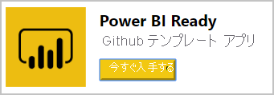

# Power BI でのテンプレート アプリの作成に関するヒント

Power BI で[テンプレート アプリを作成する](service-template-apps-create.md)場合、その一部は、ワークスペースの作成のロジスティクス、そのテスト、および運用です。 しかし、他の重要な部分がレポートとダッシュボードの作成であることは明らかです。 作成プロセスは、4 つの主要なコンポーネントに分割できます。 これらのコンポーネントについて作業すれば、可能な限り最高のテンプレート アプリを作成できます。

* **クエリ**では、データを[接続](desktop-connect-to-data.md)して[変換](../transform-model/desktop-query-overview.md)し、[パラメーター](https://powerbi.microsoft.com/blog/deep-dive-into-query-parameters-and-power-bi-templates/)を定義します。 
* **データ モデル**では、[リレーションシップ](../transform-model/desktop-create-and-manage-relationships.md)、[メジャー](../transform-model/desktop-measures.md)、および Q&A の機能強化を作成します。  
* **[レポート ページ](../create-reports/desktop-report-view.md)** には、データに対する分析情報を提供するためのビジュアルとフィルターが含まれます。  
* **[ダッシュボード](../consumer/end-user-dashboards.md)** と[タイル](../create-reports/service-dashboard-create.md)では、含まれている分析情報の概要が提供されます。
* サンプル データにより、アプリはインストール直後に検出可能になります。

既存の Power BI 機能など、各部分について精通しているかもしれません。 テンプレート アプリを構築するとき、各部分について考慮すべき追加事項があります。 詳細については、以下の各セクションを参照してください。

## クエリ
テンプレート アプリの場合、Power BI Desktop で開発されたクエリは、データ ソースへの接続とデータのインポートのために使用されます。 これらのクエリは一貫したスキーマを返すために必要とされ、スケジュールされたデータ更新のためにサポートされています (DirectQuery はサポートされていません)。

### API に接続する
クエリの構築を始めるには、最初に、Power BI Desktop から API に接続する必要があります。

Power BI Desktop で使用できるデータ コネクタを使ってご自身の API に接続できます。 Web データ コネクタ ([データの取得]、[Web]) を利用して Rest API に接続するか、OData コネクタ ([データの取得]、[OData]) を利用して OData フィードに接続できます。

> [!NOTE]
> 現在、テンプレート アプリではカスタム コネクタはサポートされていません。Odatafeed Auth 2.0 を一部の接続ユース ケースの軽減策として使って探索するか、認定のためにお使いのコネクタを提出することをお勧めします。 コネクタを作成して認定する方法の詳細については、[データ コネクタのドキュメント](https://aka.ms/DataConnectors)を参照してください。

### ソースを検討する
クエリでは、データ モデルに含まれるデータを定義します。 システムのサイズに応じて、顧客がビジネス シナリオに合った管理可能なサイズを扱っていることを確認するために、これらのクエリにフィルターを含める必要があります。

Power BI テンプレート アプリでは、同時に複数のユーザーに対して、複数のクエリを並列に実行できます。  先にスロットリングとコンカレンシー ストラテジーを計画し、テンプレート アプリ フォールト トレランスを行う方法をたずねます。

### スキーマの施行
クエリがシステム内の変更や、モデルを分割できる更新時のスキーマでの変更に対して弾力があることを確認します。 ソースがいくつかのクエリに対して Null または欠落したスキーマの結果を返すことができる場合、空の表または意味のあるカスタム エラー メッセージを返すことを考慮します。

### パラメーター
Power BI Desktop の[パラメーター](https://powerbi.microsoft.com/blog/deep-dive-into-query-parameters-and-power-bi-templates/)により、ユーザーは入力値の提供が可能になります。その入力値は、ユーザーによって取得されるデータをカスタマイズするものです。 事前のパラメーターにより、詳細なクエリやレポートを構築する時間を費やした後での修正作業を回避できると考えられます。

> [!NOTE]
> テンプレート アプリでは、Any と Binary を除くすべてのパラメーターがサポートされます。
>

### 追加のクエリ ヒント

* 確実にすべての列が適切に入力されているようにします。
* 列にわかりやすい名前を付けます (「[Q&A](#qa)」を参照してください)。  
* 共有ロジックについては、関数またはクエリの使用を検討します。  
* 現在、プライバシー レベルはサービスでサポートされていません。 プライバシー レベルについてのメッセージが表示される場合は、相対パスを使用するようにクエリを書き直すことが必要な場合があります。  

## データ モデル

適切に定義されたデータ モデルにより、顧客は簡単かつ直感的にテンプレート アプリと対話できるようになります。 Power BI Desktop で、データ モデルを作成します。

> [!NOTE]
> 基本的なモデリング (型指定と列名) の多くは、[クエリ](#queries)で作業する必要があります。

### Q&A
モデリングはまた、Q&A が顧客に対してどれほど結果を提供できるかに影響します。 確実に、通常使用される列にシノニムを追加し、列が[クエリ](#queries)で適切に命名されているようにします。

### 追加のデータ モデルのヒント

以下のことを行ったことを確認します。

* すべての値列に書式設定を適用した。 クエリで型を適用する。  
* すべてのメジャーに書式設定を適用した。
* 既定の概要作成を設定した。 特に該当する場合には、"概要作成しない" (たとえば一意の値の場合など)。  
* 該当する場合、データ カテゴリを設定した。  
* 必要に応じて、リレーションシップを設定した。  

## レポート
レポートのページでは、テンプレート アプリに含まれるデータへの追加の分析情報を提供します。 レポートのページを使用して、テンプレート アプリが処理しようとしている主要なビジネス上の質問に回答します。 Power BI Desktop を使用して、レポートを作成します。

### 追加のレポートに関するヒント

* クロス フィルター処理のために、1 ページあたり 1 つ以上のビジュアルを使用する。  
* ビジュアルを慎重に揃える (重ならない)。  
* ページは「4:3」または「16:9」モードのレイアウトに設定する。  
* 表示されるすべての集計を意味のある数値にする (平均値、一意の値)。  
* スライシングは合理的な結果を生成する。  
* ロゴが、少なくとも上位のレポートに存在する。  
* 要素は可能な限り、クライアントのカラー スキームにあるものにする。  

## ダッシュボード
ダッシュボードは、顧客にとってテンプレート アプリとやり取りする主なポイントです。 これにはコンテンツの概要が含まれるはずですが、特にビジネス シナリオにとって重要なメトリックが含まれます。

テンプレート アプリのためのダッシュボードを作成するには、[データを取得] から [ファイル] を介して PBIX をアップロードするだけ、または Power BI Desktop から直接発行するだけです。

### 追加のダッシュボードのヒント

* ダッシュボード上のタイルが一貫性のあるようにピン留めされた場合に、同じテーマを保持する。  
* 顧客がどこからのパックかわかるよう、テーマにロゴをピン留めする。  
* ほとんどの画面解像度で動作する推奨のレイアウトは、小さいタイル 5 から 6 個分の幅である。  
* すべてのダッシュボード タイルには適切なタイトルおよびサブタイトルが必要である。  
* 垂直または水平方向など、さまざまなシナリオに対応するダッシュボードのグループ化を検討する。  

## サンプル データ
テンプレート アプリでは、アプリの作成ステージの一環として、ワークスペースのキャッシュ データがアプリの一部としてラップされます。

* データに接続する前に、インストーラーがアプリの機能と目的を理解できるようにします。
* インストーラーによるアプリ機能の探索を促すエクスペリエンスを作成し、アプリ データセットへの接続につなげます。

アプリを作成する前に高品質のサンプル データを用意することをお勧めします。 また、アプリのレポートとダッシュボードにデータが設定されていることを確認します。

## AppSource での発行
テンプレート アプリは AppSource に発行できます、ご自身のアプリを AppSource に送信する前に、次のガイドラインに従ってください。

* アプリの機能をインストーラーが理解しやすいように魅力的なサンプル データを使ってテンプレート アプリを作成します (空のレポートとダッシュボードは承認されていません)。
テンプレート アプリではサンプル データのみのアプリがサポートされます。静的なアプリのチェック ボックスは必ずオンにしてください。 [詳細情報](./service-template-apps-create.md#define-the-properties-of-the-template-app)
* データ接続に必要な資格情報とパラメーターが含まれる、検証チームを対象とした指示を用意します。
* アプリケーションでは、Power BI とご自身の CPP プランにアプリ アイコンを含める必要があります。 [詳細情報](./service-template-apps-create.md#define-the-properties-of-the-template-app)
* ランディング ページを構成します。 [詳細情報](./service-template-apps-create.md#define-the-properties-of-the-template-app)
* 必ず、[パートナー センター > Power BI アプリ オファー](/azure/marketplace/partner-center-portal/create-power-bi-app-offer)のドキュメントに従ってください。
* ダッシュボードがご自身のアプリに含まれる場合は、空でないことを確認します。
* アプリを送信する前に、アプリ リンクを使用してそのアプリをインストールします。データセットに接続できることと、計画したとおりのアプリ エクスペリエンスであることを確認します。
* pbix をテンプレート ワークスペースにアップロードする前に、不要な接続すべてをアンロードしてください。
* Power BI の「[レポートとビジュアルのデザインに関するベスト プラクティス](../visuals/power-bi-report-visualizations.md)」に従って、ユーザーに対する効果を最大限に高め、配布の承認を得ます。
<!--- * In general, only application with valuable functionality can be approved for general use on AppSource. Application with sample data content only must have either a guidance or statistical value.) -->

## アプリのダウンロード リンクを作成する

AppSource でテンプレート アプリを発行した後、Web サイトから次のいずれかへのダウンロード リンクを作成することを検討します。
* AppSource ダウンロード ページ - AppSource からリンクを入手して、だれでも表示できます。
* Power BI - Power BI ユーザーが表示できます。

ユーザーを Power BI 内のアプリのダウンロード リンクにリダイレクトするには、[GitHub リポジトリ](https://github.com/microsoft/Template-apps-examples/tree/master/src)のコード例を参照してください。

## 次の手順

[Power BI テンプレート アプリとは](service-template-apps-overview.md)