# チュートリアル:Power BI で機械学習モデルを構築する

このチュートリアルの記事では、**自動機械学習**を使用して、Power BI でバイナリの予測モデルを作成して適用します。 このチュートリアルには、Power BI データフローを作成し、データフローで定義されているエンティティを使用して機械学習モデルを Power BI で直接トレーニングおよび検証するためのガイダンスが含まれています。 また、そのモデルを使用して新しいデータをスコア付けし、予測を生成します。

まず、バイナリの予測機械学習モデルを作成して、オンライン セッション属性のセットに基づいてオンラインの買い物客の購入意図を予測します。 この演習には、ベンチマーク機械学習データセットが使用されます。 モデルのトレーニングが完了すると、モデルの結果を説明する検証レポートが Power BI によって自動的に生成されます。 この検証レポートを確認し、スコア付けのためにモデルをデータに適用できます。

このチュートリアルは、次の手順で構成されています。
> [!div class="checklist"]

> * 入力データを使用してデータフローを作成する
> * 機械学習モデルの作成とトレーニング
> * モデル検証レポートを確認する
> * データフロー エンティティにモデルを適用する
> * モデルのスコア付けされた出力を Power BI レポートで使用する

## 入力データを使用してデータフローを作成する

このチュートリアルの最初の部分では、入力データを使用してデータフローを作成します。 このプロセスでは、以下のセクションで示すように、データの取得を始め、いくつかの手順を実行します。

### データを取得

データフローを作成する最初の手順として、データ ソースを準備します。 このケースでは、一連のオンライン セッションの機械学習データセットを使用しており、その一部は購入に至っています。 データセットにはこれらのセッションに関する一連の属性が含まれ、それをモデルのトレーニングに使用します。

データセットは、UC Irvine Web サイトからダウンロードできます。 また、このチュートリアルのために、[online_shoppers_intention.csv](https://raw.githubusercontent.com/santoshc1/PowerBI-AI-samples/master/Tutorial_AutomatedML/online_shoppers_intention.csv) のリンクからこれを入手することもできます。

### エンティティを作成する

データフローにエンティティを作成するには、Power BI サービスにサインインし、AI が有効になっている専用容量内のワークスペースに移動します。

ワークスペースがまだない場合は、Power BI サービスのナビ ペイン メニューで **[ワークスペース]** を選択して作成し、表示されるパネルの下部にある **[ワークスペースの作成]** を選択します。 これで、ワークスペースの詳細を入力するパネルが右側に開きます。 ワークスペース名を入力し、 **[詳細]** を選択します。 ラジオ ボタンを使用してワークスペースに [専用の容量] が使用されていること、AI プレビューが有効になっている専用の容量インスタンスに割り当てられていることを確認します。 その後、 **[保存]** を選びます。

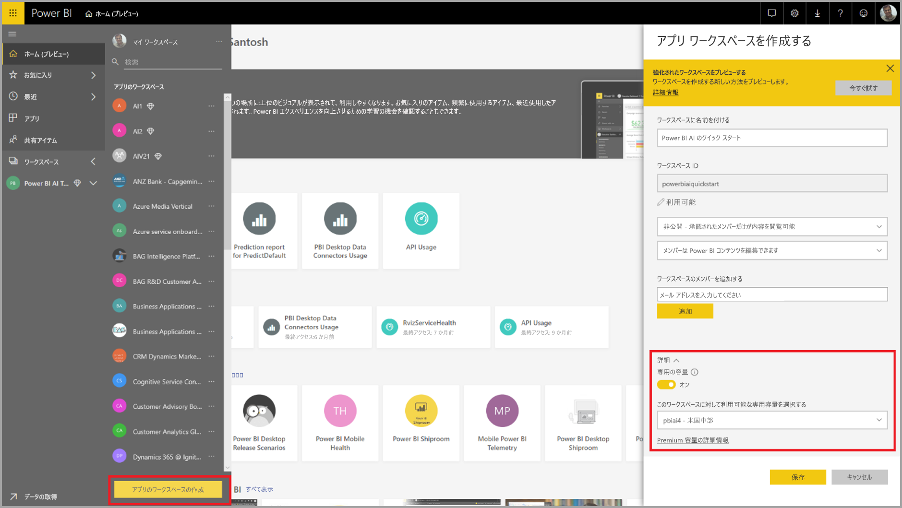

ワークスペースが作成されたら、次の図に示すように、ようこそ画面の右下にある **[スキップ]** を選択できます。

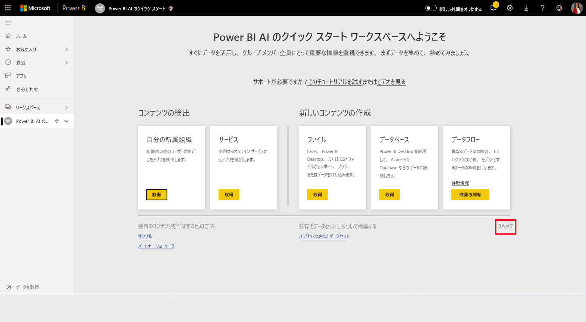

 ワークスペースの右上にある **[作成]** ボタンを選択し、 **[データフロー]** を選択します。

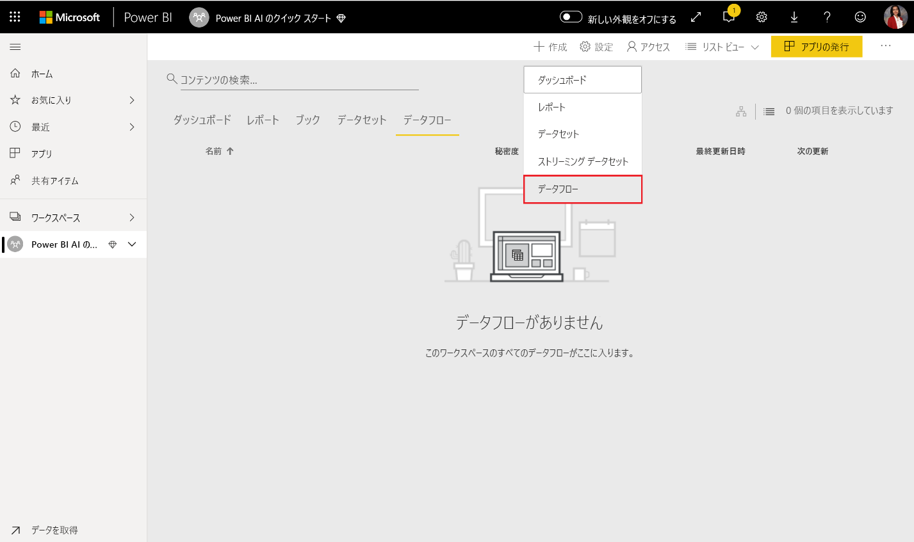

**[新しいエンティティを追加]** を選択します。 これにより、ブラウザーで **Power Query** エディターが起動します。

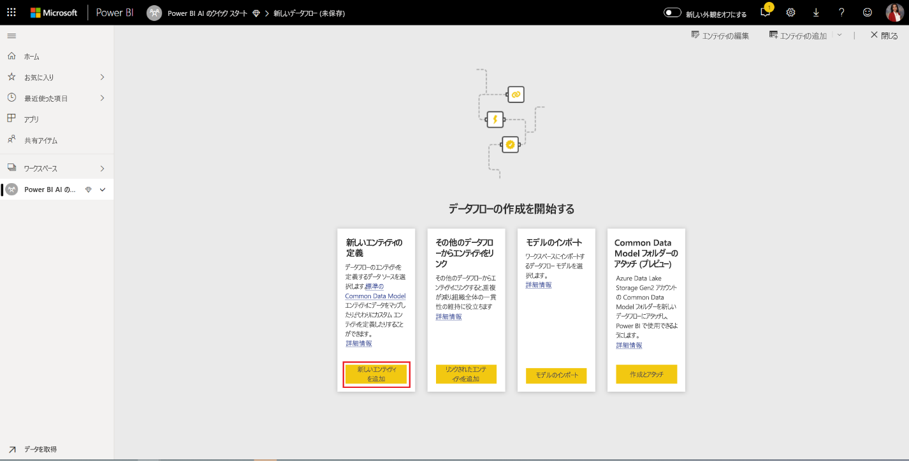

次の図に示すように、データ ソースとして **[Text/CSV File]\(テキスト/CSV ファイル\)** を選択します。

![[Text/CSV File]\(テキスト/CSV ファイル\) の選択](media/service-tutorial-build-machine-learning-model/tutorial-machine-learning-model-05.png)

次に表示される **[データ ソースへの接続]** ページで、 **[File path or URL]\(ファイル パスまたは URL\)** ボックスに _online_shoppers_intention.csv_ への次のリンクを貼り付け、 **[次へ]** を選択します。

`https://raw.githubusercontent.com/santoshc1/PowerBI-AI-samples/master/Tutorial_AutomatedML/online_shoppers_intention.csv`

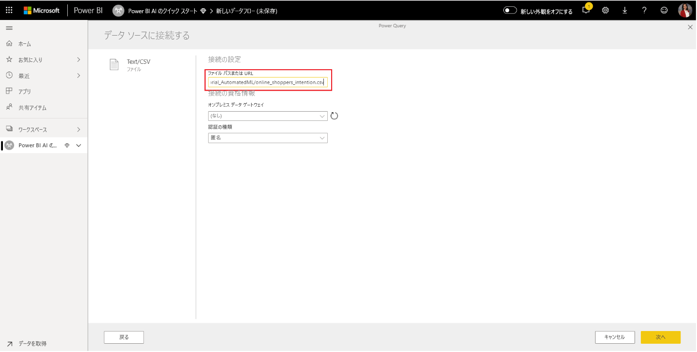

Power Query エディターに、CSV ファイル内のデータのプレビューが表示されます。 右側のペインにある [名前] ボックスの値を変更することで、クエリの名前をわかりやすい名前に変更できます。 たとえば、クエリ名を _Online Visitors_ に変更できます。

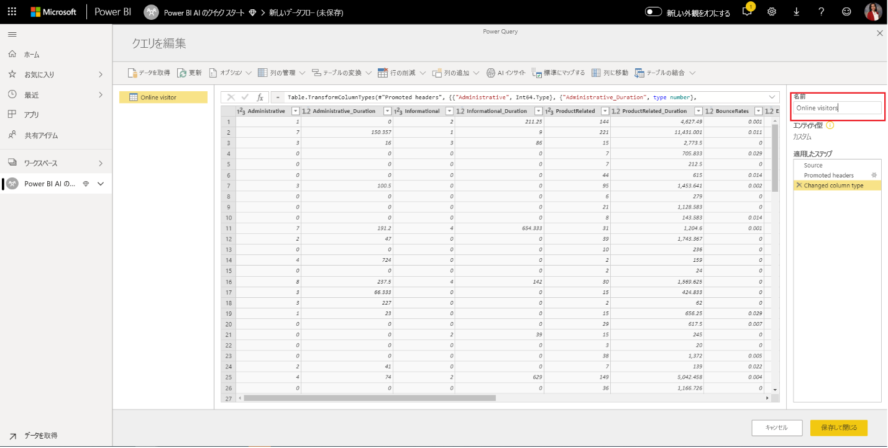

列の型は Power Query によって自動的に推測されます。 列ヘッダーの上部にある属性の種類アイコンをクリックすると、列の型を変更できます。 この例では、Revenue 列の型を [True/False] に変更します。

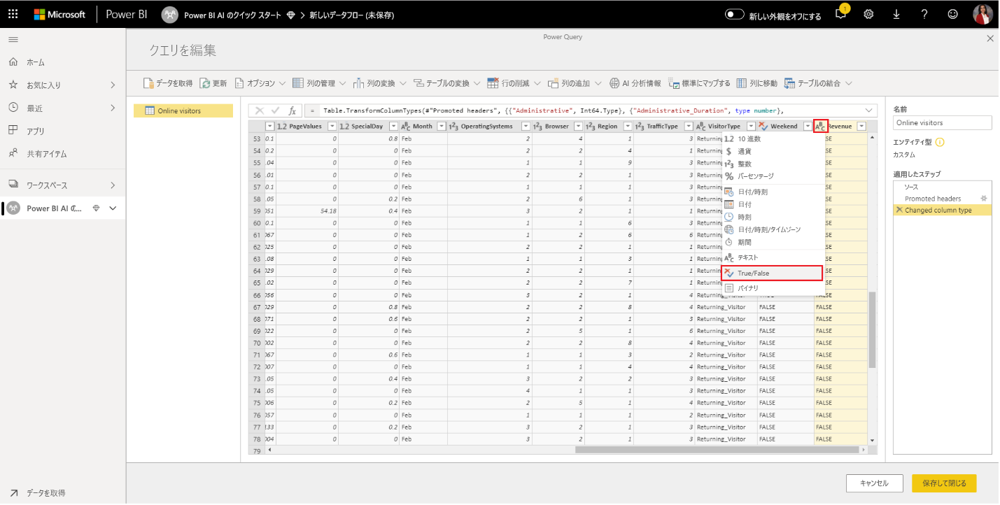

**[保存して閉じる]** ボタンを選択して Power Query エディターを閉じます。 データフローの名前を指定し、次の図に示すように、ダイアログの **[保存]** を選択します。

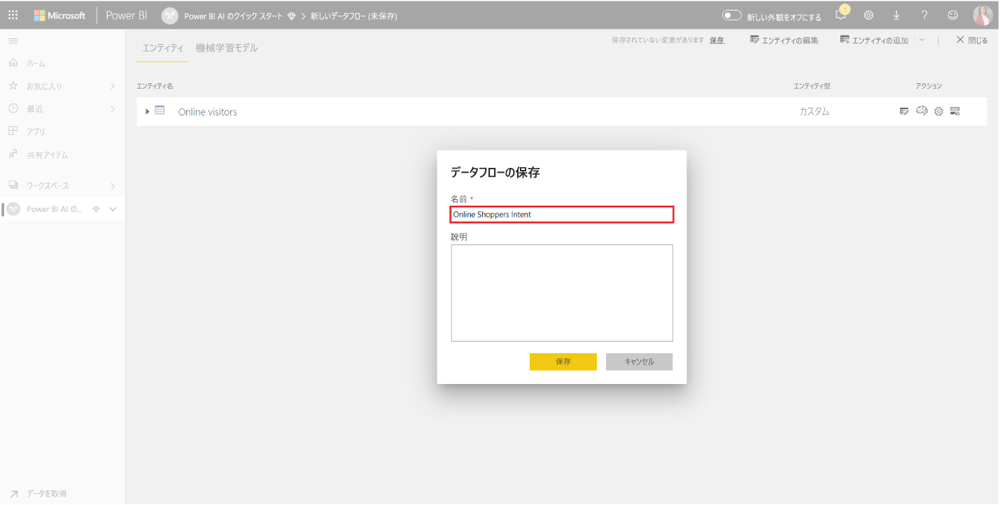

## 機械学習モデルの作成とトレーニング

機械学習モデルを追加するには、トレーニング データとラベル情報が含まれている基本エンティティの **[アクション]** 一覧で **[ML モデルを適用します]** ボタンを選択し、 **[機械学習モデルの追加]** を選択します。

機械学習モデルを作成するための最初の手順は、予測する結果フィールドを含む履歴データを特定することです。 モデルは、このデータから学習することで作成されます。

使用しているデータセットのケースでは、これは **Revenue** フィールドです。 [Outcome field]\(結果フィールド\) の値として **[Revenue]** を選択し、 **[次へ]** を選択します。

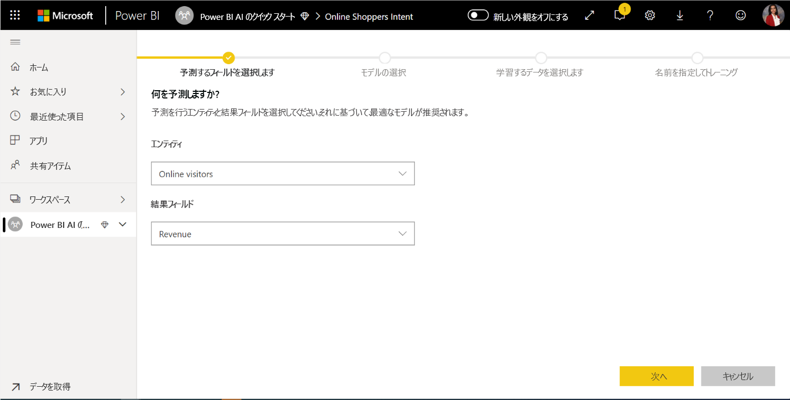

次に、作成する機械学習モデルの種類を選択する必要があります。 Power BI では、特定した結果フィールドの値が分析され、そのフィールドを予測するために作成できる機械学習モデルの種類が提案されます。

このケースでは、ユーザーが購入するかどうかのバイナリの結果を予測しているので、[バイナリの予測] が提案されます。 ここで関心があるのは購入を行うユーザーの予測であるため、最も関心のある収益の結果として [True] を選択します。 さらに、モデルの検証結果を要約する、自動的に生成されるレポートで使用される結果に対してわかりやすいラベルを指定することもできます。 [次へ] を選択します。

![[バイナリの予測] の予測](media/service-tutorial-build-machine-learning-model/tutorial-machine-learning-model-12.png)

次に、Power BI によってデータのサンプルの事前スキャンが行われ、より正確な予測が生成される可能性のある入力が提案されます。 Power BI によってフィールドが提案されない場合は、その横に説明が表示されます。 モデルに学習させるフィールドだけを含めるように選択を変更することも、エンティティ名の横にあるチェック ボックスをオンにしてすべてのフィールドを選択することもできます。 **[次へ]** を選択して入力を受け入れます。

![[次へ] チェックボックスを選択する](media/service-tutorial-build-machine-learning-model/tutorial-machine-learning-model-13.png)

最後の手順では、モデルの名前を指定する必要があります。 モデルに _Purchase Intent Prediction_ という名前を付けます。 トレーニング時間を短縮して簡単な結果を表示するか、トレーニングにかける時間を増やして最適なモデルを得るかを選択できます。 次に、 **[Save and train]\(保存してトレーニング\)** を選択して、モデルのトレーニングを開始します。

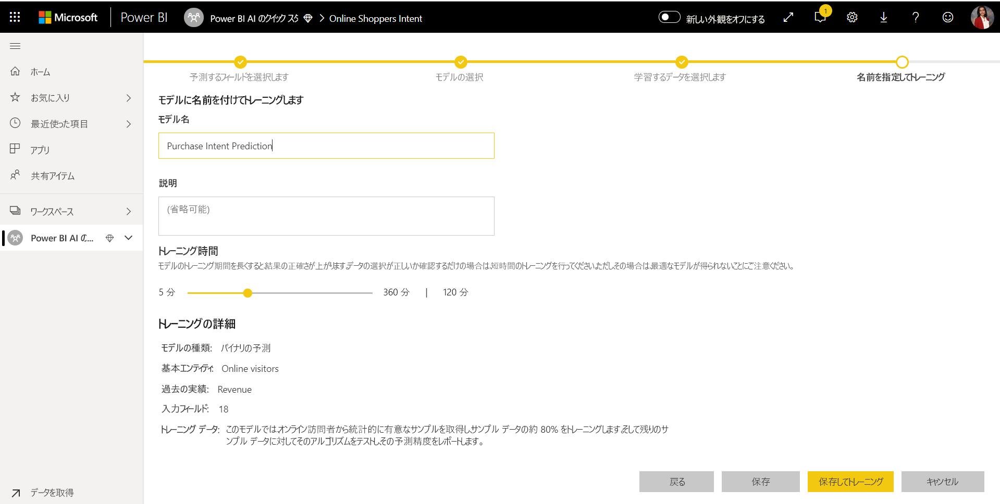

トレーニング プロセスは、履歴データをサンプリングして正規化し、データセットを 2 つの新しいエンティティ _Purchase Intent Prediction Training Data_ と _Purchase Intent Prediction Testing Data_ に分割することから始まります。

データセットのサイズによっては、トレーニング プロセスに、数分から、前の画面で選択したトレーニング時間までかかることがあります。 この時点で、データフローの **[機械学習モデル]** タブでモデルを確認できます。 [準備完了] の状態は、モデルがトレーニングのためにキューに格納されているか、トレーニング中であることを示します。

データフローの状態によって、モデルがトレーニング中および検証中であることを確認できます。 これは、ワークスペースの **[データフロー]** タブで進行中のデータ更新と表示されます。

モデルのトレーニングが完了すると、データフローに更新された更新時間が表示されます。 データフローの **[機械学習モデル]** タブに移動すると、モデルがトレーニング済みであることを確認できます。 作成したモデルには **[トレーニング済み]** と表示され、 **[最後のトレーニング]** の時刻が更新されます。

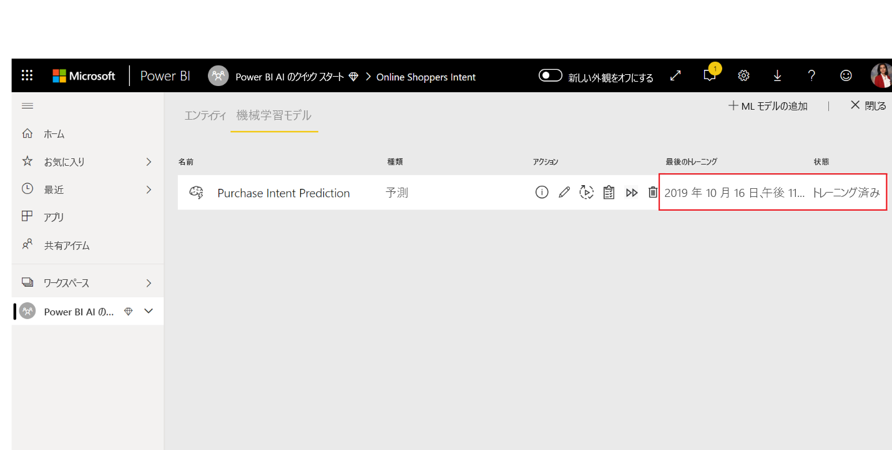

## モデル検証レポートを確認する
モデル検証レポートを確認するには、[機械学習モデル] タブで、モデルの [アクション] 列の [トレーニング レポートの表示] ボタンを選択します。 このレポートには、機械学習モデルがどのように実行される可能性があるかが示されます。

レポートの **[モデル パフォーマンス]** ページで、 **[See top predictors]\(最上位の予測子を表示する\)** を選択して、モデルの最上位の予測子を表示します。 予測子のいずれかを選択して、結果の分布がその予測子にどのように関連付けられているかを確認できます。

[モデル パフォーマンス] ページの **[Probability Threshold]\(確率しきい値\)** スライサーを使用すると、モデルの精度とリコールに対する影響を確認できます。

レポートの他のページには、モデルの統計的なパフォーマンス メトリックが記載されます。

このレポートには、実行されたさまざまなイテレーション、入力からの特徴の抽出方法、および最後に使用されたモデルのハイパーパラメーターが記述された [トレーニングの詳細] ページも含まれています。

## データフロー エンティティにモデルを適用する

レポートの上部にある **[モデルの適用]** ボタンを選択すると、このモデルが呼び出されます。 **[適用]** ダイアログで、モデルを適用するソース データを含むターゲット エンティティを指定できます。

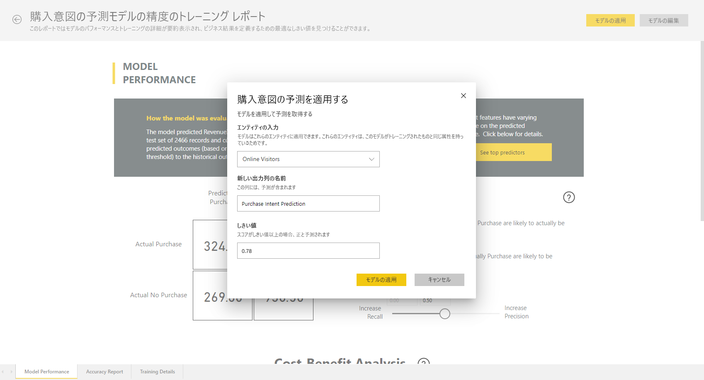

プロンプトが表示されたら、データフローを **[更新]** して、モデルの結果をプレビューする必要があります。

モデルを適用すると、**enriched <モデル名>** と **enriched <モデル名> descriptions** のサフィックスが付いた 2 つの新しいエンティティが作成されます。 この例では、モデルを **Online Visitors** エンティティに適用すると、モデルからの予測出力が含まれる **Online Visitors enriched Purchase Intent Prediction** と、予測の上位レコード固有のインフルエンサーが含まれる **Online Visitors enriched Purchase Intent Prediction explanations** が作成されます。 

バイナリの予測モデルを適用すると、予測された結果、確率スコア、予測の上位レコード固有のインフルエンサー、および説明インデックス用の 4 つの列が追加されます。それぞれの列には、指定した列名がプレフィックスとして付けられます。  

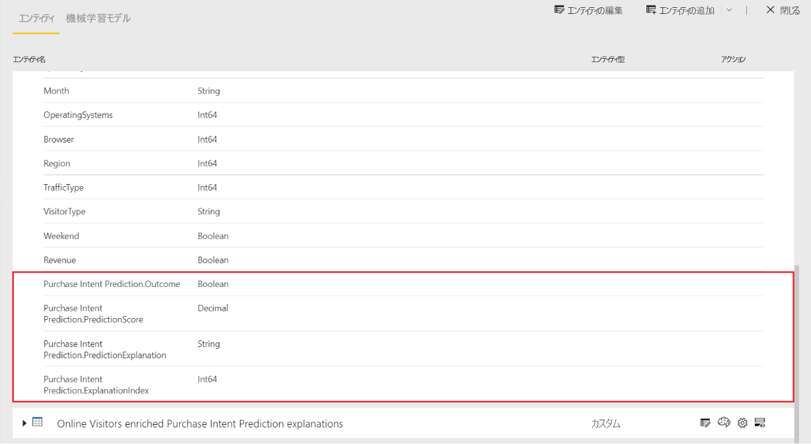

データフローの更新が完了したら、**Online Visitors enriched Purchase Intent Prediction** エンティティを選択して結果を確認できます。

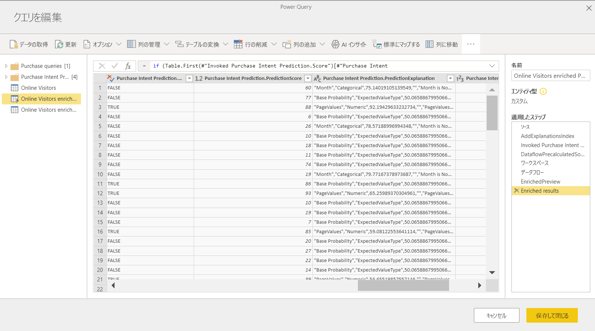

データフローで Power Query エディターから直接、ワークスペース内で任意の AutoML モデルを呼び出すこともできます。 下図に示すように、AutoML モデルにアクセスするには、AutoML モデルからの分析情報で強化するエンティティの [編集] ボタンを選択します。

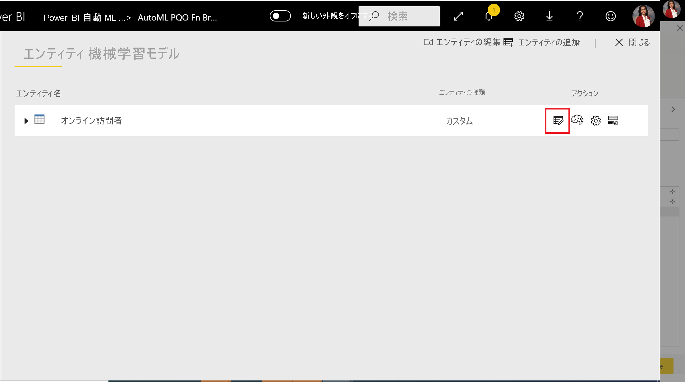

[編集] ボタンを選択すると、データフロー内でエンティティの Power Query エディターが開きます。 リボンの [AI 分析情報] ボタンを選択します。

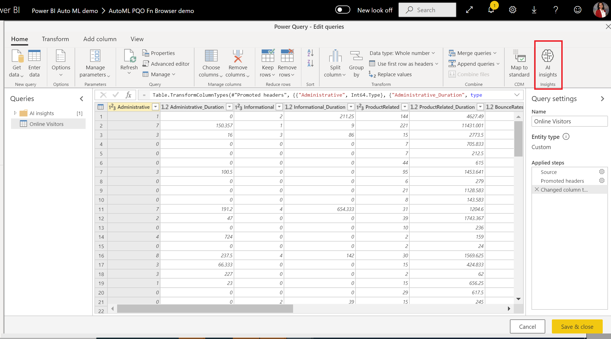

 ナビ ペイン メニューから Power BI の [機械学習モデル] フォルダーを選択します。 アクセス権があるすべての AutoML モデルが Power Query 関数としてここに一覧表示されます。 また、AutoML モデルの入力パラメーターは、対応する Power Query 関数のパラメーターとして自動的にマップされます。 パラメーターの名前とデータ型が同じ場合にのみ、パラメーターは自動的にマッピングされることにご注意ください。
 
AutoML モデルを呼び出すには、選択したエンティティのいずれかの列を、ドロップダウン リストからの入力として指定します。 入力ダイアログの左側にある列アイコンを切り替えることにより、入力として使用する定数値を指定することもできます。

[適用] を選択すると、AutoML モデルの出力のプレビューが、エンティティ テーブルの新しい列として表示されます。 また、モデル呼び出しが、クエリに適用された手順として表示されます。

データフローを保存すると、データフローの更新時に (エンティティ テーブルの行の新規作成や更新に対して) モデルが自動的に呼び出されます。

## モデルのスコア付けされた出力を Power BI レポートで使用する

機械学習モデルからのスコア付けされた出力を使用するには、データフロー コネクタを使用して、Power BI デスクトップからデータフローに接続できます。 これで、**Online Visitors enriched Purchase Intent Prediction** エンティティを使用して、モデルの予測を Power BI のレポートに組み込むことができるようになりました。

## 次の手順

このチュートリアルでは、次の手順に従って Power BI でバイナリの予測モデルを作成して適用しました。

* 入力データを使用してデータフローを作成する
* 機械学習モデルの作成とトレーニング
* モデル検証レポートを確認する
* データフロー エンティティにモデルを適用する
* モデルのスコア付けされた出力を Power BI レポートで使用する

Power BI での機械学習の自動化の詳細については、「[Power BI での自動化された機械学習](../transform-model/service-machine-learning-automated.md)」を参照してください。
