# チュートリアル:Power BI での Machine Learning Studio (クラシック) モデルの呼び出し (プレビュー)

このチュートリアルでは、**Azure Machine Learning Studio (クラシック)** モデルから得た分析情報を Power BI に取り込む方法を順を追って説明します。 このチュートリアルには、Power BI ユーザーに Azure ML モデルへのアクセス権を付与する、データフローを作成する、および Azure ML モデルから得られた分析情報をデータフローに適用するためのガイダンスが含まれています。 また、Azure ML モデルがまだない場合は、モデルを作成するためのクイック スタート ガイドも参照します。

このチュートリアルでは、以下の手順を行います。

> [!div class="checklist"]
> * Azure Machine Learning モデルを作成して発行する
> * モデルを使用するためのアクセス権を Power BI ユーザーに付与する
> * データフローを作成する
> * Azure ML モデルから得られた分析情報をデータフローに適用する

## Azure ML モデルを作成して発行する

[チュートリアル手順 1:Machine Learning Studio (クラシック) ワークスペースの作成](/azure/machine-learning/studio/walkthrough-1-create-ml-workspace)に関するページの手順に従って **Machine Learning** ワークスペースを作成します。

この手順では、既存のどの Azure ML モデルやデータセットを使っても構いません。 発行済みのモデルがない場合は、「[Azure Machine Learning Studio (クラシック) で初めてのデータ サイエンス実験を作成する](/azure/machine-learning/studio/create-experiment)」の手順に従って、自動車の価格を予測する Azure ML モデルを数分で作成することができます。

[Azure Machine Learning Studio (クラシック) Web サービスのデプロイ](/azure/machine-learning/studio/tutorial-part3-credit-risk-deploy)に関する手順に従って、Azure ML モデルを Web サービスとして発行します。

## Power BI ユーザーにアクセス権を付与する

Power BI から Azure ML モデルにアクセスするには、Azure サブスクリプションとリソース グループに対する**読み取り**アクセス権と、Machine Learning Studio (クラシック) モデル用の Azure Machine Learning Studio (クラシック) Web サービスに対する**読み取り**アクセス権が必要です。  Azure Machine Learning モデルの場合は、Machine Learning ワークスペースに対する**読み取り**アクセス権が必要です。

以下の手順では、モデルを発行した Azure サブスクリプションとリソース グループの共同管理者であることを前提としています。

[Azure portal](https://portal.azure.com) にサインインして **[サブスクリプション]** ページに移動します (ナビ ペイン メニューの **[すべてのサービス]** の一覧にあります)。

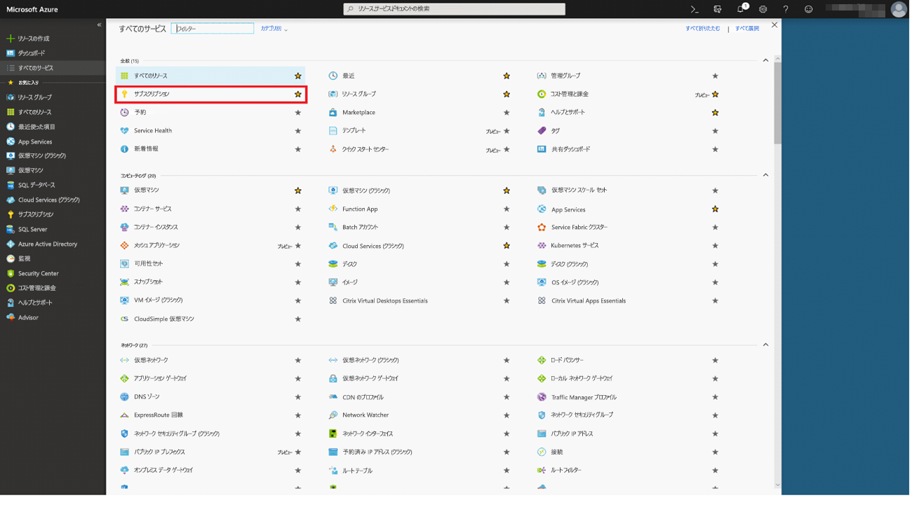

モデルの発行に使用した Azure サブスクリプションを選択し、 **[Access 制御 (IAM)]** を選択します。 次に、 **[ロールの割り当ての追加]** を選択してから、 **[閲覧者]** ロールを選択し、Power BI ユーザーを選択します。 完了したら、 **[保存]** を選択します。 次の図は、この手順で選択する項目を示しています。

上記の手順を繰り返して、Azure ML モデルがデプロイされている特定の Machine Learning Web サービスに対する **[共同作成者]** ロールのアクセス権を Power BI ユーザーに付与します。

## データフローの作成

### データフローを作成するためのデータを取得する

前の手順で Azure ML モデルへのアクセス権を付与したユーザーの資格情報を使用して、Power BI サービスにサインインします。

この手順では、Azure ML モデルでスコア付けするデータが CSV 形式で用意されていることを前提としています。  Machine Learning Studio (クラシック) でモデルを作成する際に**自動車価格の実験**を使用した場合、このデータセットは次のリンクで共有されます。

* [Azure Learning Studio (クラシック) モデルのサンプル](https://github.com/santoshc1/PowerBI-AI-samples/blob/master/Tutorial_MLStudio_model_integration/Automobile%20price%20data%20_Raw_.csv)

### データフローの作成

データフローにエンティティを作成するには、Power BI サービスにサインインし、AI プレビューが有効になっている専用容量内のワークスペースに移動します。

ワークスペースがまだない場合は、左側のメニューで **[ワークスペース]** を選択してから、下部のパネルで **[ワークスペースの作成]** をクリックすると作成できます。  これにより、ワークスペースの詳細を入力するパネルが開きます。 ワークスペース名を入力したら、 **[保存]** を選択します。

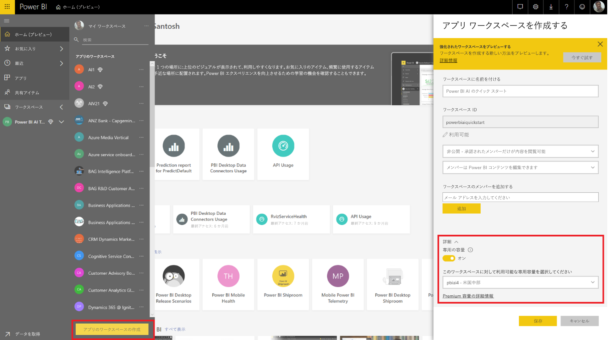

ワークスペースが作成されたら、ようこそ画面の右下で **[スキップ]** を選択できます。

**[データフロー (プレビュー)]** タブを選択した後、ワークスペースの右上にある **[作成]** ボタンを選択し、 **[データフロー]** を選択します。

**[新しいエンティティを追加]** を選択すると、ブラウザーで **Power Query エディター**が起動します。

データ ソースとして **[Text/CSV] ファイル**を選択します。

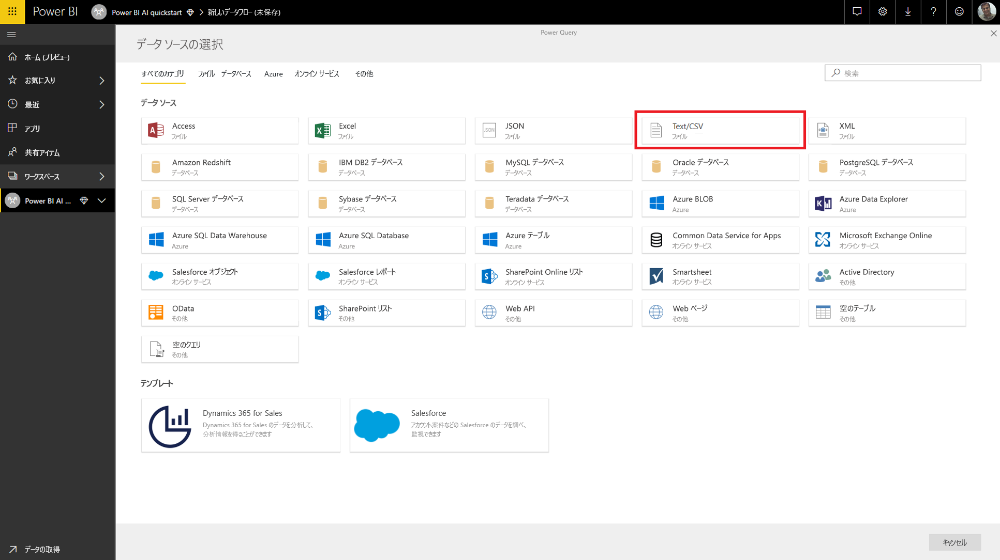

次の画面で、データ ソースに接続するように求められます。 Azure ML モデルの作成に使用したデータへのリンクを貼り付けます。 "_自動車価格_" データを使用した場合は、次のリンクを **[File path or URL]\(ファイル パスまたは URL\)** ボックスに貼り付けて、 **[次へ]** を選択します。

`https://raw.githubusercontent.com/MicrosoftLearning/Principles-of-Machine-Learning-Python/master/Module7/Automobile%20price%20data%20_Raw_.csv`

Power Query エディターに、CSV ファイル内のデータのプレビューが表示されます。 コマンドのリボンから **[テーブルの変換]** を選択し、 **[先頭の行を見出しとして使用]** を選択します。  これにより、 _[昇格されたヘッダー数]_ クエリのステップが、右側の **[適用したステップ]** ウィンドウに追加されます。 右側のウィンドウを使用して、クエリ名を "_自動車価格_" などのわかりやすい名前に変更することもできます。

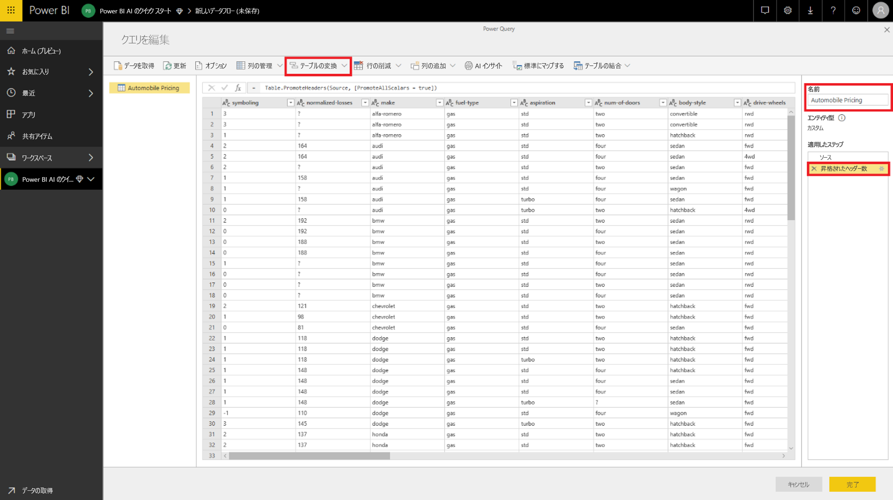

この例のソース データセットには、'?' に設定された不明な値があります。  これをクリーンアップし、後からエラーが発生しないようにするには、'?' を扱いやすい '0' に置き換えます。  これを行うには、 *[normalized-losses]* 、 *[bore]* 、 *[stroke]* 、 *[compression-ratio]* 、 *[horsepower]* 、 *[peak-rpm]* 、および *[price]* の各列をヘッダーで名前をクリックして選択した後、[列の変換] をクリックし、[値の置換] を選択します。  '?' を ' 0' に置換します。

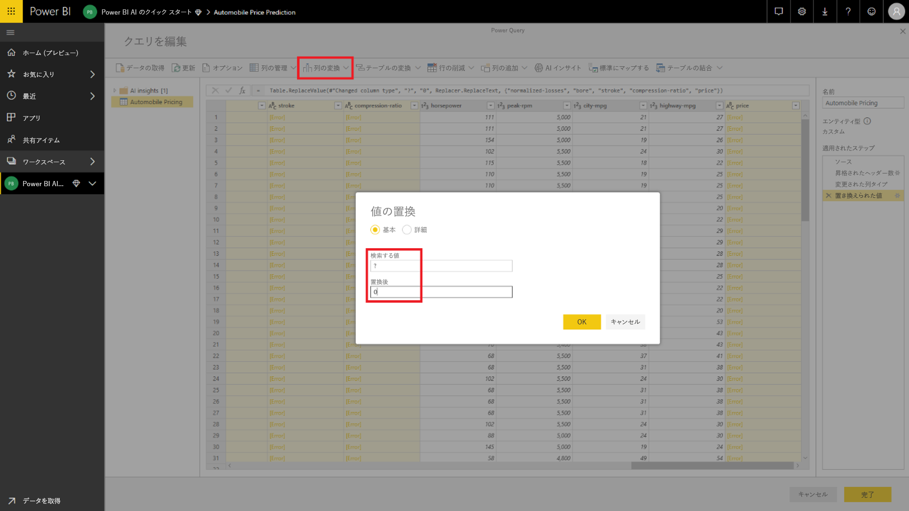

Text/CSV ソースのテーブル内の列は、すべてテキスト列として扱われます。  次は、数値の列を適切なデータ型に変更する必要があります。  これを行うには、Power Query 内で、列ヘッダーのデータ型のシンボルをクリックします。  各列を次の型に変更します。

- **整数**:  symboling、normalized-losses、curb-weight、engine-size、horsepower、peak-rpm、city-mpg、highway-mpg、price
- **10 進数**:  wheel-base、length、width、height、bore、stroke、compression-ratio

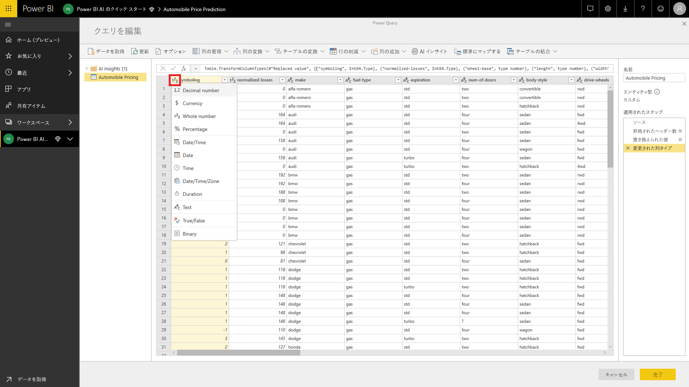

**[完了]** を選択して Power Query エディターを閉じます。 これで、追加した "_自動車価格_" データとエンティティの一覧が表示されます。 右上隅で **[保存]** を選択し、データフローの名前を指定したら、 **[保存]** を選択します。

### データフローを更新する

データフローを保存すると、データフローが保存されたことを示す通知が表示されます。 **[今すぐ更新]** を選択し、ソースからデータフローにデータを取り込みます。

右上隅にある **[閉じる]** を選択し、データフローの更新が完了するまで待ちます。

**[アクション]** のコマンドを使ってデータフローを更新することもできます。 データフローに、更新が完了したときのタイムスタンプが表示されます。

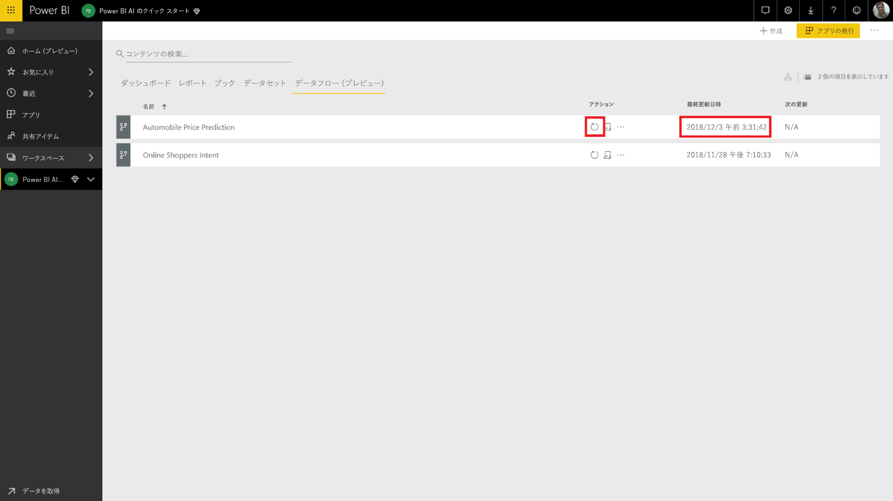

## Azure ML モデルから得られた分析情報を適用する

"_自動車価格の予測_" の Azure ML モデルにアクセスするために、予測価格を追加する "_自動車価格_" エンティティを編集することができます。

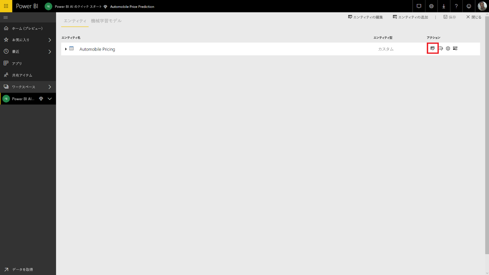

**[編集]** アイコンを選択すると、データフロー内のエンティティが Power Query エディターで開きます。

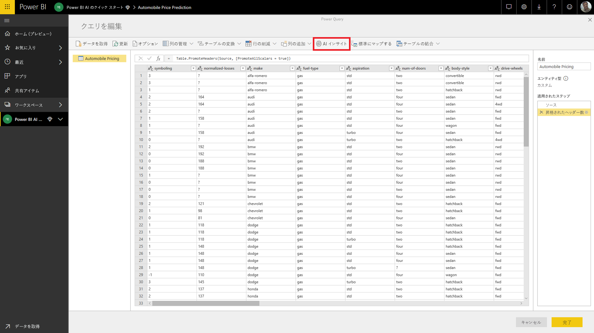

リボン内で **[AI 分析情報]** ボタンを選択した後、ナビ ペインのメニューから "_Azure Machine Learning Models_" フォルダーを選択します。

自分がアクセス権を持っている Azure ML モデルが、プレフィックス *AzureML* の付いた Power Query 関数として一覧表示されます。  _AutomobilePricePrediction_ モデルに対応する関数をクリックすると、モデルの Web サービスのパラメーターが関数のパラメーターとして一覧表示されます。

Azure ML モデルを呼び出すには、選択したエンティティのいずれかの列を、ドロップダウン リストからの入力として指定します。 入力ダイアログの左側にある列アイコンを切り替えることにより、入力として使用する定数値を指定することもできます。 列名が関数のパラメーター名のいずれかと一致すると、その列が自動的に入力として提案されます。  列名が一致しない場合は、ドロップダウン リストから選択できます。

"_自動車価格の予測_" モデルの場合、入力パラメーターは次のようになります。

- make
- body-style
- wheel-base
- engine-size
- horsepower
- peak-rpm
- highway-mpg

この例のテーブルはモデルのトレーニングに使用される元のデータセットと一致しているため、すべてのパラメーターに対して既に適切な列が選択されています。

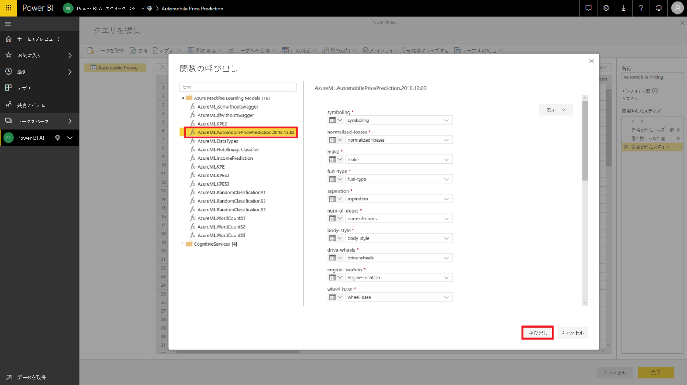

**[呼び出し]** を選択すると、Azure ML モデルの出力のプレビューが、エンティティ テーブルの新しい列として表示されます。 また、モデルの呼び出しが、クエリに適用されたステップとして表示されます。

モデルの出力は、出力列内のレコードとして表示されます。 列を展開すると、個々の出力パラメーターを別々の列内に生成できます。 この例では、自動車の予測価格を含む "_Scored Labels_" だけが必要です。  そのため、それ以外の選択を解除して **[OK]** を選択します。

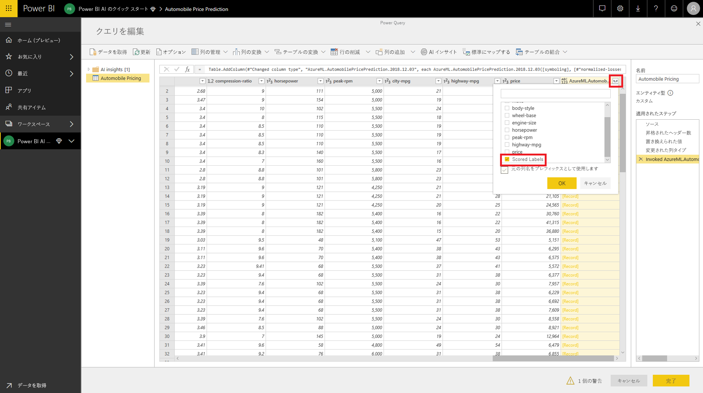

結果の "*Scored Labels*" 列には、Azure ML モデルからの予測価格が含まれます。

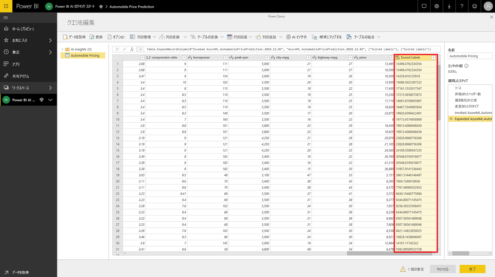

データフローを保存すると、エンティティ テーブルの行の追加や更新によりデータフローが更新されると、Azure ML モデルが自動的に呼び出されます。

## リソースをクリーンアップする

この記事を使用して作成した Azure リソースが不要である場合は、料金が発生しないように削除してください。  作成したデータフローも、今後使用しない場合は削除して構いません。

## 次の手順

このチュートリアルでは、Azure Machine Learning Studio (クラシック) で次の手順を行い、単純なデータセットを使って簡単な実験を作成しました。

- Azure Machine Learning モデルを作成して発行する
- モデルを使用するためのアクセス権を Power BI ユーザーに付与する
- データフローを作成する
- Azure ML モデルから得られた分析情報をデータフローに適用する

Power BI と Azure Machine Learning の統合について詳しくは、「[Azure Machine Learning integration in Power BI (Preview) (Power BI と Azure Machine Learning の統合 (プレビュー))](../transform-model/service-machine-learning-integration.md)」をご覧ください。