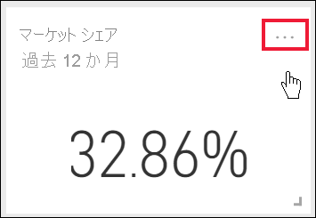
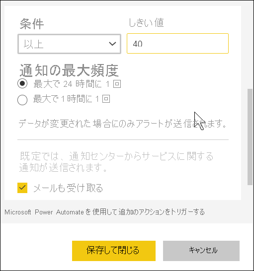
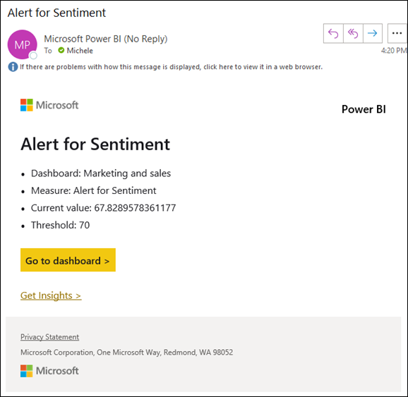
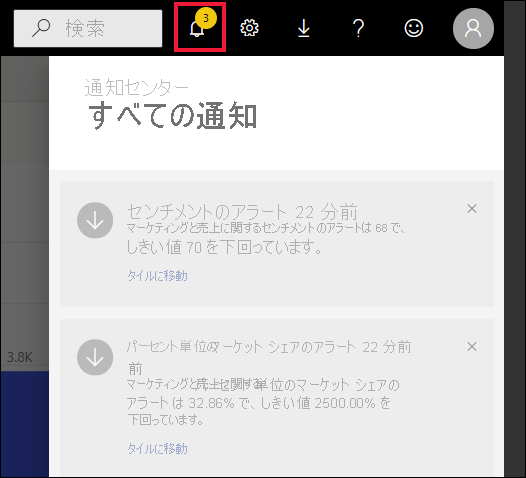
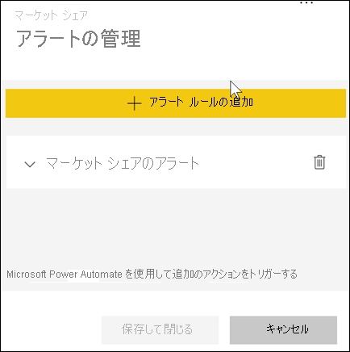

# チュートリアル:Power BI ダッシュボードでアラートを設定する

[!INCLUDE[consumer-appliesto-yynn](../includes/consumer-appliesto-yynn.md)]

[!INCLUDE [power-bi-service-new-look-include](../includes/power-bi-service-new-look-include.md)]

設定した制限を上回って、または下回ってダッシュボードのデータが変化したときにユーザーに通知するように、Power BI サービスでアラートを設定します。 アラートは、レポートのビジュアルからピン留めされたタイルでのみ、ゲージ、KPI、カードに対してだけ設定できます。 

アラートは次のダッシュボード上で作成できます。
- 作成し、**マイ ワークスペース**に保存したダッシュボード。
- [Premium 容量](end-user-license.md)で共有しているダッシュボード。 
- Power BI Pro ライセンスを持っている場合、アクセスできる任意のワークスペースにあるダッシュボード。    

アラートは更新されたデータでのみ動作します。 データが更新されると、Power BI はそのデータにアラートが設定されているかどうかを確認します。 データがアラートのしきい値に達した場合、アラートがトリガーされます。 

この機能は進化し続けているため、[次の「ヒントとトラブルシューティング」セクション](#tips-and-troubleshooting)を参照してください。

ダッシュボードを共有している場合であっても、見ることができるのは自分で設定したアラートだけです。 データ アラートはプラットフォーム間で完全に同期されます。[Power BI モバイル アプリ](mobile/mobile-set-data-alerts-in-the-mobile-apps.md)および Power BI サービスで、データ アラートを設定して表示できます。 

> [!WARNING]
> これらのアラートは、データに関する情報を提供します。 モバイル デバイスで Power BI データを参照していて、そのデバイスが盗まれた場合、Power BI サービスを使用してすべてのアラートをオフにすることをお勧めします。
> 

このチュートリアルでは、以下について説明します。
> [!div class="checklist"]
> * 通知を設定できるユーザー
> * アラートをサポートするビジュアル
> * アラートが表示される対象のユーザー
> * Power BI Desktop およびモバイルでアラートを操作する
> * アラートの作成方法
> * アラートを受信する場所

## 必須コンポーネント

Power BI にサインアップしていない場合は、[無料の試用版にサインアップ](https://app.powerbi.com/signupredirect?pbi_source=web)してください。

1. この例では、営業とマーケティングのサンプルのダッシュボード カード タイルを使用しています。 Power BI service (app.powerbi.com) を開き、サインインし、 **[マイ ワークスペース]** を開きます。    
    

2. 左下隅にある **[データの取得]** を選びます。

    ![[データを取得] を選択](media//end-user-alerts/power-bi-get-data.png)

3. 表示された [データを取得] ページで、 **[サンプル]** を選択します。

4. [売上およびマーケティングのサンプル] を選択し、 **[接続]** を選択します。

    

5. Power BI がサンプルに接続されたら、表示されたダイアログから **[ダッシュボードに移動]** を選択します。     
    

## ダッシュボード タイルにアラートを追加する

1. ダッシュボードのゲージ、KPI、またはカード タイルで、省略記号を選びます。
   
   

2. アラートのアイコン 、または **[アラートの管理]** を選択して、 **[マーケット シェア]** カードに 1 つまたは複数のアラートを追加します。

   

   
1. **[アラートの管理]** ウィンドウで、 **[+ アラート ルールの追加]** を選択します。  スライダーが **[オン]** に設定されていることを確認し、アラートのタイトルを指定します。 タイトルは、アラートの内容を簡単に理解するために役立ちます。
   
   ![[アラート ルールの追加] ウィンドウ](media/end-user-alerts/power-bi-alert-manage.png)
4. 下にスクロールして、アラートの詳細を入力します。  この例では、市場シェアが 40 以上になった場合に 1 日に 1 回通知するアラートを作成します。 アラートは[通知センター](end-user-notification-center.md)に表示されます。 電子メールの送信も設定します。
   
   

5. **[保存して閉じる]** を選びます。
 

   > 

## アラートの受信
追跡対象データがユーザー設定のしきい値のいずれかに達した場合は、いくつかの処理が行われます。 最初に、最後のアラートが送信されてから 1 時間以上または 24 時間以上 (選択したオプションによって異なる) 経過しているかどうかが確認されます。 データがしきい値を超えている場合に限り、アラートを受け取ります。

次に、Power BI によりアラートが通知センターに送信され、さらにオプションで電子メールでもアラートが送信されます。 各アラートにはデータへの直接リンクが含まれています。 リンクを選択して、関連するタイルを表示します。  

1. 電子メールを送信するようにアラートを設定した場合は、次のようなメールを受信します。 これは、 **[センチメント]** カードに設定したアラートです。
   
   
2. Power BI からは**通知センター**にメッセージも追加されます。
   
   
3. アラートの詳細を見るには通知センターを開きます。
   
    
   
  

## アラートの管理

アラートを管理するには多くの方法があります。ダッシュボードのタイル自体、Power BI の [設定] メニュー、[iPhone の Power BI モバイル アプリ](mobile/mobile-set-data-alerts-in-the-mobile-apps.md)または [Windows 10 用の Power BI モバイル アプリ](mobile/mobile-set-data-alerts-in-the-mobile-apps.md)の個別のタイルなどで管理できます。

### タイル自体から

1. タイルのアラートを変更または削除する必要がある場合は、アラートのアイコン  を選択して **[アラートの管理]** ウィンドウを再び開きます。 そのタイルに設定されているすべてのアラートが表示されます。
   
    .
2. アラートを変更するには、アラート名の左側にある矢印を選択します。
   
    .
3. アラートを削除するには、アラート名の右側にあるごみ箱を選択します。
   
      

### Power BI の [設定] メニューから

1. Power BI のメニュー バーで歯車アイコンを選択します。
   
    .
2. **[設定]** の **[アラート]** を選択します。
   
    ![[設定] ウィンドウの [アラート] タブ](media/end-user-alerts/power-bi-settings.png)
3. ここからは、アラートをオンまたはオフにしたり、 **[アラートの管理]** ウィンドウを開いて変更を行ったり、アラートを削除したりできます。

## ヒントとトラブルシューティング 

* ゲージ、KPI、またはカードに対してアラートを設定できない場合、Power BI 管理者または IT ヘルプ デスクに問い合わせてください。 ダッシュボードまたは特定の種類のダッシュボード タイルでは、アラートがオフになっているか、使用できないことがあります。
* アラートは更新されたデータでのみ動作します。 静的データでは動作しません。 Microsoft が提供する多くのサンプルは、静的なものです。 
* 共有コンテンツを受け取ったり、表示したりするには、Power BI Pro または Premium ライセンスが必要です。 詳細については、[お使いのライセンスの種類](end-user-license.md)に関するページを参照してください。
* アラートは、レポートからダッシュボードにピン留めされたストリーミング データセットから作成されたビジュアルに対して設定できます。 **[タイルの追加]**  >  **[カスタム ストリーミング データ]** を使用して、ダッシュボード上に直接作成されたストリーミング タイルにアラートを設定することはできません。

## リソースをクリーンアップする
アラートを削除する手順については、上記で説明しています。 手短に言えば、Power BI のメニュー バーで歯車アイコンを選択します。 **[設定]** で **[アラート]** を選択し、アラートを削除します。

> [!div class="nextstepaction"]
> [モバイル デバイスでデータ アラートを設定する](mobile/mobile-set-data-alerts-in-the-mobile-apps.md)

