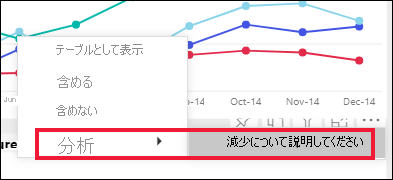

# 分析機能を使用してレポート視覚化の変動を解釈する (プレビュー)

[!INCLUDE[consumer-appliesto-ynnn](../includes/consumer-appliesto-ynnn.md)]

レポートの視覚化では、値の大幅な増加や急激な減少を確認し、そのような変動の原因を特定したいことがよくあります。 **Power BI サービス**の **[分析]** を使用すると、数回クリックするだけで原因がわかります。

たとえば、*Month* (月) と *Manufacturer* (製造元) 別に *Total units* (合計ユニット) が表示される次の視覚化について考えてみましょう。 VanArsdel は競合他社を上回っていますが、2014 年 6 月に大幅な落ち込みを見せています。 このような場合、発生した変化について説明する目的でデータをいろいろ調べることができます。 

視覚化の増加、減少、または異常な分布について説明するように Power BI サービスに尋ねて、データについて高速で自動化され、洞察に満ちた分析を得ることができます。 その場合、ユーザーはただデータ ポイントを右クリックし、 **[分析]、[減少について説明してください]** (前の棒が低い場合は [増加について説明してください]) の順に選択するか、 **[分析] を選択し、分布が異なる部分を [検索]** します。これにより、使いやすいウィンドウで洞察が得られます。

分析機能はコンテキストに依存し、前の棒や列など、直前のデータ ポイントに基づきます。

> [!NOTE]
> この機能はプレビュー段階であり、変更される可能性があります。 分析情報機能は既定で有効になっています (有効にするために [プレビュー] ボックスをオンにする必要はありません)。

### 選択されている要因とカテゴリ

Power BI では、さまざまな列が調査された後、相対的な貢献度の最大の変化を示す列が選択され、表示されます。 出力された縦棒ごとに、貢献度変化が最も大きい値に吹き出しで説明が付きます。 また、実際の増減が最も大きい値にも吹き出しが付きます。

Power BI によって生成されたすべての分析情報を表示するには、スクロールバーを使用します。 順序は、最も重要な要因が最初に表示されるように順位付けされています。 

## インサイトの使用
分析情報を使用して視覚化に見られる傾向を解釈するには、横棒または折れ線グラフのデータ ポイントを右クリックして、 **[分析]** を選択します。 次に、表示されるオプションから **[増加について説明してください]** 、 **[減少について説明してください]** 、または **[explain the difference]\(違いについて説明してください\)** を選択します。

これで、Power BI によってデータに対して機械学習アルゴリズムが実行され、増減または違いに最も影響したカテゴリを示す説明と視覚化がウィンドウに取り込まれます。  この例で最初の分析情報はウォーターフォール図です。

ウォーターフォール ビジュアルの下部にある小さいアイコンを選択すると、インサイトで散布グラフ、積み上げ縦棒グラフ、またはリボン グラフのいずれかを表示できます。

視覚化と機能に関するフィードバックを送るには、ページの上部にある*上向き親指*と*下向き親指*のアイコンを使用します。  

分析情報は、レポートが読み取りまたは編集ビューの場合に使用でき、データの分析と、レポートに簡単に追加できる視覚化の作成の両方で使用できます。 編集ビューでレポートを開いている場合は、親指アイコンの横にプラス アイコンが表示されます。 プラス アイコンを選択すると、新しい視覚化としてレポートに分析情報を追加できます。 

## 返される結果の詳細

分析情報によって返される詳細の意図は、2 つの期間の間に発生した変化を理解する目的でその間の違いを強調表示することです。  

このアルゴリズムは、モデル内の他の縦棒をすべて受け取り、*前*の期間と*後*の期間に対して縦棒ごとの内訳を計算し、その内訳の中でどのくらいの変化が発生したか判断し、変化が最も大きな縦棒を返すものと考えることができます。 たとえば、上記のウォーターフォール分析情報では *State* (州) が選択されており、ルイジアナ州、テキサス州、およびコロラド州の貢献度は 6 月から 7 月までに減少率が 13% から 19% になり、*Total units* (合計ユニット) の減少に最も影響がありました。  

返された分析情報ごとに 4 つの視覚化を表示できます。 そのうち 3 つのビジュアルは、2 つの期間の間の貢献度変化を強調表示することです。 たとえば、*第 2 四半期*から*第 3 四半期*にかけての増加を説明します。 リボン グラフには、選択したデータ ポイントの前後の変化が表示されます。

### 散布図

散布図視覚化では、縦棒の各値に対して (ここでは *State* (州))、第 1 期間の指標値 (X 軸) と第 2 期間の指標値 (Y 軸) が比較表示されます。 データ ポイントは、増加した場合は緑の領域に、減少した場合は赤の領域に配置されます。 

点線は最良適合を示すものであり、この線よりも上にあるデータ ポイントは全体的な傾向よりも増加し、下にあるデータ ポイントは減少しています。  

どちらの期間でも値が空白だったデータ項目は、散布図には表示されないことに注意してください。

### 100% 積み上げ縦棒グラフ

100% 積み上げ縦棒グラフには、選択したデータ ポイントと以前のものとの合計 (100%) への貢献度の値が視覚的に示されます。 これにより、各データ ポイントの貢献度を並べて比較できます。 この例では、選択したテキサス州の値に対する実際の貢献度がヒントに表示されます。 状態の一覧は長いため、ツールヒントを使用すると詳細の確認に役立ちます。 ツールヒントを使用すると、テキサス州の合計ユニットに対する貢献度はほぼ同じ割合 (31% と 32%) ですが、実際の合計ユニット数は 89 から 71 に減少したことがわかります。 Y 軸は合計ではなくパーセンテージであり、各列の帯は値ではなくパーセンテージであることに注意してください。 

### リボン グラフ

リボン グラフのビジュアルには、前後の指標値が表示されます。 これは、要因の "*順序*" が変わったとき (たとえば、*LA* (ルイジアナ州) が 2 位の要因から 11 位に落ちたとき) の貢献度の変化を示す場合に特に役立ちます。  また、*TX* (テキサス州) は上部の幅の広いリボンで表されています。これが前後で最も重要な要因であることを示していますが、低下は、選択した期間中とその後の両方で貢献度の値が低下したことを示しています。

### ウォーターフォール グラフ

4 番目のビジュアルはウォーターフォール図です。期間の間の増減を実際値で示します。 このビジュアルには、2014 年 6 月の減少の大きな要因 (この例では **State** (州)) の 1 つが明確に示されています。 そして、**State** (州) の合計ユニットへの影響で注目する点は、ルイジアナ州、テキサス州、コロラド州の減少が最も重要な役割を果たしたことです。      

 

## 考慮事項と制限事項
以上の分析情報は前のデータ ポイントからの変化に基づくため、ビジュアルで最初のデータ ポイントを選択した時点では利用できません。 

**分析**は、すべてのビジュアルの種類に使用できるわけではありません。 

現在のところ、**分析で増減や違いを説明**できないシナリオには次のようなものがあります。

* 上位 N フィルター
* 含める/除外するフィルター
* メジャー フィルター
* 数値以外のメジャー
* "値の表示方法" の使用
* フィルターが適用された指標 - フィルターが適用された指標とは、特定のフィルター ("*フランスの売上合計*" など) が適用されたビジュアル レベルの計算結果であり、分析情報機能によって作成された一部のビジュアルで使用されます。
* X 軸のカテゴリ列 (スカラーである列で並べ替えが定義されている場合を除く)。 階層を使用する場合は、アクティブな階層内のすべての列がこの条件と一致する必要があります。

## 次の手順
[ウォーターフォール図](../visuals/power-bi-visualization-waterfall-charts.md)    
[散布図](../visuals/power-bi-visualization-scatter.md)
[縦棒グラフ](../visuals/power-bi-report-visualizations.md)
[リボン グラフ](../visuals/desktop-ribbon-charts.md)
