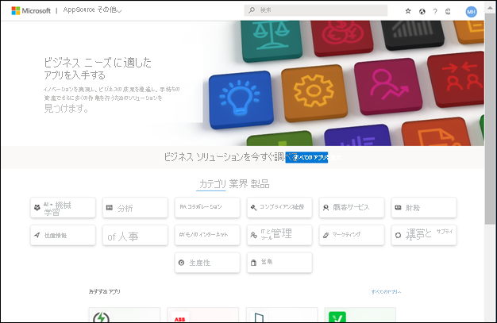
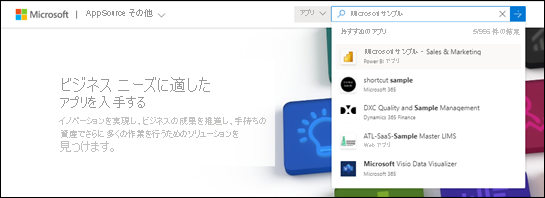
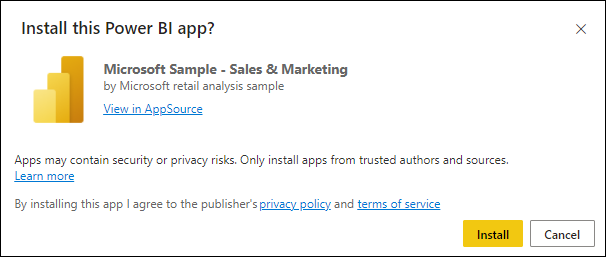

# サンプルの Sales & Marketing アプリをインストールして Power BI サービスで使用する

[!INCLUDE[consumer-appliesto-yyny](../includes/consumer-appliesto-yyny.md)]

[Power BI コンテンツを取得する方法の基本について理解](end-user-app-view.md)したので、Microsoft AppSource を使用して Sales & Marketing テンプレート アプリを取得してみましょう。 Sales & Marketing テンプレート アプリには、Power BI サービスを調べるために使用できるサンプル データが含まれています。 この特定のアプリには、1 つのダッシュボードと複数のレポート ページがあります。 

> [!IMPORTANT]
> Microsoft AppSource からこのアプリをインストールするには、**Power BI Pro** ライセンスを持っている必要があります。  詳細については、[ライセンス](end-user-license.md)に関するページを参照してください。

## Microsoft AppSource からアプリを取得する

1. [https://appsource.microsoft.com](https://appsource.microsoft.com) を開きます。

   

1. 検索ボックスに「**Microsoft サンプル**」と入力し、**Microsoft sample - Sales & Marketing** を選択します。 

    

1. 必要に応じて、概要とレビューを読み、イメージを確認します。  次に、 **[今すぐ入手する]** を選択します。

   

1. このアプリをインストールすることを確認します。

   

5. アプリがインストールされると、Power BI サービスに成功のメッセージが表示されます。 **[アプリに移動]** を選択します。 または、 **[アプリ]** キャンバスからアプリ自体を選択します。 デザイナーでアプリを作成した方法に応じて、アプリのダッシュボードまたはアプリのレポートのいずれかが表示されます。

    

7.  このテンプレート アプリは、ダッシュボードで開くように設定されています。 アプリの "*デザイナー*" によって、代わりにレポート ページの 1 つが開くように、アプリが設定されている可能性があります。  

    

## アプリのダッシュボードとレポートを操作する
時間をかけてアプリを構成するダッシュボードとレポートのデータを調べます。 フィルター処理、強調表示、並べ替え、ドリルダウンなど、標準の Power BI の相互作用のすべてにアクセスできます。  ダッシュボードとレポートの違いでまだ少し混乱していますか?  [ダッシュボードに関する記事](end-user-dashboards.md)と[レポートに関する記事](end-user-reports.md)を参照してください。  

## 次の手順
* [アプリの概要に戻る](end-user-apps.md)    
* [Power BI レポートを表示する](end-user-report-open.md)    
* [コンテンツを自分と共有するその他の方法](end-user-shared-with-me.md)
