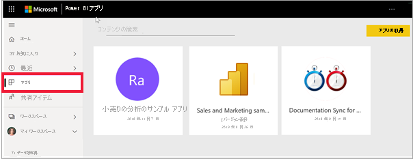

# Power BI のアプリ

[!INCLUDE[consumer-appliesto-ynny](../includes/consumer-appliesto-ynny.md)]

## Power BI とは?
*アプリ* とは、関連するダッシュ ボードとレポートがすべて 1 か所にまとめられた Power BI のコンテンツの種類です。 アプリでは、1 つ以上のダッシュ ボードと 1 つ以上のレポートをすべてまとめることができます。 アプリは、アプリを配布したり仕事仲間と共有する Power BI "*デザイナー*" によって作成されます。 "*デザイナー*" がコンテンツを共有するには、多くの異なる方法があります。 詳細については、以下の「**新しいアプリを取得する**」セクションを参照してください。 

## アプリ "*デザイナー*" とアプリ "*ユーザー*"
自分の役割によっては、自分用または仕事仲間と共有するアプリの作成者 ("*デザイナー*") である場合があります。 または、他のユーザーが作成したアプリを受け取り、ダウンロードするユーザー ("*ビジネス ユーザー*") である場合があります。 この記事は、"*ビジネス ユーザー*" を対象としています。

アプリを表示して開くには、特定のアクセス許可が必要です。 受信者は Power BI Pro または Premium Per User (PPU) のライセンスを持っているか、**Premium 容量** と呼ばれる特別な種類のクラウド ストレージでアプリを受信者と共有する必要があります。 ライセンスと Premium 容量の詳細については、[Power BI サービスのライセンス](end-user-license.md)に関する記事を参照してください。

## アプリの利点
アプリは、"*デザイナー*" にとって、さまざまな種類のコンテンツを一度に共有するための簡単な方法です。 アプリの "*デザイナー*" は、ダッシュボードとレポートを作成し、それらをアプリにまとめます。 その後、"*デザイナー*" は、"*ビジネス ユーザー*" がアクセスできる場所にアプリを共有または発行します。 関連するダッシュボードとレポートはまとめられているため、Power BI サービス ([https://powerbi.com](https://powerbi.com)) とご利用のモバイル デバイスの両方でより簡単に検索してインストールできます。 アプリのインストール後は、さまざまなダッシュボードやレポートの名前を覚えておく必要がありません。ご利用のブラウザー内やモバイル デバイス上で 1 つのアプリにまとめて表示されるためです。

アプリに関しては、アプリの作成者が更新プログラムをリリースするたびに、通知を受け取るか、変更が自動的に表示されます。 作成者はデータの更新頻度も制御するため、最新の状態が維持されているかを気にする必要はありません。 

<!-- add conceptual art -->
## 新しいアプリを取得する
新しいアプリの入手には、さまざまな方法があります。 お客様はアプリを検索し、見つけて、インストールできます。アプリ デザイナーはお客様とアプリを共有できます。 

### Power BI アプリ マーケットプレースでアプリを検索してインストールする
アプリを検索する方法の 1 つは、Power BI **アプリ** の画面から **[アプリの取得]** を選択することです。 

![[アプリの取得] アイコンが表示されているアプリの画面のスクリーンショット](./media/end-user-apps/power-bi-get-apps-button.png)

インストールするアプリが見つかるまで、Power BI Apps Marketplace にあるアプリのリストを参照します。 社内の人だけが使用できる **組織のアプリ** から選択するか、またはすべての Power BI ユーザーがインストールできるように Microsoft およびコミュニティによって発行されている **テンプレート アプリ** を選択します。 

アプリを入手するには、他にもいくつかの方法があります。 以下では一部の方法を示します。 アプリを取得して探索する詳細な手順については、[アプリを開いて操作する方法](end-user-app-view.md)に関するページを参照してください。

* アプリ デザイナーによって、アプリが自分の Power BI アカウントに自動的にインストールされ、次回、Power BI サービスを開いたときに、新しいアプリが **[アプリ]** コンテンツ リストに表示されます。 
* アプリ デザイナーでは、ユーザーにアプリへの直接リンクを送信することができます。 このリンクを選択すると、アプリが Power BI サービスで開きます。
* モバイル デバイスの Power BI では、直接リンクからのみアプリをインストールできます。アプリ マーケットプレースからはインストールできません。 アプリの作成者が自動的にアプリをインストールした場合は、アプリの一覧に表示されます。 

ご使用のアプリは、 **[アプリ]** コンテンツ リストにまとめられます。 アプリを表示するには、 **[アプリ]** を選択します。 アプリの上にマウス カーソルを移動すると、最後に更新された日付と所有者が表示されます。 

## 次の手順
* [アプリを開いて操作する](end-user-app-view.md)
* [コンテンツを共有する他の方法](end-user-shared-with-me.md)

