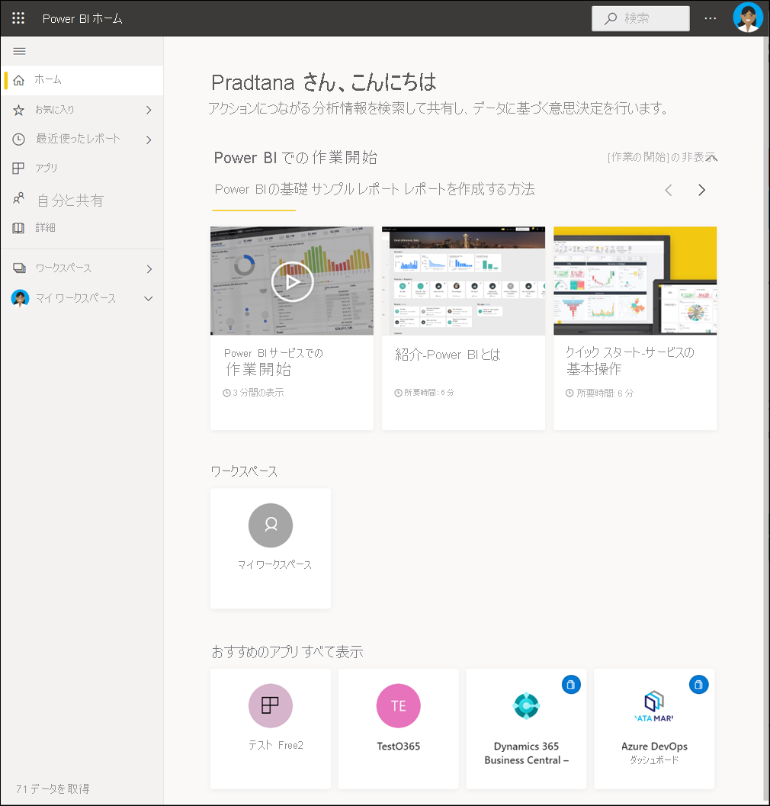
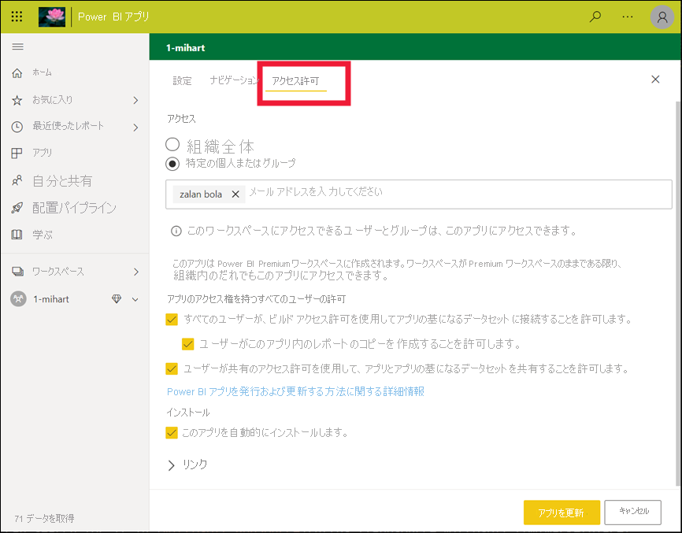
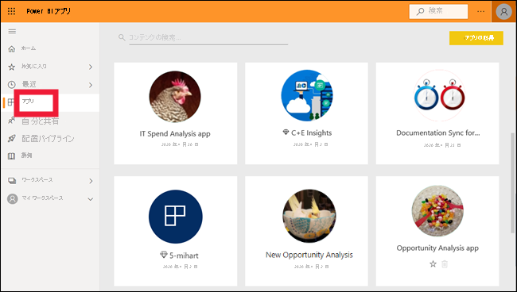

# Power BI サービスのコンシューマーの基本的な概念

[!INCLUDE[consumer-appliesto-ynnm](../includes/consumer-appliesto-ynnm.md)]

[!INCLUDE [power-bi-service-new-look-include](../includes/power-bi-service-new-look-include.md)]

この記事は、[Power BI の概要](../fundamentals/power-bi-overview.md)に関する記事を既に読んでいて、ご自分を [Power BI ビジネス ユーザー](end-user-consumer.md)と認識していることを前提としています。 "*ビジネス ユーザー*" は、ダッシュボード、レポート、アプリなどの Power BI コンテンツを同僚から受け取ります。 "*ビジネス ユーザー*" は、Power BI の Web サイトベース バージョンである Power BI サービス (app.powerbi.com) を使用します。

他のユーザーからコンテンツを受信するには、次のいずれかが必要です。
- Power BI Pro ユーザー ライセンス
- 組織が Power BI Premium のサブスクリプションを持ち、Power BI Premium の容量からコンテンツを共有する必要があります。 [ライセンスとサブスクリプションの種類についてはこちらを参照してください](end-user-license.md)。

"Power BI Desktop" あるいは単に "Desktop" という用語をご存知かと思います。 これは、ダッシュボードおよびレポートをビルドしてお客様と共有する "*デザイナー*" によって使用されるスタンドアロン ツールです。 その他の Power BI ツールが存在することを知っておくことは重要です。 お客様がビジネス ユーザー**である限り、Power BI サービスのみを操作します。 この記事は Power BI サービスにのみ適用されます。

## 用語と概念

この記事は、Power BI の視覚的なツアーでも、実践的なチュートリアルでもありません。 そうではなく、これは Power BI の用語と概念になじんでいただけるようにする概要の記事です。 専門用語や状況を説明します。 Power BI サービスとそのナビゲーションのツアーについては、「[クイック スタート - Power BI サービス内の移動](end-user-experience.md)」にアクセスしてください。

## Power BI サービスを初めて開く

Power BI "*ビジネス ユーザー*" のほとんどは Power BI サービスを入手しています。1) 会社でライセンスを購入し、2) 管理者が従業員にそのライセンスを割り当てているためです。

開始するには、ブラウザーを開いて、「**app.powerbi.com**」と入力します。 初めて Power BI サービスを開くと、次のようなものが表示されます。

Power BI サービスを使用するときに、Web サイトを開くたびに表示する内容をカスタマイズします。 たとえば、Power BI で**ホーム**を開きたい人もいれば、お気に入りのダッシュボードを最初に表示したい人もいます。 ご安心ください。次の 2 つの記事で、エクスペリエンスの個人設定の方法を説明しています。

- [Power BI ホームとグローバル検索の紹介](https://powerbi.microsoft.com/blog/introducing-power-bi-home-and-global-search)

- [Power BI サービスのおすすめのダッシュボード](end-user-featured.md)

しかし、さらに進める前に、話を戻して Power BI サービスを構成する文書パーツについて説明しましょう。

_______________________________________________________

## Power BI コンテンツ

### 文書パーツの概要

Power BI "*ビジネス ユーザー*" の場合、文書パーツは 5 つあります。**_視覚化_**、**_ダッシュボード_**、**_レポート_**、**_アプリ_**、**_データセット_** です。 これらは *Power BI の* **_コンテンツ_** と呼ばれる場合があります。 "*コンテンツ*" は、**_ワークスペース_** 内に存在します。 一般的なワークフローには、これらすべての文書パーツが含まれます。Power BI "*デザイナー*" (以下の図の黄色) は、"*データセット*" からデータを収集し、分析のために Power BI に移動し、関心のある事実や分析情報を強調表示する完全な "*視覚化*" の "*レポート*" を作成し、レポートから "*ダッシュボード*" に視覚化をピン留めし、ご自身のような "*ビジネス ユーザー*" (以下の図の黒色) とレポートやダッシュボードを共有します。 "*デザイナー*" は、ダッシュボード、レポート、またはアプリの形式でそれらを共有します。

最も基本的な要素は次のとおりです。

-  **_視覚化_** (または "*ビジュアル*") は、Power BI の "*デザイナー*" によって作成されたグラグの種類です。 ビジュアルは、"*レポート*" と "*データセット*" からのデータを表示します。 通常、*デザイナー*は Power BI Desktop でビジュアルをビルドします。

    詳しくは、「[レポート、ダッシュボード、アプリでビジュアルを操作する](end-user-visualizations.md)」をご覧ください。

-  "*データセット*" はデータのコンテナーです。 たとえば、世界保健機関の Excel ファイルなどです。 また、お客様の会社が所有しているデータベースであったり、Salesforce ファイルであったりします。 データセットは、"*デザイナー*" によって管理されます。

-  "*ダッシュボード*" は、対話型のビジュアル、テキスト、グラフィックを含む単一の画面です。 ダッシュボードでは、ストーリーを伝えたり、質問に回答したりするために、ご自分の最も重要なメトリックを収集します (1 つの画面上)。 ダッシュボードのコンテンツは、1 つ以上のレポートおよび 1 つ以上のデータセットからのものです。

    詳細については、「[Power BI サービスのビジネス ユーザー向けダッシュボード](end-user-dashboards.md)」を参照してください。

-  "*レポート*" は、単一のレポートをまとめて構成する対話型のビジュアル、テキスト、グラフィックの 1 ページまたは複数のページです。 Power BI は、1 つのデータセットに基づいてレポートを作成します。 多くの場合、"*デザイナー*" が、関心の中心となる領域に対応したり、1 つの質問に答えたりするためにレポート ページを編成します。

    詳しくは、「[Power BI のレポート](end-user-reports.md)」をご覧ください。

-  "*アプリ*" は、関連するダッシュボードとレポートを "*デザイナー*" がまとめて共有する方法です。 "*ビジネス ユーザー*" は一部のアプリを自動的に受け取りますが、仕事仲間やコミュニティによって作成されたその他のアプリを検索することができます。 たとえば、Google Analytics や Microsoft Dynamics CRM など、既にお使いになっているような外部サービス向けのすぐに使用できるアプリがあります。

念のため説明しておくと、ご自分が新規ユーザーであり、Power BI サービスに初めてログインした場合は、共有ダッシュボード、アプリ、またはレポートはまだ表示されない可能性があります。

_______________________________________________________

## データセット

*データセット*は、*デザイナー*がインポートまたは接続して、レポートとダッシュボードをビルドするために使用するデータのコレクションです。 "*ビジネス ユーザー*" として、データセットを直接操作することはありませんが、それらが全体の中でどのように適合するかを知るのは有益です。  

各データセットは、データ の 1 つのソースを表します。 たとえば、ソースとしては、OneDrive 上の Excel ブック、オンプレミスの SQL Server Analysis Services の表形式データセット、Salesforce データセットなどがあります。 Power BI では、多くのさまざまなデータ ソースがサポートされています。

デザイナーからアプリが共有されている場合は、 **[関連コンテンツ]** を開くことで、使用されているデータセットを検索できます。  データセットに何かを追加したり、変更を加えたりすることはできません。 ただし、デザイナーからアクセス許可が与えられている場合は、レポートのダウンロード、[データの分析情報](end-user-insights.md)の検索、さらにはデータセットに基づいた[独自のレポートの作成](../create-reports/service-report-create-new.md)を行うことができます。  

![Power BI ユーザー インターフェイスと、キャンバスの [データセット] セクションを指す矢印のスクリーンショット。](media/end-user-basic-concepts/power-bi-datasets.png)

1 つのデータセットを...

- レポート デザイナーがダッシュボードやレポートを作成するために繰り返し使用できます。

- 多くのさまざまなレポートの作成に使用できます

- その 1 つのデータセットからのビジュアルを、多くのさまざまなダッシュボードで表示できます

  

次の文書パーツ「視覚化」に進みます。

_______________________________________________________

## 視覚化

視覚化 (視覚エフェクトとも呼ばれる) には、Power BI がデータ内で検出した分析情報が表示されます。 視覚化により、分析情報を解釈しやすくなります。脳は数字のスプレッドシートよりも速く画像を理解できるためです。

Power BI で目にする視覚化の一部には、ウォーターフォール、リボン、ツリーマップ、円、じょうご、カード、散布図、ゲージがあります。

   

[Power BI に含まれる視覚エフェクトの完全な一覧](end-user-visual-type.md)に関するページを参照してください。

"*カスタム視覚エフェクト*" と呼ばれる視覚化は、コミュニティから利用できます。 理解できないビジュアルでレポートを受信した場合、カスタム ビジュアルである可能性が高いです。 カスタム ビジュアルの解釈でサポートが必要な場合は、レポートまたはダッシュボードの "*デザイナー*" の名前を参照して、その人にお問い合わせください。 連絡先情報を表示するには、上部のメニュー バーからタイトルを選択します。

レポート内の 1 つの視覚化を...

- 同じレポート内で複数回表示できます

- 多くのさまざまなダッシュボードで表示できます

_______________________________________________________

## Reports

Power BI レポートは、視覚エフェクト、グラフィック、テキストの 1 つ以上のページです。 レポートのすべての視覚エフェクトは 1 つのデータセットから取得されます。 "*デザイナー*" はレポートを作成し、個別に、またはアプリの一部として、他のユーザーと共有します。  通常、"*ビジネス ユーザー*" は ["*読み取りビュー*" でレポートを操作します](end-user-reading-view.md)。

1 つのレポートを...

- 複数のダッシュボードに関連付けることができます (その 1 つのレポートから固定されたタイルが、複数のダッシュボードに表示されることがあります)。

- 1 つのデータセットのみからのデータを使用して作成できます。  

- 複数のアプリの一部にできます。

  

_______________________________________________________

## ダッシュボード

ダッシュボードには、基になるデータセットの一部のサブセットのカスタマイズしたグラフィカルなビューが表示されます。 "*デザイナー*" はダッシュボードをビルドし、個別またはアプリの一部として "*ビジネス ユーザー*" と共有します。 ダッシュボードは、"*タイル*"、グラフィック、テキストを含む 1 つのキャンバスです。

  

タイルは、*デザイナーが、(たとえば、レポートからダッシュボードに) * *ピン留めする*ビジュアルのレンダリングです。 ピン留めされたタイルにはそれぞれ、デザイナーでデータセットから作成されてダッシュボードにピン留めされた[視覚化](end-user-visualizations.md)が表示されます。 また、タイルにはレポート ページ全体を含めることもでき、ライブ ストリーミング データまたはビデオを含めることができます。 "*デザイナー*" がダッシュボードにタイルを追加する方法は多数ありますが、多すぎるためこの概要の記事では紹介できません。 詳しくは、「[Power BI のダッシュボードのタイル](end-user-tiles.md)」をご覧ください。

"*ビジネス ユーザー*" は、ダッシュボードを編集できません。 ただし、コメントの追加、関連するデータの表示、お気に入りとしての設定、受信登録などを行うことができます。

ダッシュボードにはどのような目的がありますか?   以下にいくつかの例を挙げます。

- 意思決定に必要なすべての情報をひとめで確認できるようにするため

- 業務に関する最も重要な情報を監視するため

- すべての同僚が、同じ情報を表示および使用して、同じ考えを持てるようにするため

- ビジネス、製品、事業分野、マーケティング キャンペーンなどの正常性を監視するため

- 大きなダッシュボードの個人ビューを作成して、自分の関心のあるメトリックスをそこに表示するため

**1 つの** ダッシュボードに...

- 多くの異なるデータセットの視覚エフェクトを表示できます。

- 多くの異なるレポートの視覚エフェクトを表示できます。

- 他のツール (Excel など) からピン留めされた視覚エフェクトを表示できます。

  

_______________________________________________________

## アプリ

これらのダッシュボードとレポートのコレクションは、関連するコンテンツが 1 つのパッケージにまとめて整理されます。 Power BI の "*デザイナー*" は、ワークスペースにそれらを作成し、個人、グループ、組織全体、または一般のユーザーとアプリを共有します。 "*ビジネス ユーザー*" として、お客様と仕事仲間が同じ情報 (真実の 1 つの信頼されたバージョン) を操作することに自信を持つことができます。

場合によっては、アプリのワークスペース自体が共有され、多数のユーザーが共同作業してワークスペースとアプリの両方を更新することがあります。 アプリで実行できることの範囲は、付与されたアクセス許可とアクセス権によって決まります。

> [!NOTE]
> アプリを使用するには、Power BI Pro ライセンスが必要です。またはアプリのワークスペースを Premium 容量に格納する必要があります。 [ライセンスについてはこちらをご覧ください](end-user-license.md)。

アプリは [Power BI サービス](https://powerbi.com)とご利用のモバイル デバイスで簡単に検索してインストールすることができます。 アプリをインストールした後は、多数の異なるダッシュ ボードとレポートの名前を覚える必要はありません。 それらは、ブラウザー内やモバイル デバイス上で 1 つのアプリにまとめられます。

このアプリには、1 つのアプリを構成する 2 つのダッシュボードと 2 つのレポートがあります。 レポート名の右側にある矢印を選択すると、そのレポートを構成するページの一覧が表示されます。

アプリが更新されるたびに、変更が自動的に表示されます。 また、デザイナーは、Power BI でデータを最新の情報に更新する頻度のスケジュールも制御します。 最新の状態に保つことについて心配する必要はありません。

さまざまな方法でアプリを入手できます。

- アプリ デザイナーは、Power BI アカウントでアプリを自動的にインストールできます。

- アプリ デザイナーは、ユーザーにアプリの直接リンクを送信できます。

- Power BI サービス内からは、組織またはコミュニティから使用が許可されているアプリを検索できます。 [Microsoft AppSource](https://appsource.microsoft.com/marketplace/apps?product=power-bi) にアクセスして、使用できるすべてのアプリを確認することもできます。

ご利用のモバイル デバイスの Power BI では、直接リンクからのみアプリをインストールできます。AppSource からはインストールできません。 アプリのデザイナーが自動的にアプリをインストールした場合は、アプリの一覧に表示されます。

アプリをインストールしたら、ご自分のアプリの一覧からそれを選択し、最初に開いて参照するダッシュボードまたはレポートを選択するだけです。

この記事で、ビジネス ユーザー向けの Power BI サービスを構成する文書パーツをご理解いただければ幸いです。

## 次の手順

- [用語](end-user-glossary.md)を確認してブックマークする

- [Power BI サービスのツアー](end-user-experience.md)を開始する

- [ビジネス ユーザー専用に作成された Power BI の概要](end-user-consumer.md)を確認する

- ビデオを見る。このビデオでは、Will が Power BI サービスの基本的な概念と概要について説明しています

    <iframe width="560" height="315" src="https://www.youtube.com/embed/B2vd4MQrz4M" frameborder="0" allowfullscreen></iframe>
