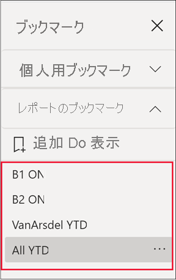
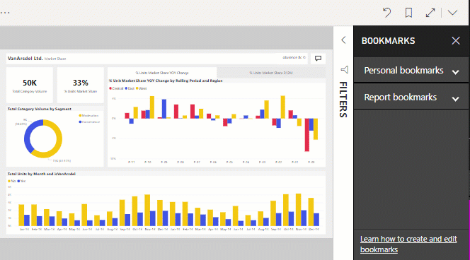

# ブックマークとは?

[!INCLUDE[consumer-appliesto-ynnm](../includes/consumer-appliesto-ynnm.md)]

[!INCLUDE [power-bi-service-new-look-include](../includes/power-bi-service-new-look-include.md)]

ブックマークは、フィルター、スライサー、ビジュアルの状態など、レポート ページで現在構成されているビューをキャプチャします。 ブックマークを選択すると、Power BI はそのビューに戻ります。 ブックマークには、自分で作成したものとレポート *デザイナー* が作成したものの 2 種類があります。 Power BI ユーザーであれば、誰でも個人用のブックマークを作成できます。 しかしながら、他のユーザーが作成したブックマークを使用するには、Power BI Pro または Premium ライセンスが必要です。 [お使いのライセンスの種類について](end-user-license.md)

## Power BI でブックマークを使用して詳細情報を共有し、ストーリーを作成する 
ブックマークには多くの用途があります。 たとえば、興味深い分析情報を見つけたとき、それを保存したいと思ったら、ブックマークを作成すると後で戻ることができます。 帰宅するとき、現在の作業を保存したければブックマークを作成します。 ブックマークをレポートの既定のビューにすることもできます。そうすれば、戻るたびに、レポート ページのそのビューが最初に開きます。 

また、ブックマークのコレクションを作成して適切な順序に並べ替えた後、プレゼンテーションで各ブックマークを順番に表示することで、一連の分析情報を強調し、ストーリーを伝えることができます。  

## ブックマークを開く
[ブックマーク] ウィンドウを開くには、メニューバーから **[ブックマーク]**  >  **[ブックマークをさらに表示]** を選択します。 

![[ブックマーク] ペインが開いているレポート キャンバスのスクリーンショット。](media/end-user-bookmarks/power-bi-show-bookmarks.png)

レポートの元の発行されたビューに戻すには、 **[リセット]** アイコンを選択します。

### レポートのブックマーク
レポート *デザイナー* にレポート ブックマークが含まれていた場合、 **[レポート ブックマーク]** という見出しの下で見つかります。 このレポート ページには、次の 4 つのブックマークがあります: B1、B2、VanArsdel YTD、All YTD。 現在は **All YTD** が選択されています。

> [!NOTE]
> 共有レポートを表示するには、Power BI Pro または Premium が必要です。 

ブックマークを選択すると、そのレポート ビューに変わります。 

### 個人用ブックマーク

レポートを表示できる場合は、個人用ブックマークを追加することもできます。  ブックマークを作成すると、次の要素がブックマークと共に保存されます。

* 現在のページ
* フィルター
* スライサー、スライサーの種類 (たとえば、ドロップダウンまたはリスト) とスライサーの状態を含みます
* ビジュアルの選択状態 (クロス強調表示フィルターなど)
* 並べ替え順序
* ドリルの場所
* 表示 ( **[選択]** ウィンドウで指定されたオブジェクトの表示)
* 表示されているオブジェクトのフォーカスまたは **Spotlight** モード

ブックマークで表示させたいようにレポート ページを構成します。 次の点に注意してください。

1. **[フィルター]** ペインで、既存の日付フィルターを変更してあります。
1. **[フィルター]** ペインで、既存のリージョン フィルターを変更してあります。
1.  ドーナツ グラフ視覚エフェクトでデータ ポイントを選択して、レポート キャンバスをクロスフィルターおよびクロス強調表示してあります。 

意図したとおりにレポート ページとビジュアルを配置できたら、 **[ブックマーク]** ウィンドウの **[追加]** を選んでブックマークを追加します。 

**Power BI** によって個人用ブックマークが作成され、汎用的な名前か、ユーザーが入力した名前が付けられます。 ブックマークの名前の横にある省略記号を選択し、表示されたメニューからアクションを選択することで、ブックマークを *名前変更*、*削除*、*更新* できます。

ブックマークを作成した後は、 **[ブックマーク]** ペインでブックマークを選択するだけで表示されます。 

<!--
## Arranging bookmarks
As you create bookmarks, you might find that the order in which you create them isn't necessarily the same order you'd like to present them to your audience. No problem, you can easily rearrange the order of bookmarks.

In the **Bookmarks** pane, simply drag-and-drop bookmarks to change their order, as shown in the following image. The yellow bar between bookmarks designates where the dragged bookmark will be placed.

The order of your bookmarks can become important when you use the **View** feature of bookmarks, as described in the next section. 

-->

## スライド ショーとしてのブックマーク
ブックマークを順番にプレゼンテーション (表示) するには、 **[ブックマーク]** ウィンドウから **[表示]** を選択し、スライドショーを開始します。

**表示** モードのときに注意する機能がいくつかあります。

- ブックマークの名前は、キャンバスの下部にあるブックマークのタイトル バーに表示されます。
- ブックマークのタイトル バーにある矢印を使って、次または前のブックマークに移動できます。
- **表示** モードを終了するには、 **[ブックマーク]** ウィンドウの **[終了]** を選ぶか、ブックマークのタイトル バーにある **[X]** を選びます。

**表示** モードのときは、 **[ブックマーク]** ウィンドウの [X] をクリックしてウィンドウを閉じ、プレゼンテーション用のスペースを大きくすることができます。 また、**表示** モードでは、すべてのビジュアルは対話形式になり、他の場合の対話操作と同様に、クロス強調表示に使うことができます。 

<!--
## Visibility - using the Selection pane
With the release of bookmarks, the new **Selection** pane is also introduced. The **Selection** pane provides a list of all objects on the current page and allows you to select the object and specify whether a given object is visible. 

You can select an object using the **Selection** pane. Also, you can toggle whether the object is currently visible by clicking the eye icon to the right of the visual. 

When a bookmark is added, the visible status of each object is also saved based on its setting in the **Selection** pane. 

It's important to note that **slicers** continue to filter a report page, regardless of whether they are visible. As such, you can create many different bookmarks, with different slicer settings, and make a single report page appear very different (and highlight different insights) in various bookmarks.

## Bookmarks for shapes and images
You can also link shapes and images to bookmarks. With this feature, when you click on an object, it will show the bookmark associated with that object. This can be especially useful when working with buttons; you can learn more by reading the article about [using buttons in Power BI](../create-reports/desktop-buttons.md). 

To assign a bookmark to an object, select the object, then expand the **Action** section from the **Format Shape** pane, as shown in the following image.

Once you turn the **Action** slider to **On** you can select whether the object is a back button, a bookmark, or a Q&A command. If you select bookmark, you can then select which of your bookmarks the object is linked to.

There are all sorts of interesting things you can do with object-linked bookmarking. You can create a visual table of contents on your report page, or you can provide different views (such as visual types) of the same information, just by clicking on an object.

When you are in editing mode you can use ctrl+click to follow the link, and when not in edit mode, simply click the object to follow the link. 

## Bookmark groups

Beginning with the August 2018 release of **Power BI Desktop**, you can create and use bookmark groups. A bookmark group is a collection of bookmarks that you specify, which can be shown and organized as a group. 

To create a bookmark group, hold down the CTRL key and select the bookmarks you want to include in the group, then click the ellipses beside any of the selected bookmarks, and select **Group** from the menu that appears.

**Power BI Desktop** automatically names the group *Group 1*. Fortunately, you can just double-click on the name and rename it to whatever you want.

With any bookmark group, clicking on the bookmark group's name only expands or collapses the group of bookmarks, and does not represent a bookmark by itself. 

When using the **View** feature of bookmarks, the following applies:

* If the selected bookmark is in a group when you select **View** from bookmarks, only the bookmarks *in that group* are shown in the viewing session. 

* If the selected bookmark is not in a group, or is on the top level (such as the name of a bookmark group), then all bookmarks for the entire report are played, including bookmarks in any group. 

To ungroup bookmarks, just select any bookmark in a group, click the ellipses, and then select **Ungroup** from the menu that appears. 

Note that selecting **Ungroup** for any bookmark from a group takes all bookmarks out of the group (it deletes the group, but not the bookmarks themselves). So to remove a single bookmark from a group, you need to **Ungroup** any member from that group, which deletes the grouping, then select the members you want in the new group (using CTRL and clicking each bookmark), and select **Group** again. 
-->

## 制限事項と考慮事項
このリリースの **ブックマーク** には、注意すべきいくつかの制限事項と考慮事項があります。

* ほとんどの Power BI ビジュアルは、ブックマークでうまく機能します。 ブックマークと Power BI ビジュアルで問題が発生する場合は、その Power BI ビジュアルの作成者に連絡して、ブックマークのサポートをそのビジュアルに追加するよう依頼してください。
* ブックマークを作成した後でレポート ページにビジュアルを追加した場合、ビジュアルは既定の状態で表示されます。 ブックマークを作成した後でページにスライサーを追加した場合も、スライサーは既定の状態で動作します。
* 一般に、レポート *デザイナー* がレポートを更新したり、再発行したりした場合、ブックマークは影響を受けません。 ただし、ブックマークで使用されているフィールドを削除するなど、デザイナーがレポートに大規模な変更を行った場合、次回、そのブックマークを開こうとしたとき、エラー メッセージが表示されます。 

<!--
## Next steps
spotlight?
-->
