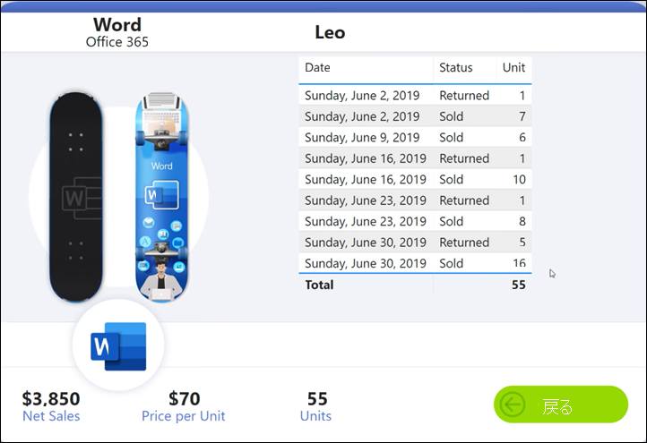
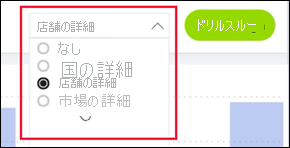

# Power BI サービスのボタン
同僚から受け取ったレポートでボタンに気付き、その使い方を知りたいと思うことがあります。 単語が含まれているものもあれば、矢印やグラフィックスが含まれているものもあります。ドロップダウン メニューまで含まれているものもあります。 この記事では、ボタンを見分け、その使い方を理解する方法について説明します。

## ボタンを見分ける方法
ボタンはレポート ページ上で図形、イメージ、またはアイコンに非常に似ていることがあります。 しかしながら、それを選択 (クリック) してアクションが発生した場合、それはおそらくボタンです。

## ボタンの種類
レポートの作成者は、移動や検索を支援する目的でレポートにボタンを追加します。 ボタンの種類には、戻る、ブックマーク、矢印、Q&A、ヘルプ、空白などがあります。 

### [戻る] ボタン 
[戻る] ボタンには矢印アイコンが含まれることがあります。これを選択すると、Power BI は前のページに戻ります。  [戻る] ボタンはドリルスルーでよく使用されます。 ドリルスルーで使用されている [戻る] ボタンの例を次に示します。

1. ユーザーが横棒グラフの **[Word]** を選択し、**マーケット バスケット分析**までドリルスルーしています。

    ![[ドリルスルー] ボタンのスクリーンショット。](media/end-user-buttons/power-bi-drillthrough.png)

2. **[マーケット バスケット分析]** を選択すると、Power BI で "*マーケット バスケット分析*" レポート ページが開き、移動元ページで行われた選択を利用し、移動先ページに表示される内容がフィルター処理されます。

    ![[戻る] ボタンのスクリーンショット。](media/end-user-buttons/power-bi-back.png)

    これで**マーケット バスケット分析**レポート ページが表示されました。**Word** 用にフィルター処理されています。 前のページに戻るには、[戻る] ボタンを選択して **[Go back]\(戻る\)** をクリックします。 

## [ブックマーク] ボタン
レポートの "*デザイナー*" は、レポートにブックマークを含めることがよくあります。 右上隅から **[ブックマーク]** を選択することでレポート ブックマークの一覧を表示できます。 レポートのデザイン時にブックマーク "*ボタン*" を追加するとき、それは、そのブックマークに関連付けられている特定のレポート ページに移動する代替手段にすぎません。 ページには、ブックマークによってキャプチャされるフィルターや設定が適用されます。 [Power BI のブックマークについて詳しくはこちらをご覧ください](end-user-bookmarks.md)。 

この例では、ボタンにブックマーク アイコンがあり、そのブックマークの名前は *Urban* です。 

![[ブックマーク] ボタンのスクリーンショット](media/end-user-buttons/power-bi-bookmark.png)

[ブックマーク] ボタンを選択すると、Power BI では、そのブックマークに定義されている場所と設定に移動します。  この例では、ブックマークは *Growth Opportunities* レポート ページに付けられており、そのページは **Urban** でクロスフィルター処理されます。

## [ドリルスルー] ボタン
Power BI サービスでは、2 つの方法でドリルスルーできます。 ドリルスルーすると別のレポート ページが表示され、移動先ページのデータは、移動元ページで行われたフィルターと選択に基づいて提示されます。

レポートでドリルスルーする方法の 1 つは、ビジュアル内でデータ ポイントを右クリックし、 **[ドリルスルー]** を選択し、移動先ページを選択します。 この方法は、上記の「 **[戻る] ボタン**」というタイトルのセクションで説明されています。 ただし、レポートをデザインするとき、アクションを目立つようにするために、また、重要な分析情報に注目してもらうために、代わりにドリルスルー "*ボタン*" を使用することがあります。  

[ドリルスルー] ボタンの前提条件は複数になることがあります。 すべての前提条件を満たさない限り、ボタンは機能しません。 例を見てみましょう。

このドリルスルー ボタンでは "*店舗の詳細*" ページに移動します。 ボタンの上にカーソルを置くとヒントが表示され、店舗と製品の両方を選択する必要があることがわかります。 どちらも 1 つ選択しない限り、ボタンは無効のままです。

製品を 1 つ (**Word**)、店舗を 1 つ (**Leo**) 選択したので、ボタンの色が変化し、有効になったことがわかります。

![[店舗の詳細にドリルスルーする] ボタンのスクリーンショット。](media/end-user-buttons/power-bi-select-both.png)

[ドリルスルー] ボタンを選択すると、"*店舗*" レポート ページに移動します。 "*店舗*" ページは、今回選択した **Word** と **Leo** でフィルター処理されます。

[ドリルスルー] ボタンには、移動先を選択するためのドロップダウン メニューを含めることもできます。 移動元レポート ページで選択したら、ドリルスルーの移動先レポート ページを選択します。 下の例では、"*マーケット詳細*" レポート ページにドリルスルーするように選択を変更しています。 

## ページの移動

[ページの移動] ボタンでは、同じレポート内の別のページに移動します。 レポートをデザインするとき、多くの場合、ストーリーを語る目的で、あるいはレポートの分析情報に導く目的でナビゲーション ボタンを作成します。 下の例では、レポートのデザイン時、レポートの最初のページ (最上位の概要ページ) に戻るためのボタンを各レポートに追加しました。 このレポートにはページがたくさんあるため、このページ ナビゲーション ボタンは役立ちます。

![[Team scorecard] という名前のページ ナビゲーション ボタンのスクリーンショット。](media/end-user-buttons/power-bi-nav-button.png)

## [Q&A] ボタン 
[Q&A] ボタンを選択すると、Power BI の Q&A エクスプローラー ウィンドウが開きます。 この Q&A ウィンドウはレポート ページの上に表示され、[X] を選択することで閉じることができます。[Q&A に関する詳細はこちらをご覧ください](end-user-q-and-a.md)。

## Web URL
[Web URL] ボタンでは、新しいブラウザー ウィンドウが開きます。 レポートをデザインするとき、企業 Web サイトまたはヘルプ ページにリンクさせる目的でこの種類のボタンを参照ソースとして追加することがあります。あるいは、別のレポートまたはダッシュボードのリンクとして追加することがあります。 下の例では、[Web URL] ボタンをクリックすると、レポートのソース ファイルをダウンロードできます。 

ページは別ウィンドウで開くため、Power BI レポートに戻るには、そのウィンドウを閉じるか、[Power BI] タブを選択します。

![[Download PBIX] ボタンとダウンロード リンクを含む新しいブラウザーのスクリーンショット](media/end-user-buttons/power-bi-url.png)

## 次の手順
[ブックマーク](end-user-bookmarks.md)    
[ドリル アップ、ドリル ダウン](end-user-drill.md)
