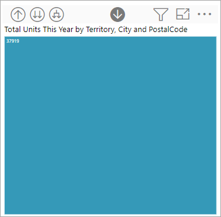

# Power BI でのビジュアルのドリル モード

[!INCLUDE[consumer-appliesto-yyny](../includes/consumer-appliesto-yyny.md)]

この記事では、Microsoft Power BI サービスでビジュアルをドリルダウンする方法について説明します。 データ ポイントでドリルダウンとドリルアップを使用すると、データに関する詳細を深く掘り下げて調べることができます。 

## ドリルには階層が必要

ビジュアルに階層がある場合は、ドリルダウンしてさらに詳細な情報を表示できます。 たとえば、分野、競技、種目で構成された階層でオリンピック メダル数を表示するビジュアルがあるとします。 既定では、ビジュアルには分野 (体操、スキー、水泳など) 別にメダル数が表示されます。 しかし、このビジュアルは階層構造になっているので、いずれかのビジュアル要素 (棒、線、バブルなど) を選ぶと、さらに詳細な図が表示されます。 **水泳** 要素を選ぶと、競泳、飛び込み、水球のデータが表示されます。  **飛び込み** 要素を選ぶと、飛び板飛び込み、高飛び込み、シンクロナイズド ダイビングの各種目に関する詳細が表示されます。

日付は、他とは違う種類の階層です。  多くの場合、レポート "*デザイナー*" は日付階層を視覚化に追加します。 一般的な日付階層には、年、四半期、月、および日が含まれます。 

## ドリルできるビジュアルを確認する
どの Power BI ビジュアルに階層が含まれるかわからない場合は、 ビジュアルをポイントします。 これらのドリル コントロールの組み合わせが上部に表示される場合、ビジュアルには階層があります。

  

## ドリルダウンおよびドリルアップの方法

この例では、販売区域、都市、郵便番号、店舗名で構成される階層構造を持つツリーマップを使用します。 ツリーマップをドリルする前に、今年販売された合計ユニット数を販売区域別に調べます。 販売区域は、階層の最上位レベルです。

  

### ドリル機能を使用する 2 つの方法

階層を持つ視覚化のドリルダウン、ドリルアップ、展開の機能にアクセスするには 2 つの方法があります。 両方を試して、最も気に入ったものを選んでください。

- 最初の方法: ビジュアルをポイントし、アイコンを表示して使用します。 下矢印を選択して、最初にドリルダウンをオンにします。 グレーの背景により、ドリルダウンがアクティブであることがわかります。   

    

- 2 番目の方法: ビジュアルを右クリックし、メニューを表示して使用します。

    

## ドリルの経路

### すべてのフィールドを一度にドリルダウンする

ビジュアルをドリルするには複数の方法があります。 二重矢印  を選択すると、階層内の次のレベルに移動します。 ケンタッキー州とテネシー州の **販売区域** レベルを調べている場合、両方の州の都市レベルをドリルダウンした後、両方の州の郵便番号レベルをドリルダウンし、最後に両方の州の店舗名レベルをドリルダウンできます。 パスの各ステップでは、新しい情報が表示されます。

[販売区域別の今年の合計ユニット数] に戻るまで  ドリルアップ アイコンを選択します。

### すべてのフィールドを一度に展開する

"**展開**" は、現在のビューに新しい階層レベルを追加します。 そのため、**販売区域** レベルを調べている場合は、ツリーの現在のすべてのリーフを一度に展開することができます。  最初のドリルにより、**KY** と **TN** の両方の都市データが追加されます。 次のドリルにより、**KY** と **TN** 両方の郵便番号データが追加され、都市データも保持されます。 パスの各ステップでは、前のレベルと同じ情報に、次のレベルの新しい情報が追加されます。

### 一度に 1 つのフィールドをドリルダウンする

1. ドリルダウン アイコンを選択して、オンにします .

    ビジュアル要素を選択することで **一度に 1 つのフィールド** をドリルダウンするオプションを使用できるようになりました。 ビジュアル要素 (横棒、バブル、リーフ) の例。

    

    ドリルダウンをオンにしないと、ビジュアル要素 (横棒、バブル、リーフなど) を選択してもドリル ダウンされません。 代わりに、それによって、レポート ページ上の他のグラフがクロス フィルター処理されます。

1. **TN** のリーフを選択します。 以上で、ツリーマップに、店舗があるテネシー州のすべての都市と販売区域が表示されます。

    

1. この時点で、次のようなことができます。

    1. テネシー州のドリルダウンを続行する。

    1. テネシー州の特定の都市をドリル ダウンする。

    1. 代わりに展開する。

    一度に 1 つのフィールドのドリルダウンを続けます。  **Knoxville, TN** を選びます。 ツリーマップに Knoxville の店舗の郵便番号が表示されます。

    

    階層を上下に移動するとタイトルが変わることに注意してください。

    そして、さらに 1 フィールドだけドリルダウンします。 郵便番号 **37919** を選択し、店舗名にドリルダウンします。 

        

    この特定のデータの場合、すべてのレベルを一度にドリルダウンしても面白くないかもしれません。 代わりに、展開してみましょう。

### 一度に全フィールドおよび 1 フィールドを展開する

郵便番号だけまたは店舗名だけが表示されるツリーマップでは役に立ちません。  そこで、階層内の 1 つ下のレベルを *展開* します。  

1. 最初に、郵便番号レベルにドリルバックします。     
1. ツリーマップをアクティブにして、"*下方向に展開*" アイコン  を選択します。 ツリーマップに、階層の 2 つのレベル (郵便番号と店舗名) が表示されます。

    

1. テネシー州の 4 つの階層レベルすべてのデータを表示するには、第 2 レベル **Territory および City による Total Units This Year** に達するまでドリルアップ矢印を選択します。

    

1. ドリルダウンがオンのままである  ことを確認し、 "*下方向に展開*" アイコン  を選択します。 以上で、ツリーマップに、同数のリーフ (ボックス) が表示されますが、各リーフには追加の詳細が含まれます。 都市と州だけでなく、郵便番号も表示されるようになります。

    

1. "*下方向に展開*" アイコンをもう一度選択し、ツリーマップのテネシー州に対する 4 つの階層レベルすべての詳細を表示します。 リーフをポイントするとさらに多くの詳細が表示されます。

    

## データをドリルしながら表示する
**[テーブルとして表示]** を使用して背後にあるものを確認します。 ドリルまたは展開するたびに、 **[テーブルとして表示]** によって、視覚エフェクトの構築に使用されているデータが表示されます。 これは、階層、ドリル、展開が連携してビジュアルを構築するしくみを理解するのに役立ちます。 

右上隅で **[その他のアクション]** ([...]) を選択し、 **[テーブルとして表示]** を選択します。 

Power BI によって、キャンバスいっぱいにツリーマップが開かれます。 ツリーマップを構成するデータが、視覚エフェクトの下に表示されます。 

キャンバス内の視覚エフェクトだけを使用して、ドリルを続けます。 ツリーマップの作成に使用されているデータを反映するように、テーブル内のデータが変化することを確認します。 次の表は、販売区域から店舗名まで一度にすべてのフィールドをドリルダウンした結果を示しています。 最初のテーブルは階層の最上位レベルを表しており、ツリーマップには **KY** と **TN** に対する 2 つのリーフが表示されています。 次の 3 つのテーブルには、販売区域から都市、郵便番号、店舗名まで、すべてのレベルを一度にドリルダウンしたときのツリーマップのデータが表示されています。

**都市**、**郵便番号**、**名前** の合計が同じであることに注意してください。 合計が常に一致するようになるとは限りません。  しかし、このデータの場合は、各郵便番号および各都市の店舗は 1 つのみです。  

## 考慮事項と制限事項
- 既定では、ドリルによってレポートの他のビジュアルはフィルター処理されません。 ただし、レポート デザイナーは、この既定の動作を変更できます。 ドリルしながら、ページの他のビジュアルがクロスフィルター処理またはクロス強調表示されるかどうかを確認します。

- 共有されているレポートを表示するには、Power BI Pro または Premium ライセンスを使用するか、レポートが Power BI Premium 容量に保存されている必要があります。 [お使いのライセンスの種類について](end-user-license.md)

## 次のステップ

[Power BI レポートのビジュアル](../visuals/power-bi-report-visualizations.md)

[Power BI レポート](end-user-reports.md)

[Power BI - 基本的な概念](end-user-basic-concepts.md)

他にわからないことがある場合は、 [Power BI コミュニティを利用してください](https://community.powerbi.com/)。
