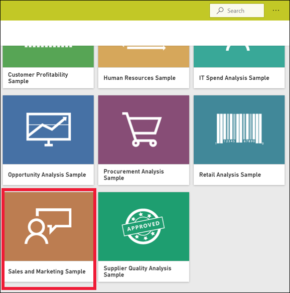
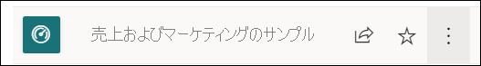
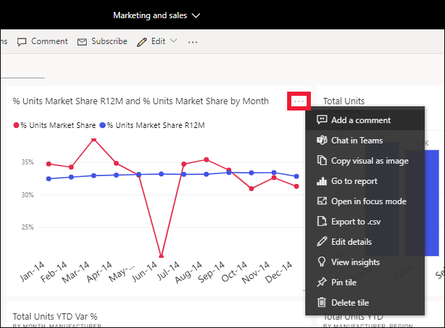
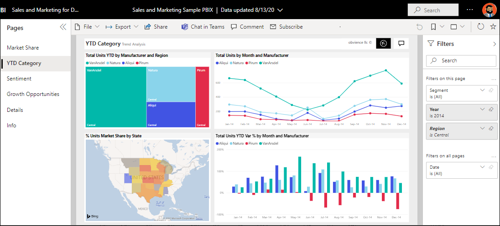
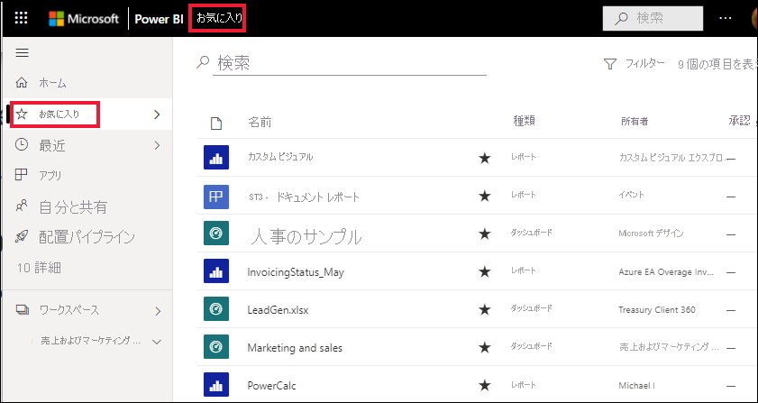
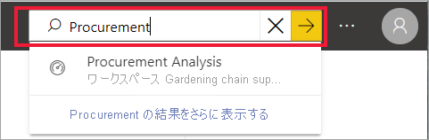
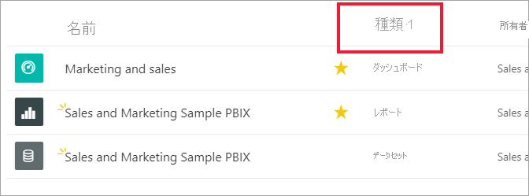
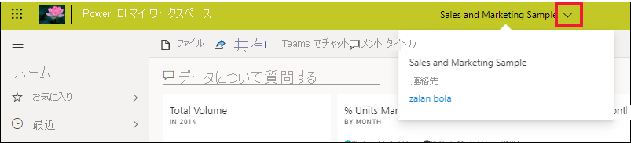
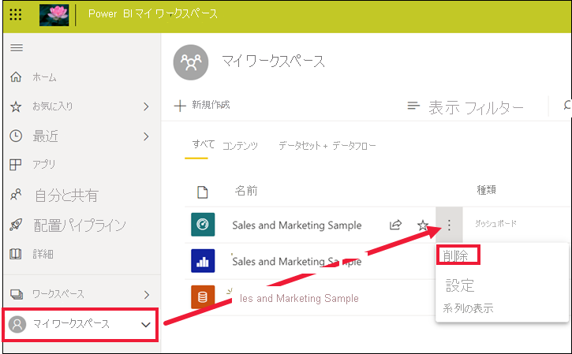

# クイック スタート - Power BI サービス内の移動

[!INCLUDE [power-bi-service-new-look-include](../includes/power-bi-service-new-look-include.md)]

[Power BI の基本](end-user-basic-concepts.md)を理解したので、**Power BI サービス**の操作について説明します。 前の記事で説明したように、チームの同僚は、**Power BI Desktop** だけを使用して、データを組み合わせたり、他のユーザーのためのレポート、ダッシュボード、アプリを作成したりすることがあります。 そのような人たちは "*デザイナー*" です。 一方で、Power BI サービスだけを使用して、他のユーザーが作成したコンテンツを表示し、操作するユーザーもいます (エクスペリエンスの**消費**)。 そのような人たちは "*ビジネス ユーザー*" です。 このクイックスタートは "*ビジネス ユーザー*" を対象としています。 

   
 
## 前提条件

- Power BI にサインアップしていない場合は、[無料の試用版にサインアップ](https://app.powerbi.com/signupredirect?pbi_source=web)してください。

- [Power BI サービスの基本概念](end-user-basic-concepts.md)についてお読みください

- "*デザイナー*" によって作成された Power BI コンテンツ (レポート、ダッシュボード、アプリ) を表示するには、次の 2 つの条件のいずれかが必要です。
    - Power BI Pro ライセンス
    - 組織が Power BI Premium サブスクリプションを持っていて、コンテンツが Premium 容量から共有されていること。    
    [ライセンスとサブスクリプションについて確認する](end-user-license.md)。     

    このクイックスタートに関する限り、これらの条件が満たされている必要はありません。 Microsoft からは、Power BI サービスのインターフェイスから直接使用できるサンプル コンテンツが提供されています。 このサンプル コンテンツを使用して、Power BI サービスの操作方法を学習します。 

## Power BI サービスを開きます

最初に、Power BI サービス (app.powerbi.com) を開きます。 
1. 左側のナビゲーション ペインが折りたたまれている場合は、ナビゲーション ペインのアイコン  をクリックして展開します。 

1. 左下隅にある **[データを取得]** を選択します。 Power BI サービスのツアーに使用するサンプル データを取得します。 調査用にあらゆる種類のサンプル データが提供されていますが、今回はマーケティングと売上に関するデータを使用します。 

   ![スクリーンショットには、[データを取得] ボタンが表示されています。](./media/end-user-experience/power-bi-get-data.png)

1. **[データを取得]** 画面が開いたら、 **[サンプル]** を選択します。

   ![スクリーンショットには、[サンプル] が赤い四角で囲まれた [データを取得] 画面が表示されています。](./media/end-user-experience/power-bi-sample.png)

1. **[売上およびマーケティングのサンプル]**  >  **[接続]** を選択します。 

   

5. Power BI サービスによって、 **[マイ ワークスペース]** にサンプルがインストールされます。  **[マイ ワークスペース]** は、学習と実験のためのプライベート サンドボックスです。  **[マイ ワークスペース]** の内容は自分だけが見ることができます。 サンプルには、1 つのダッシュボード、1 つのレポート、1 つのデータセットが含まれています。 通常、"*ビジネス ユーザー*" がデータセットを受け取ることはありませんが、このサンプルはすべてのユーザー向けに設計されており、1 つ含まれます。

    ![スクリーンショットには、Power BI の [アプリ] 画面と、"売上およびマーケティングのサンプル" というアプリが表示されています。](./media/end-user-experience/power-bi-new-sample.png)

    "*ビジネス ユーザー*" の場合、共有されるほとんどのコンテンツには、基になるデータセットへの直接アクセスは含まれません。 Power BI のサンプルは、すべての Power BI ユーザー向けに作成されているため、データセットが含まれます。   

    サンプルの詳細については、「[Power BI のサンプルを入手する](../create-reports/sample-datasets.md)」を参照してください。

## コンテンツ (ダッシュボードとレポート) を表示する
コンテンツはワークスペースのコンテキスト内に整理されています。 すべてのビジネス ユーザーは、少なくとも 1 つのワークスペースを持っています。これは**マイ ワークスペース**と呼ばれます。 "*デザイナー*" の同僚からコンテンツを共有されると、追加のワークスペースが作成される場合があります。  たとえば、"*デザイナー*" によって、ワークスペースの 1 つへのアクセス許可が自分に割り当てられた場合、Power BI サイトにそのワークスペースが表示されます。  

**マイ ワークスペース**には、ユーザーが所有および作成するすべてのコンテンツが格納されます。 これは、個人用サンドボックスまたはユーザーのコンテンツの作業領域と考えることができます。 Power BI を使用する多くの "*ビジネス ユーザー*" の場合、ジョブに新しいコンテンツの作成が含まれていないため、**マイ ワークスペース**は空のままです。  定義上、"*ビジネス ユーザー*" は、他のユーザーが作成したデータを利用し、そのデータを使用してビジネス上の意思決定を行います。 コンテンツを作成することがわかっている場合は、代わりに、["*レポート作成者*" 向けの Power BI に関する記事](../index.yml)を参照することを検討してください。

ワークスペースは、単にコンテンツを一覧表示するだけのものではありません。 このページでは、ワークスペースのダッシュボードやレポートの詳細を確認できます。 コンテンツの所有者、最終更新日、データの秘密度、推奨がある場合、それを確認するには数分かかります。 ダッシュボードとレポートのアクションの一覧を表示するには、 **[その他のアクション] ([...])** を選択します。   

詳細については、[ワークスペース](end-user-workspaces.md)に関するページを参照してください。

![レポートの [その他のアクション] メニューが表示されているアプリ ワークスペースの画面](./media/end-user-experience/power-bi-more-actions.png)

ワークスペースは、データへのパスの 1 つでもあります。 ワークスペースからは、一覧でダッシュボードまたはレポートを選択して開くことができます。  星アイコンをポイントして選択することにより、ダッシュボードまたはレポートをお気に入りに追加できます。 "*デザイナー*" から[共有アクセス許可](end-user-shared-with-me.md)を付与されている場合は、ここから共有することもできます。 

1. ダッシュボードの名前を選択して開きます。 ダッシュボードは Power BI サービスの機能で、これが Power BI Desktop と異なる点です。 [ダッシュボードについて確認する](end-user-dashboards.md)

    

2. ダッシュボードに対して実行できる操作は、上部のメニュー バーに表示されています。    

    

3. ダッシュボードのタイルをポイントし、 **[その他のオプション] ([...])** を選択して、そのタイルを操作するために使用できるオプションを表示します。

    

4. ダッシュボードのタイルを選択して、そのタイルの作成に使用されたレポートを開きます。 タイル上の視覚エフェクトが含まれるレポートのページが開きます。 ここでは、ツリーマップを含むダッシュボード タイルを選択しました。 Power BI サービスによって、**YTD Category** レポート ページが開かれます。

    

    レポートにはいくつかのセクションがあります。 左側には、レポート ページのクリック可能な一覧が表示されます。 上部には、レポートで実行できるアクションが含まれるメニュー バーがあります。  使用できるオプションは、ロールと、レポートの "*デザイナー*" によって割り当てられているアクセス許可によって異なります。 右側には **[フィルター]** ペインがあります。 そして、中央のキャンバスには、レポート自体が含まれています。 ダッシュボードと同様に、レポート全体、個々の視覚エフェクト、さらには 1 つのレポート ページに対して実行できるアクションがあります。 

    [Power BI レポート](end-user-reports.md)に関する記事を参照してください。

## 左側のナビゲーション ペインの使用
同僚からコンテンツを共有されると、ナビゲーション ペインはさらに便利になります。 クイックスタートのこのセクションでは、"*売上およびマーケティング*" サンプルから離れて、多くの共有コンテンツを持っている Power BI "*ビジネス ユーザー*" のダッシュボードとレポートを見ていきます。

1. **[ホーム]** は、Power BI サービスにログインするときの既定のランディング ページです。 ホームは便利な開始場所であり、コンテンツ間を移動するために代わりに使用できる方法です。 [ホーム] のコンテンツは、お気に入り、最近、頻繁、おすすめの順に整理されています。 また、[ホーム] には、最近使用したワークスペースとアプリも表示されます。 項目を選択するだけで開くことができます。

    ホームには、検索と並べ替えのツール、ナビゲーション ペイン、キャンバスがまとめて表示されます。キャンバスには、ダッシュボード、レポート、アプリを開くために選択できる*カード*が表示されます。 最初は、ホーム キャンバスにそれほど多くのコンテンツが表示されない場合もありますが、Power BI の使用を開始して、同僚と共に使用するに従って外観は変化します。 ホーム キャンバスはまた、推奨コンテンツや学習リソースで更新されます。

   ![完全な [ホーム] のスクリーンショット。](./media/end-user-experience/power-bi-full-home.png)

    詳細については、[Power BI ホーム](end-user-home.md)に関する記事を参照してください

2. **[お気に入り]** と **[最近]** の両方には矢印が付いています。 矢印を選択すると、上位 5 つのお気に入り、または最近使用した 5 つのコンテンツがすぐに表示されます。 フライアウトから、開くコンテンツを選びます。 

   ![[最近] コンテンツのポップアップ。](./media/end-user-experience/power-bi-recent.png)

    すべてのお気に入りまたは最近の一覧を表示するには、単語またはアイコンを選択します。 これらのコンテンツ リストには、レポート、アプリ、ダッシュボードに関する追加情報が表示されます。

    

    詳細については、[Power BI の [最近]](end-user-recent.md) および [Power BI の [お気に入り]](end-user-recent.md) に関する記事を参照してください。

4. **[アプリ]** を選択すると、共有されているアプリまたはインストール済みのアプリがすべて表示されます。 そして、 **[自分と共有]** を選択すると、共有されているダッシュボードとレポートが表示されます。 Power BI サービスを始めたばかりなので、これらのコンテンツ領域は空です。 

    [アプリ](end-user-apps.md)および[自分と共有](end-user-shared-with-me.md)に関する記事を参照してください。

### コンテンツの検索と並べ替え
Power BI サービスを初めて使用する場合は、いくつかのコンテンツのみが表示されます。 ただし、同僚があなたとコンテンツの共有を始めて、あなたがアプリのダウンロードを始めると、コンテンツの一覧が長くなる可能性があります。 このような場合は、検索と並べ替えが非常に役に立ちます。

検索は、Power BI サービスのほぼすべての部分から使用できます。 検索ボックスを探すか、拡大鏡アイコンを見つけます。    

検索フィールドに、ダッシュボード、レポート、ブック、アプリ、または所有者の名前のすべてまたは一部を入力します。 Power BI によってすべてのコンテンツが検索されます。

コンテンツを並べ替える方法も多数あります。 列ヘッダーにカーソルを合わせて、列の並べ替えが可能なことを示す矢印を探します。 並べ替えることができるのは一部の列に限られます。 

または、コンテンツ リストの右上隅付近にある検索 **[フィルター]** を探します。 コンテンツの種類、所有者、またはその他の使用可能なフィールドから選択して、コンテンツをすばやく検索します。

詳細については、[Power BI ナビゲーションの検索と並べ替え](end-user-search-sort.md)に関するページをご覧ください。

## 所有者を検索する
最後に、役に立つヒントを示します。 ダッシュボード、レポート、またはアプリについて質問がある場合は、所有者を探すことができます。 コンテンツを開いた状態で、タイトルのドロップダウンを選択すると所有者が表示されます。 所有者は、個人の場合とグループの場合があります。

## リソースのクリーンアップ
このクイックスタートが完了した後、不要であれば、サンプルのダッシュ ボード、レポート、データセットを削除することができます。

1. Power BI サービス (app.powerbi.com) を開いてサインインします。    
2. Power BI ホームを開き、下にスクロールして **[マイ ワークスペース]** を選択します。      

3. ダッシュボード、レポート、またはデータセットにカーソルを合わせて、 **[その他のオプション (...)]**  >  **[削除]** の順に選択します。 3 つすべてが削除されるまで繰り返します。

    

## 次のステップ

> [!div class="nextstepaction"]
> [Power BI サービスの読み取りビュー](end-user-reading-view.md)
