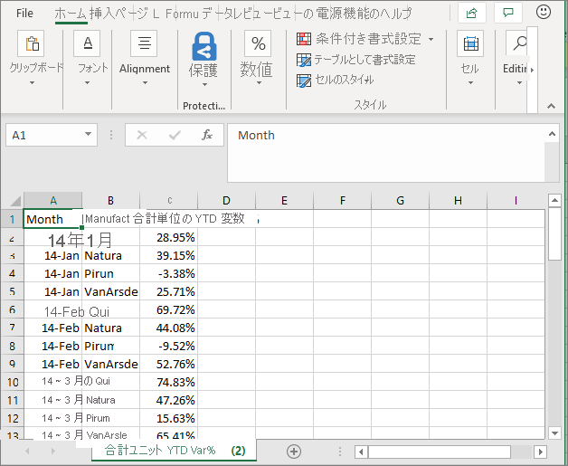
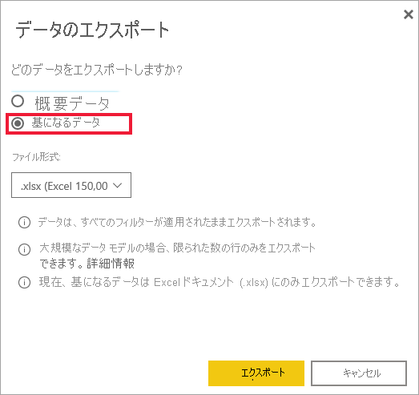

# ビジュアルからデータをエクスポートする

[!INCLUDE[consumer-appliesto-yyny](../includes/consumer-appliesto-yyny.md)]

ビジュアルの作成に使用されているデータを確認するには、[Power BI でそのデータを表示する](end-user-show-data.md)か、それを Excel にエクスポートできます。 この記事では、Excel にエクスポートする方法について説明します。

データを Excel にエクスポートするには Power BI Pro ライセンスが必要であり、ダッシュボードまたはレポートを共有するには Premium 容量を使用する必要があります。 詳細については、「[Power BI ライセンスの種類](end-user-license.md)」を参照してください。 

> [!IMPORTANT]
> Excel にエクスポートできない場合は、レポート作成者または Power BI 管理者がこの機能を無効にしている可能性があります。 これは、多くの場合、プライベート データを保護するために行われます。

## ダッシュボード上のビジュアルからデータをエクスポートする

1. Power BI ダッシュボードから始めます。 ここでは、"**マーケティングと売上サンプル**" アプリのダッシュボードを使用しています。 [このアプリは AppSource.com からダウンロード](https://appsource.microsoft.com/en-us/product/power-bi/microsoft-retail-analysis-sample.salesandmarketingsample)できます。

    

2. ビジュアルをポイントすると、"*その他のオプション*" (...) が表示され、クリックするとアクション メニューが表示されます。

    

3. **[.csv にエクスポート]** を選択します。

4. 次に行われることは、使用しているブラウザーによって異なります。 ファイルを保存するように求められるか、またはブラウザーの下部にエクスポートされたファイルへのリンクが表示される場合があります。 既定では、エクスポートはローカル環境のダウンロード フォルダーに保存されます。 

    

5. Excel でファイルを開きます。 

    > [!NOTE]
    > データへのアクセス許可を持っていない場合は、エクスポートすることも Excel で開くこともできません。 ダッシュボードの所有者または Power BI 管理者に連絡して、エクスポート権限を要求してください。 

    

## レポート内のビジュアルからデータをエクスポートする
レポート内のビジュアルから、.csv または .xlsx (Excel) 形式として、データをエクスポートできます。 

1. ダッシュボードでタイルを選択して、基になっているレポートを開きます。  この例では、上と同じビジュアル *Total Units YTD Var %* を選択しています。 

    

    このタイルは "*売上とマーケティング サンプル*" のレポートから作成されたものであるため、そのレポートが開きます。 また、選択したタイル ビジュアルが含まれるページが開きます。 

2. レポートで、ビジュアルを選択します。 右側の **[フィルター]** ウィンドウに注意してください。 このビジュアルにはフィルターが適用されています。 フィルターの詳細については、[レポートでのフィルターの使用](end-user-report-filter.md)に関する記事を参照してください。

    ![選択された [フィルター] ウィンドウ](media/end-user-export/power-bi-export-filter-pane.png)

3. 視覚エフェクトの右上隅にある **[その他のオプション] (...)** を選択します。 **[データをエクスポート]** を選択します。

    

4. 概要データまたは基になるデータのいずれかをエクスポートするオプションが表示されます。 "*売上およびマーケティング サンプル*" アプリを使用している場合、**[基になるデータ]** は無効になります。 ビジュアルに表示されるデータ (基になるデータ) よりも多くのデータを表示するには、追加のアクセス許可が必要です。 これらのアクセス許可は、データが不適切に表示されたり、再利用されたり、対象ユーザー以外のユーザーと共有されたりするのを防ぐためのものです。

    **[概要データ]**: 現在ビジュアルで表示されている内容のデータをエクスポートする場合、このオプションを選択します。  この種類のエクスポートでは、ビジュアルの現在の状態を作成するのに使用されたデータのみが表示されます。 ビジュアルにフィルターが適用されている場合は、エクスポートしたデータもフィルター処理されています。 たとえば、このビジュアルの場合、エクスポートには 2014 年と中央地域のみのデータ、そして次の 4 つの製造元のデータのみが含まれます: VanArsdel、Natura、Aliqui、Pirum。 ご利用のビジュアルに集計 (合計、平均など) がある場合は、エクスポートも集計されます。 
  

    **[基になるデータ]**: ビジュアルに表示されているデータに **加えて**、基になるデータセットからの追加データをエクスポートする場合は、このオプションを選択します。  これには、データセットには含まれているものの、ビジュアルでは使用されていないデータが、含まれる場合があります。 ビジュアルにフィルターが適用されている場合は、エクスポートしたデータもフィルター処理されています。  ご利用のビジュアルに集計 (合計、平均など) がある場合、エクスポートでは集計が削除されます。基本的にデータは平坦化されます。 

    

5. 次に行われることは、使用しているブラウザーによって異なります。 ファイルを保存するように求められるか、またはブラウザーの下部にエクスポートされたファイルへのリンクが表示される場合があります。 Microsoft Teams で Power BI アプリを使用している場合、エクスポートしたファイルはローカル環境のダウンロード フォルダーに保存されます。 

    

    > [!NOTE]
    > データへのアクセス許可を持っていない場合は、エクスポートすることも Excel で開くこともできません。 レポートの所有者または Power BI 管理者に連絡して、エクスポート権限を要求してください。 

6. Excel でファイルを開きます。 エクスポートされたデータの量を、ダッシュボードの同じビジュアルからエクスポートしたものと比べてください。 違うのは、このエクスポートには **基になるデータ** が含まれているためです。 

    

## 考慮事項とトラブルシューティング
Excel へのエクスポートに関しては、多くの考慮事項があります。 これは、レポート デザイナーと Power BI 管理者が個人または組織全体に対して無効にすることができる機能の 1 つです。 その目的は、プライベート データが不適切なユーザーに確実に公開されないようにすることです。 

この機能を使用できないことがわかった場合は、レポートの所有者と管理者に連絡して、特定のビジュアルまたはすべてのビジュアルからデータをエクスポートできない理由をご確認ください。 この機能は意図的に無効にされている可能性があり、自分向けに有効にしてもらえる場合があります。  それ以外にも、エクスポートが機能しない特別な理由が存在する場合があります。  アクセス許可、データの内容、データの種類、ビジュアルの種類、デザイナーによるフィールドの名前付け方法などに関連している可能性があります。 レポートの所有者または管理者に連絡するときは、次の記事を紹介しください: [管理者のテナント設定](../guidance/admin-tenant-settings.md)、[行レベルのセキュリティ](../admin/service-admin-rls.md)、[データ保護](../admin/service-security-data-protection-overview.md)に関する記事。

- Excel にエクスポートできる行の数には制限があります。  .xlsx ファイルの場合、上限は 150,000 行です。  .csv ファイルの場合、上限は 30,000 行です。 

- データセットには、データに適用される RLS (ロール レベルのセキュリティ) が含まれている場合があります。 これは、一部のデータがユーザーに表示するのが適切でないために、非表示にされている可能性があることを意味します。  たとえば、部下を持つマネージャーの場合、人事データセットには、直属の従業員のデータのみを表示できる RLS が適用されている場合があります。 

- 特定の種類のビジュアルはサポートされていません。 これには、カスタム ビジュアル、R ビジュアルなどが含まれます。 

## 次のステップ

[視覚化の作成に使用されたデータを表示する](end-user-show-data.md)