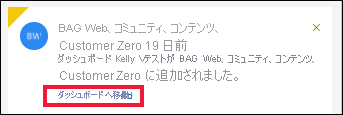

# Power BI 通知を表示する

[!INCLUDE[consumer-appliesto-yynn](../includes/consumer-appliesto-yynn.md)]

Power BI サービスでは、最後にログインした後に発生したイベントが追跡されます。 これには、アプリの更新、ダッシュボードでトリガーされたアラート、Power BI イベントと会議に関する情報、ワークスペースに追加された新しいコンテンツが含まれます。 これらのイベントを順に示す一覧は、"*通知センター*" に保存されます。 

通知を確認する準備ができたら、ベルのアイコンを選択します。  . 通知は最新のものが一番上に示され、日時順に一覧表示されます。 確認した項目はグレーで表示され、確認していない項目は強調表示されて角が黄色くなっています。   

Amanda が通知をレビューし、管理し、また、通知に応答する様子をご覧ください。 その後、ビデオで説明されている手順に従って、ご自分でやってみてください。    

> [!NOTE]
> このビデオでは、古いバージョンの Power BI サービスが表示されます。 

<iframe width="560" height="315" src="https://www.youtube.com/embed/bZMSv5KAlcE" frameborder="0" allowfullscreen></iframe>

## 通知を表示する
Power BI にサインインすると、オフラインの間に受信した新しい通知がフィードに追加されます。 新しい通知があると、Power BI では、通知センター アイコンの上に黄色いバブルと新しいアイテムの数が表示されます。 通知センターは Power BI サービスのトップ メニュー バーの一部であるため、次に示すような Power BI サービスのほとんどの領域から通知を開くことができます: [ホーム]、[最近使用]、ダッシュボード、レポート、アプリ、ワークスペース、Power BI Q&A 画面など。

通知はさまざまな理由で送信され、多くの場合、同じ通知が電子メールでも送信されます。 
- アプリが更新され、新しいバージョンが利用可能になったとき
- 新しいコンテンツ (ダッシュボード、レポートなど) がワークスペースに追加されたとき
- [アラート](end-user-alerts.md)がトリガーされたとき (アラートは Power BI サービスのほか、Power BI モバイル アプリでも設定できます。)
- その他

   
1. Power BI サービス メニュー バーで、ベルのアイコンを選択します。 この例では、ユーザーは最後に通知センターを開いた後、2 つの新しい通知を受け取っています。
   
   
2. 最新の通知から先に表示され、未読のメッセージは強調表示されます。 通知は、削除するか、100 件の上限に達するまで 90 日間保持されます。
   
   

3. 通知を読み、アクションを実行します。 ほとんどの通知には、1 つ以上のアクティブなリンクが含まれています。  次の例には、ダッシュボードへのリンクが含まれています。

   

1. 通知が不要になったら、[X] アイコンを選択して閉じます。    

 
## 通知をキャンセルする方法
一部の通知は、Power BI サービスによって自動的に送信されます。 その他の通知は、同僚またはユーザーによって作成されます。 すべての通知は、開封前または後に通知センターから削除できます。 ただし、特定の通知を受信する頻度が高すぎる場合や、情報が不要になった場合は、配信をキャンセルする方法があります。 

自分または同僚が作成した通知については、その通知が参照するコンテンツを削除せずにキャンセルできます。 たとえば、"日別の売上合計" が $100 を超えるたびに受信されるアラートを停止するには、ダッシュボードでアラートを[編集またはキャンセル](end-user-alerts.md)します。 同僚がアラート通知を作成した場合は、その同僚に連絡して、削除するように依頼します。

## 次の手順
* [Power BI サービスでのデータ アラート](end-user-alerts.md)
* [iPhone アプリでデータ アラートを設定する (Power BI for iOS)](mobile/mobile-set-data-alerts-in-the-mobile-apps.md)
* [Windows 10 用の Power BI モバイル アプリでデータ アラートを設定する](mobile/mobile-set-data-alerts-in-the-mobile-apps.md)
* 他にわからないことがある場合は、 [Power BI コミュニティを利用してください](https://community.powerbi.com/)。

