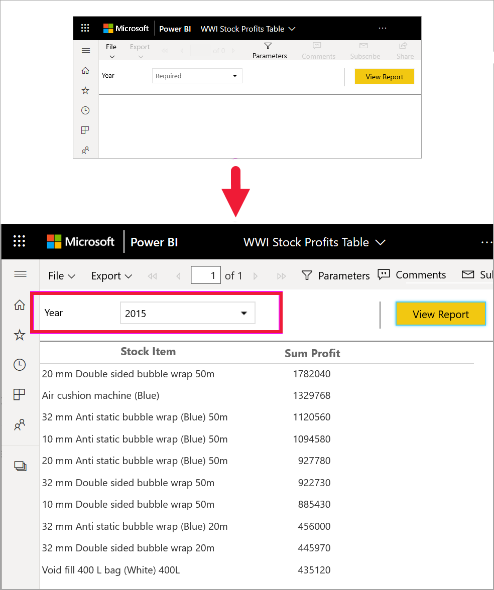
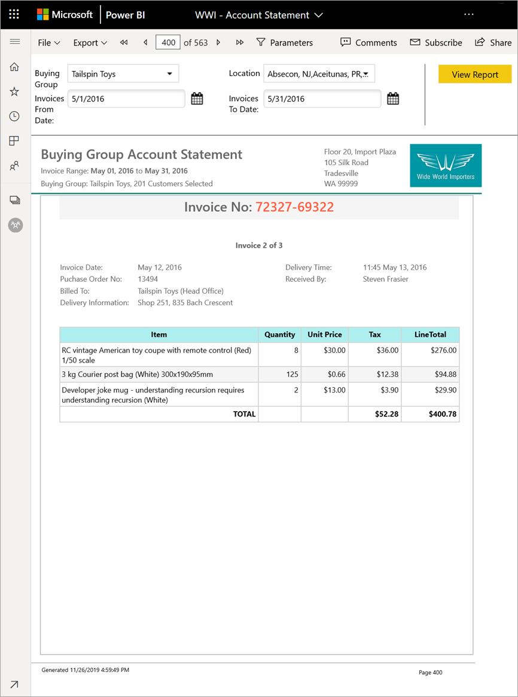

# Power BI サービスでのページ分割されたレポート

[!INCLUDE[consumer-appliesto-yyny](../includes/consumer-appliesto-yyny.md)]

[Power BI レポート](end-user-reports.md)については、既に学習しました。これらは、最も使用される可能性の高い種類のレポートです。 Power BI レポートは、探索と対話性に最適化されています。 異なる営業担当者が、同じレポートのデータを特定の地域/業界/顧客でスライスして業績の変化を見る売上レポートは、Power BI レポートで提供するのが最善です。

ただし、"*ページ分割されたレポート*" と呼ばれる別の種類のレポートもあります。 ページ分割されたレポートを受け取って表示するには、レポートを Premium 容量に保存するための Power BI Pro ライセンスが必要です。  [ライセンスについてはこちらをご覧ください](end-user-license.md)。  

## ページ分割されたレポートを識別する

コンテンツ リストおよびご利用のホーム ランディング ページでは、ページ分割されたレポートを、そのアイコン  によって識別できます。  ページ分割されたレポートは、お客様と直接共有されることもあれば、[Power BI アプリ](end-user-apps.md)の一部として共有されることもあります。 お客様がレポート "*デザイナー*" からアクセス許可を付与された場合、お客様はページ分割されたレポートを再共有し、自分や他のユーザーをサブスクライブできるようになります。

## ページ分割されたレポートとは

これらのレポートは、印刷ページにうまく収まるように書式設定されているので、"*ページ分割された*" と呼ばれます。 利点の 1 つに、テーブルが複数のページにまたがる場合でも、すべてのデータが 1 つのテーブル内に表示されるということがあります。 ページ分割されたレポートは "ピクセル パーフェクト" と呼ばれることもあります。これは、レポート "*デザイナー*" がそのレポート ページのレイアウトを正確に制御するからです。

ページ分割されたレポートは、印刷や PDF 生成用に最適化されている、高度に書式設定されたピクセル単位で完璧な出力が必要なシナリオに最適です。 損益計算書は、ページ分割されたレポートとして表示するのがおそらく望ましいレポートの種類のよい例です。

## ページ分割されたレポートのしくみ

レポート "*デザイナー*" は、ページ分割されたレポートを作成する場合、実際には "*レポート定義*" を作成します。 それにデータは含まれません。 それでは、データを取得する場所、取得するデータ、データを表示する方法を指定します。 レポートを実行すると、レポート プロセッサによってレポート定義が取得されて、データが取得され、レポートのレイアウトと組み合わせることでレポートが生成されます。 場合によって、レポートには既定のデータが表示されます。 それ以外の場合、レポートにデータを表示するには事前にパラメーターを入力しておく必要があります。 

ページ分割されたレポートを選択して、Power BI サービスで開きます。 パラメーターがある場合は、レポートを表示する前に、選択する必要があります。

   

それは通常、やりとりの範囲 (パラメーターの設定) です。 ご自分が請求アナリストである場合、ページ分割されたレポートを使用して請求書の作成または印刷を行うことができます。 ご自分が販売マネージャーである場合は、ページ分割されたレポートを使用して、店舗別または販売員別に注文を表示することができます。 

このシンプルなページ分割されたレポートでは、 **[年]** パラメーターを選択すると、年ごとの利益が生成されます。 

ページ分割されたレポートと比較して、Power BI レポートはやりとりがかなり容易です。 Power BI レポートでは、カスタム レポートを作成できるほか、カスタム ビジュアルを含むさまざまな種類のビジュアルがサポートされています。

## ページ分割されたレポートとやりとりする

ページ分割されたレポートとやりとりする方法は、他のレポートとは異なります。 印刷、ブックマーク、エクスポート、コメントなどの操作を行うことができますが、対話性は低くなります。 多くの場合、ページ分割されたレポートでは、レポート キャンバスにデータを入力するためにお客様からの入力が必要になります。  また、レポートに既定のデータが表示される場合、さまざまなデータを表示するためのパラメーターを入力できる場合もあります。

### ページ分割されたレポートを印刷する

"*ページ分割された*" レポートは、ページ上にうまく収まって適切に印刷されるように書式設定されます。 ブラウザーに表示される内容は、印刷したときに目にする内容です。 さらに、レポートに長いテーブルが含まれている場合、それが複数のページにまたがっていても、テーブル全体が印刷されます。 

ページ分割されたレポートは、多くのページを含むことができます。 たとえば、このレポートは 563 ページです。 請求書ごとに 1 ページが使用されて、ヘッダーとフッターが繰り返されるように、各ページが正確にレイアウトされています。 このレポートを印刷すると、請求書間に改ページが表示されます。

   

### ページ分割されたレポート内を移動する

この販売注文レポートには、次の 3 つのパラメーターがあります: 業種、リセラー、および注文番号。 

表示される情報を変更するには、3 つのパラメーターに対して新しい値を入力し、 **[レポートの表示]** を選択します。 ここでは、 **[Specialty bike shop]** 、 **[Alpine Ski House]** 、および注文番号 **[SO46085]** を選択しました。 **[レポートの表示]** を選択すると、レポート キャンバスがこの新しい販売注文で更新されます。

選択したパラメーターを使用して、新しい販売注文が表示されます。 

ページ分割されたレポートの中には、多くのページを含むものがあります。  ページのコントロールを使用して、レポート内を移動します。 

### ページ分割されたレポートをエクスポートする
PDF、Word、XML、PowerPoint、Excel などのページ分割されたレポートをエクスポートするためのさまざまなオプションが用意されています。 エクスポート時には、可能な限り書式設定が保持されます。 たとえば、Excel、Word、PowerPoint、MHTML、PDF にエクスポートされるページ分割されたレポートでは、"完璧なピクセル" の書式設定が維持されます。 

### ページ分割されたレポートをサブスクライブする
ページ分割されたレポートをサブスクライブすると、レポートが添付された電子メールが Power BI から送信されます。 ご自分のサブスクリプションの設定時には、メールの受信頻度 (毎日、毎週、毎時間、または毎月) を選択します。 サブスクリプションには、レポート出力全体の添付ファイルが含まれています (最大サイズは 25 MB)。 レポート全体をエクスポートするか、事前にパラメーターを選択します。 Excel、PDF、PowerPoint など、さまざまな種類の添付ファイルから選択できます。  

## 考慮事項とトラブルシューティング

- パラメーターを選択し、 **[レポートの表示]** を選択するまで、ページ分割されたレポートが空白のままとなることがあります。

- ページ分割されたレポートがない場合は、この種類のレポートを誰もお客様と共有していない可能性があります。 また、システム管理者が、お客様に対してページ分割されたレポートを有効にしていないことを意味する場合もあります。 

 

## 次の手順
- [Power BI レポート](end-user-reports.md)
- [Power BI のページ分割されたレポート:FAQ](../paginated-reports/paginated-reports-faq.md)
- 他にわからないことがある場合は、 [Power BI コミュニティ](https://community.powerbi.com/)を利用してください。
