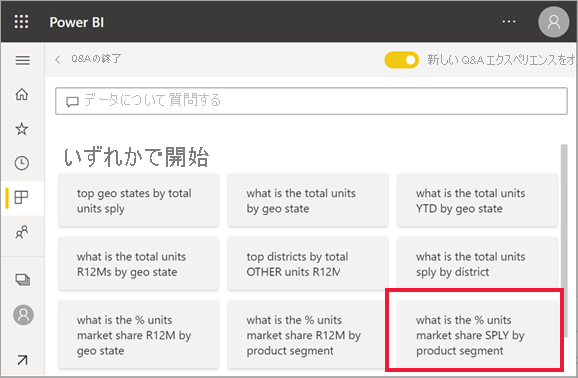
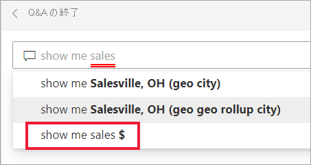

# Power BI コンシューマーのための Q&A

[!INCLUDE[consumer-appliesto-yyny](../includes/consumer-appliesto-yyny.md)]

[!INCLUDE [power-bi-service-new-look-include](../includes/power-bi-service-new-look-include.md)]

## Q&A とは
自然言語を使用して質問するのが、データから回答を得る最も速い方法である場合があります。 たとえば、「昨年の総売り上げはいくらですか」という質問です。

Q&A を使用すると、直感的な自然言語の機能を使ってデータを調査し、チャートやグラフの形式で質問に対する回答を受け取ることができます。 Q&A は、検索エンジンとは異なります。Q&A は Power BI 内のデータに関する結果だけを提供します。

## Q&A はどの視覚化を使用しますか。
Q&A は、表示されているデータに基づいて最適な視覚化を選びます。 基になるデータセットにあるデータは、特定の種類またはカテゴリとして定義されることがあります。Q&A はこれを利用して表示方法が分かります。 たとえば、データが日付型として定義されている場合は、折れ線グラフで表示される可能性が高くなります。 市区町村として分類されているデータは、マップとして表示される可能性が高くなります。

また、Q&A に独自の質問を追加して、使用するビジュアルを Q&A で指定することもできます。 ただし、Q&A では、要求した種類のビジュアルでデータを表示できるとは限りません。 Q&A により、実行可能なビジュアルの種類の一覧が表示されます。

## Q&A はどこで使用できますか。
Power BI サービスのダッシュボードと、Power BI モバイルのダッシュボードの下部に Q&A があります。 デザイナーから編集アクセス許可を与えられていない場合、利用者は Q&A を使ってデータを探すことはできますが、Q&A で作成された視覚エフェクトを保存することはできません。

レポートの*デザイナー*が [Q&A のビジュアル](../visuals/power-bi-visualization-q-and-a.md)を追加していれば、レポートにも Q&A が表示されます。   

## ダッシュボード上の Q&A

**Power BI Q&A** は Pro または Premium ライセンスで利用できます。  [Power BI モバイル アプリの Q&A](mobile/mobile-apps-ios-qna.md) および [Power BI Embedded の Q&A ](../developer/embedded/qanda.md) については、別の記事で説明します。 現在のところ、**Power BI Q & A** では、英語で寄せられた自然言語クエリの回答のみがサポートされます。ただし、スペイン語についてはプレビューがあり、ご自身の Power BI 管理者が有効にできます。

質問をすることは、始まりにすぎません。  質問の検索条件を限定あるいは拡大したり、信頼に値する新しい情報を明らかにしたり、詳しい情報に的を絞ったり、ズームアウトしてより広い視野を得たりして、データの調査を楽しんでください。 分析や発見を行うことによって喜びを得ることができます。

エクスペリエンスはまったくの対話型で、しかも高速です。 メモリ内の記憶域を使用するため、ほぼ瞬時に応答します。

## Power BI サービスのダッシュボードで Q&A を使用する
Power BI サービス (app.powerbi.com) のダッシュボードには 1 つ以上のデータセットからピン留めされたタイルが含まれているので、いずれかのデータセットに含まれるいずれかのデータに関して質問することができます。 ダッシュボードの作成に使われたレポートとデータセットを見るには、 **[その他の操作]** ボックスの一覧から **[関連の表示]** を選択します。

![メニュー バーの [関連の表示]](media/end-user-q-and-a/power-bi-q-and-a-view-related.png)

## どのように始めますか。
最初に、内容を理解します。 ダッシュボードとレポートでビジュアルを確認してください。 自分が利用できるデータの型と範囲の感じをつかみます。 

例:

* ビジュアルの軸のラベルと値に "売上"、"アカウント"、"月"、"営業案件" が含まれている場合は、自信を持って次のような質問をすることができます。「どの "*アカウント*" の "*営業案件*" が一番多いか」または「月別の "*売上*" を棒グラフとして表示する」。

* Google Analytics に Web サイトのパフォーマンス データがある場合は、Web ページの利用に費やした時間、固有のページのアクセス数、ユーザーの契約率に関する Q&A を行えます。 あるいは、人口統計データのクエリを実行している場合は、年齢および場所ごとの世帯収入に関する質問をする場合があります。

データの感じをつかんだら、ダッシュボードに戻り、質問ボックスにカーソルを置きます。 これで Q&A 画面が開きます。

 

入力を開始する前に、Q & A で質問を作るときに役立つ情報が新しい画面に表示されます。 基になっているデータセットのテーブルの名前を含む言い回しおよび質問が表示されるほか、データセット所有者によって作成された "*おすすめ*" の質問が表示されることもあります。

そのいずれかを選択して質問ボックスに追加し、特定の回答を見つけられるように、その質問を調整できます。 

 

Power BI を使って質問するには、プロンプト、オートコンプリート、視覚的合図などの機能も使用できます。Power BI には、ダッシュボードの Q&A、レポートの Q&A、および Q&A ビジュアルに関してこのヘルプが用意されています。 これらの機能については、後述する「[自然言語クエリを入力して Q&A ビジュアルを作成する」](#create-a-qa-visual-by-typing-a-natural-language-query)セクションで詳しく説明します。

<!--  -->

## Power BI レポートの Q&A ビジュアル

Q&A ビジュアルにより、ユーザーが自然言語で質問をし、ビジュアル形式で回答を得ることができます。 Q&A ビジュアルは、レポートの他のビジュアルと同様に動作するため、クロスフィルター処理またはクロス強調表示が可能で、ブックマークやコメントもサポートされます。 

Q&A ビジュアルは、上部に並んだ質問ボックスで見分けることができます。 そこに自然言語を使用して質問を入力します。 Q&A ビジュアルは、データについて質問する目的で繰り返し使用できます。 レポートを終了すると、Q&A ビジュアルがその既定の状態にリセットされます。 

## Q&A を使用する 
ダッシュボード上で Q&A を使用する場合、またはレポート内でビジュアル Q&A を使用する場合は、提案された質問のいずれかを選択するか、自然言語の質問を入力します。 

### 提案された質問を使用して Q&A ビジュアルを作成する

ここでは、 **[top geo states by total units]** を選択しています。 Power BI によって最善であると判断される視覚化タイプが、使用するものとして選択されます。 この例ではマップです。

ただし、使用する視覚化タイプは、自然言語クエリに追加することで、Power BI に対して明示的に指定することができます。 実際のデータに対してすべての視覚化タイプが妥当であるとは限らないので注意してください。 たとえば、このデータから意味のある散布図は生成されません。 しかし、塗り分け地図としてなら機能します。

### 自然言語クエリを入力して Q&A ビジュアルを作成する

どのような質問をするべきか、またどのような用語を使用すべきかがわからない場合は、 **[すべての候補を表示する]** を展開するか、またはレポート内の他のビジュアルを観察します。 そうすることでデータセットの内容と用語についての知識が得られます。

1. 自然言語を使用して Q&A フィールドに質問を入力します。 質問を入力する際は、Power BI のオートコンプリート、視覚的合図、フィードバック機能が役立ちます。

    **オートコンプリート** - 質問を入力すると、関連性があり、文脈に沿った候補が Power BI Q&A によって表示されるため、自然言語ですぐに生産性を高めることができます。 入力すると、すぐにフィードバックと結果が得られます。 このエクスペリエンスは、検索エンジンでの入力に似ています。

    この例では、目的の候補は最後の項目です。 

    

    **赤色と青色の下線** - Power BI Q&A では、Power BI で認識された、またはされなかった単語を確認できるように、下線付きの単語が表示されます。 青色の実線の下線は、Power BI によって単語が認識されたことを示します。 次の例は、**store** という単語が Q&A によって認識されたことを示しています。

    

    青色の下線付きの単語を選択すると、提案された質問のドロップダウンが表示されます。 

    ![[以下もお試しいただけます] 候補が表示されたドロップダウン](media/end-user-q-and-a/power-bi-try.png)

    多くの場合、Q&A に単語を入力すると、赤色の下線でマークされます。 赤い下線は、潜在的な 2 つの問題のいずれかを示している可能性があります。 1 番目の種類の問題は、低信頼度として分類されます。 不明瞭な、またはあいまいな単語を入力すると、フィールドに赤色の下線が表示されます。 たとえば、"Location" という単語を使用できます。 複数のフィールドに "Location" という語が含まれている可能性があるので、赤い下線が表示され、目的のフィールドを選択するようにシステムから求められます。 この例では、Power BI から "VanArsdel" に使用するフィールドを選択するよう求められます。
    
    
    
    低信頼度の別の例として、"area" という単語を入力しても、一致する列が "district" である場合が挙げられます。 Bing および Office との統合により、Power BI Q&A では、同じことを意味する単語も認識されます。 Q&A によって単語に赤の下線が付けられているので、直接一致していないことがわかります

    

    2 番目の種類の問題は、Q&A によって単語がまったく認識されない場合です。 例として、データ内のどこにも存在しない "geography" という言葉を使用した場合が挙げられます。 この単語は英語の辞書に載っていますが、Q&A ではこの用語に赤い下線が付けられます。 Power BI Q&A では視覚化を作成できず、レポート デザイナーに用語の追加を依頼することが提案されます。

    

    **候補** - さらに質問文を入力していくと、質問が認識されなければ Power BI から通知が表示され、支援機能が作動します。 下の例では、Power BI から "候補" というメッセージが表示され、データセット内の用語を使用して別の質問文が提案されています。 

    

    Power BI による修正を選択すると、目的の結果が折れ線グラフとして表示されます。 

    

    ただし折れ線グラフは、別の視覚化タイプに変更することができます。  

    

## 考慮事項とトラブルシューティング

**質問**:このダッシュボードに Q&A が表示されません。    
**回答 1**:質問ボックスが表示されない場合、最初に設定を確認してください。 それを行うには、Power BI ツール バーの右上隅にある歯車アイコンを選択します。   

次に、 **[設定]**  >  **[ダッシュボード]** の順に選択します。 **[このダッシュボードに Q&A 検索ボックスを表示する]** の隣にチェックマークがあることを確認します。    
  

**回答 2**:場合によっては、設定にアクセスできないことがあります。 ダッシュボードの "*デザイナー*" または管理者によって Q&A がオフに設定されている場合は、オンに戻してよいかどうかをそれらのデザイナーまたは管理者に確認してください。   

**質問**:質問を入力しても、求めている結果が表示されません。    
**回答**:レポートまたはダッシュボードの所有者に連絡するためのオプションを選択してください。 この操作は、Q&A のダッシュボード ページまたは Q&A ビジュアルから直接行うことができます。 または、Power BI のヘッダーから所有者を検索できます。  Q&A の結果を改善するためにデザイナーができることがたくさんあります。 たとえば、デザイナーは、簡単に理解される言葉を使用するようにデータセットの列名を変更できます (`CustFN` の代わりに `CustomerFirstName`)。 デザイナーはデータセットのことをよく理解しているため、役に立つ質問を考え、Q&A によって提案される質問にそれらを追加できます。

## プライバシー

Microsoft は、Power BI を改善するために質問を使用する場合があります。 詳細については、「[Microsoft プライバシー ステートメント](https://go.microsoft.com/fwlink/?LinkId=521839)」を参照してください。

## 次の手順
Q&A ビジュアルがレポートの "*デザイナー*" によってどのように作成され、管理されるかについては、[Q&A ビジュアルの種類](../visuals/power-bi-visualization-q-and-a.md)に関するページを参照してください。
