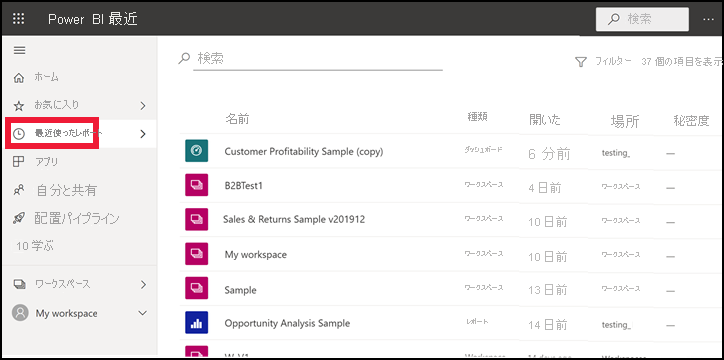
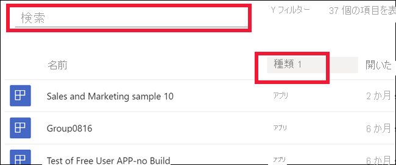

# Power BI サービスの "**最近**" のコンテンツ

[!INCLUDE[consumer-appliesto-yyny](../includes/consumer-appliesto-yyny.md)]

**最近** のコンテンツには、Power BI サービスで最近表示した項目が含まれます。 これには、ダッシュボード、レポート、アプリ、ワークスペース、ブックなどがあります。 ナビゲーション バーから **[最近]** を選択すると、Power BI によって、このコンテンツが日付別に降順で表示されます。  並べ替え順序を変更するには、見出しの 1 つを選択し、[昇順] または [降順] を選択します。

2 つの項目が [[お気に入り]](end-user-favorite.md) になっており、星のアイコンが付いていることに注目してください。 また、顧客収益性のサンプルという 1 つの項目が [Premium 容量](end-user-license.md)に格納されています。

## 最近表示した 5 つを表示する

最近アクセスした 5 つの項目を確認するには、ナビゲーション ペインで、 **[最近]** の右にある矢印を選択します。  ここから、開くコンテンツを選びます。 

## 最近のすべてのコンテンツを表示する

最近アクセスした項目が 5 つを超える場合、 **[すべて表示]** を選択して、 **[最近]** 画面を開きます。 この記事の冒頭で説明したように、ポップアップをスキップして、ナビ ペインで **[最近]** またはそのアイコンである ![[最近] アイコン](./media/end-user-recent/power-bi-icon.png) を選択して、 **[最近]** 画面を開きます。

## 最近使ったコンテンツの一覧を検索して並べ替える

一覧が長くなる場合は、[検索フィールドと並べ替えを使用して検索](end-user-search-sort.md)します。 列を並べ替えることができるかどうかを調べるには、ポイントして矢印が表示されるかどうかを確認します。 この例では、 **[種類]** にカーソルを置くと、矢印が表示されます。最近のコンテンツは、コンテンツの種類別にアルファベット順に並べ替えることができます。 

Amanda による Power BI サービスの **[最近]** コンテンツの一覧の入力方法のデモンストレーションを見たら、下のビデオの手順に従ってご自分で試してください。

<iframe width="560" height="315" src="https://www.youtube.com/embed/G26dr2PsEpk" frameborder="0" allowfullscreen></iframe>

> [!NOTE]
> このビデオでは、古いバージョンの Power BI サービスを使用しています。

<!--
## Actions available from the **Recent** content list
The actions available to you will depend on the settings assigned by the content *designer*. Some of your options may include:
* Select the star icon to [favorite a dashboard, report, or app](end-user-favorite.md) .
* Some dashboards and reports can be re-shared  .
* [Open the report in Excel](end-user-export.md)  
* [View insights](end-user-insights.md) that Power BI finds in the data . -->

## 次の手順
[Power BI サービス アプリ](end-user-apps.md)

その他の質問 [Power BI コミュニティを利用してください](https://community.powerbi.com/)。

