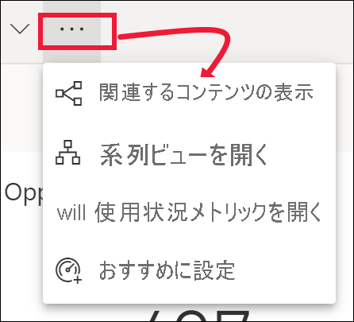

# Power BI サービスで関連するコンテンツを表示する

[!INCLUDE[consumer-appliesto-yyny](../includes/consumer-appliesto-yyny.md)]

[!INCLUDE [power-bi-service-new-look-include](../includes/power-bi-service-new-look-include.md)]

**[関連するコンテンツ]** ペインには、Power BI サービスのコンテンツ (ダッシュボード、レポート、データセット) がどのように相互接続されているかが示されます。 **[関連するコンテンツ]** ウィンドウは、操作を実行するための起動パッドでもあります。 ここからは、ダッシュボードを開いたり、レポートを開いたり、分析情報を生成したり、Excel でデータを分析するといった操作を行うことができます。  

Power BI サービスでは、レポートはデータセットを基にして作成されていて、レポート視覚エフェクトはダッシュボードにピン留めされ、ダッシュボード視覚エフェクトはレポートにリンクしています。 しかし、マーケティング レポートのビジュアルをホストしているダッシュボードをどのようにして知りますか。 そのダッシュボードをどのようにして見つけますか。 調達ダッシュボードでは複数のデータセットからのビジュアルが使われていますか。 その場合、どのような名前が付けられていて、開いて編集するにはどうすればよいですか。 HR データセットはレポートやダッシュボードで使われていますか。 または、それはリンクを壊さずに移動できますか。 このような疑問の答えは、 **[関連するコンテンツ]** ペインでわかります。  このペインでは、関連するコンテンツが表示されるだけでなく、コンテンツに対する操作を実行し、関連するコンテンツ間を簡単に移動することもできます。

> [!NOTE]
> 関連するコンテンツの機能は、ストリーミング データセットには機能しません。
> 
> 

## ダッシュボードまたはレポートの関連するコンテンツを表示する
Watch ではダッシュボードの関連するコンテンツが表示されます。 その後、ビデオで説明されている手順に従って、ご自分でやってみてください。調達の分析のサンプルをご利用ください。

> [!NOTE]
> このビデオでは、以前のバージョンの Power BI を使って操作説明をしています。 

<iframe width="560" height="315" src="https://www.youtube.com/embed/B2vd4MQrz4M#t=3m05s" frameborder="0" allowfullscreen></iframe>

ダッシュボードまたはレポートを開いた状態で、メニュー バーの **その他のオプション** (...) を選択し、ドロップダウンから **[関連するコンテンツの表示]** を選択します。

**[関連するコンテンツ]** ペインが開きます。 ダッシュボードの場合、ダッシュボードに視覚エフェクトがピン留めされているすべてのレポートと、それに関連付けられているデータセットが表示されます。 このダッシュボードでは、1 つのレポートからのみピン留めされた視覚エフェクトがあり、そのレポートは 1 つのデータセットのみに基づいています。 この記事の冒頭にある画像を見ると、ダッシュボードの関連コンテンツとして、4 つのレポート (および 2 つのデータセット) から視覚化がピン留めされています。

![[関連するコンテンツ] ウィンドウ](./media/end-user-related/power-bi-view-related-dashboard.png)

ここからは、アクセス許可に応じて、関連するコンテンツに対する操作を直接実行できます。  たとえば、レポートまたはダッシュボード名を選択して開きます。  一覧表示されたレポートについては、アイコンを選択してレポートを開き、レポートの設定を編集したり、[詳細情報を取得](end-user-insights.md)したりすることができます。 データセットについては、最終更新日時を確認したり、[Excel で分析](../collaborate-share/service-analyze-in-excel.md)したり、[詳細情報を取得](end-user-insights.md)したり、内容を更新したりすることができます。  

<!-- ## See related content for a dataset
You'll need at least *view* permissions to a dataset to open the **Related content** pane. In this example, we're using the [Procurement Analysis sample](../create-reports/sample-procurement.md).

From the nav pane, locate the **Workspaces** heading and select a workspace from the list. If you have content in a workspace, it will display in the canvas to the right. 

In a workspace, select the **Datasets** tab and locate the **See related** icon .

Select the icon to open the **Related content** pane.

From here, you can take direct action on the related content. For example, select a dashboard or report name to open it.  For any dashboard in the list, select an icon to [share the dashboard with others](../collaborate-share/service-share-dashboards.md) or to open the **Settings** window for the dashboard. For a report, select an icon to [analyze in Excel](../collaborate-share/service-analyze-in-excel.md), [rename](../create-reports/service-rename.md), or [get insights](end-user-insights.md).  -->

## 制限事項とトラブルシューティング
* "関連の表示" が表示されない場合は、代わりにアイコン  を探してください。 アイコンを選び、 **[関連するコンテンツ]** ペインを開きます。
* レポートの関連するコンテンツを開くには、[[読み取りビュー]](end-user-reading-view.md) を表示している必要があります。
* 関連するコンテンツの機能は、ストリーミング データセットには機能しません。

## 次の手順
* [Power BI サービスの概要](../fundamentals/service-get-started.md)
* 他にわからないことがある場合は、 [Power BI コミュニティを利用してください](https://community.powerbi.com/)。
