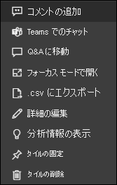

# Power BI のダッシュボードのタイル

[!INCLUDE[consumer-appliesto-yyny](../includes/consumer-appliesto-ynny.md)]

[!INCLUDE [power-bi-service-new-look-include](../includes/power-bi-service-new-look-include.md)]

タイルは、*デザイナー* によってダッシュボードにピン留めされた、データのスナップショットです。 "*デザイナー*" は、レポート、データセット、ダッシュボード、Q&A 質問ボックス、Excel、SQL Server Reporting Services (SSRS) などから、タイルを作成できます。  次のスクリーンショットは、ダッシュボードにピン留めされているさまざまなタイルを示しています。

レポートからピン留めされたタイルに加え、*デザイナー* は **[タイルの追加]** を利用し、ダッシュボードに直接、スタンドアロンのタイルを追加できます。 スタンドアロン タイルには、テキスト ボックス、画像、ビデオ、ストリーミング データ、Web コンテンツが含まれます。

Power BI を構成する要素を理解するうえで助けが必要ですか?  「[Power BI - 基本的な概念](end-user-basic-concepts.md)」を参照してください。

## ダッシュボードのタイルと対話する

1. タイルにマウス カーソルを置き、省略記号を表示します。
   
    
2. 省略記号を選んで、タイルの操作メニューを開きます。 使用できるオプションは、アクセス許可、視覚エフェクトの種類、およびタイルの作成に使用された方法によって異なります。 たとえば、Q&A からピン留めされたタイルに使用できるメニュー項目は、レポートからピン留めされたタイルとは異なります。 Q&A を使用して作成されたタイルのアクション メニューを次に示します。

   
    

   
    これらのメニューから使用できるアクションの一部を次に示します。
   
   * [このタイルの作成に使われたレポートを開く ](end-user-reports.md)   
   
   * [タイルの作成に使用した Q&A 質問を開く ](end-user-reports.md)   
   

   * [このタイルの作成に使われたブックを開く ](end-user-reports.md)   
   * [フォーカス モードでタイルを表示する ](end-user-focus.md)   
   * [分析情報を表示する ](end-user-insights.md) 
   * [コメントを追加し、ディスカッションを開始する ](end-user-comment.md) 
   * [ダッシュボードのタイルで設定されたアラートを管理する ](end-user-alerts.md) 
   * [Excel でデータを開く ](end-user-export.md) 

3. 操作メニューを閉じるには、キャンバスの空白領域を選びます。

### タイルの選択 (クリック)
タイルを選択したときに次に生じる動作は、タイルの作成方法、および[カスタム リンク](../create-reports/service-dashboard-edit-tile.md)があるかどうかによって異なります。 カスタム リンクがある場合、タイルを選択するとそのリンクに移動します。 それ以外の場合、タイルを選択すると、そのタイルを作成するために使われたレポート、Excel Online ブック、オンプレミスの SSRS レポート、Q&A の質問に移動します。

> [!NOTE]
> これの例外は、"*デザイナー*" によってダッシュボードに追加されたビデオ タイルです。 (この方法で作成された) ビデオ タイルを選択すると、ダッシュボード上で直接ビデオが再生されます。   
> 
> 

## 考慮事項とトラブルシューティング
* タイルを選択 (クリック) しても何も起こらない場合、またはエラー メッセージが表示される場合は、次の理由が考えられます。
  - 視覚化の作成に使用されたレポートが保存されなかったか、削除されました。
  - このタイルは Excel Online のブックから作成されており、そのブックに対して読み取り以上のアクセス許可を持っていません。
  - タイルが SSRS から作成され、SSRS レポートに対してアクセス許可を持っていない場合、または SSRS サーバーが配置されているネットワークに対してアクセス権を持っていない場合。
* **[タイルの追加]** を使ってダッシュボード上に直接作成されたタイルについては、カスタム ハイパーリンクが設定されている場合は、タイトル、サブタイトル、またはタイルを選択したときにその URL が開かれます。  それ以外の場合、既定では、イメージ、Web コード、またはテキスト ボックスのためにダッシュボード上に直接作成されたこれらのタイルのいずれかを選択しても、アクションは実行されません。
* タイルの作成に使った元の視覚エフェクトが変更された場合、タイルは変更されません。  たとえば、*デザイナー* がレポートからの折れ線グラフをピン留めし、折れ線グラフを横棒グラフに変更した場合でも、ダッシュボード タイルは引き続き折れ線グラフを表示します。 データは更新されますが、視覚化の種類は変更されません。

## 次のステップ
[データ更新](../connect-data/refresh-data.md)

[Power BI - 基本的な概念](end-user-basic-concepts.md)

