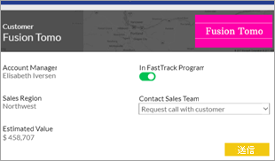

# Power BI でのビジュアルの種類

[!INCLUDE[consumer-appliesto-yynn](../includes/consumer-appliesto-yynn.md)]

レポート、ダッシュボード、Q&A でビジュアルを見つけることができます。 これらのビジュアルの種類には、Power BI でパッケージ化されているものと、"*Power BI ビジュアル*" のものがあります。 カスタム ビジュアルは、Power BI の外部で作成され、レポート "*デザイナー*" でそれを Power BI のレポートとダッシュボードに追加できるようになっています。 

この記事は、Power BI サービスにパッケージ化されているビジュアルの概要です。  これらは、最もよく目にするビジュアルです。 これらのビジュアルについてのより詳しい情報については、[ビジュアル型に関する Power BI レポート *デザイナー*のドキュメント](../visuals/power-bi-visualization-types-for-reports-and-q-and-a.md)を参照してください。

> [!NOTE]
> カスタム ビジュアルについては、[Microsoft AppSource](https://appsource.microsoft.com/marketplace/apps?product=power-bi-visuals) の **[Power BI ビジュアル]** セクションで探してください。 ビジュアルごとに、説明、作成者の情報、スクリーンショットまたはビデオを確認できます。 

## Power BI で利用可能なビジュアルの一覧
これらのビジュアルはすべて、Power BI のダッシュボードとレポートで見つけることができ、[Q&A で指定する](end-user-q-and-a.md)ことができます。 ビジュアルを操作する方法については、「[レポート、ダッシュボード、アプリでビジュアルを操作する](end-user-visualizations.md)」を参照してください。

### 面グラフ:基本 (階層) と積み上げ

基本的な面グラフは、折れ線グラフに基づいており、軸と線の間の範囲が塗りつぶされます。 面グラフは、時間の経過に伴う変化の大きさを強調し、トレンドの合計値に注目させるために使用できます。 たとえば、時間の経過に伴う利益を表すデータを面グラフにプロットして、総利益を強調することができます。

### 横棒グラフおよび縦棒グラフ

 

横棒グラフは、異なるカテゴリの特定の値を調べるときの標準的なグラフです。

### カード:単一数値

単一数値カードでは、1 つのファクトと 1 つのデータ ポイントが表示されます。 Power BI のダッシュボードまたはレポートで追跡すべき最重要の項目が 1 つの数値だけという場合もあります。たとえば、総売上高、対前年比の市場シェア、営業案件の総数などがこれに該当します。  

### カード:複数行

複数の行カードでは、1 行に 1 つまたは複数のデータ ポイントが表示されます。

### 複合グラフ

複合グラフは、縦棒グラフと折れ線グラフを組み合わせたものです。 2 つのグラフを 1 つに組み合わせると、データの比較をよりすばやく行うことができます。 複合グラフでは 1 つまたは 2 つの Y 軸を使用できるので、詳しく見ることができます。 

複合グラフは、次のような場合に最適な選択肢になります。
- 同じ X 軸を持つ折れ線グラフと縦棒グラフがある場合。
- 値の範囲が異なる複数のメジャーを比較する場合
- 2 つのメジャーの間の相関関係を 1 つのビジュアルで示す場合
- あるメジャーが別のメジャーで定義されているターゲットを満たすかどうかを調べる場合
- キャンバスのスペースを節約する場合

### ドーナツ グラフ

ドーナツ グラフは円グラフと似ています。  どちらのグラフも全体とその一部との関係を表します。 唯一の違いは、中央が空白で、ラベルまたはアイコン用の領域を確保できることです。

### じょうごグラフ

じょうごグラフは、段階と 1 つの段階から順番にフローする項目を持つプロセスを視覚化するのに役立ちます。  1 つの例は、潜在顧客で始まり、購入の完了で終わる営業プロセスです。

たとえば、次のような段階にわたって顧客を追跡する販売のじょうごグラフがあります:潜在顧客 > 見込みのあるリード > 見込顧客 > 契約 > 契約の締結。 じょうごの形状は、追跡しているプロセスの正常性がひとめでわかります。
じょうごの各段階は、全体のうちの割合を表します。 そして、ほとんどの場合、じょうごグラフの形は、最初の段階が最も大きく、それ以降の各段階はその前の段階よりも小さくなり、じょうごのような形になります。 洋ナシの形のじょうごグラフも役立ち、プロセスにおける問題を特定することができます。 ただし、通常は「インテーク」段階と呼ばれる最初の段階が最も大きくなります。

### ゲージ グラフ

放射状ゲージ グラフには、1 つの円弧があり、目標/KPI に向けた進行状況を測定した 1 つの値が表示されます。 目標 (ターゲット値) は、線 (指針) で示されます。 その目標への進行状況は、網掛け表示で示されます。 また、進行状況を表す値は、円弧の内側に太字で表示されます。考えられるすべての値は、最小値 (左端の値) から最大値 (右端の値) に向けて、円弧に沿って均等に割り振られます。

上に示した例は、自動車販売店を想定したもので、営業部門の月平均売上の推移を追跡記録しています。 目標は 140 であり、黒色の指針で示されています。 考えられる最小の平均売上は 0 であり、最大売上は 200 に設定しています。 青色の網掛けは、現時点で今月の平均売上が約 120 に達していることを示しています。 幸いなことに、目標に到達するまでに、まだ 1 週間の猶予があります。

次の場合は、放射状ゲージが最適な選択になります。
- 目標向けた進行状況を示す
- 百分位の測定値を表す (KPI など)
- 1 つの測定基準の正常性を示す
- ひとめでわかるように情報を表示する

 ### 主要なインフルエンサのグラフ

主要なインフルエンサのグラフは、選択した結果または値の主な要因を示しています。

重要なメトリックに影響する要因を理解する場合、主要なインフルエンサが重要な選択肢となります。 たとえば、 *顧客が 2 番目に何を注文するかに影響するもの *や、* 先の 6 月に売上が急上昇した原因* などです。 

### KPI

主要業績評価指標 (KPI) は、測定可能な目標に対する進捗状況を視覚的に伝える方法の 1 つです。 

KPI は、次のような場合に最適です。
- 進行状況 (目標より進んでいるか遅れているか) を測定する
- 目標までの距離 (どの程度進んで、または遅れているか) を測定する

### 折れ線グラフ

折れ線グラフでは、(通常は時間の経過に伴う) 一連の値すべての全体的な形を強調します。

### マップ:基本マップ

基本マップは、空間的な場所におけるカテゴリと数量の両方の情報を関連付けるのに使用されます。

### マップ:ArcGIS マップ

ArcGIS マップと Power BI を組み合わせると、マッピングをマップ上のポイントの表現を越える、まったく新しいレベルに引き上げることができます。 基本マップ、場所の種類、テーマ、記号のスタイル、参照レイヤーで使用可能なオプションでは、すばらしい有益なマップのビジュアルが作成されます。 地図上の信頼できるデータのレイヤー (国勢調査データなど) と空間分析を組み合わせにより、ビジュアルのデータをより深く理解できるようになります。

### マップ:塗り分け地図 (コロプレス)

塗り分け地図では、網掛け、着色またはパターンを使用して、値の違いを割合に応じて、地理的または地域的に表示します。 こうした相対的な違いは、薄い色の網掛け (頻度が低い/量が少ない) から、濃い色の網掛け (頻度が高い/量が多い) を使用して、すぐにわかるように表示されます。

### マップ:図形マップ

図形マップでは、色を使用してマップの領域が比較されます。 図形マップでは、マップ上のデータ ポイントの地理的な場所を正確に示すことはできません。 代わりに、これの主な用途は、違う色を適用することにより、マップ上の領域を相対的に比較できます。

### Matrix

マトリックス ビジュアルは、階段状レイアウトをサポートするテーブル ビジュアル (後の「テーブル」を参照) の一種です。 多くの場合、レポート デザイナーは、ユーザーがマトリックスの 1 つまたは複数の要素 (行、列、セル) を選択してレポート ページ上の他のビジュアルをクロス強調表示できるようにするため、レポートやダッシュボードにマトリックスを組み込みます。  

### 円グラフ

円グラフでは、全体に対する部分の関係が示されます。 

### Power Apps のビジュアル

レポート デザイナーでは、パワー アプリを作成し、それを Power BI レポートに埋め込むことができます。 ユーザーは、Power BI レポート内でそのビジュアルを操作できます。 

### Q&A ビジュアル

>[!TIP]
>[ダッシュボードでの Q&A エクスペリエンス](../create-reports/power-bi-tutorial-q-and-a.md)と同様に、Q&A ビジュアルでは、自然言語を使用してデータに関する質問をすることができます。 

詳細については、[Power BI の Q&A ビジュアル](../visuals/power-bi-visualization-types-for-reports-and-q-and-a.md)に関するページを参照してください。

### リボン グラフ

リボン グラフでは、どのデータ カテゴリが最高ランク (最大値) かが示されます。 リボン グラフでは、ランクの変化を効果的に確認できます。各期間を対象に、最高位の範囲 (値) が常に一番上に表示されます。

### 散布図、バブル チャート、ドット プロット グラフ

散布図には、必ず 2 つの値軸があり、横軸に沿って数値データの 1 つのセットが表示され、縦軸に沿って数値データのもう 1 つのセットが表示されます。 このグラフには x と y の数値が交差する位置に点が表示され、この 2 つの値が 1 つのデータ ポイントに結合されます。 これらのデータ ポイントは、データに応じて、横軸に沿って値が均等に分布したり、不均等に分布したりします。

バブル チャートでは、データ ポイントがバブルに置き換えられます。バブルのサイズは、データの追加のディメンションを表します。

ドット プロット グラフは、数値またはカテゴリ データを X 軸にプロットできることを除き、バブル チャートおよび散布図に似ています。 この例では、円ではなく正方形を使用し、X 軸に沿って売上高がプロットされます。

### 高密度散布図

定義上、対話機能に応答するビジュアルをすばやく作成するために、高密度データがサンプリングされます。 高密度サンプリングでは、重複するポイントを排除するアルゴリズムが使用され、データ セット内のすべてのポイントがビジュアルに表示されることが保証されます。 データの代表的なサンプルがプロットされるだけではありません。  

これにより、全体的なデータ セットの重要なポイントの応答性、表記、および明確な保存の最適な組み合わせが保証されます。

### スライサー

スライサーは、ページ上の他のビジュアルのフィルター処理に使用できるスタンドアロンのグラフです。 スライサーは、多くの異なる形式 (カテゴリ、範囲、日付など) で提供され、使用可能な値の 1 つだけ、多数、またはすべてを選択できるように書式設定できます。 

スライサーは、次のような場合に最適です。
- レポート キャンバスによく使うフィルターまたは重要なフィルターを表示してアクセスしやすくする
- ドロップダウン リストを開くことなく、現在のフィルターされた状態を簡単に表示する
- データ テーブルで不要な非表示の列でフィルター処理する
- 重要なビジュアルの隣にスライサーを配置することにより、レポートを絞り込む

### スタンドアロン画像

スタンドアロン画像は、レポートまたはダッシュボードに追加されたグラフィックです。 

### テーブル

テーブルは、関連性のあるデータが論理的な一連の行と列に格納されたグリッドです。 ヘッダーと合計行が含まれる場合もあります。 テーブルは、1 つのカテゴリの多くの値を調べるときの定量的な比較で役に立ちます。 たとえば、次の表にはカテゴリに対する 5 つの異なるメジャーが表示されています。

テーブルは、次のような場合に最適です。
- 詳細なデータと正確な値を表示および比較する場合 (視覚的な表現ではなく)
- 表形式でデータを表示する場合
- カテゴリ別に数値データを表示する場合

### ツリーマップ

ツリーマップは、サイズが値を示す色付きの四角形を使ったグラフです。  メインの四角形内で入れ子になった四角形では階層的になることがあります。 各四角形内の面積は、測定される値に基づいて割り当てられます。 各四角形は大きさの順に左上 (最大) から右下 (最小) に向かって配置されます。

ツリーマップは、次のような場合に最適な選択肢です。
- 大量の階層データを表示する場合
- 横棒グラフで多数の値を効果的に処理できない場合
- 各部分と全体の間の割合を示す場合
- 階層内のカテゴリの各レベルにわたってメジャーの分布のパターンを示す場合
- サイズと色分けを使用して属性を示す場合
- パターン、外れ値、最も重要な要因、および例外を見分ける場合

### ウォーターフォール グラフ

ウォーターフォール図では、値が加算または減算された際の累計 (現在の合計) が示されます。 一連の加算と減算の変化によって、初期値 (たとえば、純利益) が、どのように影響を受けるかを理解するために役立ちます。

各縦棒が色分けされるため、ひと目で増減を識別できます。 最初と最後の値の縦棒は、通常は横軸を起点としますが、中間値の縦棒は浮動縦棒です。 この外観から、ウォーターフォール図はブリッジ図と呼ばれることもあります。

ウォーターフォール図は、次のような場合に最適な選択肢です。
- 時間やさまざまなカテゴリを超えてメジャーに変化がある場合
- 合計値に影響を与える大きな変化を監査する場合
- 収益のさまざまな要因を示すことによって、会社の年間利益をプロットして、総利益 (または損) に到達するよう表示する場合
- 会社のある年の年始と年末の社員数をグラフに示す場合
- 毎月の収入と支出、および口座の現在の残高を視覚化する場合

## 使用するビジュアルを Q&A で指定する
Power BI の Q&A で自然言語クエリを入力するときに、クエリ内でビジュアルの種類を指定できます。  例:

***ツリー マップでの都市ごとの売り上げ***

## 次の手順
[レポート、ダッシュボード、アプリでビジュアルを操作する](end-user-visualizations.md)    
[sqlbi.com の正しい視覚エフェクト参照](https://www.sqlbi.com/wp-content/uploads/videotrainings/dashboarddesign/visuals-reference-may2017-A3.pdf)

