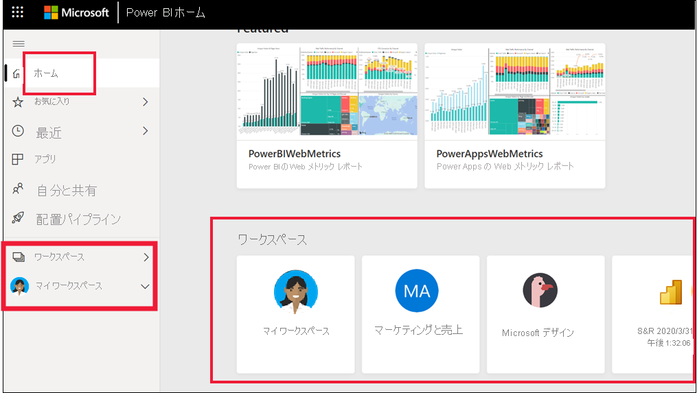
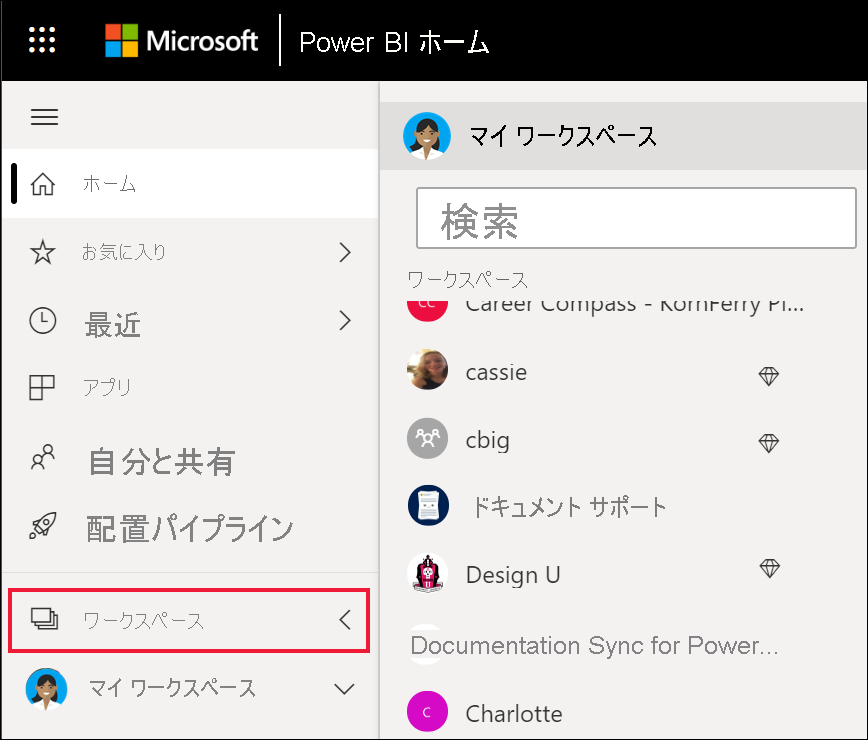

# ワークスペースで共同作業する

 "*ワークスペース*" は、特定のコンテンツで同僚と共同作業を行う場所です。 ワークスペースは、ダッシュボードとレポートのコレクションを保持するために Power BI "*デザイナー*" が作成します。 その後、デザイナーはワークスペースを同僚と共有できます。 また、デザイナーは、ダッシュボードとレポートのコレクションを "*アプリ*" にバンドルして、コミュニティ全体、組織、または特定のユーザーやグループに配布することもできます。 "*テンプレート アプリ*" と呼ばれる特定の種類のアプリの場合、アプリのインストール時にワークスペースが作成されます。 [アプリに関する詳細を参照してください](end-user-apps.md)。 

 Power BI サービスを使用するすべてのユーザーには、**マイ ワークスペース** も与えられます。  マイ ワークスペースは、自分でコンテンツを作成できる個人用サンドボックスです。

 自分のワークスペースは、Power BI の **[ホーム]** で、またはナビゲーション ペインから **[ワークスペース]** を選択することで、表示することができます。

 

## ワークスペースの種類
**マイ ワークスペース** には、ユーザーが所有および作成するすべてのコンテンツが格納されます。 これは、個人用サンドボックスまたはユーザーのコンテンツの作業領域と考えることができます。 Power BI を使用する多くの "*ビジネス ユーザー*" の場合、ジョブに新しいコンテンツの作成が含まれていないため、**マイ ワークスペース** は空のままです。 定義上、"*ビジネス ユーザー*" は、他のユーザーが作成したデータを利用し、そのデータを使用してビジネス上の意思決定を行います。 コンテンツを作成することがわかっている場合は、代わりに、[デザイナー向けの Power BI に関する記事](../create-reports/index.yml)を参照することを検討してください。

**ワークスペース** には、特定のアプリのすべてのコンテンツが含まれます。 *デザイナー* は、アプリを作成するときに、そのアプリを利用するために必要なすべてのコンテンツをアプリにバンドルします。 コンテンツには、ダッシュボード、レポート、データセットが含まれる場合があります。 すべてのアプリに、これらの 3 つの種類のコンテンツが含まれているとは限りません。 1 つのダッシュボードのみを含むアプリや、各コンテンツの種類を 3 つずつ含むアプリもあります。また、20 個以上ものレポートを含むアプリもあります。 これはすべて、*デザイナー* がアプリにどんなコンテンツを含めるかによって異なります。 一般に、"*ビジネス ユーザー*" と共有されるアプリ ワークスペースには、データセットは含まれません。

下の Fig sales ワークスペースには、3 つのレポートと 1 つのダッシュボードが含まれています。 

![スクリーンショットでは、ワークスペースが [ワークスペース] のメニュー項目に表示されています。ワークスペースには、レポートとダッシュボードが含まれています。](media/end-user-workspaces/power-bi-app-workspace.png)

## ワークスペースのアクセス許可

アクセス許可を使用すると、チームで共同作業できるように、ワークスペースでユーザーが実行できる操作が決定されます。  新しいワークスペースへのアクセス権を付与する場合、"*デザイナー*" が、個人またはグループをワークスペース ロールの 1 つに追加します:**ビューアー**、**メンバー**、**共同作成者**、または **管理者** があります。 

Power BI の "*ビジネス ユーザー*" は通常、**ビューアー** ロールを使用してワークスペースでの操作を行います。 ただし、"*デザイナー*" によって **メンバー** または **共同作成者** ロールに割り当てられることもあります。 ビューアー ロールでは、他のユーザーによって作成されて共有されたコンテンツ (ダッシュボード、レポート、アプリ) を表示し、操作できます。 また、ビューアー ロールでは基になるデータセットにアクセスできないため、基になるデータを "壊す" 心配がなく、コンテンツを操作する方法として安全です。

ビューアー ロールを持つ "*ビジネス ユーザー*" ができることの詳しい一覧については、[ビジネス ユーザー向けの Power BI の機能](end-user-features.md)に関する記事を参照してください。

### ワークスペースのアクセス許可とロール

4 つのロールの機能は次のとおりです:管理者、メンバー、共同作成者、およびビューアー。 表示と操作を除く、これらの機能すべてに、Power BI Pro ライセンスが必要です。

[!INCLUDE[power-bi-workspace-roles-table](../includes/power-bi-workspace-roles-table.md)]

## ライセンス、ワークスペース、容量
また、ライセンスは、ワークスペースで実行できる操作と実行できない操作を決定する役割も果たします。 多くの機能を使用するには、ユーザーが Power BI *Pro* ライセンスを持っているか、またはワークスペースを Premium 容量に格納する必要があります。 

多くの場合、"*ビジネス ユーザー*" は Free ライセンスを使用します。 [ライセンスの詳細についてはこちらを参照してください](end-user-license.md)。 コンテンツが Premium 容量に格納されていない場合、ビジネス ユーザーはアクセスできません。

ワークスペースが Premium 容量に格納されている場合は、"*ビジネス ユーザー*" はそのワークスペース内のコンテンツを表示して操作できます。 Premium 容量に格納されているワークスペースは、ダイヤモンド形のアイコンで示されます。

 詳細については、[Power BI ライセンスの種類](end-user-license.md)に関するページを参照してください。

## 次の手順
* [Power BI のアプリ](end-user-apps.md)    

* わからないことがある場合は、 [Power BI コミュニティで質問してみてください](https://community.powerbi.com/)。

