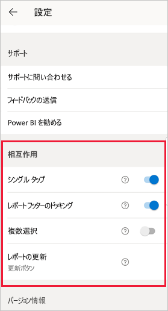
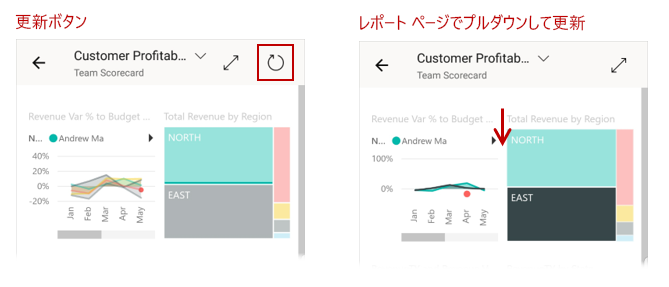
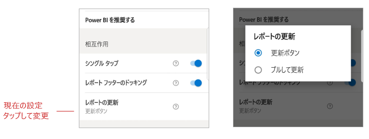

# レポートの対話式操作の設定を構成する

## Overview

Power BI モバイル アプリには、多くの構成可能な "対話式操作" の設定があります。この設定を使用すると、データの操作方法を制御したり、Power BI モバイル アプリの一部の要素の動作を定義したりすることができます。 次の表は、現在使用可能な対話式操作の設定と、それらを備えているデバイスを示しています。

| 設定 | Android フォン | iPhone | Android タブレット  | iPad |
|---------|:-:|:-:|:-:|:-:|
| [レポート ビジュアルでのシングル タップとダブルタップの対話式操作](#single-tap) |✔|✔|||
| [レポート ビジュアルでのデータ ポイントの複数選択と単一選択](#multi-select) |✔|✔|✔|✔|
| [レポート フッターのドッキングと動的なレポート フッター](#docked-report-footer) |✔|✔|||
| [ボタンからのレポートの更新とプルによる更新](#report-refresh) |✔||||

対話式操作の設定に移動するには、ご自分のプロフィール画像をタップして [サイド パネル](./mobile-apps-home-page.md#header)を開き、**[設定]** を選択して、**[対話式操作]** セクションを見つけます。

対話式操作の設定については、以降のセクションで説明します。

## 対話式操作の設定

### シングル タップ
Power BI モバイル アプリをダウンロードすると、そのアプリはシングルタップ操作用に設定されます。 これは、何らかのアクション (スライサー項目の選択、クロス強調表示、リンクまたはボタンのクリックなど) を行うためにビジュアルをタップすると、タップによってビジュアルの選択と必要な操作の実行の両方が行われることを意味します。

必要に応じて、シングル タップの対話式操作をオフにすることができます。 その後、ダブルタップの対話式操作にすることができます。 ダブルタップ操作では、最初にビジュアルをタップして選択してから、ビジュアル内をもう一度タップして目的のアクションを実行します。

### 複数選択

複数選択オプションを使用すると、レポート ページ上の複数のデータ ポイントを選択できます。 複数選択が有効になっている場合、タップする各データ ポイントは、選択した他のデータ ポイントに追加され、ページ上のすべてのビジュアルで、結合された結果が自動的に強調表示されます。 複数選択が無効の場合、データ ポイントをタップして選択すると、現在の選択範囲が新しい選択項目に置き換えられます。

データ ポイントの選択を解除するには、もう一度タップします。

>[!NOTE]
>Power BI ビジュアルでは、複数選択はサポートされていません。
>
>複数選択モードは、レポート サーバーの次回のリリースの Power BI Report Server でサポートされます。

### レポート フッターのドッキング

ドッキングされたレポート フッターの設定では、レポート フッターをレポートの下部にドッキング (固定して常に表示) したままにするか、非表示にしてレポート内のアクション (スクロールなど) に基づいて再表示するかを指定します。

Android フォンでは、ドッキングされたレポート フッター設定が既定で **オン** になっています。つまり、レポート フッターがドッキングされ、レポートの下部に常に表示されます。 レポートでのアクションに応じて表示および非表示にする動的レポート フッターを使用する場合は、この設定を **オフ** に切り替えます。

### レポートの更新

レポートの更新設定では、レポートの更新を開始する方法を定義します。 レポートを更新するには、すべてのレポート ヘッダーに更新ボタンを表示するか、またはレポート ページでプルして更新アクション (上から下へ少しプルする) を使用する、のいずれかを選択できます。 次の図は、この 2 つの選択肢を示しています。 

Android フォンでは、更新ボタンが既定で追加されます。

レポートの更新設定を変更するには、対話式操作の設定でレポートの更新項目に移動します。 現在の設定が表示されます。 値をタップしてポップアップを開くと、新しい値を選択できます。

## リモート構成

対話式操作は、管理者がアプリ構成ファイルで MDM ツールを使用して、リモートで構成することもできます。 この方法では、組織全体または組織内の特定のユーザー グループに対して、レポートの対話式操作エクスペリエンスを標準化できます。 詳細については、[モバイル デバイス管理を使用した対話式操作の構成](./mobile-app-configuration.md)に関するページを参照してください。

## 次のステップ
* [レポートを操作する](./mobile-reports-in-the-mobile-apps.md#interact-with-reports)
* [モバイル デバイス管理を使用して対話式操作を構成する](./mobile-app-configuration.md)
