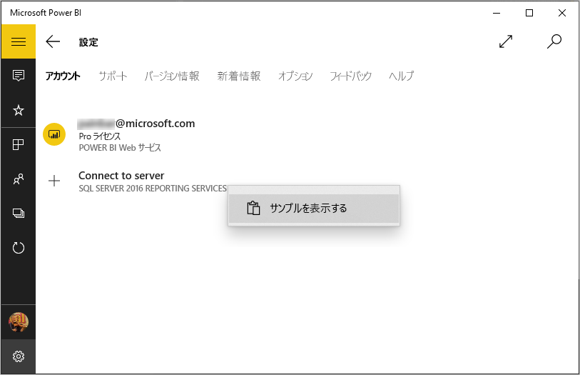
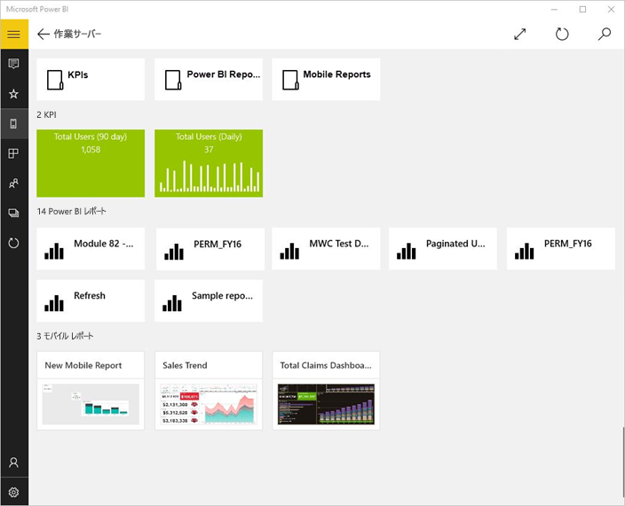

# Power BI Windows アプリでオンプレミス レポートと KPI を表示する
Windows 10 用 Power BI アプリを使って、タッチ対応のモバイルから、SQL Server 2016 Reporting Services のオンプレミスの重要なビジネス情報に簡単にアクセスできます。 

## 最初に行うこと
SQL Server 2016 Enterprise Edition Mobile Report Publisher で [Reporting Services のモバイル レポートを作成](/sql/reporting-services/mobile-reports/create-mobile-reports-with-sql-server-mobile-report-publisher)し、[Reporting Services の Web ポータル](/sql/reporting-services/web-portal-ssrs-native-mode)にそのレポートを公開します。 KPI は Web ポータルで作成します。 作成したレポートと KPI を簡単に探せるように、フォルダーで整理したりお気に入りに追加したりします。 

Windows 10 用 Power BI アプリで、フォルダーやお気に入りに追加した KPS、モバイル レポート、Power BI レポートを表示します。 

> [!NOTE]
> デバイスで Windows 10 を実行している必要があります。 このアプリは、最低 1 GB RAM と 8 GB の内部記憶域を持つデバイスに適しています。

>[!NOTE]
>**Windows 10 Mobile を使用するスマートフォン**に対する Power BI モバイル アプリのサポートは、2021 年 3 月 16 日に廃止されます。 [詳細情報](/legal/powerbi/powerbi-mobile/power-bi-mobile-app-end-of-support-for-windows-phones)

## SQL Server 2016 Reporting Services サーバーを使用せずにサンプルを参照する
Reporting Services の Web ポータルへのアクセス権がない場合でも、Reporting Services のモバイル レポートの機能を参照できます。

1. Windows 10 デバイスで Power BI アプリを開きます。
2. 左上隅にあるグローバル ナビゲーション ボタン  をタップします。
3. **[設定]** アイコン ![[設定] アイコン](media/mobile-app-windows-10-ssrs-kpis-mobile-reports/power-bi-settings-icon.png) をタップし、 **[サーバーに接続]** を右クリックするかタップして長押しした後、 **[サンプルを表示]** をタップします。
   
   
4. Retail Reports または Sales Reports フォルダーを開き、その KPI やモバイル レポートを調べます。
   
   

サンプルを参照して KPI とモバイル レポートを操作します。

## Reporting Services レポート サーバーに接続する
1. ナビ ペインの下部にある **[設定]** ![[設定] アイコン](media/mobile-app-windows-10-ssrs-kpis-mobile-reports/power-bi-settings-icon.png) をタップします
2. **[サーバーに接続]** をタップします。
3. サーバーのアドレス、ユーザー名、パスワードを入力します。 サーバーのアドレスには次の形式を使用します。
   
     `https://<servername>/reports` または `https://<servername>/reports`
   
   > [!NOTE]
   > 接続文字列の先頭に、**http** または **https** を含めてください。
   > 
   > 
   
    必要に応じて、 **[詳細オプション]** をタップしてサーバーの名前を指定します。
4. チェック マークをタップして接続します。 
   
   ナビ ペインに、サーバーが表示されます。
   
   
   
   >[!TIP]
   >[グローバル ナビゲーション] ボタン ![[グローバル ナビゲーション] ボタン](media/mobile-app-windows-10-ssrs-kpis-mobile-reports/powerbi_windows10_options_icon.png) をタップすると、Power BI サービスでいつでも Reporting Services のモバイル レポートとダッシュボードの間を行き来できます。 
   > 

   >[!NOTE]
   >カスタム ポートを使用して構成されたレポート サーバーはサポートされておらず、Power BI Windows アプリからはアクセスできません。 

## Power BI アプリで Reporting Services の KPI とモバイル レポートを表示する
Reporting Services KPI、モバイル レポート、Power BI レポート (プレビュー) は、Reporting Services Web ポータル上で同じフォルダー内に表示されます。

* KPI をタップし、フォーカス モードで表示します。
  
    
* モバイル レポートをタップし、Power BI アプリを開いて対話します。
  
    

## お気に入りの KPI とレポートを表示する
Reporting Services Web ポータルで KPI、モバイル レポート、Power BI レポートをお気に入りに設定し、Power BI のお気に入りのダッシュボードやレポートと共に、Windows 10 デバイスの 1 つの便利なフォルダー内に表示できます。

* **[お気に入り]** をタップします。
  
   ![[お気に入り] アイコン](media/mobile-app-windows-10-ssrs-kpis-mobile-reports/power-bi-ssrs-mobile-report-favorite-menu.png)
  
   Web ポータルでお気に入りに追加したアイテムは、すべてこのページに表示されます。
  
[Power BI モバイル アプリでのお気に入り](mobile-apps-favorites.md)の詳細については、こちらをご覧ください。

## レポート サーバーへの接続を削除する
Power BI モバイル アプリから一度に接続できるのは、1 つのレポート サーバーだけです。 別のサーバーに接続する場合は、現在のサーバーを切断する必要があります。

1. ナビ ペインの下部にある **[設定]** ![[設定] アイコン](media/mobile-app-windows-10-ssrs-kpis-mobile-reports/power-bi-settings-icon.png) をタップします。
2. 接続を望まないサーバー名をタップしてそのまま押さえます。
3. **[サーバーの削除]** をタップします。
   
    

## Reporting Services のモバイル レポートと KPI を作成する
Power BI モバイル アプリでは、Reporting Services KPI とモバイル レポートを作成できません。 作成するには、SQL Server Mobile Report Publisher と SQL Server 2016 Reporting Services Web ポータルを使用します。

* [Reporting Services のモバイル レポートを作成](/sql/reporting-services/mobile-reports/create-mobile-reports-with-sql-server-mobile-report-publisher)し、Reporting Services の Web ポータルに公開します。
* [Reporting Services の Web ポータルで KPI を作成](/sql/reporting-services/working-with-kpis-in-reporting-services)します

## 次のステップ
* [Windows 10 用 Power BI モバイル アプリを使ってみる](mobile-windows-10-phone-app-get-started.md)  
* [Power BI とは?](../../fundamentals/power-bi-overview.md)  
* 疑問がある場合 [Power BI コミュニティで質問してみてください](https://community.powerbi.com/)。