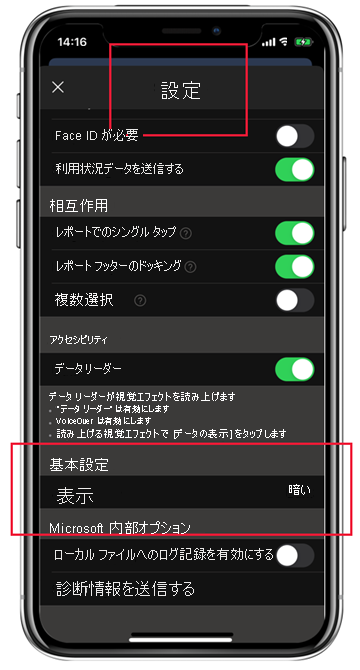

# ダーク モード

ユーザー個人の好みの表示設定に対応するため、iOS および Android 用 Power BI モバイル アプリでは、ライトとダーク両方の画面モードがサポートされています。 ダーク モードでは、画面の明るさが低下し、コンテンツが見やすくなります。

 ダーク モードでは、すべてのアプリ エクスペリエンスが暗い背景で表示されます。 ただし、Power BI のコンテンツは影響を受けません。 レポート、ダッシュボード、アプリは、デザイナーが意図したように常に表示されます。
 
 既定の Power BI モバイル アプリでは、デバイスの設定を使用して、表示する画面の外観が決定されます。 デバイスがダーク モードに構成されている場合、アプリはダーク モードで表示されます。

>[!NOTE]
>Android デバイスにおけるダーク モードのデバイス レベルでのサポートは、Android 10 から正式に提供されています。 以前のバージョンの Android を実行しているデバイスでは、Power BI モバイル アプリのダーク モードは、アプリの外観設定によって制御できます。

ライト モードとダーク モードを切り替えるか、デバイス設定によってモードを決定できるようにするには、 **[設定]** ページに移動し、下にスクロールして **[外観]** をタップし、目的のモードを選択します。

