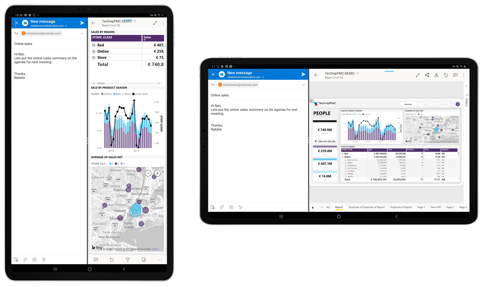

# 分割画面モードで Power BI モバイル アプリを使用する

適用対象:

|  |
|:--- |
| Android タブレット |

お使いの Android タブレットでマルチウィンドウがサポートされている場合は、分割画面モードを使用して、別のアプリとサイド バイ サイドでデータを表示し、対話することができます。

### 分割画面モードの使用

お使いのタブレットのドキュメントを参照して、デバイス上で分割画面モードでアプリを開く方法を確認してください。

分割画面モードでアプリを開いたら、アプリ間の分割線を右または左にドラッグして、画面のサイズを調整できます。

分割画面モードは、モバイル デバイスでの表示用に最適化されているレポートに対して最適に動作します。 お客様がレポート作成者である場合は、レポートでモバイル用に最適化されたレイアウトを作成することを検討してください。 詳細については、「[モバイル アプリ用に Power BI レポートを最適化する](../../create-reports/desktop-create-phone-report.md)」を参照してください。

>[!IMPORTANT]
>分割画面モードは、サポートされている Android タブレットでのみ機能します。 分割画面モードがサポートされているかどうかを確認するには、お使いのデバイスのドキュメントを参照してください。