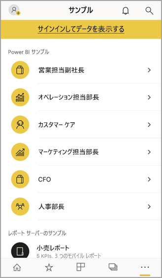

# iOS デバイスでの Power BI モバイル アプリの概要
iPhone または iPad 上の Microsoft Power BI for iOS アプリは、Power BI、Power BI Report Server、Reporting Services のモバイル BI エクスペリエンスを提供します。 タッチ入力対応のモバイル アクセスでどこからでもオンプレミスやクラウド内の自社のダッシュボードを簡単に表示したり、そこでやり取りしたりできます。 ダッシュボードでデータを探索し、電子メールやテキスト メッセージで同僚と共有できます。 [Apple Watch](mobile-apple-watch.md) で最新データを常に把握できます。  

Power BI Desktop で Power BI レポートを作成して、それらを公開します。

* [それらを Power BI サービスに公開し](../../service-get-started.md)、ダッシュボードを作成します。
* [それらをオンプレミスから Power BI Report Server に公開します](../../report-server/quickstart-create-powerbi-report.md)。

iOS の Power BI モバイル アプリで、オンプレミスまたはクラウドのダッシュボードやレポートを操作します。

「[Power BI 用モバイル アプリの新機能](mobile-whats-new-in-the-mobile-apps.md)」をご覧ください。

## アプリのダウンロード
Apple App Store から iPhone または iPad に [iOS アプリをダウンロード](https://go.microsoft.com/fwlink/?LinkId=522062 "iOS アプリをダウンロード")します。

iOS 用の Power BI モバイル アプリは、iOS 11 以降を実行している任意のデバイス上で実行できます。 

## Power BI サービスにサインアップする
まだサインアップしていない場合は、[powerbi.com](https://powerbi.microsoft.com/get-started/) にアクセスし、 **[Power BI - クラウド コラボレーションと共有]** の下の **[無料で試す]** を選択します。

## Power BI アプリの概要
1. iOS デバイスで Power BI アプリを開きます。
2. Power BI にサインインするには、 **[Power BI]** タブをタップし、サインインの詳細を入力します。  
   Reporting Services のモバイル レポートと KPI にサインインするには、 **[レポート サーバー]** タブをタップし、サインインの詳細を入力します。
   
   
   
   アプリにサインインしたら、画面の左上隅にあるアカウント プロファイル画像をタップすると、Power BI とレポート サーバーの間で切り替えられます。 

## Power BI と Reporting Services のサンプルをお試しください。
サインアップしなくても、Power BI と Reporting Services のサンプルを表示したり、操作したりできます。

サンプルにアクセスするには、ナビゲーション バーの **[その他のオプション]** (...) をタップし、 **[サンプル]** を選択します。

さまざまな Power BI サンプルの後にレポート サーバーのサンプルが続きます。

   
   
   > [!NOTE]
   > サンプルではすべての機能を使用できるわけではありません。 たとえば、ダッシュボードの基礎となるサンプル レポートは表示できません。サンプルは他のユーザーと共有できません。サンプルはお気に入りに設定することができません。 
   > 
   >

## Power BI モバイル アプリでコンテンツを見つける

Power BI コンテンツの検索を始めるにはヘッダーの虫眼鏡をタップします。

## お気に入りのダッシュボードとレポートを表示する
ナビゲーション バーの **[お気に入り]** () をタップし、[お気に入り] ページを表示します。 

[Power BI モバイル アプリでのお気に入り](mobile-apps-favorites.md)の詳細については、こちらをご覧ください。

## Power BI モバイル アプリのエンタープライズ サポート
Microsoft Intune を使用すると、Android 用や iOS 用の Power BI モバイル アプリなど、デバイスとアプリを管理できます。

Microsoft Intune では、アクセスに暗証番号 (PIN) を必要とする項目を管理したり、アプリケーションでデータを処理する方法を制御したり、さらには、アプリが使用されていないときにアプリのデータを暗号化したりできます。

> [!NOTE]
> iOS デバイスで Power BI モバイル アプリを使用しているとき、組織が Microsoft Intune MAM を構成している場合、バックグラウンド データ更新がオフになります。 次にアプリを起動したときは、Web 上の Power BI サービスからデータが更新されます。
> 

詳細については、「[Power BI モバイル アプリを Microsoft Intune で構成する](../../service-admin-mobile-intune.md)」をご覧ください。 

## 次の手順

* [Power BI とは?](../../fundamentals/power-bi-overview.md)
* わからないことがある場合は、 [Power BI コミュニティで質問してみてください](https://community.powerbi.com/)。

