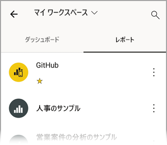
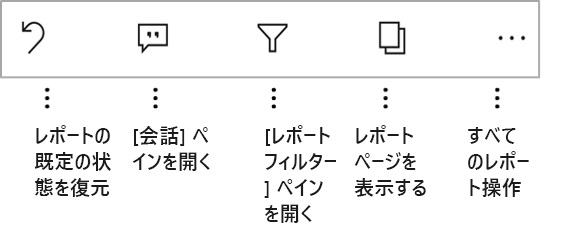
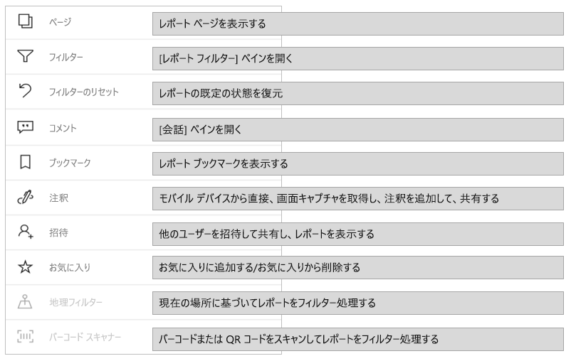
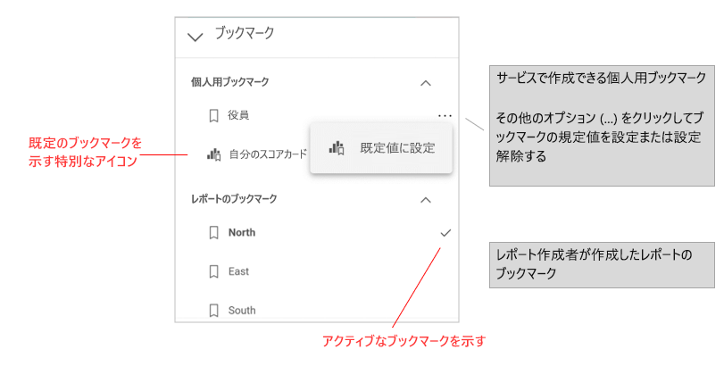
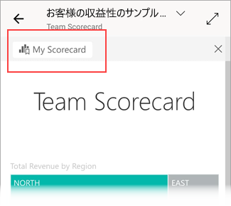

# Power BI モバイル アプリのレポートを調べる
適用対象:

|  |  |  |  |  |
|:---: |:---: |:---: |:---: |:---: |
| iPhone |iPad |Android フォン |Android タブレット |Windows 10 デバイス |

>[!NOTE]
>**Windows 10 Mobile を使用するスマートフォン**に対する Power BI モバイル アプリのサポートは、2021 年 3 月 16 日に廃止されます。 [詳細情報](https://go.microsoft.com/fwlink/?linkid=2121400)

Power BI レポートは、データの対話型表示で、データから得られるさまざまな発見と洞察を表す視覚化が付いています。 Power BI モバイル アプリでは、3 段階のプロセスの 3 つ目の手順でレポートを表示できます。

1. [Power BI Desktop でレポートを作成します](../../create-reports/desktop-report-view.md)。 Power BI Desktop で[スマートフォン用にレポートを最適化](mobile-apps-view-phone-report.md)することもできます。
2. そのレポートを Power BI サービス [(https://powerbi.com)](https://powerbi.com) または [Power BI Report Server](../../report-server/get-started.md) に公開します。  
3. Power BI モバイル アプリでこれらのレポートを操作します。

## モバイル アプリで Power BI レポートを開く
Power BI レポートは、入手した場所に応じてモバイル アプリのそれぞれの場所に保存されます。 具体的には、アプリ、自分と共有、ワークスペース (マイ ワークスペースを含む)、またはレポート サーバーに保存されます。 関連するダッシュボードからレポートにアクセスしたり、一覧が表示されたりすることがあります。

リストおよびメニューでは、レポート名の横にアイコンが表示され、アイテムがレポートであることがわかります。

Power BI モバイル アプリのレポートには、次の 2 つのアイコンがあります。

* ![[レポート] アイコン](./media/mobile-reports-in-the-mobile-apps/report-default-icon.png) アプリで横向きに表示されるレポートを示します。 ブラウザーで見た場合と同じように見えます。

*  電話に最適化されたページが少なくとも 1 つ含まれる、縦向きに表示されるレポートを示します。

> [!NOTE]
> 電話を横向きに持つと、レポート ページがモバイル レイアウトの場合でも、常に横レイアウトが表示されます。

ダッシュボードからレポートを表示するには、タイルの右上にある**その他のオプション** (...) をタップして、 **[レポートを開く]** をタップします。
  
  
  
  すべてのタイルがレポートとして開けるわけではありありません。 たとえば、Q&A ボックスで質問すると作成されるタイルをタップしてもレポートは開きません。
  
## レポートを操作する
アプリでレポートを開いたら、操作を開始できます。 レポートとそのデータを使用してさまざまなことが行えます。 レポート フッターには、そのレポートに対して実行できるアクションが表示されます。 レポートに表示されるデータをタップおよびロング タップすることにより、データを細分化することもできます。

### シングルタップ操作とダブルタップ操作
Power BI モバイル アプリをダウンロードすると、そのアプリはシングルタップ操作用に設定されます。 これは、何らかのアクション (スライサー項目の選択、クロス強調表示、リンクまたはボタンのクリックなど) を行うためにビジュアルをタップすると、タップによってビジュアルの選択と必要な操作の実行の両方が行われることを意味します。

必要に応じて、ダブルタップ操作に切り替えることができます。 ダブルタップ操作では、最初にビジュアルをタップして選択してから、ビジュアル内をもう一度タップして目的のアクションを実行します。

ダブルタップ操作に切り替えるには、またはシングルタップ操作に戻すには、[アプリの対話式操作の設定](./mobile-app-interaction-settings.md)に移動します。

### データ ポイントの選択の単一選択モードと複数選択モード

レポートでは、データ ポイントをタップして選択します。 単一選択モードと複数選択モードのどちらを使用するかを選択できます。 単一選択モードでは、データ ポイントをタップして選択すると、その選択によってそれ以前にした選択がすべて置き換えられます。 複数選択モードでは、データ ポイントをタップして選択すると、その選択が現在の選択内容に "*追加*" され、すべての選択をまとめた結果がレポートのビジュアル全体で強調表示されます。

選択したデータ ポイントの選択を解除するには、単純にそれをもう一度タップします。

単一選択モードと複数選択モードを切り替えるには、[アプリの操作設定](./mobile-app-interaction-settings.md)に移動します。

### タップとロング タップの使用
タップは、マウス クリックと同じです。 したがって、データ ポイントに基づいてレポートをクロス強調表示したい場合は、そのデータ ポイントをタップします。
スライサー値をタップすると、値が選択され、レポートの残りの部分がその値によってスライスされます。
リンク、ボタン、またはブックマークをタップすると、レポート作成者によって定義されたアクションが実行されます。

おそらくお気付きでしょうが、ビジュアルをタップすると、枠線が表示されます。 枠線の右上隅には、**その他のオプション** (...) が表示されます。省略記号をタップすると、そのビジュアルで実行できるアクションのメニューが表示されます。

### ツールヒントとドリル操作
データ ポイントをロング タップ (タップして保持) すると、このデータ ポイントが表す値を示すツールヒントが表示されます。

レポート作成者がレポート ページのツールヒントを構成していた場合、既定のツールヒントはレポート ページのツールヒントに置き換えられます。

> [!NOTE]
> レポートのツールヒントは、640 x 320 ピクセル以上のビューポートでサポートされています。 これより低いデバイスの場合、アプリでは既定のツールヒントが使用されます。

レポート作成者は、データ内の階層と、レポート ページ間のリレーションシップを定義できます。 階層を使用すると、ビジュアルや値から別のレポート ページにドリルダウン、ドリルアップ、ドリルスルーできます。 そのため、値をロング タップすると、ツールヒントに加えて、関連するドリル オプションがフッターに表示されます。

ビジュアルの特定の部分をタップしてから*ドリルスルー* オプションをタップすると、Power BI によって、レポートの別のページがタップした値でフィルター処理されて表示されます。 レポートの作成者は、それぞれ異なるページを表示するドリルスルー オプションを 1 つ以上定義できます。 その場合、ドリルスルーしたいオプションを選ぶことができます。 "戻る" ボタンで前のページに戻ることができます。

詳細については、[こちら](../../create-reports/desktop-drillthrough.md)で Power BI Desktop でドリルスルーを追加する方法をご確認ください。
   
   > [!IMPORTANT]
   > Power BI モバイル アプリでは、マトリックスとテーブルのビジュアルのドリル操作は、セル値でのみ有効になり、列ヘッダーまたは行ヘッダーでは使用できません。
   
   
   
### レポート フッターでの操作の使用
レポート フッターからは、現在のレポート ページまたはレポート全体に対していくつかのアクションを実行できます。 フッターでは、最もよく使用されるアクションへのクイック アクセスが提供されます。 **その他のオプション** (...) ボタンをタップすると、他のアクションにアクセスできます。

フッターから次の操作を実行できます。
* レポート フィルターとクロス強調表示の選択を、元の状態に戻します。
* 会話ウィンドウを開き、このコメントを表示するか、レポートにコメントを追加します。
* フィルター ウィンドウを開き、レポートに現在適用されているフィルターを表示または変更します。
* レポート内のすべてのページを一覧表示します。 ページ名をタップすると、そのページが読み込まれて表示されます。
レポート ページ間を移動するには、画面の端から中央に向けてスワイプします。
* すべてのレポート操作を表示します。

#### すべてのレポート操作
レポート フッターの**その他のオプション** (...) をタップすると、レポートで実行できるすべてのアクションが表示されます。

一部のアクションは、特定のレポート機能に依存しているため、無効になっている場合があります。
例:

**ブックマーク**はレポートに[ブックマーク](mobile-reports-in-the-mobile-apps.md#bookmarks)が設定されている場合にのみ表示されます。 Power BI サービスで定義できる個人用ブックマークとレポートの作成者によって定義されたブックマークの両方が表示されます。 ブックマークの 1 つが既定のブックマークとして定義されている場合、レポートが読み込まれたとき、そのビューが開きます。

Power BI モバイル アプリからの共有を禁止する [Intune 保護ポリシー](https://docs.microsoft.com/intune/app-protection-policies)が組織で適用されている場合、 **[注釈を付けて共有]** がオフになることがあります。

**招待**は、ユーザーがレポートを他のユーザーと共有するアクセス許可を持っている場合にのみ有効になります。 レポートの所有者である場合、または所有者から再共有アクセス許可を与えられている場合にのみ、アクセス許可が付与されます。

レポート作成者がレポートを地理的データで分類している場合は、**現在の場所でのフィルター処理**が有効になります。 レポート内の地理的データの識別の詳細については、[こちら](https://docs.microsoft.com/power-bi/desktop-mobile-geofiltering)を参照してください。

**バーコードのスキャンによるレポートのフィルター処理**は、レポート内のデータセットが**バーコード**としてタグ付けされている場合にのみ有効になります。 Power BI Desktop でのバーコードのタグ付けの詳細については、[こちら](https://docs.microsoft.com/power-bi/desktop-mobile-barcodes)を参照してください。

### ブックマーク

Power BI モバイル アプリでは、レポートの作成者が定義したレポートブックマークと、Power BI サービスで定義できる個人用ブックマークの両方がサポートされています。 ブックマーク メニューは、[レポート アクション ツールバー](mobile-reports-in-the-mobile-apps.md#all-report-actions)の **[その他のオプション]** (...) の下にあります。

既定のブックマークは、特別なアイコンで示されます。 個人用のブックマークの場合、既定の設定を設定、設定解除、または変更するには、変更するブックマークの横にある **[その他のオプション (...)]** をタップし、 **[既定値に設定]** または **[既定値のクリア]** を選択します。

レポートのブックマーク ビューが開くと、ブックマークの名前がレポートの一番上に表示されます。

[Power BI サービスでのブックマークについてさらに学習してください](https://docs.microsoft.com/power-bi/consumer/end-user-bookmarks)。

## レポート使用時のエクスペリエンスを構成する
Power BI モバイル アプリには、レポート エクスペリエンスを制御するための設定がいくつかあります。 現時点では、以下のことを構成できます。
* **レポート ビジュアルの対話式操作**: シングルタップ操作またはダブルタップ操作のどちらを使用するかを選択できます。
* **データ更新方法**: レポート データを更新するために、更新ボタンまたは引き下げるアクションのいずれかを選択できます。
* **レポート フッターの表示**: 常に表示される固定フッターにするか、操作 (スクロールなど) に応じて非表示になったり再表示されたりする動的フッターにするかを選択できます。

これらの設定を変更する方法については、[アプリの対話式操作の設定](./mobile-app-interaction-settings.md)に関するページを参照してください。

## 次の手順
* [電話用に最適化された Power BI レポートの表示と対話](mobile-apps-view-phone-report.md)
* [電話用に最適化されたレポートのバージョンを作成する](../../create-reports/desktop-create-phone-report.md)
* わからないことがある場合は、 [Power BI コミュニティで質問してみてください](https://community.powerbi.com/)。