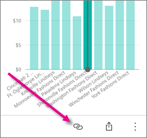

# Power BI モバイル アプリのタイルを調べる
適用対象:

|  |  |  |  |  |
|:--- |:--- |:--- |:--- |:--- |
| iPhone |iPad |Android フォン |Android タブレット |Windows 10 デバイス |

タイルは、データのライブ スナップショットであり、ダッシュボードにピン留めされます。 その値は、データが変更されると変更されます。 **[Power BI サービスでダッシュボードにタイルを追加](../end-user-tiles.md)します。** 

その後、Power BI モバイル アプリからタイルをフォーカス モードで開き、操作します。 Bing と R に基づいたタイルを含め、ありとあらゆる種類のビジュアルを使ったタイルを開くことができます。

## iOS アプリ内のタイル

1. [iOS 用のモバイル アプリでダッシュボード](mobile-apps-view-dashboard.md)を開きます。
2. タイルをタップします。 タイルがフォーカス モードで開きます。このモードでは、タイルのデータを簡単に表示および調査できます。 フォーカス モードでは次のことができます。
   
   折れ線グラフ、横棒グラフ、または縦棒グラフでタップすると、視覚化の特定の部分の値を表示できます。
   
    
   
   "*たとえば、この折れ線グラフで選択されている値は、**今年**と**昨年**の **8 月の売上値**です。* "  
   
   円グラフでスライスをタップすると、円の上部にスライスの値を表示できます。  
   
   
3. マップで、 **[マップの中心を設定する]** アイコン  をタップし、マップの中心を現在の場所に設定します。

   

4. 鉛筆アイコン  をタップして[タイルに注釈を付け](mobile-annotate-and-share-a-tile-from-the-mobile-apps.md#annotate-and-share-the-tile-report-or-visual)、共有アイコン  をタップして[他のユーザーとそれを共有します](mobile-annotate-and-share-a-tile-from-the-mobile-apps.md#annotate-and-share-the-tile-report-or-visual)。

5. [タイルに警告を追加](mobile-set-data-alerts-in-the-mobile-apps.md)します。 値が目標を超えるか下回る場合、Power BI から通知されます。

6. ダッシュボード作成者がリンクをタイルに追加することもあります。 その場合、フォーカス モードのときにリンク アイコン  が表示されます。
   
    
   
    リンクにより、他の Power BI ダッシュボードや外部の URL に移動できます。 [リンクをタップ](../../create-reports/service-dashboard-edit-tile.md#hyperlink)して、Power BI アプリ内で開くことができます。 外部サイトの場合、Power BI に許可するよう求められます。
   
    
   
    Power BI アプリ内でリンクを開いた後で、リンクをコピーしたり、代わりにブラウザー ウィンドウで開いたりすることができます。
7. タイルの基となっている[レポートを開きます](mobile-reports-in-the-mobile-apps.md) 。
8. タイルをフォーカス モードのままにするには、タイル名をタップし、ダッシュボードの名前または **[マイ ワークスペース]** をタップします。
   
    

## Android フォンおよびタブレット用のモバイル アプリのタイル
1. [Power BI モバイル アプリでダッシュボード](mobile-apps-view-dashboard.md)を開きます。
2. タイルをタップしてフォーカス モードで開きます。このモードでは、タイルのデータを簡単に表示および調査できます。
   
   
   
    フォーカス モードでは次のことができます。
   
   * グラフをタップして、折れ線グラフ、横棒グラフ、縦棒グラフ、またはバブル チャート内のバーを移動し、視覚化の特定の点の値を表示します。  
   * 鉛筆アイコン  をタップして[タイルに注釈を付け](mobile-annotate-and-share-a-tile-from-the-mobile-apps.md#annotate-and-share-the-tile-report-or-visual)、[スナップショットを共有] アイコン  をタップして[他のユーザーとそれを共有します](mobile-annotate-and-share-a-tile-from-the-mobile-apps.md#annotate-and-share-the-tile-report-or-visual)。
   * [レポートを開く] アイコン  をタップして、モバイル アプリで[レポートを表示](mobile-reports-in-the-mobile-apps.md)します。
3. ダッシュボード作成者がリンクをタイルに追加することもあります。 その場合、縦の省略記号 **[…]** をタップすると、 **[リンクを開く]**  が表示されます。
   
    
   
    リンクにより、他の Power BI ダッシュボードや外部の URL に移動できます。 [リンクをタップ](../../create-reports/service-dashboard-edit-tile.md#hyperlink)して、Power BI アプリ内で開くことができます。 外部サイトの場合、Power BI に許可するよう求められます。
   
    
   
    Power BI アプリ内でリンクを開いた後で、リンクをコピーしたり、代わりにブラウザー ウィンドウで開いたりすることができます。
4. 左上隅にある矢印をタップしてタイルを閉じ、ダッシュボードに戻ります。

## Windows 10 モバイル アプリのタイル

>[!NOTE]
>**Windows 10 Mobile を使用するスマートフォン**に対する Power BI モバイル アプリのサポートは、2021 年 3 月 16 日に廃止されます。 [詳細情報](https://go.microsoft.com/fwlink/?linkid=2121400)

1. Windows 10 用の [Power BI モバイル アプリでダッシュボード](mobile-apps-view-dashboard.md)を開きます。
2. タイルで垂直線の省略記号をタップします。 ここでは、次の操作を実行できます。 
   
    
   
    [タイルのスナップショットを共有](mobile-windows-10-phone-app-get-started.md)できます。
   
    **[レポートを開く]**  をタップして、[基になっているレポートを表示](mobile-reports-in-the-mobile-apps.md)できます。
   
    リンクがある場合は、[リンクを開きます](../../create-reports/service-dashboard-edit-tile.md#hyperlink)。 リンクにより、Power BI ダッシュボードや外部の URL に移動できます。
3. **[タイルを展開]**  をタップします。 タイルがフォーカス モードで開きます。このモードでは、タイルのデータを簡単に表示および調査できます。 このモードでは、次のことができます。
   
   円グラフを回転させて円の上部にスライスの値を表示します。  
   
   
   
   グラフをタップして、折れ線グラフ、横棒グラフ、縦棒グラフ、またはバブル チャート内のバーを移動し、視覚化の特定の点の値を表示します。  
   
   
   
   "*この横棒グラフでは、 **Decor** バーの値はグラフの上部に表示されます。* "
   
   **[全画面表示]** アイコン  をタップすると、タイルが全画面表示モードで開き、ナビゲーション バーとメニュー バーは表示されません。
   
   > [!NOTE]
   > Windows 10 用 Power BI モバイル アプリでは、[ダッシュボードとレポートを全画面表示モードで表示する](mobile-windows-10-app-presentation-mode.md)こともできます。
   > 
   > 
   
   マップで、 **[マップの中心を設定する]** アイコン  をタップし、マップの中心を現在の場所に設定します。
   
   
   
   [スナップショットの共有] アイコン  をタップして、他ユーザーと[タイルを共有](mobile-windows-10-phone-app-get-started.md)します。   
   
   [レポートを開く] アイコン  をタップして、そのタイルの基になっている[レポートを表示](mobile-reports-in-the-mobile-apps.md)します。 
4. 戻る矢印または戻るボタンをタップして、タイルを閉じ、ダッシュボードに戻ります。

## 次の手順
* [Power BI とは?](../../fundamentals/power-bi-overview.md)
* わからないことがある場合は、 [Power BI コミュニティで質問してみてください](https://community.powerbi.com/)。
