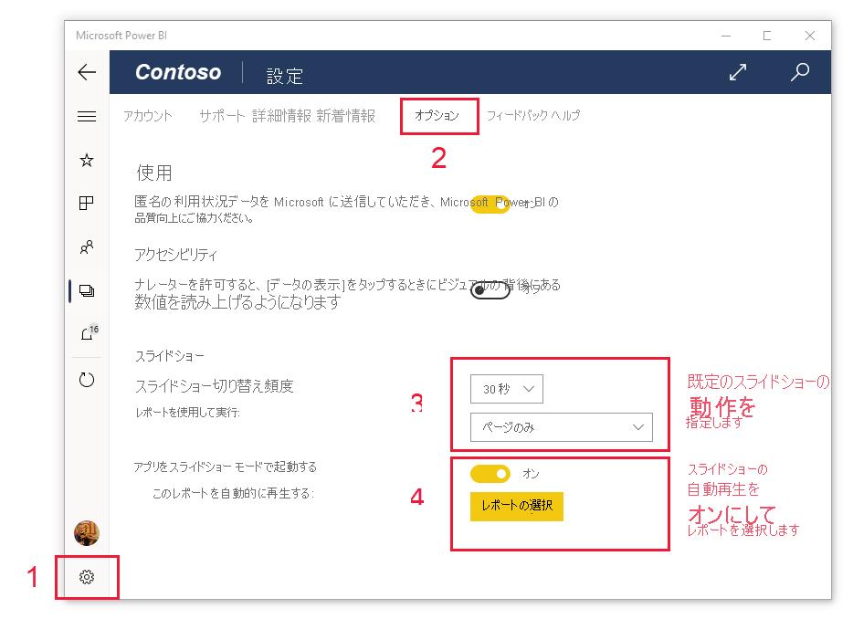

# Surface Hub と Windows 10 デバイスで、プレゼンテーション モードでレポートとダッシュボードを表示する
Windows 10 デバイスと Surface Hub で、プレゼンテーション モードを使用し、レポートとダッシュボードを全画面表示できます。 プレゼンテーション モードは、会議やカンファレンスで、またはオフィスの専用プロジェクターで Power BI を表示する場合や、小さい画面上の領域を最大化するためだけにも役立ちます。

プレゼンテーション モードの場合:
* すべての "クロム" (ナビゲーション バーやメニュー バーなど) は表示されなくなり、レポート内のデータに集中しやすくなります。
* 操作ツール バーを使用できるようになり、データと対話したり、プレゼンテーションを制御したりできます。
* ページ、ブックマーク、またはページとブックマークの両方を自動的に順番に表示する、スライドショーを再生できます。

>[!NOTE]
>**Windows 10 Mobile を使用するスマートフォン**に対する Power BI モバイル アプリのサポートは、2021 年 3 月 16 日に廃止されます。 [詳細情報](https://go.microsoft.com/fwlink/?linkid=2121400)

## プレゼンテーション モードを使用する
Power BI モバイル アプリで **[全画面表示]** アイコンをタップすると、全画面表示モードに切り替わります。
![[全画面表示] アイコン](././media/mobile-windows-10-app-presentation-mode/power-bi-full-screen-icon.png) アプリのクロムが消え、画面の下部または右側と左側 (画面のサイズによって変わります) に操作ツール バーが表示されます。

このツール バーからタップして、次の操作を実行できます。

|||
|-|-|
|![[戻る] アイコン](./media/mobile-windows-10-app-presentation-mode/power-bi-windows-10-presentation-back-icon.png)|前のページに**戻ります**。 アイコンを長押しすると、階層リンク ウィンドウがポップアップ表示され、レポートやダッシュボードを含むフォルダーに移動できます。|
||プレゼンテーション内のレポートの別のページに**ページを切り替えます**。|
||**ブックマークを適用**して、そのブックマークによってキャプチャされるデータの特定のビューを表示します。 個人用とレポートの両方のブックマークを適用できます。|
||Surface ペンを使ってレポート ページ上に描画したり、注釈を付けたりするときの**インクの色を選択します**。|
||Surface ペンを使ってレポート ページ上に描画したり、注釈を付けたりするために作成した**インク マークを消します**。          |
||**既定のビューにリセット**し、プレゼンテーション中に行ったすべてのフィルター、スライサー、またはその他のデータ ビューの変更をクリアします。|
|![[共有] アイコン](./media/mobile-windows-10-app-presentation-mode/power-bi-windows-10-share-icon.png)|プレゼンテーション ビューの画像を同僚と**共有します**。 この画像には、プレゼンテーション中に Surface ペンで書いたすべての注釈が含まれます。|
||レポートを**更新します**。|
|![[再生] アイコン](./media/mobile-windows-10-app-presentation-mode/power-bi-windows-10-presentation-play-icon.png)|**スライドショーを再生します**。操作バーを非表示にして、スライドショーを開始します。 セレクターを使用すると、ページ、ブックマーク、またはページとブックマークの両方の間での自動切り替えを選択できます。 既定では、スライドショーでは 30 秒ごとに自動的にページが切り替わります。 これらの設定は、[ **[設定] > [オプション]** ](#slideshow-settings) で変更できます。 スライドショーについての[詳細情報](#slideshows)を参照してください|
||プレゼンテーション モードを**終了します**。|
|![[検索] アイコン](./media/mobile-windows-10-app-presentation-mode/power-bi-windows-10-presentation-search-icon.png)|Power BI 内の他の成果物を**検索します**。|

ツール バーを切り離し、画面上の任意の場所にドラッグ アンド ドロップできます。 これは大きな画面の場合に便利です。レポートの特定の領域に集中的に取り組むとき、その隣にツールを配置します。 ツール バーを指で触れ、レポート キャンバスまでスワイプします。

## スライドショー

スライドショーを再生して、自動的にプレゼンテーションを順番に表示することができます。 ページ、ブックマーク、またはページとブックマークの両方を順番に表示するようにスライドショーを設定できます。

操作ツール バーの **[再生]** ボタンを選択すると、スライドショーが開始します。 コントローラーが表示され、スライドショーを一時停止したり、再生されている内容 (ページ、ブックマーク、またはページとブックマークの両方) を変更したりできます。

 コントローラーには、現在表示されているビュー (ページまたはブックマークとページ) の名前が表示されます。 上の図では、**Sales** という名前のレポート内で、現在 **Sales Performance** ページ上の **Asia Pacific** ブックマークが表示されていることを確認できます。

既定では、スライドショーは 30 秒ごとに 1 回のペースでページのみが切り替わります。 [スライドショーの設定](#slideshow-settings)で既定の動作を変更できます。

### スタートアップ時にスライドショーを自動再生する

アプリが起動されるたびにスライドショーの再生を自動的に開始するように、Power BI モバイル アプリを設定できます。 このオプションは、手動で介入せずに、パブリック表示でレポートを実行するキオスクのようなエクスペリエンスを作成する場合に便利です。 自動再生用のレポートの設定に関する詳細については、「[スライドショーの設定](#slideshow-settings)」を参照してください。

### スライドショーの設定

既定では、スライドショーは 30 秒ごとに 1 回のペースでページのみが切り替わります。 この既定の動作を変更するには、次に示すように、 **[設定]、[オプション]** の順に移動します。 自動再生をオンにして、再生するレポートを選択することもできます。

1. [設定] アイコンを選択します。

1. [オプション] タブを開きます。

1. 必要に応じて、スライドショーで切り替える内容の既定の設定 (ページ、ブックマーク、またはその両方) と、スライドショーを切り替える頻度を変更します。

1. アプリの起動時にレポートの自動再生を開始する必要がある場合は、切り替えをオンにして、 **[レポートの選択]** を選択します。 アクセス権のあるレポートを検索することができます。

## 次の手順
* [Power BI サービスから全画面表示モードでダッシュボードとレポートを表示する](../end-user-focus.md)
* わからないことがある場合は、 [Power BI コミュニティで質問してみてください](https://community.powerbi.com/)。