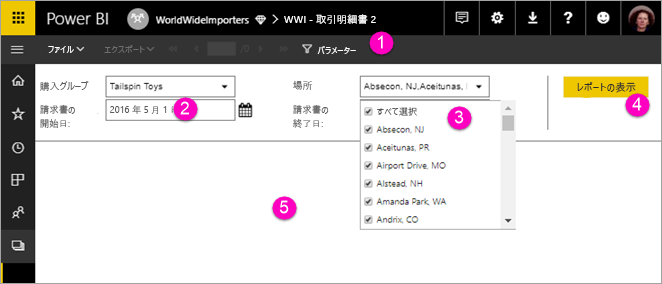

# Power BI サービスでページ分割されたレポートのパラメーターを表示する

この記事では、Power BI サービスでページ分割されたレポートのパラメーターを操作する方法を学びます。  レポート パラメーターでは、レポート データをフィルター処理する手段が提供されます。 パラメーターにより、使用可能な値の一覧が提供されます。 ユーザーは、1 つまたは複数の値を選択したり、パラメーター テキスト ボックスにテキストを入力して値を検索することができます。 一部のパラメーターには既定値があり、レポートを表示する前に値を選択する必要があります。  

パラメーターを持つレポートを表示する場合、各パラメーターは、ユーザーが値を対話的に指定できるように、レポート ビューアー ツール バーに示されます。 次の図では、**Buying Group**、**Location**、**From Date**、**To Date** の各パラメーターを含むレポートのパラメーター領域を示します。  

## Power BI サービスの [パラメーター] ウィンドウ

  
1.  **[パラメーター] ウィンドウ**: レポート ビューアーのツール バーには、"必須" や、各パラメーターの既定値などのプロンプトが表示されます。    
  
2.  **Invoices From / To Date パラメーター**: 2 つの日付パラメーターには既定値があります。 日付を変更するには、テキスト ボックスに日付を入力するか、またはカレンダーで日付を選択します。  
  
3.  **Location パラメーター**: Location パラメーターは、1 つ、複数、または全部の値を選択できるように設定されています。 
  
4.  **[レポートの表示]**: パラメーターの値を入力または変更した後、**[レポートの表示]** をクリックしてレポートを実行します。 

5. **既定値**: すべてのパラメーターに既定値がある場合、レポートは最初に表示した時点で自動的に実行されます。 このレポートでは一部のパラメーターに既定値がないため、値を選択するまでレポートは表示されません。  

## 次のステップ

[Power BI サービスでのページ分割されたレポート](end-user-paginated-report.md)
