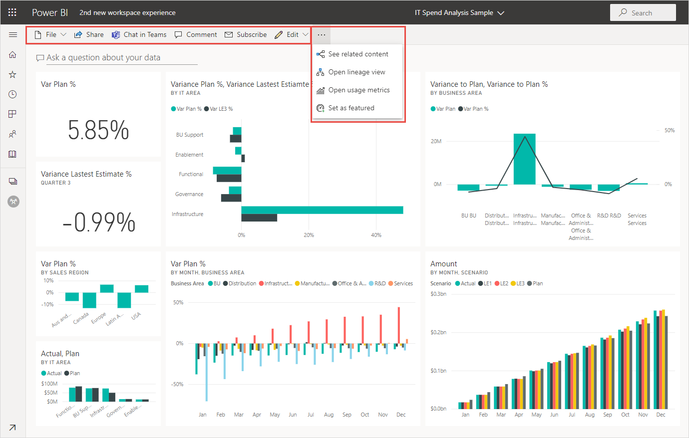

# Power BI サービスの "新しい外観"

Power BI サービス (app.powerbi.com) には、レポートの表示と操作を容易にする新しい外観が備わっています。 新しい外観はよりシンプルで、他の Microsoft 製品で慣れ親しんでいる外観に基づいています。 Power BI サービス全体で、明るい色のテーマに切り替え、アイコンを更新して、レポート コンテンツが焦点の中心になるようにしました。 

**Power BI Desktop** の新しい外観に関する情報をお探しですか?  「[Power BI Desktop で更新されたリボンを使用する](../create-reports/desktop-ribbon.md)」を参照してください。

新しい外観の変更点の概要を次に示します。 詳細については、番号付きのセクションを参照してください。

特定のアクションをお探しですか。 「["新しい外観": アクションの新しい場所](service-new-look-where-actions.md)」を参照してください。

## 1. 縦長のページ リスト 
読み取りビューには、レポート ページの名前が縦長のウィンドウに一覧表示されます。 これらは目立ち、見逃されることがなく、Word や PowerPoint のナビゲーションに似ています。 レポート領域の残りの部分は、拡大または縮小できます。縦長のウィンドウのサイズを変更するか、二重矢印を選択して完全に閉じます。

レポートに対する編集アクセス許可を持っている場合は、レポートの編集ビューと同じように、ページ名が下部にわたって表示されるように設定することができます。 詳細については、記事「Power BI レポートの設定を変更する」の「[[ページ ウィンドウ] を設定する](../create-reports/power-bi-report-settings.md#set-the-pages-pane)」を参照してください。

## 2. 単純化されたアクション バー 

上部に表示される最新のアクション バーには、レポート コンシューマーにとって最も重要なコマンドが配置されています。 エクスポート、共有、Teams でのチャット、およびサブスクライブが簡単になります。 

![[新しいアクション バー] のスクリーンショット。](media/service-new-look/power-bi-new-look-action-bar.png)

## 3. レポート コマンドの場所

以前の外観にあった機能はどれも削除されていません。 その他のより高度なコマンドについては、 **[その他のオプション] (...)** を選択してください。 「["新しい外観": アクションの新しい場所](service-new-look-where-actions.md)」で詳細を確認してください。

## 4. 新しいフィルター エクスペリエンス

既定では、レポートの新しい [フィルター] ウィンドウが新しい外観で表示されます。 また、ビジュアルの [フィルター] アイコンをポイントすると、そのビジュアルに影響を与えるすべてのフィルターとスライサーが表示されます。

## レポートの詳細の表示 

上部のバナーで、最終更新日や連絡先情報などの詳細をすばやく確認できます。  レポートに関する追加の詳細を表示するには、メニューを開きます。 レポートの所有者にメールを送信することもできます。

## レポートの編集モードに変更はありません 

作成エクスペリエンスは、デスクトップでのエクスペリエンスと同様に保たれています。 新しい外観の変更は、読み取りビューにのみ適用されます。

## ダッシュボードの "新しい外観" エクスペリエンス 

ダッシュボードには、簡略化されたアクション バーもあります。 レポートやアプリと同様に、一貫したエクスペリエンスが実現されますが、機能の違いは保たれます。 ダッシュボードでのアクションを次に示します。
 

## 次のステップ

- [Power BI Desktop で更新されたリボンを使用する](../create-reports/desktop-ribbon.md)
- [コンシューマー向けの Power BI](end-user-consumer.md)
