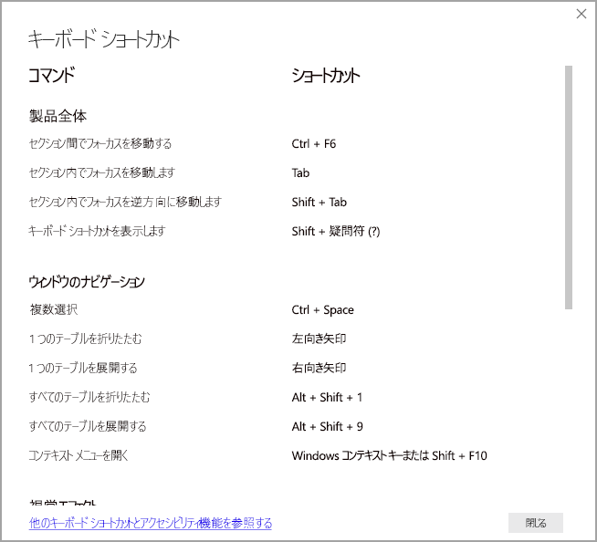
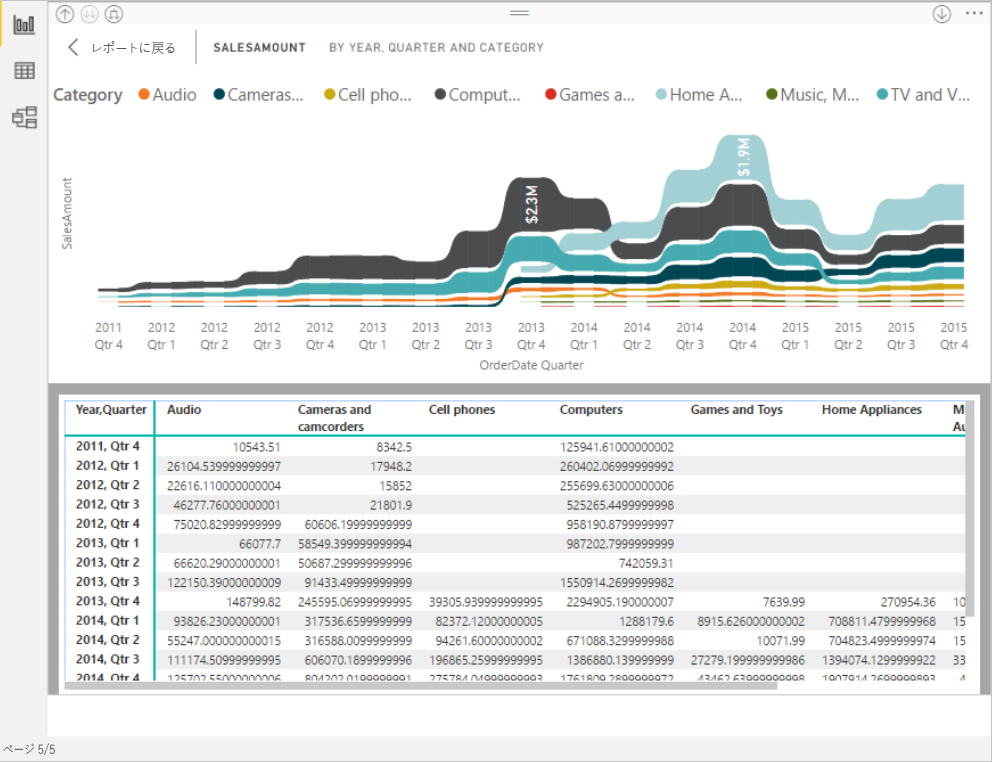

# アクセシビリティ機能を使用して Power BI レポートを使用する
Power BI には、障碍のある方がより簡単に Power BI レポートを利用および操作できるよう支援するさまざまな機能が組み込まれています。 これらのツールは、支援技術を使用しないユーザーと同じ情報をレポートから入手するのに役立ちます。

この記事を読むにあたって知っておくべき用語がいくつかあります。

* **フォーカス**は、マウス ポインターが置かれているページ上の場所です。 通常、フォーカスはオブジェクトを囲む青い枠線で示されます。
* **キャンバス**は、実際のレポートのページ領域です。

以降のセクションでは、Power BI レポートを利用する際に使用できるアクセシビリティ ツールについて説明します。

## キーボード ナビゲーション

Power BI Desktop または Power BI サービスを起動している場合、**Tab** キーを押すとすぐに右上隅にツールヒントが表示されます。 **[Power BI でスクリーン リーダーを使用するためのヒントです]** というリンクからは、この記事に移動し、アクセシビリティ ツールを使用したレポートの利用方法についての情報が提供されます。 **[メイン コンテンツにスキップ]** リンクをクリックすると、レポート キャンバスに移動します。

**?** キーを押すと、 ダイアログが開き、Power BI 内でよく使用されるキーボード ショートカットが表示されます。 Power BI 内で使用できるキーボード ショートカットの完全な一覧を確認するには、ダイアログの下部にあるリンクに移動します。これにより、[キーボード ショートカット](desktop-accessibility-keyboard-shortcuts.md)に関する Power BI のドキュメントが表示されます。

**Ctrl + F6** キーを使用して、特定のレポート ページ上のレポート ページ タブまたはオブジェクトのフォーカスを切り替えることが可能です。 読み込まれているレポート ページにフォーカスがある場合、**Tab** キーを使用してページのすべてのテキスト ボックス、画像、図形、およびグラフなどの各オブジェクトにフォーカスを移動します。 

一般に、**Enter** キーを使用した選択または入力と、**Esc** キーを使用した終了は、Power BI における一般的なコマンドです。

### ビジュアルのキーボード ナビゲーション

多くの Power BI レポート作成者は、大量のデータを含むレポートを作成します。 ビジュアル内を移動する際に、ビジュアル内のすべての要素間を Tab キーを使って移動するのが面倒な場合があります。 ビジュアルのキーボード ナビゲーションは、3 つのレベルから成る階層として設計されています。 これら 3 つのレベルについては、次の段落で説明します。

最初のレベル内を移動するには、ビジュアルに移動するときに、**Ctrl + 右方向キー**を押して、そのビジュアルに入ります。 そのビジュアルに入ったら、**Tab** キーを押して、ビジュアルの主な領域を順番に切り替えることができます。 順番に切り替えることができるそうした主な領域は、データ プロット領域、軸カテゴリ (ビジュアルに適用されている場合)、および凡例 (ビジュアルにある場合) です。

次の .gif は、ビジュアルの最初のレベル内でどのように順番に切り替わるかを示しています。

階層の 2 番目のレベルは、ビジュアルの主な領域 (データ プロット領域、x 軸カテゴリ、凡例) のいずれかに入ります。 レポートを利用する場合に、これらの主な領域のいずれかに移動すると、ビジュアルのそのセクション内にあるデータ ポイントまたはカテゴリを順番に切り替えることができます。 詳細を確認する領域を決定したら、**Enter** キーを押して、その特定の領域内で順番に切り替えることができます。

系列内のすべてのデータ ポイントを選択する場合は、凡例に移動し、**Enter** キーを押します。 凡例に入ったら、**Tab** キーを押して、凡例内のさまざまなカテゴリ間を移動できます。 **Enter** キーを押すと、特定の系列が選択されます。

特定のデータ ポイントを選択する場合は、データ プロット領域に移動し、**Enter** キーを押します。 データ プロット領域に入ったら、**Tab** キーを押して、データ ポイント間を移動できます。 実際のビジュアルに複数の系列が含まれている場合は、**上方向**キーまたは**下方向**キーを押すと、別の系列内のデータ ポイントに移動できます。

カテゴリ軸内のすべてのデータ ポイントを選択する場合は、軸ラベルに移動し、**Enter** キーを押します。 軸ラベルに入ったら、**Tab** キーを押して、ラベル名間を移動できます。 **Enter** キーを押すと、ラベル名が選択されます。

特定のレイヤー内に移動した場合は、**Esc** キーを押すと、そのレイヤーから出ることができます。 次の .gif は、ユーザーがどのようにビジュアルのレベルに出入りし、データポイント、x 軸カテゴリ ラベルを選択し、別の系列に移動し、系列内のすべてのデータ ポイントを選択するかを示しています。

キーボードの使用中にオブジェクトやビジュアルに移動できない場合は、レポート作成者がそのオブジェクトをタブ オーダーから非表示にすることに決定したことが原因である可能性があります。 レポート作成者は、通常、装飾オブジェクトをタブ オーダーから非表示にします。 論理的な方法でレポート内を Tab キーを使って移動できない場合は、レポート作成者に連絡してください。 レポート作成者は、オブジェクトとビジュアルのタブ オーダーを設定できます。

### スライサーのキーボード ナビゲーション

スライサーにもアクセシビリティ機能が組み込まれています。 スライサーを選択するときにスライサーの値を調整するには、**Ctrl + 右方向**キーを押してスライサー内のさまざまなコントロール間を移動します。 たとえば、最初に **Ctrl + 右方向**キーを押すと、消しゴムにフォーカスが移動します。 次に、**Space** キーを押すことは、スライサーのすべての値を消去する消しゴム ボタンをクリックすることと同じです。

**Tab** キーを押すと、スライサー内のコントロール間を移動できます。消しゴムにフォーカスがあるときに **Tab** キーを押すと、ドロップダウン ボタンに移動します。 もう一度 **Tab** キーを押すと、最初のスライサー値に移動します (範囲など、スライサーに複数の値がある場合)。

### ページを切り替える

フォーカスがレポート ページ タブ上にある場合、**Tab** キーまたは**方向**キーを使用して、1 つのレポート ページから次のレポート ページへフォーカスを移動します。 レポート ページのタイトルおよびそれが現在選択されているかどうかがスクリーン リーダーによって読み上げられます。 現在フォーカスのあるレポート ページを読み込むには、**Enter** キーまたは **Space** キーを使用します。

### ビジュアル ヘッダーにアクセスする
ビジュアル間を移動する場合は、**Alt + Shift + F10** キーを押すことで、ビジュアル ヘッダーにフォーカスを移動することができます。 ビジュアル ヘッダーには、並べ替え、グラフの背後にあるデータのエクスポート、フォーカス モードなど、さまざまなオプションが含まれています。 ビジュアル ヘッダーに表示されるアイコンは、レポート作成者が表示するように決定したオプションによって異なります。

## スクリーン リーダー

レポートを表示するときは、スキャン モードをオフにすることをお勧めします。 Power BI は、ドキュメントよりも、アプリケーションのように扱う必要があります。そのため、カスタム ナビゲーションを使って操作しやすくできるよう設定されています。 Power BI Desktop でスクリーン リーダーを使用する場合、Power BI Desktop を開く前にご利用のスクリーン リーダーも開いていることを確認する必要があります。

オブジェクト間を移動すると、スクリーン リーダーによってオブジェクトの種類とオブジェクトのタイトル (存在する場合) が読み上げられます。 また、レポート作成者がオブジェクトの説明 (代替テキスト) を指定している場合は、スクリーン リーダーによってそれも読み上げられます。

### データの表示
**Alt + Shift + F11** キーを押すと、 **[データの表示]** ウィンドウがアクセシビリティ バージョンで表示されます。 このウィンドウにより、通常はスクリーン リーダーで使用するのと同じキーボード ショートカットを使って、HTML テーブルで、ビジュアルで使用されるデータを調べることができます。

**[データを表示します]** 機能は、このキーボード ショートカットを使ってスクリーン リーダーからのみアクセスできる HTML テーブルです。 ビジュアル ヘッダーのオプションから **[データを表示します]** を開いた場合、スクリーン リーダーと互換性の "*ない*" テーブルが表示されます。  キーボード ショートカットから **[データを表示します]** を使用する場合は、ご利用のスクリーン リーダーで使用できるホット キーをすべて活用するためにスキャン モードをオンにしてください。

**[データを表示します]** ビューを終了してレポートに戻るには、**Esc** キーを押します。

## ハイ コントラスト モード

Power BI サービスでは、Windows 用に選択されたハイ コントラストの設定の検出が試みられます。 その検出の有効性と精度は、Power BI サービスを表示しているブラウザーによって異なります。 Power BI サービスでテーマを手動で設定する場合は、 **[表示]、[ハイ コントラストの色]** の順に選択して、レポートに適用するテーマを選択します。

## 次の手順

Power BI のアクセシビリティに関する記事のコレクションは次のとおりです。

* [Power BI でのアクセシビリティの概要](desktop-accessibility-overview.md) 
* [アクセシビリティ対応の Power BI レポートの作成](desktop-accessibility-creating-reports.md) 
* [アクセシビリティ ツールを使用した Power BI レポートの作成](desktop-accessibility-creating-tools.md)
* [Power BI レポートのアクセシビリティ キーボード ショートカット](desktop-accessibility-keyboard-shortcuts.md)
* [レポートのアクセシビリティ チェックリスト](desktop-accessibility-creating-reports.md#report-accessibility-checklist)

