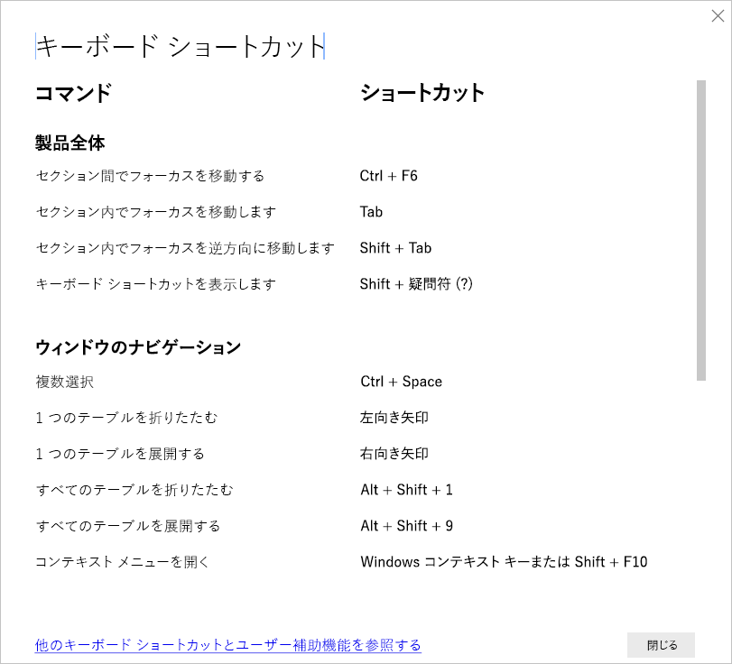

# Power BI Desktop のキーボード ショートカット

キーボード ショートカットは、キーボードを使用して Power BI レポートの中を移動するのに役立ちます。 この記事内の表では、Power BI レポート内で使用できるショートカットについて説明します。 

Power BI Desktop を使用している場合は、**Shift + ?** キーを押すと、 次の画像に示すように、キーボード ショートカットを表示できます。

**Power BI Desktop** でのこれらのキーボード ショートカットの使用に加えて、各ショートカットは次のエクスペリエンスでも同様に機能します。

* **[Q&A Explorer]** ダイアログ
* **[作業の開始]** ダイアログ
* **[ファイル]** メニューおよび **[バージョン情報]** ダイアログ
* **[警告]** バー
* **[ファイルの復元]** ダイアログ
* **[Frowns]\(問題点\)** ダイアログ

Microsoft はアクセシビリティを改善する取り組みを続けています。前の一覧のエクスペリエンスでは、スクリーン リーダーやハイ コントラスト設定もサポートされています。

## 頻繁に使用されるショートカット
| この操作を行うには           | 押すキー                |
| :------------------- | :------------------- |
| セクション間でフォーカスを移動する  | **Ctrl + F6** |
| セクション内でフォーカスを移動します | **Tab**         |
| セクション内でフォーカスを逆方向に移動します | **Shift + Tab** |
| オブジェクトを選択または選択解除します | **Enter** または **Space** |
| オブジェクトを複数選択します | **Ctrl + Space** |

## 視覚エフェクト上で
| この操作を行うには           | 押すキー                |
| :------------------- | :------------------- |
| 視覚化メニューにフォーカスを移動します | **Alt + Shift + F10** |
| データの表示 | **Alt + Shift + F11**  |
| 視覚エフェクトを入力します | **Ctrl + →** |
| レイヤーを入力します | **Enter** |
| レイヤーまたは視覚エフェクトを終了します | **Esc** |
| データ ポイントを選択または選択解除します | **Enter** または **Space** |
| 複数選択 | **Ctrl + Enter** または **Ctrl + Space** |
| 右クリック | <ul><li>Windows のキーボード:**Windows コンテキスト キー + F10**。 Windows コンテキスト キーは左側の Alt キーと左側の矢印キーの間にあります</li><li>その他のキーボード:**Shift + F10**</li></ul> |
| 選択を解除します | **Ctrl + Shift + C** |
| ツールヒントの表示/非表示 | **Ctrl + H** |

## テーブルおよびマトリックス ナビゲーション
| この操作を行うには          | 押すキー                |
| :------------------- | :------------------- |
| 1 つ上または下のセルにフォーカスを移動します (すべての領域のすべてのセルにわたって)  | **↑ キー** / **↓ キー** |
| 1 つ左または右のセルにフォーカスを移動します (すべての領域のすべてのセルにわたって)  | **← キー** / **→ キー** |

## ウィンドウのナビゲーション
| この操作を行うには           | 押すキー                |
| :------------------- | :------------------- |
| 複数選択 | **Ctrl + Space** |
| 1 つのテーブルを折りたたむ | **← キー** |
| 1 つのテーブルを展開する | **→ キー** |
| すべてのテーブルを折りたたむ | **Alt + Shift + 1** |
| すべてのテーブルを展開する | **Alt + Shift + 9** |
| コンテキスト メニューを開く | <ul><li>Windows のキーボード:**Windows コンテキスト キー + F10**。  Windows コンテキスト キーは左側の Alt キーと左側の矢印キーの間にあります</li><li>その他のキーボード:**Shift + F10**</li></ul> |

## スライサー
| この操作を行うには         | 押すキー                |
| :------------------- | :------------------- |
| スライサーを操作する | **Ctrl + → キー** |

## 選択ウィンドウ
| この操作を行うには           | 押すキー                |
| :------------------- | :------------------- |
| 選択ウィンドウをアクティブ化する | **F6** |
| 階層内の上のオブジェクトに移動する | **Ctrl + Shift + F** |
| 階層内の下のオブジェクトに移動する | **Ctrl + Shift + B** |
| オブジェクトの表示/非表示を切り替える | **Ctrl + Shift + S** |

## DAX エディター
| この操作を行うには          | ショートカット キー                |
| :------------------- | :------------------- |
| 行番号に移動 | **Ctrl + G** |
| 行を上/下に移動 | **Alt + ↑ キー** / **↓ キー** |
| 行を上/下にコピー | **Shift + Alt + ↑ キー** / **↓ キー** |
| 行を下に挿入 | **Shift + Enter** |
| 行を上に挿入 | **Ctrl + Shift + Enter** |
| 選択された単語を削除 | **Ctrl + Del**|
| 選択された行をすべて削除 | **Ctrl + Shift + K**|
| 対応するかっこにジャンプ | **Ctrl + Shift +**  \ |
| コード行の先頭にジャンプ | **Ctrl + Home**  |
| コード行の末尾にジャンプ | **Ctrl + End** |
| 行のインデント/余白への行の拡張 | **Ctrl + ]**  /  **[** |
| カーソルの挿入 | **Alt + Click** |
| 現在の行の選択 | **Ctrl + I** |
| 現在の選択範囲のすべての出現箇所を選択 | **Ctrl + Shift + L** |
| 現在の単語のすべての出現箇所を選択 | **Ctrl + F2** |
| 現在の選択の次の出現箇所を選択 | **Ctrl + D** |
| 上の行を選択する | **Shift + 上方向キー** |
| 下の行を選択する | **Shift + 下方向キー** |
| 複数行のコードを上/下に入力 |**Ctrl + Alt + 上方向キー** / **下方向キー**|
| 行にコメントを付ける | **Ctrl + /** または **Ctrl + K + C** |
| 行のコメントを解除 | **Ctrl + /** または **Ctrl + K + U** |
| フォント サイズを大きくします | **Ctrl + +** または **Scroll Up** |
| フォント サイズを小さくします | **Ctrl + -** または **Scroll Down** |

## データの入力
| 行う操作           | ショートカット キー                |
| :------------------- | :------------------- |
| 編集可能グリッドの終了 | **Ctrl + Tab** |

## 考慮事項と制限事項
アクセシビリティ機能には、既知の問題と制限がいくつかあります。 これらの問題と制限事項について、次の一覧で説明します。

* **Power BI Desktop** でスクリーン リーダーを使用する場合、**Power BI Desktop** でいずれかのファイルを開く前にご利用のスクリーン リーダーを開くと最良のエクスペリエンスが得られます。
* ナレーターを使用する場合、HTML テーブルとしての **[データの表示]** の移動に関する制限がいくつあります。

## 次の手順

Power BI のアクセシビリティに関する記事のコレクションは次のとおりです。

* [Power BI でのアクセシビリティの概要](desktop-accessibility-overview.md) 
* [アクセシビリティ対応の Power BI レポートの作成](desktop-accessibility-creating-reports.md) 
* [アクセシビリティ ツールを使用した Power BI のレポートの使用](desktop-accessibility-consuming-tools.md)
* [アクセシビリティ ツールを使用した Power BI レポートの作成](desktop-accessibility-creating-tools.md)
* [レポートのアクセシビリティ チェックリスト](desktop-accessibility-creating-reports.md#report-accessibility-checklist)

次にも興味を持たれるかもしれません。

* [Power BI Desktop でレポートのテーマを使用する](desktop-report-themes.md)

